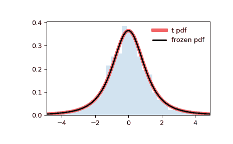

# `scipy.stats.t`

> 原文链接：[`docs.scipy.org/doc/scipy-1.12.0/reference/generated/scipy.stats.t.html#scipy.stats.t`](https://docs.scipy.org/doc/scipy-1.12.0/reference/generated/scipy.stats.t.html#scipy.stats.t)

```py
scipy.stats.t = <scipy.stats._continuous_distns.t_gen object>
```

A Student’s t 连续随机变量。

对于非中心 t 分布，请参见 `nct`。

作为 `rv_continuous` 类的一个实例，`t` 对象继承了一组通用方法（下面详细列出），并以此特定分布的特定细节补充它们。

See also

`nct`

Notes

`t` 的概率密度函数为：

\[f(x, \nu) = \frac{\Gamma((\nu+1)/2)} {\sqrt{\pi \nu} \Gamma(\nu/2)} (1+x²/\nu)^{-(\nu+1)/2}\]

where \(x\) is a real number and the degrees of freedom parameter \(\nu\) (denoted `df` in the implementation) satisfies \(\nu > 0\). \(\Gamma\) is the gamma function (`scipy.special.gamma`).

上述概率密度定义为“标准化”形式。使用 `loc` 和 `scale` 参数进行移位和/或缩放分布。具体来说，`t.pdf(x, df, loc, scale)` 在 `y = (x - loc) / scale` 的等效性下等同于 `t.pdf(y, df) / scale`。请注意，移动分布的位置并不使其成为“非中心”分布；某些分布的非中心推广在单独的类中可用。

Examples

```py
>>> import numpy as np
>>> from scipy.stats import t
>>> import matplotlib.pyplot as plt
>>> fig, ax = plt.subplots(1, 1) 
```

Calculate the first four moments:

```py
>>> df = 2.74
>>> mean, var, skew, kurt = t.stats(df, moments='mvsk') 
```

Display the probability density function (`pdf`):

```py
>>> x = np.linspace(t.ppf(0.01, df),
...                 t.ppf(0.99, df), 100)
>>> ax.plot(x, t.pdf(x, df),
...        'r-', lw=5, alpha=0.6, label='t pdf') 
```

或者，可以像调用函数一样调用分布对象以固定形状、位置和比例参数。这将返回一个固定给定参数的“冻结”RV 对象。

Freeze the distribution and display the frozen `pdf`:

```py
>>> rv = t(df)
>>> ax.plot(x, rv.pdf(x), 'k-', lw=2, label='frozen pdf') 
```

Check accuracy of `cdf` and `ppf`:

```py
>>> vals = t.ppf([0.001, 0.5, 0.999], df)
>>> np.allclose([0.001, 0.5, 0.999], t.cdf(vals, df))
True 
```

生成随机数：

```py
>>> r = t.rvs(df, size=1000) 
```

And compare the histogram:

```py
>>> ax.hist(r, density=True, bins='auto', histtype='stepfilled', alpha=0.2)
>>> ax.set_xlim([x[0], x[-1]])
>>> ax.legend(loc='best', frameon=False)
>>> plt.show() 
```



Methods

| **rvs(df, loc=0, scale=1, size=1, random_state=None)** | 随机变量。 |
| --- | --- |
| **pdf(x, df, loc=0, scale=1)** | 概率密度函数。 |
| **logpdf(x, df, loc=0, scale=1)** | 概率密度函数的对数。 |
| **cdf(x, df, loc=0, scale=1)** | 累积分布函数。 |
| **logcdf(x, df, loc=0, scale=1)** | 累积分布函数的对数。 |
| **sf(x, df, loc=0, scale=1)** | 生存函数（也定义为 `1 - cdf`，但 *sf* 有时更精确）。 |
| **logsf(x, df, loc=0, scale=1)** | 生存函数的对数。 |
| **ppf(q, df, loc=0, scale=1)** | 百分位点函数（`cdf` 的反函数 — 百分位数）。 |
| **isf(q, df, loc=0, scale=1)** | 逆生存函数（`sf` 的反函数）。 |
| **moment(order, df, loc=0, scale=1)** | 指定阶数的非中心矩。 |
| **stats(df, loc=0, scale=1, moments=’mv’)** | 均值（‘m’）、方差（‘v’）、偏度（‘s’）和/或峰度（‘k’）。 |
| **entropy(df, loc=0, scale=1)** | 随机变量的（微分）熵。 |
| **fit(data)** | 一般数据的参数估计。详细文档请参见[scipy.stats.rv_continuous.fit](https://docs.scipy.org/doc/scipy/reference/generated/scipy.stats.rv_continuous.fit.html#scipy.stats.rv_continuous.fit)中的关键参数文档。 |
| **expect(func, args=(df,), loc=0, scale=1, lb=None, ub=None, conditional=False, **kwds)** | 相对于分布的一个参数的函数的期望值。 |
| **median(df, loc=0, scale=1)** | 分布的中位数。 |
| **mean(df, loc=0, scale=1)** | 分布的均值。 |
| **var(df, loc=0, scale=1)** | 分布的方差。 |
| **std(df, loc=0, scale=1)** | 分布的标准差。 |
| **interval(confidence, df, loc=0, scale=1)** | 置信区间，围绕中位数具有相等面积的区间。 |
