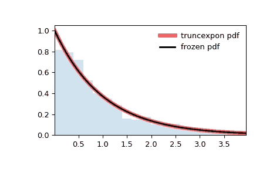

# `scipy.stats.truncexpon`

> 原文：[`docs.scipy.org/doc/scipy-1.12.0/reference/generated/scipy.stats.truncexpon.html#scipy.stats.truncexpon`](https://docs.scipy.org/doc/scipy-1.12.0/reference/generated/scipy.stats.truncexpon.html#scipy.stats.truncexpon)

```py
scipy.stats.truncexpon = <scipy.stats._continuous_distns.truncexpon_gen object>
```

截断指数连续随机变量。

作为 `rv_continuous` 类的实例，`truncexpon` 对象继承了一组通用方法（下面列出全部方法），并用此特定分布的细节完成它们。

注意事项

`truncexpon` 的概率密度函数为：

\[f(x, b) = \frac{\exp(-x)}{1 - \exp(-b)}\]

对于 \(0 <= x <= b\)。

`truncexpon` 以 `b` 作为形状参数。

上述概率密度函数以“标准化”形式定义。要移位和/或缩放分布，请使用 `loc` 和 `scale` 参数。具体而言，`truncexpon.pdf(x, b, loc, scale)` 与 `truncexpon.pdf(y, b) / scale` 是完全等效的，其中 `y = (x - loc) / scale`。请注意，移动分布的位置不会使其成为“非中心”分布；某些分布的非中心推广可以在单独的类中找到。

示例

```py
>>> import numpy as np
>>> from scipy.stats import truncexpon
>>> import matplotlib.pyplot as plt
>>> fig, ax = plt.subplots(1, 1) 
```

计算前四个矩：

```py
>>> b = 4.69
>>> mean, var, skew, kurt = truncexpon.stats(b, moments='mvsk') 
```

显示概率密度函数（`pdf`）：

```py
>>> x = np.linspace(truncexpon.ppf(0.01, b),
...                 truncexpon.ppf(0.99, b), 100)
>>> ax.plot(x, truncexpon.pdf(x, b),
...        'r-', lw=5, alpha=0.6, label='truncexpon pdf') 
```

或者，可以调用分布对象（作为函数）来固定形状、位置和比例参数。这将返回一个“冻结”的随机变量对象，其中给定的参数被固定。

冻结分布并显示冻结的 `pdf`：

```py
>>> rv = truncexpon(b)
>>> ax.plot(x, rv.pdf(x), 'k-', lw=2, label='frozen pdf') 
```

检查`cdf`和`ppf`的准确性：

```py
>>> vals = truncexpon.ppf([0.001, 0.5, 0.999], b)
>>> np.allclose([0.001, 0.5, 0.999], truncexpon.cdf(vals, b))
True 
```

生成随机数：

```py
>>> r = truncexpon.rvs(b, size=1000) 
```

然后比较直方图：

```py
>>> ax.hist(r, density=True, bins='auto', histtype='stepfilled', alpha=0.2)
>>> ax.set_xlim([x[0], x[-1]])
>>> ax.legend(loc='best', frameon=False)
>>> plt.show() 
```



方法

| **rvs(b, loc=0, scale=1, size=1, random_state=None)** | 随机变量。 |
| --- | --- |
| **pdf(x, b, loc=0, scale=1)** | 概率密度函数。 |
| **logpdf(x, b, loc=0, scale=1)** | 概率密度函数的对数。 |
| **cdf(x, b, loc=0, scale=1)** | 累积分布函数。 |
| **logcdf(x, b, loc=0, scale=1)** | 累积分布函数的对数。 |
| **sf(x, b, loc=0, scale=1)** | 生存函数（也定义为 `1 - cdf`，但 *sf* 有时更准确）。 |
| **logsf(x, b, loc=0, scale=1)** | 生存函数的对数（也定义为 `1 - cdf`，但 *sf* 有时更准确）。 |
| **ppf(q, b, loc=0, scale=1)** | 百分位点函数（`cdf` 的反函数 — 百分位数）。 |
| **isf(q, b, loc=0, scale=1)** | 生存函数的反函数（`sf` 的反函数）。 |
| **moment(order, b, loc=0, scale=1)** | 指定阶数的非中心矩。 |
| **stats(b, loc=0, scale=1, moments=’mv’)** | 均值（‘m’）、方差（‘v’）、偏度（‘s’）和/或峰度（‘k’）。 |
| **entropy(b, loc=0, scale=1)** | 随机变量的（微分）熵。 |
| **fit(data)** | 一般数据的参数估计。详细文档请参见 [scipy.stats.rv_continuous.fit](https://docs.scipy.org/doc/scipy/reference/generated/scipy.stats.rv_continuous.fit.html#scipy.stats.rv_continuous.fit)。 |
| **expect(func, args=(b,), loc=0, scale=1, lb=None, ub=None, conditional=False, **kwds)** | 对分布的一个参数函数的期望值。 |
| **median(b, loc=0, scale=1)** | 分布的中位数。 |
| **mean(b, loc=0, scale=1)** | 分布的均值。 |
| **var(b, loc=0, scale=1)** | 分布的方差。 |
| **std(b, loc=0, scale=1)** | 分布的标准差。 |
| **interval(confidence, b, loc=0, scale=1)** | 围绕中位数的等面积置信区间。 |
