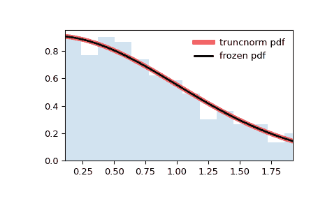
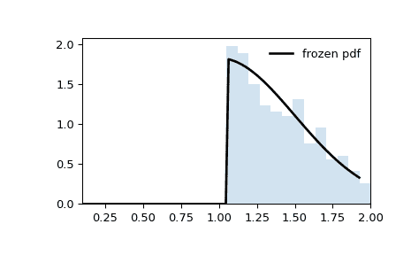
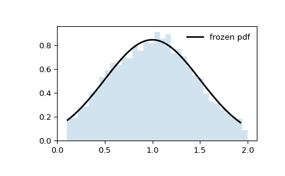

# `scipy.stats.truncnorm`

> 原文链接：[`docs.scipy.org/doc/scipy-1.12.0/reference/generated/scipy.stats.truncnorm.html#scipy.stats.truncnorm`](https://docs.scipy.org/doc/scipy-1.12.0/reference/generated/scipy.stats.truncnorm.html#scipy.stats.truncnorm)

```py
scipy.stats.truncnorm = <scipy.stats._continuous_distns.truncnorm_gen object>
```

截断正态连续随机变量。

作为`rv_continuous`类的一个实例，`truncnorm`对象继承了一系列通用方法（请参阅下面的完整列表），并使用特定于该特定分布的细节补充它们。

Notes

该分布是以`loc`（默认为 0）为中心的正态分布，标准差为`scale`（默认为 1），并在距离`loc` *标准偏差*为`a`和`b`处截断。对于任意的`loc`和`scale`，`a`和`b`不是移位和缩放后分布截断的横坐标。

注意

如果`a_trunc`和`b_trunc`是我们希望截断分布的横坐标（而不是从`loc`测量的标准偏差数），那么我们可以按以下方式计算分布参数`a`和`b`：

```py
a, b = (a_trunc - loc) / scale, (b_trunc - loc) / scale 
```

这是一个常见的混淆点。为了进一步澄清，请参见下面的示例。

示例

```py
>>> import numpy as np
>>> from scipy.stats import truncnorm
>>> import matplotlib.pyplot as plt
>>> fig, ax = plt.subplots(1, 1) 
```

计算前四个时刻：

```py
>>> a, b = 0.1, 2
>>> mean, var, skew, kurt = truncnorm.stats(a, b, moments='mvsk') 
```

显示概率密度函数（`pdf`）：

```py
>>> x = np.linspace(truncnorm.ppf(0.01, a, b),
...                 truncnorm.ppf(0.99, a, b), 100)
>>> ax.plot(x, truncnorm.pdf(x, a, b),
...        'r-', lw=5, alpha=0.6, label='truncnorm pdf') 
```

或者，可以调用分布对象（作为函数）来固定形状、位置和比例参数。这将返回一个“冻结”的 RV 对象，保持给定的参数不变。

冻结分布并显示冻结的`pdf`：

```py
>>> rv = truncnorm(a, b)
>>> ax.plot(x, rv.pdf(x), 'k-', lw=2, label='frozen pdf') 
```

检查`cdf`和`ppf`的准确性：

```py
>>> vals = truncnorm.ppf([0.001, 0.5, 0.999], a, b)
>>> np.allclose([0.001, 0.5, 0.999], truncnorm.cdf(vals, a, b))
True 
```

生成随机数：

```py
>>> r = truncnorm.rvs(a, b, size=1000) 
```

并比较直方图：

```py
>>> ax.hist(r, density=True, bins='auto', histtype='stepfilled', alpha=0.2)
>>> ax.set_xlim([x[0], x[-1]])
>>> ax.legend(loc='best', frameon=False)
>>> plt.show() 
```



在上述示例中，`loc=0`和`scale=1`，因此绘图在左侧截断为`a`，右侧截断为`b`。但是，假设我们用`loc = 1`和`scale=0.5`生成相同的直方图。

```py
>>> loc, scale = 1, 0.5
>>> rv = truncnorm(a, b, loc=loc, scale=scale)
>>> x = np.linspace(truncnorm.ppf(0.01, a, b),
...                 truncnorm.ppf(0.99, a, b), 100)
>>> r = rv.rvs(size=1000) 
```

```py
>>> fig, ax = plt.subplots(1, 1)
>>> ax.plot(x, rv.pdf(x), 'k-', lw=2, label='frozen pdf')
>>> ax.hist(r, density=True, bins='auto', histtype='stepfilled', alpha=0.2)
>>> ax.set_xlim(a, b)
>>> ax.legend(loc='best', frameon=False)
>>> plt.show() 
```



注意，分布似乎不再在横坐标`a`和`b`处截断。这是因为*标准*正态分布首先在`a`和`b`处截断，然后将结果分布按`scale`缩放并按`loc`移动。如果我们希望移位和缩放后的分布在`a`和`b`处截断，我们需要在传递这些值作为分布参数之前对这些值进行变换。

```py
>>> a_transformed, b_transformed = (a - loc) / scale, (b - loc) / scale
>>> rv = truncnorm(a_transformed, b_transformed, loc=loc, scale=scale)
>>> x = np.linspace(truncnorm.ppf(0.01, a, b),
...                 truncnorm.ppf(0.99, a, b), 100)
>>> r = rv.rvs(size=10000) 
```

```py
>>> fig, ax = plt.subplots(1, 1)
>>> ax.plot(x, rv.pdf(x), 'k-', lw=2, label='frozen pdf')
>>> ax.hist(r, density=True, bins='auto', histtype='stepfilled', alpha=0.2)
>>> ax.set_xlim(a-0.1, b+0.1)
>>> ax.legend(loc='best', frameon=False)
>>> plt.show() 
```



方法

| **rvs(a, b, loc=0, scale=1, size=1, random_state=None)** | 随机变量。 |
| --- | --- |
| **pdf(x, a, b, loc=0, scale=1)** | 概率密度函数。 |
| **logpdf(x, a, b, loc=0, scale=1)** | 概率密度函数的对数。 |
| **cdf(x, a, b, loc=0, scale=1)** | 累积分布函数。 |
| **logcdf(x, a, b, loc=0, scale=1)** | 累积分布函数的对数。 |
| **sf(x, a, b, loc=0, scale=1)** | 存活函数（也定义为 `1 - cdf`，但*sf*有时更精确）。 |
| **logsf(x, a, b, loc=0, scale=1)** | 生存函数的对数。 |
| **ppf(q, a, b, loc=0, scale=1)** | 百分点函数（`cdf`的逆函数 — 百分位数）。 |
| **isf(q, a, b, loc=0, scale=1)** | 逆存活函数（`sf`的逆函数）。 |
| **moment(order, a, b, loc=0, scale=1)** | 指定阶数的非中心矩。 |
| **stats(a, b, loc=0, scale=1, moments=’mv’)** | 均值（‘m’）、方差（‘v’）、偏度（‘s’）、峰度（‘k’）。 |
| **entropy(a, b, loc=0, scale=1)** | 随机变量的（微分）熵。 |
| **fit(data)** | 通用数据的参数估计。详细的关键字参数文档请参见 [scipy.stats.rv_continuous.fit](https://docs.scipy.org/doc/scipy/reference/generated/scipy.stats.rv_continuous.fit.html#scipy.stats.rv_continuous.fit)。 |
| **expect(func, args=(a, b), loc=0, scale=1, lb=None, ub=None, conditional=False, **kwds)** | 相对于分布的一个参数函数的期望值（具有一个参数）。 |
| **median(a, b, loc=0, scale=1)** | 分布的中位数。 |
| **mean(a, b, loc=0, scale=1)** | 分布的均值。 |
| **var(a, b, loc=0, scale=1)** | 分布的方差。 |
| **std(a, b, loc=0, scale=1)** | 分布的标准差。 |
| **interval(confidence, a, b, loc=0, scale=1)** | 置信区间，围绕中位数具有相等的面积。 |
