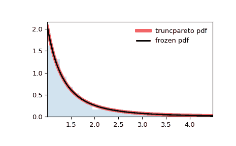

# `scipy.stats.truncpareto`

> 原文链接：[`docs.scipy.org/doc/scipy-1.12.0/reference/generated/scipy.stats.truncpareto.html#scipy.stats.truncpareto`](https://docs.scipy.org/doc/scipy-1.12.0/reference/generated/scipy.stats.truncpareto.html#scipy.stats.truncpareto)

```py
scipy.stats.truncpareto = <scipy.stats._continuous_distns.truncpareto_gen object>
```

上截的 Pareto 连续随机变量。

作为 `rv_continuous` 类的实例，`truncpareto` 对象从中继承了一组通用方法（请参阅下面的完整列表），并使用特定于此特定分布的详细信息来完善它们。

另见

`pareto`

Pareto 分布

注释

`truncpareto` 的概率密度函数为：

\[f(x, b, c) = \frac{b}{1 - c^{-b}} \frac{1}{x^{b+1}}\]

对于 \(b > 0\), \(c > 1\) 和 \(1 \le x \le c\)。

`truncpareto` 以 *b* 和 *c* 作为形状参数定义了 \(b\) 和 \(c\)。

注意，上截值 \(c\) 的定义采用标准化形式，以确保未缩放、未移位的随机值位于 `[1, c]` 的范围内。如果 `u_r` 是缩放和/或移位变量的上界，则 `c = (u_r - loc) / scale`。换句话说，当提供 *scale* 和/或 *loc* 参数时，分布的支持区间变为 `(scale + loc) <= x <= (c*scale + loc)`。

上述概率密度以“标准化”形式定义。要进行偏移和/或缩放分布，请使用 *loc* 和 *scale* 参数。具体来说，`truncpareto.pdf(x, b, c, loc, scale)` 与 `truncpareto.pdf(y, b, c) / scale` 是完全等价的，其中 `y = (x - loc) / scale`。请注意，改变分布的位置并不会使其成为“非中心”分布；某些分布的非中心推广可在单独的类中找到。

参考文献

[1]

Burroughs, S. M., and Tebbens S. F. “Upper-truncated power laws in natural systems.” Pure and Applied Geophysics 158.4 (2001): 741-757.

示例

```py
>>> import numpy as np
>>> from scipy.stats import truncpareto
>>> import matplotlib.pyplot as plt
>>> fig, ax = plt.subplots(1, 1) 
```

计算前四个时刻：

```py
>>> b, c = 2, 5
>>> mean, var, skew, kurt = truncpareto.stats(b, c, moments='mvsk') 
```

显示概率密度函数 (`pdf`)：

```py
>>> x = np.linspace(truncpareto.ppf(0.01, b, c),
...                 truncpareto.ppf(0.99, b, c), 100)
>>> ax.plot(x, truncpareto.pdf(x, b, c),
...        'r-', lw=5, alpha=0.6, label='truncpareto pdf') 
```

或者，可以调用分布对象（作为函数），以固定形状、位置和缩放参数。这将返回一个“冻结”的 RV 对象，其中给定的参数被固定。

冻结分布并显示冻结的 `pdf`：

```py
>>> rv = truncpareto(b, c)
>>> ax.plot(x, rv.pdf(x), 'k-', lw=2, label='frozen pdf') 
```

检查 `cdf` 和 `ppf` 的准确性：

```py
>>> vals = truncpareto.ppf([0.001, 0.5, 0.999], b, c)
>>> np.allclose([0.001, 0.5, 0.999], truncpareto.cdf(vals, b, c))
True 
```

生成随机数：

```py
>>> r = truncpareto.rvs(b, c, size=1000) 
```

并比较直方图：

```py
>>> ax.hist(r, density=True, bins='auto', histtype='stepfilled', alpha=0.2)
>>> ax.set_xlim([x[0], x[-1]])
>>> ax.legend(loc='best', frameon=False)
>>> plt.show() 
```



方法

| **rvs(b, c, loc=0, scale=1, size=1, random_state=None)** | 随机变量。 |
| --- | --- |
| **pdf(x, b, c, loc=0, scale=1)** | 概率密度函数。 |
| **logpdf(x, b, c, loc=0, scale=1)** | 概率密度函数的对数。 |
| **cdf(x, b, c, loc=0, scale=1)** | 累积分布函数。 |
| **logcdf(x, b, c, loc=0, scale=1)** | 累积分布函数的对数。 |
| **sf(x, b, c, loc=0, scale=1)** | 生存函数（也定义为 `1 - cdf`，但 *sf* 有时更准确）。 |
| **logsf(x, b, c, loc=0, scale=1)** | 生存函数的对数。 |
| **ppf(q, b, c, loc=0, scale=1)** | 百分位点函数（`cdf` 的反函数 — 百分位数）。 |
| **isf(q, b, c, loc=0, scale=1)** | 逆生存函数（`sf` 的反函数）。 |
| **moment(order, b, c, loc=0, scale=1)** | 指定阶数的非中心矩。 |
| **stats(b, c, loc=0, scale=1, moments=’mv’)** | 均值（‘m’）、方差（‘v’）、偏度（‘s’）、及/或峰度（‘k’）。 |
| **entropy(b, c, loc=0, scale=1)** | 随机变量的（微分）熵。 |
| **fit(data)** | 一般数据的参数估计。详细文档见 [scipy.stats.rv_continuous.fit](https://docs.scipy.org/doc/scipy/reference/generated/scipy.stats.rv_continuous.fit.html#scipy.stats.rv_continuous.fit)。 |
| **expect(func, args=(b, c), loc=0, scale=1, lb=None, ub=None, conditional=False, **kwds)** | 函数期望值（对于分布的一个参数的函数）。 |
| **median(b, c, loc=0, scale=1)** | 分布的中位数。 |
| **mean(b, c, loc=0, scale=1)** | 分布的均值。 |
| **var(b, c, loc=0, scale=1)** | 分布的方差。 |
| **std(b, c, loc=0, scale=1)** | 分布的标准差。 |
| **interval(confidence, b, c, loc=0, scale=1)** | 中位数周围的等面积置信区间。 |
