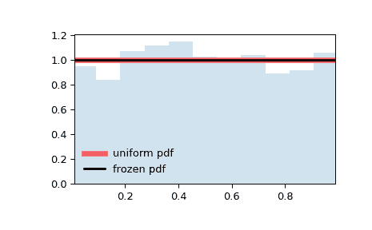

# `scipy.stats.uniform`

> 原文：[`docs.scipy.org/doc/scipy-1.12.0/reference/generated/scipy.stats.uniform.html#scipy.stats.uniform`](https://docs.scipy.org/doc/scipy-1.12.0/reference/generated/scipy.stats.uniform.html#scipy.stats.uniform)

```py
scipy.stats.uniform = <scipy.stats._continuous_distns.uniform_gen object>
```

一个均匀连续随机变量。

在标准形式中，分布在 `[0, 1]` 上是均匀的。使用参数 `loc` 和 `scale`，可以获得在 `[loc, loc + scale]` 上的均匀分布。

作为 `rv_continuous` 类的一个实例，`uniform` 对象从中继承了一系列通用方法（下面有完整列表），并根据这个特定分布的细节补充了它们。

示例

```py
>>> import numpy as np
>>> from scipy.stats import uniform
>>> import matplotlib.pyplot as plt
>>> fig, ax = plt.subplots(1, 1) 
```

计算前四个时刻：

```py
>>> mean, var, skew, kurt = uniform.stats(moments='mvsk') 
```

显示概率密度函数（`pdf`）：

```py
>>> x = np.linspace(uniform.ppf(0.01),
...                 uniform.ppf(0.99), 100)
>>> ax.plot(x, uniform.pdf(x),
...        'r-', lw=5, alpha=0.6, label='uniform pdf') 
```

或者，可以调用分布对象（作为函数）以固定形状、位置和比例参数。这将返回一个固定参数的“冻结”随机变量对象。

冻结分布并显示冻结的 `pdf`：

```py
>>> rv = uniform()
>>> ax.plot(x, rv.pdf(x), 'k-', lw=2, label='frozen pdf') 
```

检查 `cdf` 和 `ppf` 的准确性：

```py
>>> vals = uniform.ppf([0.001, 0.5, 0.999])
>>> np.allclose([0.001, 0.5, 0.999], uniform.cdf(vals))
True 
```

生成随机数：

```py
>>> r = uniform.rvs(size=1000) 
```

对比直方图：

```py
>>> ax.hist(r, density=True, bins='auto', histtype='stepfilled', alpha=0.2)
>>> ax.set_xlim([x[0], x[-1]])
>>> ax.legend(loc='best', frameon=False)
>>> plt.show() 
```



方法

| **rvs(loc=0, scale=1, size=1, random_state=None)** | 随机变量。 |
| --- | --- |
| **pdf(x, loc=0, scale=1)** | 概率密度函数。 |
| **logpdf(x, loc=0, scale=1)** | 概率密度函数的对数。 |
| **cdf(x, loc=0, scale=1)** | 累积分布函数。 |
| **logcdf(x, loc=0, scale=1)** | 累积分布函数的对数。 |
| **sf(x, loc=0, scale=1)** | 生存函数（也定义为 `1 - cdf`，但 *sf* 有时更精确）。 |
| **logsf(x, loc=0, scale=1)** | 生存函数的对数。 |
| **ppf(q, loc=0, scale=1)** | 百分点函数（`cdf` 的逆函数 — 百分位数）。 |
| **isf(q, loc=0, scale=1)** | 生存函数的逆函数（`sf` 的逆）。 |
| **moment(order, loc=0, scale=1)** | 指定阶数的非中心时刻。 |
| **stats(loc=0, scale=1, moments=’mv’)** | 均值（‘m’）、方差（‘v’）、偏度（‘s’）和/或峰度（‘k’）。 |
| **entropy(loc=0, scale=1)** | 随机变量的（微分）熵。 |
| **fit(data)** | 一般数据的参数估计。详细文档请参见 [scipy.stats.rv_continuous.fit](https://docs.scipy.org/doc/scipy/reference/generated/scipy.stats.rv_continuous.fit.html#scipy.stats.rv_continuous.fit) 的关键参数。 |
| **expect(func, args=(), loc=0, scale=1, lb=None, ub=None, conditional=False, **kwds)** | 关于分布的函数（一个参数的函数）的期望值。 |
| **median(loc=0, scale=1)** | 分布的中位数。 |
| **mean(loc=0, scale=1)** | 分布的均值。 |
| **var(loc=0, scale=1)** | 分布的方差。 |
| **std(loc=0, scale=1)** | 分布的标准差。 |
| **interval(confidence, loc=0, scale=1)** | 置信区间，围绕中位数具有相等面积。 |
