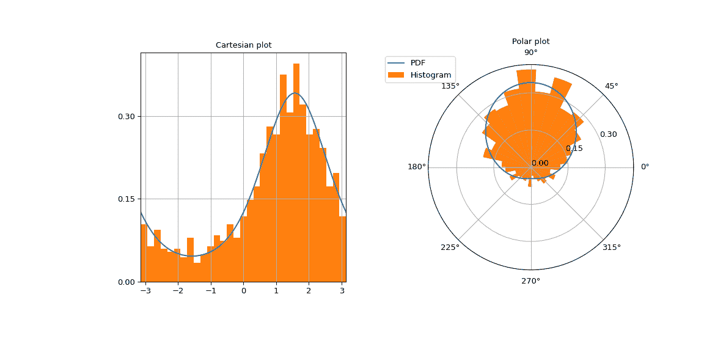

# `scipy.stats.vonmises_line`

> 原文：[`docs.scipy.org/doc/scipy-1.12.0/reference/generated/scipy.stats.vonmises_line.html#scipy.stats.vonmises_line`](https://docs.scipy.org/doc/scipy-1.12.0/reference/generated/scipy.stats.vonmises_line.html#scipy.stats.vonmises_line)

```py
scipy.stats.vonmises_line = <scipy.stats._continuous_distns.vonmises_gen object>
```

一个 Von Mises 连续随机变量。

作为 [`rv_continuous`](https://docs.scipy.org/doc/scipy-1.12.0/reference/generated/scipy.stats.rv_continuous.html#scipy.stats.rv_continuous "scipy.stats.rv_continuous") 类的实例，`vonmises_line` 对象从中继承了一系列通用方法（请参阅下面的完整列表），并使用特定于此特定分布的详细信息补充它们。

另请参见

[`scipy.stats.vonmises_fisher`](https://docs.scipy.org/doc/scipy-1.12.0/reference/generated/scipy.stats.vonmises_fisher.html#scipy.stats.vonmises_fisher "scipy.stats.vonmises_fisher")

Von-Mises Fisher 分布在超球面上

注释

[`vonmises`](https://docs.scipy.org/doc/scipy-1.12.0/reference/generated/scipy.stats.vonmises.html#scipy.stats.vonmises "scipy.stats.vonmises") 和 `vonmises_line` 的概率密度函数为：

\[f(x, \kappa) = \frac{ \exp(\kappa \cos(x)) }{ 2 \pi I_0(\kappa) }\]

对于 \(-\pi \le x \le \pi\), \(\kappa > 0\)。 \(I_0\) 是零阶修改贝塞尔函数（[`scipy.special.i0`](https://docs.scipy.org/doc/scipy-1.12.0/reference/generated/scipy.special.i0.html#scipy.special.i0 "scipy.special.i0")）。

[`vonmises`](https://docs.scipy.org/doc/scipy-1.12.0/reference/generated/scipy.stats.vonmises.html#scipy.stats.vonmises "scipy.stats.vonmises") 是一个不限制分布到固定区间的圆形分布。目前 SciPy 中没有圆形分布框架。 `cdf` 实现使得 `cdf(x + 2*np.pi) == cdf(x) + 1`。

`vonmises_line` 是相同的分布，在实轴上定义在 \([-\pi, \pi]\)。这是一个常规（非圆形）分布。

关于分布参数的注意：[`vonmises`](https://docs.scipy.org/doc/scipy-1.12.0/reference/generated/scipy.stats.vonmises.html#scipy.stats.vonmises "scipy.stats.vonmises") 和 `vonmises_line` 以 `kappa` 作为形状参数（集中度）和 `loc` 作为位置（圆形均值）。接受 `scale` 参数但不产生任何效果。

示例

导入必要的模块。

```py
>>> import numpy as np
>>> import matplotlib.pyplot as plt
>>> from scipy.stats import vonmises 
```

定义分布参数。

```py
>>> loc = 0.5 * np.pi  # circular mean
>>> kappa = 1  # concentration 
```

通过 `pdf` 方法计算 `x=0` 处的概率密度。

```py
>>> vonmises.pdf(loc, kappa, 0)
0.12570826359722018 
```

验证百分位函数`ppf`在浮点精度下反转累积分布函数`cdf`。

```py
>>> x = 1
>>> cdf_value = vonmises.cdf(loc=loc, kappa=kappa, x=x)
>>> ppf_value = vonmises.ppf(cdf_value, loc=loc, kappa=kappa)
>>> x, cdf_value, ppf_value
(1, 0.31489339900904967, 1.0000000000000004) 
```

通过调用 `rvs` 方法绘制 1000 个随机变量。

```py
>>> number_of_samples = 1000
>>> samples = vonmises(loc=loc, kappa=kappa).rvs(number_of_samples) 
```

在笛卡尔和极坐标网格上绘制冯·米塞斯密度图，以突显其为圆形分布。

```py
>>> fig = plt.figure(figsize=(12, 6))
>>> left = plt.subplot(121)
>>> right = plt.subplot(122, projection='polar')
>>> x = np.linspace(-np.pi, np.pi, 500)
>>> vonmises_pdf = vonmises.pdf(loc, kappa, x)
>>> ticks = [0, 0.15, 0.3] 
```

左图包含笛卡尔图。

```py
>>> left.plot(x, vonmises_pdf)
>>> left.set_yticks(ticks)
>>> number_of_bins = int(np.sqrt(number_of_samples))
>>> left.hist(samples, density=True, bins=number_of_bins)
>>> left.set_title("Cartesian plot")
>>> left.set_xlim(-np.pi, np.pi)
>>> left.grid(True) 
```

右图包含极坐标图。

```py
>>> right.plot(x, vonmises_pdf, label="PDF")
>>> right.set_yticks(ticks)
>>> right.hist(samples, density=True, bins=number_of_bins,
...            label="Histogram")
>>> right.set_title("Polar plot")
>>> right.legend(bbox_to_anchor=(0.15, 1.06)) 
```



方法

| **rvs(kappa, loc=0, scale=1, size=1, random_state=None)** | 随机变量。 |
| --- | --- |
| **pdf(x, kappa, loc=0, scale=1)** | 概率密度函数。 |
| **logpdf(x, kappa, loc=0, scale=1)** | 概率密度函数的对数。 |
| **cdf(x, kappa, loc=0, scale=1)** | 累积分布函数。 |
| **logcdf(x, kappa, loc=0, scale=1)** | 累积分布函数的对数。 |
| **sf(x, kappa, loc=0, scale=1)** | 生存函数（也定义为 `1 - cdf`，但*sf*有时更精确）。 |
| **logsf(x, kappa, loc=0, scale=1)** | 生存函数的对数。 |
| **ppf(q, kappa, loc=0, scale=1)** | 百分位点函数（`cdf` 的反函数 — 百分位数）。 |
| **isf(q, kappa, loc=0, scale=1)** | 逆生存函数（*sf*的反函数）。 |
| **moment(order, kappa, loc=0, scale=1)** | 指定阶数的非中心矩。 |
| **stats(kappa, loc=0, scale=1, moments=’mv’)** | 平均值（‘m’）、方差（‘v’）、偏度（‘s’）和/或峰度（‘k’）。 |
| **entropy(kappa, loc=0, scale=1)** | 随机变量的（微分）熵。 |
| **fit(data)** | 通用数据的参数估计。详细文档请参见 [scipy.stats.rv_continuous.fit](https://docs.scipy.org/doc/scipy/reference/generated/scipy.stats.rv_continuous.fit.html#scipy.stats.rv_continuous.fit)。 |
| **expect(func, args=(kappa,), loc=0, scale=1, lb=None, ub=None, conditional=False, **kwds)** | 期望值函数（一个参数的函数）关于分布的期望值。 |
| **median(kappa, loc=0, scale=1)** | 分布的中位数。 |
| **mean(kappa, loc=0, scale=1)** | 分布的均值。 |
| **var(kappa, loc=0, scale=1)** | 分布的方差。 |
| **std(kappa, loc=0, scale=1)** | 分布的标准差。 |
| **interval(confidence, kappa, loc=0, scale=1)** | 等面积置信区间，围绕中位数。 |
