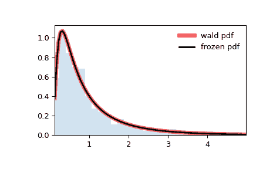

# `scipy.stats.wald`

> 原文：[`docs.scipy.org/doc/scipy-1.12.0/reference/generated/scipy.stats.wald.html#scipy.stats.wald`](https://docs.scipy.org/doc/scipy-1.12.0/reference/generated/scipy.stats.wald.html#scipy.stats.wald)

```py
scipy.stats.wald = <scipy.stats._continuous_distns.wald_gen object>
```

一个 Wald 连续随机变量。

作为`rv_continuous`类的一个实例，`wald`对象继承了一组通用方法（下面是完整列表），并且用于该特定分布的详细信息完成了它们。

注意

`wald`的概率密度函数为：

\[f(x) = \frac{1}{\sqrt{2\pi x³}} \exp(- \frac{ (x-1)² }{ 2x })\]

为 \(x >= 0\)。

`wald`是`invgauss`的`mu=1`的特殊情况。

上面的概率密度在“标准化”形式中定义。使用`loc`和`scale`参数来进行分布的位移和/或缩放。具体地说，`wald.pdf(x, loc, scale)`等同于`wald.pdf(y) / scale`，其中`y = (x - loc) / scale`。注意，平移分布的位置并不会使其成为“非中心”分布；某些分布的非中心推广可以在单独的类中找到。

例子

```py
>>> import numpy as np
>>> from scipy.stats import wald
>>> import matplotlib.pyplot as plt
>>> fig, ax = plt.subplots(1, 1) 
```

计算前四个矩：

```py
>>> mean, var, skew, kurt = wald.stats(moments='mvsk') 
```

显示概率密度函数(`pdf`)：

```py
>>> x = np.linspace(wald.ppf(0.01),
...                 wald.ppf(0.99), 100)
>>> ax.plot(x, wald.pdf(x),
...        'r-', lw=5, alpha=0.6, label='wald pdf') 
```

或者，可以像函数一样调用分布对象来固定形状、位置和比例参数。这将返回一个持有给定参数固定的“冻结”RV 对象。

冻结分布并显示冻结的`pdf`：

```py
>>> rv = wald()
>>> ax.plot(x, rv.pdf(x), 'k-', lw=2, label='frozen pdf') 
```

检查 `cdf` 和 `ppf` 的准确性：

```py
>>> vals = wald.ppf([0.001, 0.5, 0.999])
>>> np.allclose([0.001, 0.5, 0.999], wald.cdf(vals))
True 
```

生成随机数：

```py
>>> r = wald.rvs(size=1000) 
```

并且比较直方图：

```py
>>> ax.hist(r, density=True, bins='auto', histtype='stepfilled', alpha=0.2)
>>> ax.set_xlim([x[0], x[-1]])
>>> ax.legend(loc='best', frameon=False)
>>> plt.show() 
```



方法

| **rvs(loc=0, scale=1, size=1, random_state=None)** | 随机变量。 |
| --- | --- |
| **pdf(x, loc=0, scale=1)** | 概率密度函数。 |
| **logpdf(x, loc=0, scale=1)** | 概率密度函数的对数。 |
| **cdf(x, loc=0, scale=1)** | 累积分布函数。 |
| **logcdf(x, loc=0, scale=1)** | 累积分布函数的对数。 |
| **sf(x, loc=0, scale=1)** | 生存函数（也被定义为 `1 - cdf`，但 *sf* 有时更准确）。 |
| **logsf(x, loc=0, scale=1)** | 生存函数的对数。 |
| **ppf(q, loc=0, scale=1)** | 百分点函数（`cdf`的反函数——百分位数）。 |
| **isf(q, loc=0, scale=1)** | 逆生存函数（`sf`的反函数）。 |
| **moment(order, loc=0, scale=1)** | 指定顺序的非中心矩。 |
| **stats(loc=0, scale=1, moments=’mv’)** | 平均值（‘m’），方差（‘v’），偏度（‘s’）和/或峰度（‘k’）。 |
| **entropy(loc=0, scale=1)** | RV 的（微分）熵。 |
| **fit(data)** | 通用数据的参数估计。参见[scipy.stats.rv_continuous.fit](https://docs.scipy.org/doc/scipy/reference/generated/scipy.stats.rv_continuous.fit.html#scipy.stats.rv_continuous.fit)以获取关键字参数的详细文档。 |
| **expect(func, args=(), loc=0, scale=1, lb=None, ub=None, conditional=False, **kwds)** | 对分布的一个函数（一个参数的函数）的期望值。 |
| **median(loc=0, scale=1)** | 分布的中位数。 |
| **mean(loc=0, scale=1)** | 分布的均值。 |
| **var(loc=0, scale=1)** | 分布的方差。 |
| **std(loc=0, scale=1)** | 分布的标准差。 |
| **interval(confidence, loc=0, scale=1)** | 置信区间，围绕中位数具有相等的面积。 |
