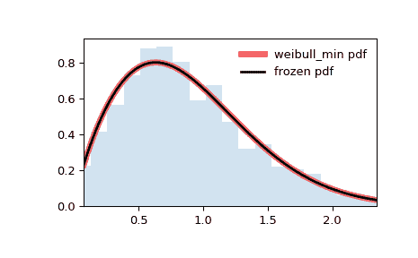

# `scipy.stats.weibull_min`

> 原文链接：[`docs.scipy.org/doc/scipy-1.12.0/reference/generated/scipy.stats.weibull_min.html#scipy.stats.weibull_min`](https://docs.scipy.org/doc/scipy-1.12.0/reference/generated/scipy.stats.weibull_min.html#scipy.stats.weibull_min)

```py
scipy.stats.weibull_min = <scipy.stats._continuous_distns.weibull_min_gen object>
```

Weibull 最小连续随机变量.

Weibull 最小极值分布，来自极值理论（费舍尔-格涅登科定理），通常也简称为 Weibull 分布. 它是 iid 随机变量最小值的重新缩放极限分布.

作为 `rv_continuous` 类的一个实例，`weibull_min` 对象继承了一组通用方法（下文详列），并针对这个特定分布补充了具体细节。

另请参阅

`weibull_max`, [`numpy.random.Generator.weibull`](https://numpy.org/devdocs/reference/random/generated/numpy.random.Generator.weibull.html#numpy.random.Generator.weibull "(in NumPy v2.0.dev0)"), `exponweib`

注释

`weibull_min` 的概率密度函数为：

\[f(x, c) = c x^{c-1} \exp(-x^c)\]

对于 \(x > 0\), \(c > 0\).

`weibull_min` 以 `c` 作为形状参数，用于 \(c\).（在维基百科文章中称为 \(k\)，在 `numpy.random.weibull` 中称为 \(a\). 特殊形状值为 \(c=1\) 和 \(c=2\), 其中 Weibull 分布分别简化为 `expon` 和 `rayleigh` 分布.

假设 `X` 是具有比例 `s` 的指数分布随机变量. 那么 `Y = X**k` 就是具有形状 `c = 1/k` 和比例 `s**k` 的 `weibull_min` 分布.

上述概率密度在 “标准化” 形式下定义. 若要移动和/或缩放分布，请使用 `loc` 和 `scale` 参数. 具体而言, `weibull_min.pdf(x, c, loc, scale)` 等价于 `weibull_min.pdf(y, c) / scale`, 其中 `y = (x - loc) / scale`. 请注意, 移动分布的位置并不使其成为 “非中心” 分布; 一些分布的非中心推广可在单独的类中找到.

参考文献

[`zh.wikipedia.org/wiki/威布尔分布`](https://zh.wikipedia.org/wiki/威布尔分布)

[`zh.wikipedia.org/wiki/费舍尔-提普特-格涅登科定理`](https://zh.wikipedia.org/wiki/费舍尔-提普特-格涅登科定理)

示例

```py
>>> import numpy as np
>>> from scipy.stats import weibull_min
>>> import matplotlib.pyplot as plt
>>> fig, ax = plt.subplots(1, 1) 
```

计算前四个时刻：

```py
>>> c = 1.79
>>> mean, var, skew, kurt = weibull_min.stats(c, moments='mvsk') 
```

显示概率密度函数 (`pdf`)：

```py
>>> x = np.linspace(weibull_min.ppf(0.01, c),
...                 weibull_min.ppf(0.99, c), 100)
>>> ax.plot(x, weibull_min.pdf(x, c),
...        'r-', lw=5, alpha=0.6, label='weibull_min pdf') 
```

或者，可以调用分布对象（作为函数），以固定形状、位置和尺度参数。这会返回一个“冻结的”RV 对象，保持给定的参数不变。

冻结分布并显示冻结的 `pdf`：

```py
>>> rv = weibull_min(c)
>>> ax.plot(x, rv.pdf(x), 'k-', lw=2, label='frozen pdf') 
```

检查 `cdf` 和 `ppf` 的准确性：

```py
>>> vals = weibull_min.ppf([0.001, 0.5, 0.999], c)
>>> np.allclose([0.001, 0.5, 0.999], weibull_min.cdf(vals, c))
True 
```

生成随机数：

```py
>>> r = weibull_min.rvs(c, size=1000) 
```

并比较直方图：

```py
>>> ax.hist(r, density=True, bins='auto', histtype='stepfilled', alpha=0.2)
>>> ax.set_xlim([x[0], x[-1]])
>>> ax.legend(loc='best', frameon=False)
>>> plt.show() 
```



方法

| **rvs(c, loc=0, scale=1, size=1, random_state=None)** | 随机变量。 |
| --- | --- |
| **pdf(x, c, loc=0, scale=1)** | 概率密度函数。 |
| **logpdf(x, c, loc=0, scale=1)** | 概率密度函数的对数。 |
| **cdf(x, c, loc=0, scale=1)** | 累积分布函数。 |
| **logcdf(x, c, loc=0, scale=1)** | 累积分布函数的对数。 |
| **sf(x, c, loc=0, scale=1)** | 生存函数（也定义为 `1 - cdf`，但 *sf* 有时更精确）。 |
| **logsf(x, c, loc=0, scale=1)** | 生存函数的对数。 |
| **ppf(q, c, loc=0, scale=1)** | 百分位点函数（`cdf` 的反函数 — 百分位数）。 |
| **isf(q, c, loc=0, scale=1)** | 逆生存函数（`sf` 的反函数）。 |
| **moment(order, c, loc=0, scale=1)** | 指定阶数的非中心矩。 |
| **stats(c, loc=0, scale=1, moments=’mv’)** | 均值（‘m’）、方差（‘v’）、偏度（‘s’）和/或峰度（‘k’）等参数估计。 |
| **entropy(c, loc=0, scale=1)** | RV 的（微分）熵。 |
| **fit(data)** | 用于一般数据的参数估计。详细文档请参阅 [scipy.stats.rv_continuous.fit](https://docs.scipy.org/doc/scipy/reference/generated/scipy.stats.rv_continuous.fit.html#scipy.stats.rv_continuous.fit)。 |
| **expect(func, args=(c,), loc=0, scale=1, lb=None, ub=None, conditional=False, **kwds)** | 函数期望值（一参数函数）相对于分布的期望值。 |
| **median(c, loc=0, scale=1)** | 分布的中位数。 |
| **mean(c, loc=0, scale=1)** | 分布的均值。 |
| **var(c, loc=0, scale=1)** | 分布的方差。 |
| **std(c, loc=0, scale=1)** | 分布的标准差。 |
| **interval(confidence, c, loc=0, scale=1)** | 中位数周围具有相等面积的置信区间。 |
