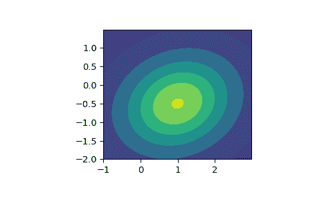

# `scipy.stats.multivariate_t`

> 原文链接：[`docs.scipy.org/doc/scipy-1.12.0/reference/generated/scipy.stats.multivariate_t.html#scipy.stats.multivariate_t`](https://docs.scipy.org/doc/scipy-1.12.0/reference/generated/scipy.stats.multivariate_t.html#scipy.stats.multivariate_t)

```py
scipy.stats.multivariate_t = <scipy.stats._multivariate.multivariate_t_gen object>
```

多元 t 分布随机变量。

*loc* 参数指定位置。*shape* 参数指定正半定形状矩阵。*df* 参数指定自由度。

除了调用下面的方法，对象本身也可以作为一个函数调用，以固定位置、形状矩阵和自由度参数，返回一个“冻结”的多元 t 分布随机对象。

参数：

**loc**array_like，可选

分布的位置。（默认`0`）

**shape**array_like，可选

分布的正半定矩阵。（默认`1`）

**df**float，可选

分布的自由度；必须大于零。如果 `np.inf`，则结果为多元正态分布。默认为 `1`。

**allow_singular**bool，可选

是否允许奇异矩阵。（默认`False`）

**seed**{None, int, np.random.RandomState, np.random.Generator}，可选

用于生成随机变量。如果 *seed* 为 *None*，则使用 *RandomState* 单例。如果 *seed* 是整数，则使用一个新的 `RandomState` 实例，并用 seed 进行初始化。如果 *seed* 已经是 `RandomState` 或 `Generator` 实例，则使用该对象。默认为 *None*。

注意事项

将 *loc* 参数设为 `None` 相当于将 *loc* 设为零向量。*shape* 参数可以是标量，此时形状矩阵为单位矩阵乘以该值，也可以是形状矩阵的对角线条目的向量，或者是二维数组。矩阵 *shape* 必须是（对称的）正半定矩阵。其伪行列式和伪逆分别计算为矩阵 *shape* 的行列式和逆，因此 *shape* 不需要具有完全秩。

`multivariate_t` 的概率密度函数为

\[f(x) = \frac{\Gamma((\nu + p)/2)}{\Gamma(\nu/2)\nu^{p/2}\pi^{p/2}|\Sigma|^{1/2}} \left[1 + \frac{1}{\nu} (\mathbf{x} - \boldsymbol{\mu})^{\top} \boldsymbol{\Sigma}^{-1} (\mathbf{x} - \boldsymbol{\mu}) \right]^{-(\nu + p)/2},\]

其中 \(p\) 是 \(\mathbf{x}\) 的维度，\(\boldsymbol{\mu}\) 是 \(p\) 维位置，\(\boldsymbol{\Sigma}\) 是 \(p \times p\) 维形状矩阵，\(\nu\) 是自由度。

版本 1.6.0 中的新增内容。

参考文献

[1]

Arellano-Valle 等人的“多元斜椭圆分布的香农熵和互信息”。《斯堪的纳维亚统计学杂志》。第 40 卷，第 1 期。

示例

该对象可以被调用（作为函数），以固定 *loc*、*shape*、*df* 和 *allow_singular* 参数，返回一个“冻结”的多元 t 随机变量：

```py
>>> import numpy as np
>>> from scipy.stats import multivariate_t
>>> rv = multivariate_t([1.0, -0.5], [[2.1, 0.3], [0.3, 1.5]], df=2)
>>> # Frozen object with the same methods but holding the given location,
>>> # scale, and degrees of freedom fixed. 
```

创建概率密度函数的等高线图。

```py
>>> import matplotlib.pyplot as plt
>>> x, y = np.mgrid[-1:3:.01, -2:1.5:.01]
>>> pos = np.dstack((x, y))
>>> fig, ax = plt.subplots(1, 1)
>>> ax.set_aspect('equal')
>>> plt.contourf(x, y, rv.pdf(pos)) 
```



方法

| **pdf(x, loc=None, shape=1, df=1, allow_singular=False)** | 概率密度函数。 |
| --- | --- |
| **logpdf(x, loc=None, shape=1, df=1, allow_singular=False)** | 概率密度函数的对数。 |
| **cdf(x, loc=None, shape=1, df=1, allow_singular=False, *,** | maxpts=None, lower_limit=None, random_state=None) 累积分布函数。 |
| **rvs(loc=None, shape=1, df=1, size=1, random_state=None)** | 从多元 t 分布中抽取随机样本。 |
| **entropy(loc=None, shape=1, df=1)** | 多元 t 分布的微分熵。 |
