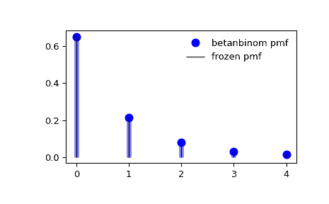

# `scipy.stats.betanbinom`

> 原文链接：[`docs.scipy.org/doc/scipy-1.12.0/reference/generated/scipy.stats.betanbinom.html#scipy.stats.betanbinom`](https://docs.scipy.org/doc/scipy-1.12.0/reference/generated/scipy.stats.betanbinom.html#scipy.stats.betanbinom)

```py
scipy.stats.betanbinom = <scipy.stats._discrete_distns.betanbinom_gen object>
```

贝塔负二项离散随机变量。

作为 [`rv_discrete`](https://docs.scipy.org/doc/scipy/reference/generated/scipy.stats.rv_discrete.html#scipy.stats.rv_discrete "scipy.stats.rv_discrete") 类的一个实例，`betanbinom` 对象继承了一组通用方法（请参阅下文的完整列表），并用此特定分布的详细信息补充了它们。

另请参见

[`贝塔二项分布`](https://docs.scipy.org/doc/scipy-1.12.0/reference/generated/scipy.stats.betanbinom.html#scipy.stats.betanbinom "scipy.stats.betanbinom")

Beta 负二项分布

注意

贝塔负二项分布是具有成功概率 *p* 的贝塔分布的负二项分布。

`betanbinom` 的概率质量函数为：

\[f(k) = \binom{n + k - 1}{k} \frac{B(a + n, b + k)}{B(a, b)}\]

对于 \(k \ge 0\), \(n \geq 0\), \(a > 0\), \(b > 0\)，其中 \(B(a, b)\) 是贝塔函数。

`betanbinom` 接受 \(n\)、\(a\) 和 \(b\) 作为形状参数。

参考资料

[1]

[`en.wikipedia.org/wiki/Beta_negative_binomial_distribution`](https://en.wikipedia.org/wiki/Beta_negative_binomial_distribution)

上述概率质量函数定义为“标准化”形式。要转移分布，请使用 `loc` 参数。具体来说，`betanbinom.pmf(k, n, a, b, loc)` 等同于 `betanbinom.pmf(k - loc, n, a, b)`。

自版本 1.12.0 起新增。

示例

```py
>>> import numpy as np
>>> from scipy.stats import betanbinom
>>> import matplotlib.pyplot as plt
>>> fig, ax = plt.subplots(1, 1) 
```

计算前四个时刻：

```py
>>> n, a, b = 5, 9.3, 1
>>> mean, var, skew, kurt = betanbinom.stats(n, a, b, moments='mvsk') 
```

显示概率质量函数 (`pmf`)：

```py
>>> x = np.arange(betanbinom.ppf(0.01, n, a, b),
...               betanbinom.ppf(0.99, n, a, b))
>>> ax.plot(x, betanbinom.pmf(x, n, a, b), 'bo', ms=8, label='betanbinom pmf')
>>> ax.vlines(x, 0, betanbinom.pmf(x, n, a, b), colors='b', lw=5, alpha=0.5) 
```

或者，可以调用分布对象（作为函数）以固定形状和位置。这会返回一个固定给定参数的“冻结”RV 对象。

冻结分布并显示冻结的 `pmf`：

```py
>>> rv = betanbinom(n, a, b)
>>> ax.vlines(x, 0, rv.pmf(x), colors='k', linestyles='-', lw=1,
...         label='frozen pmf')
>>> ax.legend(loc='best', frameon=False)
>>> plt.show() 
```



检查 `cdf` 和 `ppf` 的准确性：

```py
>>> prob = betanbinom.cdf(x, n, a, b)
>>> np.allclose(x, betanbinom.ppf(prob, n, a, b))
True 
```

生成随机数：

```py
>>> r = betanbinom.rvs(n, a, b, size=1000) 
```

方法

| **rvs(n, a, b, loc=0, size=1, random_state=None)** | 随机变量。 |
| --- | --- |
| **pmf(k, n, a, b, loc=0)** | 概率质量函数。 |
| **logpmf(k, n, a, b, loc=0)** | 概率质量函数的对数。 |
| **cdf(k, n, a, b, loc=0)** | 累积分布函数。 |
| **logcdf(k, n, a, b, loc=0)** | 累积分布函数的对数。 |
| **sf(k, n, a, b, loc=0)** | 生存函数（也定义为 `1 - cdf`，但 *sf* 有时更精确）。 |
| **logsf(k, n, a, b, loc=0)** | 生存函数的对数。 |
| **ppf(q, n, a, b, loc=0)** | 百分位点函数（`cdf` 的反函数，即百分位数）。 |
| **isf(q, n, a, b, loc=0)** | 生存函数的反函数（`sf` 的反函数）。 |
| **stats(n, a, b, loc=0, moments=’mv’)** | 均值（‘m’）、方差（‘v’）、偏度（‘s’）和/或峰度（‘k’）。 |
| **entropy(n, a, b, loc=0)** | 随机变量的（微分）熵。 |
| **expect(func, args=(n, a, b), loc=0, lb=None, ub=None, conditional=False)** | 期望值，针对分布的一个参数的函数（的一个参数）。 |
| **median(n, a, b, loc=0)** | 分布的中位数。 |
| **mean(n, a, b, loc=0)** | 分布的均值。 |
| **var(n, a, b, loc=0)** | 分布的方差。 |
| **std(n, a, b, loc=0)** | 分布的标准差。 |
| **interval(confidence, n, a, b, loc=0)** | 置信区间，围绕中位数有相等的面积。 |
