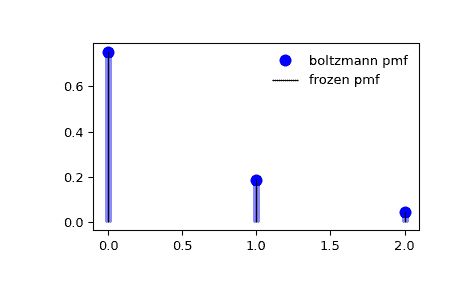

# `scipy.stats.boltzmann`

> 原始文本：[`docs.scipy.org/doc/scipy-1.12.0/reference/generated/scipy.stats.boltzmann.html#scipy.stats.boltzmann`](https://docs.scipy.org/doc/scipy-1.12.0/reference/generated/scipy.stats.boltzmann.html#scipy.stats.boltzmann)

```py
scipy.stats.boltzmann = <scipy.stats._discrete_distns.boltzmann_gen object>
```

一种 Boltzmann（截断离散指数）随机变量。

作为`rv_discrete`类的一个实例，`boltzmann` 对象继承了一组通用方法（下面详细列出），并补充了特定于此特定分布的细节。

注意事项

`boltzmann` 的概率质量函数为：

\[f(k) = (1-\exp(-\lambda)) \exp(-\lambda k) / (1-\exp(-\lambda N))\]

对于 \(k = 0,..., N-1\)。

`boltzmann` 接受 \(\lambda > 0\) 和 \(N > 0\) 作为形状参数。

上述概率质量函数以“标准化”形式定义。要移动分布，请使用`loc`参数。具体而言，`boltzmann.pmf(k, lambda_, N, loc)` 与 `boltzmann.pmf(k - loc, lambda_, N)` 完全等效。

示例

```py
>>> import numpy as np
>>> from scipy.stats import boltzmann
>>> import matplotlib.pyplot as plt
>>> fig, ax = plt.subplots(1, 1) 
```

计算前四个时刻：

```py
>>> lambda_, N = 1.4, 19
>>> mean, var, skew, kurt = boltzmann.stats(lambda_, N, moments='mvsk') 
```

显示概率质量函数（`pmf`）：

```py
>>> x = np.arange(boltzmann.ppf(0.01, lambda_, N),
...               boltzmann.ppf(0.99, lambda_, N))
>>> ax.plot(x, boltzmann.pmf(x, lambda_, N), 'bo', ms=8, label='boltzmann pmf')
>>> ax.vlines(x, 0, boltzmann.pmf(x, lambda_, N), colors='b', lw=5, alpha=0.5) 
```

或者，可以调用分布对象（作为函数）以固定形状和位置。这将返回一个“冻结的”RV 对象，其中包含给定的固定参数。

冻结分布并显示冻结的`pmf`：

```py
>>> rv = boltzmann(lambda_, N)
>>> ax.vlines(x, 0, rv.pmf(x), colors='k', linestyles='-', lw=1,
...         label='frozen pmf')
>>> ax.legend(loc='best', frameon=False)
>>> plt.show() 
```



检查`cdf`和`ppf`的准确性：

```py
>>> prob = boltzmann.cdf(x, lambda_, N)
>>> np.allclose(x, boltzmann.ppf(prob, lambda_, N))
True 
```

生成随机数：

```py
>>> r = boltzmann.rvs(lambda_, N, size=1000) 
```

方法

| **rvs(lambda_, N, loc=0, size=1, random_state=None)** | 随机变量。 |
| --- | --- |
| **pmf(k, lambda_, N, loc=0)** | 概率质量函数。 |
| **logpmf(k, lambda_, N, loc=0)** | 概率质量函数的对数。 |
| **cdf(k, lambda_, N, loc=0)** | 累积分布函数。 |
| **logcdf(k, lambda_, N, loc=0)** | 累积分布函数的对数。 |
| **sf(k, lambda_, N, loc=0)** | 生存函数（也被定义为`1 - cdf`，但*sf*有时更精确）。 |
| **logsf(k, lambda_, N, loc=0)** | 生存函数的对数。 |
| **ppf(q, lambda_, N, loc=0)** | 百分点函数（`cdf`的逆 — 百分位数）。 |
| **isf(q, lambda_, N, loc=0)** | 逆生存函数（`sf`的逆）。 |
| **stats(lambda_, N, loc=0, moments=’mv’)** | 平均值（‘m’）、方差（‘v’）、偏度（‘s’）和/或峰度（‘k’）。 |
| **entropy(lambda_, N, loc=0)** | RV 的（微分）熵。 |
| **expect(func, args=(lambda_, N), loc=0, lb=None, ub=None, conditional=False)** | 函数期望值（一个参数的函数）。 |
| **median(lambda_, N, loc=0)** | 分布的中位数。 |
| **mean(lambda_, N, loc=0)** | 分布的均值。 |
| **var(lambda_, N, loc=0)** | 分布的方差。 |
| **std(lambda_, N, loc=0)** | 分布的标准差（lambda，N，位置=0）。 |
| **interval(confidence, lambda_, N, loc=0)** | 区间（置信度，lambda，N，位置=0），中位数周围具有相等面积的置信区间。 |
