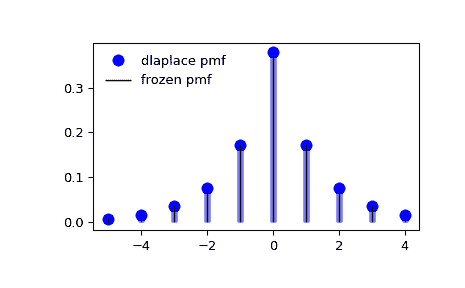

# `scipy.stats.dlaplace`

> 原文链接：[`docs.scipy.org/doc/scipy-1.12.0/reference/generated/scipy.stats.dlaplace.html#scipy.stats.dlaplace`](https://docs.scipy.org/doc/scipy-1.12.0/reference/generated/scipy.stats.dlaplace.html#scipy.stats.dlaplace)

```py
scipy.stats.dlaplace = <scipy.stats._discrete_distns.dlaplace_gen object>
```

一个拉普拉斯离散随机变量。

作为 `rv_discrete` 类的一个实例，`dlaplace` 对象继承了一组通用方法（下面详细列出），并用特定于此特定分布的细节完善了它们。

注意事项

`dlaplace` 的概率质量函数为：

\[f(k) = \tanh(a/2) \exp(-a |k|)\]

对于整数 \(k\) 和 \(a > 0\)。

`dlaplace` 以参数 \(a\) 作为形状参数。

上述概率质量函数以“标准化”形式定义。使用 `loc` 参数来移动分布。具体地，`dlaplace.pmf(k, a, loc)` 与 `dlaplace.pmf(k - loc, a)` 完全等价。

示例

```py
>>> import numpy as np
>>> from scipy.stats import dlaplace
>>> import matplotlib.pyplot as plt
>>> fig, ax = plt.subplots(1, 1) 
```

计算前四个矩：

```py
>>> a = 0.8
>>> mean, var, skew, kurt = dlaplace.stats(a, moments='mvsk') 
```

显示概率质量函数（`pmf`）：

```py
>>> x = np.arange(dlaplace.ppf(0.01, a),
...               dlaplace.ppf(0.99, a))
>>> ax.plot(x, dlaplace.pmf(x, a), 'bo', ms=8, label='dlaplace pmf')
>>> ax.vlines(x, 0, dlaplace.pmf(x, a), colors='b', lw=5, alpha=0.5) 
```

或者，可以调用分布对象（作为函数）以固定形状和位置。这将返回一个固定给定参数的“冻结”随机变量对象。

冻结分布并显示冻结的 `pmf`：

```py
>>> rv = dlaplace(a)
>>> ax.vlines(x, 0, rv.pmf(x), colors='k', linestyles='-', lw=1,
...         label='frozen pmf')
>>> ax.legend(loc='best', frameon=False)
>>> plt.show() 
```



检查 `cdf` 和 `ppf` 的准确性：

```py
>>> prob = dlaplace.cdf(x, a)
>>> np.allclose(x, dlaplace.ppf(prob, a))
True 
```

生成随机数：

```py
>>> r = dlaplace.rvs(a, size=1000) 
```

方法

| **rvs(a, loc=0, size=1, random_state=None)** | 随机变量。 |
| --- | --- |
| **pmf(k, a, loc=0)** | 概率质量函数。 |
| **logpmf(k, a, loc=0)** | 概率质量函数的对数。 |
| **cdf(k, a, loc=0)** | 累积分布函数。 |
| **logcdf(k, a, loc=0)** | 累积分布函数的对数。 |
| **sf(k, a, loc=0)** | 生存函数（也定义为 `1 - cdf`，但 *sf* 有时更准确）。 |
| **logsf(k, a, loc=0)** | 生存函数的对数。 |
| **ppf(q, a, loc=0)** | 百分点函数（`cdf` 的反函数 — 百分位数）。 |
| **isf(q, a, loc=0)** | 生存函数的逆函数（`sf` 的逆函数）。 |
| **stats(a, loc=0, moments=’mv’)** | 均值（‘m’），方差（‘v’），偏度（‘s’），及/或峰度（‘k’）。 |
| **entropy(a, loc=0)** | 随机变量的（微分）熵。 |
| **expect(func, args=(a,), loc=0, lb=None, ub=None, conditional=False)** | 对分布的函数（一个参数的函数）的期望值。 |
| **median(a, loc=0)** | 分布的中位数。 |
| **mean(a, loc=0)** | 分布的均值。 |
| **var(a, loc=0)** | 分布的方差。 |
| **std(a, loc=0)** | 分布的标准偏差。 |
| **interval(confidence, a, loc=0)** | 中位数周围具有相等面积的置信区间。 |
