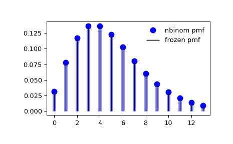

# `scipy.stats.nbinom`

> 原文链接：[`docs.scipy.org/doc/scipy-1.12.0/reference/generated/scipy.stats.nbinom.html#scipy.stats.nbinom`](https://docs.scipy.org/doc/scipy-1.12.0/reference/generated/scipy.stats.nbinom.html#scipy.stats.nbinom)

```py
scipy.stats.nbinom = <scipy.stats._discrete_distns.nbinom_gen object>
```

负二项离散随机变量。

作为 `rv_discrete` 类的一个实例，`nbinom` 对象继承了一组通用方法（下面完整列表），并根据这个特定分布补充了细节。

另请参阅

`hypergeom`, `binom`, `nhypergeom`

注意事项

负二项分布描述了一系列独立同分布的伯努利试验，重复进行直到达到预定的非随机成功次数。

`nbinom` 的失败次数的概率质量函数是：

\[f(k) = \binom{k+n-1}{n-1} p^n (1-p)^k\]

对于 \(k \ge 0\), \(0 < p \leq 1\)

`nbinom` 接受 \(n\) 和 \(p\) 作为形状参数，其中 \(n\) 是成功次数，\(p\) 是单次成功的概率，\(1-p\) 是单次失败的概率。

负二项分布的另一种常见参数化是通过平均失败次数 \(\mu\) 来实现 \(n\) 次成功。平均值 \(\mu\) 与成功概率的关系如下

\[p = \frac{n}{n + \mu}\]

成功次数 \(n\) 也可以用“分散度”、“异质性”或“聚合度”参数 \(\alpha\) 来指定，它将平均值 \(\mu\) 与方差 \(\sigma²\) 关联起来，例如 \(\sigma² = \mu + \alpha \mu²\)。无论使用 \(\alpha\) 的哪种约定，

\[\begin{split}p &= \frac{\mu}{\sigma²} \\ n &= \frac{\mu²}{\sigma² - \mu}\end{split}\]

上面的概率质量函数是以“标准化”形式定义的。要移动分布，请使用 `loc` 参数。具体而言，`nbinom.pmf(k, n, p, loc)` 等同于 `nbinom.pmf(k - loc, n, p)`。

示例

```py
>>> import numpy as np
>>> from scipy.stats import nbinom
>>> import matplotlib.pyplot as plt
>>> fig, ax = plt.subplots(1, 1) 
```

计算前四个矩：

```py
>>> n, p = 5, 0.5
>>> mean, var, skew, kurt = nbinom.stats(n, p, moments='mvsk') 
```

显示概率质量函数 (`pmf`)：

```py
>>> x = np.arange(nbinom.ppf(0.01, n, p),
...               nbinom.ppf(0.99, n, p))
>>> ax.plot(x, nbinom.pmf(x, n, p), 'bo', ms=8, label='nbinom pmf')
>>> ax.vlines(x, 0, nbinom.pmf(x, n, p), colors='b', lw=5, alpha=0.5) 
```

或者，可以调用分布对象（作为函数）来固定形状和位置。这将返回一个“冻结”的随机变量对象，保持给定的参数不变。

冻结分布并显示冻结的 `pmf`：

```py
>>> rv = nbinom(n, p)
>>> ax.vlines(x, 0, rv.pmf(x), colors='k', linestyles='-', lw=1,
...         label='frozen pmf')
>>> ax.legend(loc='best', frameon=False)
>>> plt.show() 
```



检查 `cdf` 和 `ppf` 的准确性：

```py
>>> prob = nbinom.cdf(x, n, p)
>>> np.allclose(x, nbinom.ppf(prob, n, p))
True 
```

生成随机数：

```py
>>> r = nbinom.rvs(n, p, size=1000) 
```

方法

| **rvs(n, p, loc=0, size=1, random_state=None)** | 随机变量。 |
| --- | --- |
| **pmf(k, n, p, loc=0)** | 概率质量函数。 |
| **logpmf(k, n, p, loc=0)** | 概率质量函数的对数。 |
| **cdf(k, n, p, loc=0)** | 累积分布函数。 |
| **logcdf(k, n, p, loc=0)** | 累积分布函数的对数。 |
| **sf(k, n, p, loc=0)** | 生存函数（也定义为 `1 - cdf`，但*sf*有时更精确）。 |
| **logsf(k, n, p, loc=0)** | 生存函数的对数。 |
| **ppf(q, n, p, loc=0)** | 百分位点函数（`cdf`的逆函数，即百分位数）。 |
| **isf(q, n, p, loc=0)** | 逆生存函数（`sf`的逆函数）。 |
| **stats(n, p, loc=0, moments=’mv’)** | 均值（‘m’）、方差（‘v’）、偏度（‘s’）和/或峰度（‘k’）。 |
| **entropy(n, p, loc=0)** | 随机变量的（微分）熵。 |
| **expect(func, args=(n, p), loc=0, lb=None, ub=None, conditional=False)** | 期望值（对于分布的一个参数的函数）。 |
| **median(n, p, loc=0)** | 分布的中位数。 |
| **mean(n, p, loc=0)** | 分布的均值。 |
| **var(n, p, loc=0)** | 分布的方差。 |
| **std(n, p, loc=0)** | 分布的标准差。 |
| **interval(confidence, n, p, loc=0)** | 置信区间，围绕中位数有相等的区域。 |
