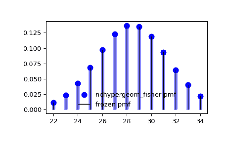

# `scipy.stats.nchypergeom_fisher`

> 原文链接：[`docs.scipy.org/doc/scipy-1.12.0/reference/generated/scipy.stats.nchypergeom_fisher.html#scipy.stats.nchypergeom_fisher`](https://docs.scipy.org/doc/scipy-1.12.0/reference/generated/scipy.stats.nchypergeom_fisher.html#scipy.stats.nchypergeom_fisher)

```py
scipy.stats.nchypergeom_fisher = <scipy.stats._discrete_distns.nchypergeom_fisher_gen object>
```

Fisher 的非中心超几何离散随机变量。

Fisher 的非中心超几何分布模型从箱中抽取两种类型的物体。 *M* 是总物体数， *n* 是类型 I 物体的数量， *odds* 是赔率比：当每种类型只有一个物体时选择类型 I 物体而不是类型 II 物体的赔率。随机变量表示从箱子中一把抓取物体后抽取的类型 I 物体数量，事后发现我们抓取了 *N* 个物体。

作为 `rv_discrete` 类的一个实例，`nchypergeom_fisher` 对象继承了该类的一系列通用方法（下面列出了完整列表），并完成了这些方法与该特定分布的详细信息。

参见

`nchypergeom_wallenius`, `hypergeom`, `nhypergeom`

注释

让数学符号 \(N\), \(n\), 和 \(M\) 分别对应上述定义的参数 *N*, *n*, 和 *M*。

概率质量函数定义为

\[p(x; M, n, N, \omega) = \frac{\binom{n}{x}\binom{M - n}{N-x}\omega^x}{P_0},\]

对于 \(x \in [x_l, x_u]\), \(M \in {\mathbb N}\), \(n \in [0, M]\), \(N \in [0, M]\), \(\omega > 0\), 其中 \(x_l = \max(0, N - (M - n))\), \(x_u = \min(N, n)\),

\[P_0 = \sum_{y=x_l}^{x_u} \binom{n}{y}\binom{M - n}{N-y}\omega^y,\]

并且二项式系数定义为

\[\binom{n}{k} \equiv \frac{n!}{k! (n - k)!}.\]

`nchypergeom_fisher` 使用 Agner Fog 的 BiasedUrn 包，并在 SciPy 许可下分发。

用于表示形状参数 (*N*, *n*, 和 *M*) 的符号并非普遍接受；选择这些符号是为了与 `hypergeom` 保持一致。

请注意，Fisher 的非中心超几何分布与 Wallenius 的非中心超几何分布不同，Wallenius 模型从箱子中逐个抽取预定数量的 *N* 物体。然而，当赔率比为单位时，两个分布都归结为普通超几何分布。

上述概率质量函数以“标准化”形式定义。要移动分布，请使用 `loc` 参数。具体来说，`nchypergeom_fisher.pmf(k, M, n, N, odds, loc)` 与 `nchypergeom_fisher.pmf(k - loc, M, n, N, odds)` 是完全等价的。

参考文献

[1]

阿格内尔·福格，《有偏抽奖理论》。[`cran.r-project.org/web/packages/BiasedUrn/vignettes/UrnTheory.pdf`](https://cran.r-project.org/web/packages/BiasedUrn/vignettes/UrnTheory.pdf)

[2]

“费舍尔的非中心超几何分布”，维基百科，[`en.wikipedia.org/wiki/Fisher’s_noncentral_hypergeometric_distribution`](https://en.wikipedia.org/wiki/Fisher's_noncentral_hypergeometric_distribution)

示例

```py
>>> import numpy as np
>>> from scipy.stats import nchypergeom_fisher
>>> import matplotlib.pyplot as plt
>>> fig, ax = plt.subplots(1, 1) 
```

计算前四个时刻：

```py
>>> M, n, N, odds = 140, 80, 60, 0.5
>>> mean, var, skew, kurt = nchypergeom_fisher.stats(M, n, N, odds, moments='mvsk') 
```

显示概率质量函数（`pmf`）：

```py
>>> x = np.arange(nchypergeom_fisher.ppf(0.01, M, n, N, odds),
...               nchypergeom_fisher.ppf(0.99, M, n, N, odds))
>>> ax.plot(x, nchypergeom_fisher.pmf(x, M, n, N, odds), 'bo', ms=8, label='nchypergeom_fisher pmf')
>>> ax.vlines(x, 0, nchypergeom_fisher.pmf(x, M, n, N, odds), colors='b', lw=5, alpha=0.5) 
```

或者，可以调用分布对象（作为函数）以固定形状和位置。这将返回一个“冻结”的随机变量对象，保持给定的参数不变。

冻结分布并显示冻结的 `pmf`：

```py
>>> rv = nchypergeom_fisher(M, n, N, odds)
>>> ax.vlines(x, 0, rv.pmf(x), colors='k', linestyles='-', lw=1,
...         label='frozen pmf')
>>> ax.legend(loc='best', frameon=False)
>>> plt.show() 
```



检查 `cdf` 和 `ppf` 的准确性：

```py
>>> prob = nchypergeom_fisher.cdf(x, M, n, N, odds)
>>> np.allclose(x, nchypergeom_fisher.ppf(prob, M, n, N, odds))
True 
```

生成随机数：

```py
>>> r = nchypergeom_fisher.rvs(M, n, N, odds, size=1000) 
```

方法

| **rvs(M, n, N, odds, loc=0, size=1, random_state=None)** | 随机变量。 |
| --- | --- |
| **pmf(k, M, n, N, odds, loc=0)** | 概率质量函数。 |
| **logpmf(k, M, n, N, odds, loc=0)** | 概率质量函数的对数。 |
| **cdf(k, M, n, N, odds, loc=0)** | 累积分布函数。 |
| **logcdf(k, M, n, N, odds, loc=0)** | 累积分布函数的对数。 |
| **sf(k, M, n, N, odds, loc=0)** | 生存函数（也被定义为 `1 - cdf`，但 *sf* 有时更精确）。 |
| **logsf(k, M, n, N, odds, loc=0)** | 生存函数的对数。 |
| **ppf(q, M, n, N, odds, loc=0)** | 百分点函数（`cdf` 的反函数 — 百分位数）。 |
| **isf(q, M, n, N, odds, loc=0)** | 生存函数的反函数（`sf`的反函数）。 |
| **stats(M, n, N, odds, loc=0, moments=’mv’)** | 均值（‘m’）、方差（‘v’）、偏度（‘s’）和/或峰度（‘k’）。 |
| **entropy(M, n, N, odds, loc=0)** | 随机变量的（微分）熵。 |
| **expect(func, args=(M, n, N, odds), loc=0, lb=None, ub=None, conditional=False)** | 对于分布的函数（一个参数）的期望值。 |
| **median(M, n, N, odds, loc=0)** | 分布的中位数。 |
| **mean(M, n, N, odds, loc=0)** | 分布的均值。 |
| **var(M, n, N, odds, loc=0)** | 分布的方差。 |
| **std(M, n, N, odds, loc=0)** | 分布的标准差。 |
| **interval(confidence, M, n, N, odds, loc=0)** | 周围面积相等的置信区间，围绕中位数。 |
