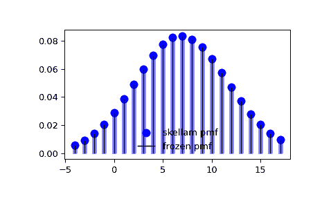

# `scipy.stats.skellam`

> 原文链接：[scipy.stats.skellam](https://docs.scipy.org/doc/scipy-1.12.0/reference/generated/scipy.stats.skellam.html#scipy.stats.skellam)

```py
scipy.stats.skellam = <scipy.stats._discrete_distns.skellam_gen object>
```

一个斯凯拉姆离散随机变量。

作为 `rv_discrete` 类的一个实例，`skellam` 对象继承了一系列通用方法（请参阅下面的完整列表），并针对这个特定分布补充了特定细节。

注释

两个相关或不相关泊松随机变量差的概率分布。

设 \(k_1\) 和 \(k_2\) 是两个期望值分别为 \(\lambda_1\) 和 \(\lambda_2\) 的泊松分布随机变量。那么，\(k_1 - k_2\) 符合参数为 \(\mu_1 = \lambda_1 - \rho \sqrt{\lambda_1 \lambda_2}\) 和 \(\mu_2 = \lambda_2 - \rho \sqrt{\lambda_1 \lambda_2}\) 的斯凯拉姆分布，其中 \(\rho\) 是 \(k_1\) 和 \(k_2\) 之间的相关系数。如果两个泊松分布随机变量是独立的，则 \(\rho = 0\)。

参数 \(\mu_1\) 和 \(\mu_2\) 必须严格为正数。

详细信息请参见：[斯凯拉姆分布](https://en.wikipedia.org/wiki/Skellam_distribution)

`skellam` 以 \(\mu_1\) 和 \(\mu_2\) 作为形状参数。

上述概率质量函数以“标准化”形式定义。使用 `loc` 参数来改变分布位置。具体而言，`skellam.pmf(k, mu1, mu2, loc)` 与 `skellam.pmf(k - loc, mu1, mu2)` 完全等价。

示例

```py
>>> import numpy as np
>>> from scipy.stats import skellam
>>> import matplotlib.pyplot as plt
>>> fig, ax = plt.subplots(1, 1) 
```

计算前四个矩：

```py
>>> mu1, mu2 = 15, 8
>>> mean, var, skew, kurt = skellam.stats(mu1, mu2, moments='mvsk') 
```

显示概率质量函数（`pmf`）：

```py
>>> x = np.arange(skellam.ppf(0.01, mu1, mu2),
...               skellam.ppf(0.99, mu1, mu2))
>>> ax.plot(x, skellam.pmf(x, mu1, mu2), 'bo', ms=8, label='skellam pmf')
>>> ax.vlines(x, 0, skellam.pmf(x, mu1, mu2), colors='b', lw=5, alpha=0.5) 
```

或者，可以调用分布对象（作为函数）以固定形状和位置。这将返回一个持有给定参数固定的“冻结”随机变量对象。

冻结分布并显示冻结的 `pmf`：

```py
>>> rv = skellam(mu1, mu2)
>>> ax.vlines(x, 0, rv.pmf(x), colors='k', linestyles='-', lw=1,
...         label='frozen pmf')
>>> ax.legend(loc='best', frameon=False)
>>> plt.show() 
```



检查 `cdf` 和 `ppf` 的准确性：

```py
>>> prob = skellam.cdf(x, mu1, mu2)
>>> np.allclose(x, skellam.ppf(prob, mu1, mu2))
True 
```

生成随机数：

```py
>>> r = skellam.rvs(mu1, mu2, size=1000) 
```

方法

| **rvs(mu1, mu2, loc=0, size=1, random_state=None)** | 随机变量。 |
| --- | --- |
| **pmf(k, mu1, mu2, loc=0)** | 概率质量函数。 |
| **logpmf(k, mu1, mu2, loc=0)** | 概率质量函数的对数。 |
| **cdf(k, mu1, mu2, loc=0)** | 累积分布函数。 |
| **logcdf(k, mu1, mu2, loc=0)** | 累积分布函数的对数。 |
| **sf(k, mu1, mu2, loc=0)** | 生存函数（也定义为 `1 - cdf`，但 *sf* 有时更精确）。 |
| **logsf(k, mu1, mu2, loc=0)** | 生存函数的对数。 |
| **ppf(q, mu1, mu2, loc=0)** | 百分点函数（`cdf` 的反函数 — 百分位数）。 |
| **isf(q, mu1, mu2, loc=0)** | 逆生存函数（`sf` 的反函数）。 |
| **stats(mu1, mu2, loc=0, moments=’mv’)** | 均值（‘m’）、方差（‘v’）、偏度（‘s’）和/或峰度（‘k’）。 |
| **entropy(mu1, mu2, loc=0)** | 随机变量的（微分）熵。 |
| **expect(func, args=(mu1, mu2), loc=0, lb=None, ub=None, conditional=False)** | 对分布的一个参数函数（一个参数）的期望值。 |
| **median(mu1, mu2, loc=0)** | 分布的中位数。 |
| **mean(mu1, mu2, loc=0)** | 分布的均值。 |
| **var(mu1, mu2, loc=0)** | 分布的方差。 |
| **std(mu1, mu2, loc=0)** | 分布的标准差。 |
| **interval(confidence, mu1, mu2, loc=0)** | 中位数周围等面积置信区间。 |
