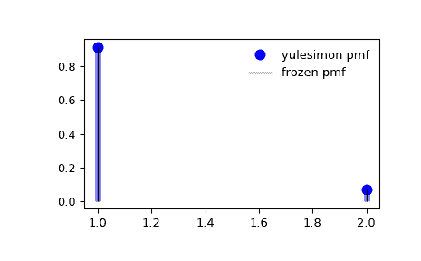

# `scipy.stats.yulesimon`

> 原文：[`docs.scipy.org/doc/scipy-1.12.0/reference/generated/scipy.stats.yulesimon.html#scipy.stats.yulesimon`](https://docs.scipy.org/doc/scipy-1.12.0/reference/generated/scipy.stats.yulesimon.html#scipy.stats.yulesimon)

```py
scipy.stats.yulesimon = <scipy.stats._discrete_distns.yulesimon_gen object>
```

Yule-Simon 离散随机变量。

作为 `rv_discrete` 类的一个实例，`yulesimon` 对象继承了一系列通用方法（下面列出完整列表），并通过特定于此特定分布的细节完善它们。

注释

`yulesimon` 的概率质量函数如下：

\[f(k) = \alpha B(k, \alpha+1)\]

对于 \(k=1,2,3,...\)，其中 \(\alpha>0\)。这里 \(B\) 是 `scipy.special.beta` 函数。

随机变量的采样基于[[1]](#r71ee978d9ee0-1)第 553 页第 6.3 节。我们的符号映射到通过 \(\alpha=a-1\) 引用的逻辑。

详细信息请参见维基百科条目[[2]](#r71ee978d9ee0-2)。

参考文献

[1]

Devroye, Luc. “非均匀随机变量生成”，（1986 年）斯普林格出版社，纽约。

[2]

[`en.wikipedia.org/wiki/Yule-Simon_distribution`](https://en.wikipedia.org/wiki/Yule-Simon_distribution)

上述概率质量函数定义为“标准化”形式。要移动分布，请使用 `loc` 参数。具体地说，`yulesimon.pmf(k, alpha, loc)` 与 `yulesimon.pmf(k - loc, alpha)` 完全等效。

示例

```py
>>> import numpy as np
>>> from scipy.stats import yulesimon
>>> import matplotlib.pyplot as plt
>>> fig, ax = plt.subplots(1, 1) 
```

计算前四个时刻：

```py
>>> alpha = 11
>>> mean, var, skew, kurt = yulesimon.stats(alpha, moments='mvsk') 
```

显示概率质量函数 (`pmf`)：

```py
>>> x = np.arange(yulesimon.ppf(0.01, alpha),
...               yulesimon.ppf(0.99, alpha))
>>> ax.plot(x, yulesimon.pmf(x, alpha), 'bo', ms=8, label='yulesimon pmf')
>>> ax.vlines(x, 0, yulesimon.pmf(x, alpha), colors='b', lw=5, alpha=0.5) 
```

或者，可以调用分布对象（作为函数）以固定形状和位置。这将返回一个“冻结”的 RV 对象，保持给定参数不变。

冻结分布并显示冻结的 `pmf`：

```py
>>> rv = yulesimon(alpha)
>>> ax.vlines(x, 0, rv.pmf(x), colors='k', linestyles='-', lw=1,
...         label='frozen pmf')
>>> ax.legend(loc='best', frameon=False)
>>> plt.show() 
```



检查 `cdf` 和 `ppf` 的准确性：

```py
>>> prob = yulesimon.cdf(x, alpha)
>>> np.allclose(x, yulesimon.ppf(prob, alpha))
True 
```

生成随机数：

```py
>>> r = yulesimon.rvs(alpha, size=1000) 
```

方法

| **rvs(alpha, loc=0, size=1, random_state=None)** | 随机变量。 |
| --- | --- |
| **pmf(k, alpha, loc=0)** | 概率质量函数。 |
| **logpmf(k, alpha, loc=0)** | 概率质量函数的对数。 |
| **cdf(k, alpha, loc=0)** | 累积分布函数。 |
| **logcdf(k, alpha, loc=0)** | 累积分布函数的对数。 |
| **sf(k, alpha, loc=0)** | 生存函数（也定义为 `1 - cdf`，但 *sf* 有时更精确）。 |
| **logsf(k, alpha, loc=0)** | 生存函数的对数。 |
| **ppf(q, alpha, loc=0)** | 百分位点函数（`cdf` 的反函数 — 百分位数）。 |
| **isf(q, alpha, loc=0)** | 逆生存函数（`sf` 的逆）。 |
| **stats(alpha, loc=0, moments=’mv’)** | 均值（‘m’）、方差（‘v’）、偏度（‘s’）、峰度（‘k’）。 |
| **entropy(alpha, loc=0)** | RV 的（微分）熵。 |
| **expect(func, args=(alpha,), loc=0, lb=None, ub=None, conditional=False)** | 对分布中一个（一元）函数的期望值。 |
| **median(alpha, loc=0)** | 分布的中位数。 |
| **mean(alpha, loc=0)** | 分布的均值。 |
| **var(alpha, loc=0)** | 分布的方差。 |
| **std(alpha, loc=0)** | 分布的标准差。 |
| **interval(confidence, alpha, loc=0)** | 置信区间，围绕中位数具有相等面积。 |
