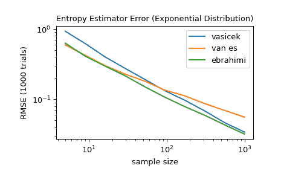

# `scipy.stats.differential_entropy`

> 原文链接：[`docs.scipy.org/doc/scipy-1.12.0/reference/generated/scipy.stats.differential_entropy.html#scipy.stats.differential_entropy`](https://docs.scipy.org/doc/scipy-1.12.0/reference/generated/scipy.stats.differential_entropy.html#scipy.stats.differential_entropy)

```py
scipy.stats.differential_entropy(values, *, window_length=None, base=None, axis=0, method='auto', nan_policy='propagate', keepdims=False)
```

给定分布的样本，估计微分熵。

根据样本大小选择默认的方法，可使用*method*参数选择多种估计方法。

参数：

**values**序列

从连续分布中抽取样本。

**window_length**整数，可选

用于计算 Vasicek 估计的窗口长度。必须是 1 到样本大小的一半之间的整数。如果为`None`（默认值），则使用启发式值

\[\left \lfloor \sqrt{n} + 0.5 \right \rfloor\]

其中 \(n\) 是样本大小。这一启发式方法最初是在文献中提出的[[2]](#raf58c91bd86c-2)，现在在文献中很常见。

**base**浮点数，可选

使用的对数基数，默认为`e`（自然对数）。

**axis**int 或 None，默认值为：0

如果为整数，则是计算统计量的输入轴。输入的每个轴切片（例如行）的统计量将出现在输出的相应元素中。如果为`None`，则在计算统计量之前将对输入进行展平。

**method**{‘vasicek’, ‘van es’, ‘ebrahimi’, ‘correa’, ‘auto’}，可选

从样本中估计微分熵的方法。默认为`'auto'`。更多信息请参阅注意事项。

**nan_policy**{‘propagate’, ‘omit’, ‘raise’}

定义如何处理输入的 NaN 值。

+   `propagate`: 如果在进行统计计算的轴切片（例如行）中存在 NaN，则输出的相应条目将为 NaN。

+   `omit`: 在执行计算时将省略 NaN 值。如果沿着进行统计计算的轴切片中剩余的数据不足，则输出的相应条目将为 NaN。

+   `raise`: 如果存在 NaN 值，则会引发`ValueError`。

**keepdims**bool，默认值为：False

如果设置为 True，则被减少的轴将作为大小为一的维度保留在结果中。使用此选项，结果将正确地与输入数组进行广播。

返回：

**entropy**浮点数

计算得到的微分熵。

注意事项

该函数在极限情况下将收敛到真实的微分熵

\[n \to \infty, \quad m \to \infty, \quad \frac{m}{n} \to 0\]

对于给定的样本大小，`window_length`的最佳选择取决于（未知的）分布。通常，分布的密度越平滑，`window_length`的最佳值就越大[[1]](#raf58c91bd86c-1)。

*method*参数有以下选项可供选择。

+   `'vasicek'`使用[[1]](#raf58c91bd86c-1)中提出的估计器。这是微分熵的最早和最有影响力的估计器之一。

+   `'van es'`使用在[[3]](#raf58c91bd86c-3)中提出的修正偏差估计器，不仅是一致的，而且在某些条件下渐近正态。

+   `'ebrahimi'`使用在[[4]](#raf58c91bd86c-4)中提出的估计器，在模拟中显示比 Vasicek 估计器具有更小的偏差和均方误差。

+   `'correa'`使用在[[5]](#raf58c91bd86c-5)中基于局部线性回归提出的估计器。在模拟研究中，其均方误差始终比 Vasiceck 估计器小，但计算成本更高。

+   `'auto'`自动选择方法（默认）。目前，这为非常小的样本（<10）选择`'van es'`，对于中等样本大小（11-1000）选择`'ebrahimi'`，对于较大样本选择`'vasicek'`，但此行为可能在未来版本中更改。

所有估计器均按照[[6]](#raf58c91bd86c-6)中描述的方式实现。

从 SciPy 1.9 开始，不推荐新代码使用`np.matrix`输入，在进行计算之前将其转换为`np.ndarray`。在这种情况下，输出将是适当形状的标量或`np.ndarray`，而不是 2D 的`np.matrix`。类似地，尽管忽略了掩码数组的掩码元素，输出将是标量或`np.ndarray`，而不是带有`mask=False`的掩码数组。

参考文献

[1] (1,2)

Vasicek, O. (1976). 基于样本熵的正态性检验. 《皇家统计学会杂志：B 系列（方法学）》，38(1)，54-59。

[2]

Crzcgorzewski, P., & Wirczorkowski, R. (1999). 基于熵的指数分布适合性检验. 《统计学通信-理论与方法》，28(5)，1183-1202。

[3]

Van Es, B. (1992). 通过基于间隔的统计量类估计密度相关的函数. 《斯堪的纳维亚统计学杂志》，61-72。

[4]

Ebrahimi, N., Pflughoeft, K., & Soofi, E. S. (1994). 两种样本熵测量. 《统计与概率信函》，20(3)，225-234。

[5]

Correa, J. C. (1995). 新的熵估计器. 《统计学通信-理论与方法》，24(10)，2439-2449。

[6]

Noughabi, H. A. (2015). 使用数值方法进行熵估计. 《数据科学年鉴》，2(2)，231-241。[`link.springer.com/article/10.1007/s40745-015-0045-9`](https://link.springer.com/article/10.1007/s40745-015-0045-9)

示例

```py
>>> import numpy as np
>>> from scipy.stats import differential_entropy, norm 
```

标准正态分布的熵：

```py
>>> rng = np.random.default_rng()
>>> values = rng.standard_normal(100)
>>> differential_entropy(values)
1.3407817436640392 
```

与真实熵比较：

```py
>>> float(norm.entropy())
1.4189385332046727 
```

对于在 5 到 1000 之间的多个样本大小，比较`'vasicek'`，`'van es'`和`'ebrahimi'`方法的准确性。具体比较（1000 次试验中）估计与分布真实差分熵之间的均方根误差。

```py
>>> from scipy import stats
>>> import matplotlib.pyplot as plt
>>>
>>>
>>> def rmse(res, expected):
...  '''Root mean squared error'''
...     return np.sqrt(np.mean((res - expected)**2))
>>>
>>>
>>> a, b = np.log10(5), np.log10(1000)
>>> ns = np.round(np.logspace(a, b, 10)).astype(int)
>>> reps = 1000  # number of repetitions for each sample size
>>> expected = stats.expon.entropy()
>>>
>>> method_errors = {'vasicek': [], 'van es': [], 'ebrahimi': []}
>>> for method in method_errors:
...     for n in ns:
...        rvs = stats.expon.rvs(size=(reps, n), random_state=rng)
...        res = stats.differential_entropy(rvs, method=method, axis=-1)
...        error = rmse(res, expected)
...        method_errors[method].append(error)
>>>
>>> for method, errors in method_errors.items():
...     plt.loglog(ns, errors, label=method)
>>>
>>> plt.legend()
>>> plt.xlabel('sample size')
>>> plt.ylabel('RMSE (1000 trials)')
>>> plt.title('Entropy Estimator Error (Exponential Distribution)') 
```


