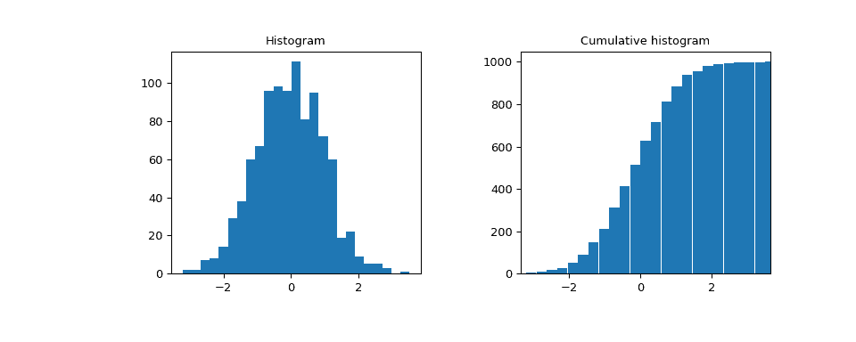

# `scipy.stats.cumfreq`

> 原文链接：[`docs.scipy.org/doc/scipy-1.12.0/reference/generated/scipy.stats.cumfreq.html#scipy.stats.cumfreq`](https://docs.scipy.org/doc/scipy-1.12.0/reference/generated/scipy.stats.cumfreq.html#scipy.stats.cumfreq)

```py
scipy.stats.cumfreq(a, numbins=10, defaultreallimits=None, weights=None)
```

返回一个累积频率直方图，使用直方图函数。

累积直方图是一种映射，它计算了到指定箱子的所有箱子中的观测累积数。

参数：

**a**array_like

输入数组。

**numbins**int，可选

用于直方图的箱子数。默认为 10。

**defaultreallimits**tuple (lower, upper)，可选

直方图的范围的下限和上限值。如果未指定值，则使用稍大于 *a* 值范围的范围。具体而言，`(a.min() - s, a.max() + s)`，其中 `s = (1/2)(a.max() - a.min()) / (numbins - 1)`。

**weights**array_like，可选

*a* 中每个值的权重。默认为 None，即每个值的权重为 1.0。

返回：

**cumcount**ndarray

累积频率的分箱值。

**lowerlimit**float

较低的实际限制

**binsize**float

每个箱子的宽度。

**extrapoints**int

额外点。

示例

```py
>>> import numpy as np
>>> import matplotlib.pyplot as plt
>>> from scipy import stats
>>> rng = np.random.default_rng()
>>> x = [1, 4, 2, 1, 3, 1]
>>> res = stats.cumfreq(x, numbins=4, defaultreallimits=(1.5, 5))
>>> res.cumcount
array([ 1.,  2.,  3.,  3.])
>>> res.extrapoints
3 
```

创建具有 1000 个随机值的正态分布

```py
>>> samples = stats.norm.rvs(size=1000, random_state=rng) 
```

计算累积频率

```py
>>> res = stats.cumfreq(samples, numbins=25) 
```

计算 x 的值的空间

```py
>>> x = res.lowerlimit + np.linspace(0, res.binsize*res.cumcount.size,
...                                  res.cumcount.size) 
```

绘制直方图和累积直方图

```py
>>> fig = plt.figure(figsize=(10, 4))
>>> ax1 = fig.add_subplot(1, 2, 1)
>>> ax2 = fig.add_subplot(1, 2, 2)
>>> ax1.hist(samples, bins=25)
>>> ax1.set_title('Histogram')
>>> ax2.bar(x, res.cumcount, width=res.binsize)
>>> ax2.set_title('Cumulative histogram')
>>> ax2.set_xlim([x.min(), x.max()]) 
```

```py
>>> plt.show() 
```


