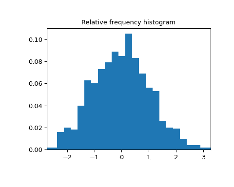

# `scipy.stats.relfreq`

> 原文：[`docs.scipy.org/doc/scipy-1.12.0/reference/generated/scipy.stats.relfreq.html#scipy.stats.relfreq`](https://docs.scipy.org/doc/scipy-1.12.0/reference/generated/scipy.stats.relfreq.html#scipy.stats.relfreq)

```py
scipy.stats.relfreq(a, numbins=10, defaultreallimits=None, weights=None)
```

返回一个相对频率直方图，使用直方图函数。

相对频率直方图是每个区间内观察值数量相对于总观察值的映射。

参数:

**a**数组型

输入数组。

**numbins**整数，可选

直方图使用的箱子数量。默认为 10。

**defaultreallimits**元组（下限，上限），可选

直方图的范围的下限和上限值。如果未给定值，则使用稍大于 a 值范围的范围。具体来说是 `(a.min() - s, a.max() + s)`，其中 `s = (1/2)(a.max() - a.min()) / (numbins - 1)`。

**weights**数组型，可选

*a*中每个值的权重。默认为 None，每个值的权重为 1.0。

返回：

**frequency**n 维数组

相对频率的分箱值。

**lowerlimit**浮点数

较低的实际限制。

**binsize**浮点数

每个箱子的宽度。

**extrapoints**整数

额外的点。

示例

```py
>>> import numpy as np
>>> import matplotlib.pyplot as plt
>>> from scipy import stats
>>> rng = np.random.default_rng()
>>> a = np.array([2, 4, 1, 2, 3, 2])
>>> res = stats.relfreq(a, numbins=4)
>>> res.frequency
array([ 0.16666667, 0.5       , 0.16666667,  0.16666667])
>>> np.sum(res.frequency)  # relative frequencies should add up to 1
1.0 
```

创建具有 1000 个随机值的正态分布

```py
>>> samples = stats.norm.rvs(size=1000, random_state=rng) 
```

计算相对频率

```py
>>> res = stats.relfreq(samples, numbins=25) 
```

计算 x 的值空间

```py
>>> x = res.lowerlimit + np.linspace(0, res.binsize*res.frequency.size,
...                                  res.frequency.size) 
```

绘制相对频率直方图

```py
>>> fig = plt.figure(figsize=(5, 4))
>>> ax = fig.add_subplot(1, 1, 1)
>>> ax.bar(x, res.frequency, width=res.binsize)
>>> ax.set_title('Relative frequency histogram')
>>> ax.set_xlim([x.min(), x.max()]) 
```

```py
>>> plt.show() 
```


