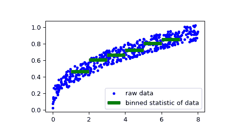
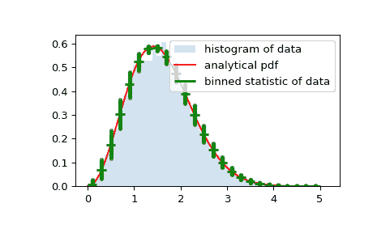

# `scipy.stats.binned_statistic`

> 原文：[`docs.scipy.org/doc/scipy-1.12.0/reference/generated/scipy.stats.binned_statistic.html#scipy.stats.binned_statistic`](https://docs.scipy.org/doc/scipy-1.12.0/reference/generated/scipy.stats.binned_statistic.html#scipy.stats.binned_statistic)

```py
scipy.stats.binned_statistic(x, values, statistic='mean', bins=10, range=None)
```

计算一个或多个数据集的分 bin 统计量。

这是直方图函数的一般化。直方图将空间划分为 bins，并返回每个 bin 中点的数量。此函数允许计算每个 bin 中的值（或值集合）的和、均值、中位数或其他统计量。

参数：

**x**(N,) 类似数组

要分 bin 的一系列值。

**values**(N,) 类似数组或者(N,) 类似数组的列表

统计量将被计算的数据。这必须与*x*具有相同的形状，或者是一组序列 - 每个序列与*x*具有相同的形状。如果*values*是一组序列，则将独立地计算每个统计量。

**statistic**字符串或可调用对象，可选

要计算的统计量（默认为‘mean’）。以下统计量可用：

> +   ‘mean’：计算每个 bin 内点的平均值。空的 bins 将用 NaN 表示。
> +   
> +   ‘std’：计算每个 bin 内的标准差。这是使用 ddof=0 隐式计算的。
> +   
> +   ‘median’：计算每个 bin 内点的值的中位数。空的 bins 将用 NaN 表示。
> +   
> +   ‘count’：计算每个 bin 内点的数量。这等同于一个非加权直方图。*values*数组不被引用。
> +   
> +   ‘sum’：计算每个 bin 内点的值的总和。这等同于一个加权直方图。
> +   
> +   ‘min’：计算每个 bin 内点的最小值。空的 bins 将用 NaN 表示。
> +   
> +   ‘max’：计算每个 bin 内点的值的最大值。空的 bins 将用 NaN 表示。
> +   
> +   function：一个用户定义的函数，接受一个值的 1D 数组，并输出一个单一的数值统计量。此函数将在每个 bin 中的值上调用。空的 bins 将由 function([])表示，如果这导致错误，则返回 NaN。

**bins**整数或标量序列，可选

如果*bins*是整数，则定义给定范围内的等宽 bin 数（默认为 10）。如果*bins*是序列，则定义 bin 边缘，包括右边的边缘，允许非均匀的 bin 宽度。小于最低 bin 边缘的*x*值被分配给 bin 号 0，超出最高 bin 的值被分配给`bins[-1]`。如果指定了 bin 边缘，则 bins 的数量将为（nx = len(bins)-1）。

**range** (float, float) 或 [(float, float)]，可选

bins 的下限和上限。如果未提供，则范围为`(x.min(), x.max())`。超出范围的值将被忽略。

返回值：

**statistic**数组

每个 bin 中所选统计量的值。

**bin_edges**浮点数 dtype 的数组

返回 bin 边界 `(length(statistic)+1)`。

binnumber：整数型的 1-D ndarray

每个值 *x* 属于的箱子（对应于 *bin_edges*）的索引。与 *values* 长度相同。箱号为 *i* 表示对应的值位于 (bin_edges[i-1], bin_edges[i]) 之间。

另请参阅

[`numpy.digitize`](https://numpy.org/devdocs/reference/generated/numpy.digitize.html#numpy.digitize "(在 NumPy v2.0.dev0 中)"), [`numpy.histogram`](https://numpy.org/devdocs/reference/generated/numpy.histogram.html#numpy.histogram "(在 NumPy v2.0.dev0 中)"), `binned_statistic_2d`, `binned_statistic_dd`

注意：

除了最后一个（最右边的）箱子是半开放的。换句话说，如果 *bins* 是 `[1, 2, 3, 4]`，那么第一个箱子是 `[1, 2)`（包括 1，但不包括 2），第二个是 `[2, 3)`。然而，最后一个箱子是 `[3, 4]`，其中包括 4。

版本 0.11.0 中的新特性。

示例：

```py
>>> import numpy as np
>>> from scipy import stats
>>> import matplotlib.pyplot as plt 
```

首先是一些基本示例：

在给定样本范围内创建两个均匀间隔的箱子，并计算每个箱子中对应的值的总和：

```py
>>> values = [1.0, 1.0, 2.0, 1.5, 3.0]
>>> stats.binned_statistic([1, 1, 2, 5, 7], values, 'sum', bins=2)
BinnedStatisticResult(statistic=array([4\. , 4.5]),
 bin_edges=array([1., 4., 7.]), binnumber=array([1, 1, 1, 2, 2])) 
```

也可以传递多个值数组。统计量是在每个集合上独立计算的：

```py
>>> values = [[1.0, 1.0, 2.0, 1.5, 3.0], [2.0, 2.0, 4.0, 3.0, 6.0]]
>>> stats.binned_statistic([1, 1, 2, 5, 7], values, 'sum', bins=2)
BinnedStatisticResult(statistic=array([[4\. , 4.5],
 [8\. , 9\. ]]), bin_edges=array([1., 4., 7.]),
 binnumber=array([1, 1, 1, 2, 2])) 
```

```py
>>> stats.binned_statistic([1, 2, 1, 2, 4], np.arange(5), statistic='mean',
...                        bins=3)
BinnedStatisticResult(statistic=array([1., 2., 4.]),
 bin_edges=array([1., 2., 3., 4.]),
 binnumber=array([1, 2, 1, 2, 3])) 
```

作为第二个例子，我们现在生成一些作为风速函数的帆船速度的随机数据，然后确定我们的船在特定风速下的速度有多快：

```py
>>> rng = np.random.default_rng()
>>> windspeed = 8 * rng.random(500)
>>> boatspeed = .3 * windspeed**.5 + .2 * rng.random(500)
>>> bin_means, bin_edges, binnumber = stats.binned_statistic(windspeed,
...                 boatspeed, statistic='median', bins=[1,2,3,4,5,6,7])
>>> plt.figure()
>>> plt.plot(windspeed, boatspeed, 'b.', label='raw data')
>>> plt.hlines(bin_means, bin_edges[:-1], bin_edges[1:], colors='g', lw=5,
...            label='binned statistic of data')
>>> plt.legend() 
```

现在我们可以使用 `binnumber` 来选择所有风速低于 1 的数据点：

```py
>>> low_boatspeed = boatspeed[binnumber == 0] 
```

最后一个例子中，我们将使用 `bin_edges` 和 `binnumber` 来绘制一个分布的图，该图显示每个 bin 中的平均值及其周围的分布，叠加在常规直方图和概率分布函数之上：

```py
>>> x = np.linspace(0, 5, num=500)
>>> x_pdf = stats.maxwell.pdf(x)
>>> samples = stats.maxwell.rvs(size=10000) 
```

```py
>>> bin_means, bin_edges, binnumber = stats.binned_statistic(x, x_pdf,
...         statistic='mean', bins=25)
>>> bin_width = (bin_edges[1] - bin_edges[0])
>>> bin_centers = bin_edges[1:] - bin_width/2 
```

```py
>>> plt.figure()
>>> plt.hist(samples, bins=50, density=True, histtype='stepfilled',
...          alpha=0.2, label='histogram of data')
>>> plt.plot(x, x_pdf, 'r-', label='analytical pdf')
>>> plt.hlines(bin_means, bin_edges[:-1], bin_edges[1:], colors='g', lw=2,
...            label='binned statistic of data')
>>> plt.plot((binnumber - 0.5) * bin_width, x_pdf, 'g.', alpha=0.5)
>>> plt.legend(fontsize=10)
>>> plt.show() 
```


