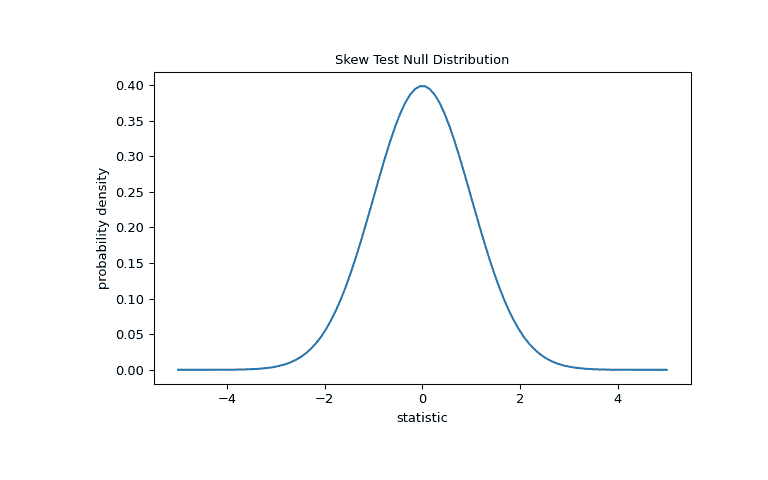
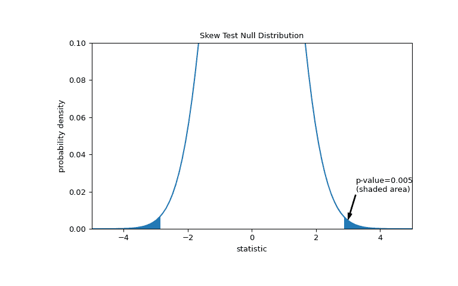
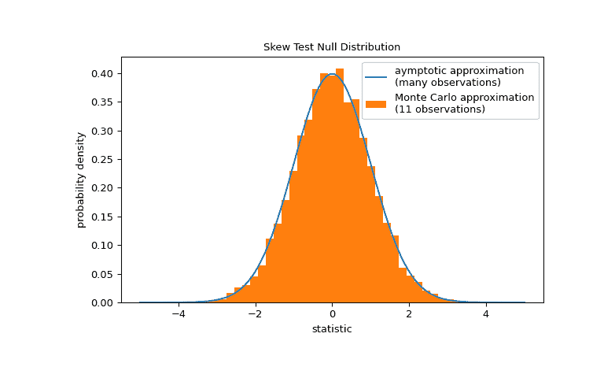

# `scipy.stats.skewtest`

> 原文：[`docs.scipy.org/doc/scipy-1.12.0/reference/generated/scipy.stats.skewtest.html#scipy.stats.skewtest`](https://docs.scipy.org/doc/scipy-1.12.0/reference/generated/scipy.stats.skewtest.html#scipy.stats.skewtest)

```py
scipy.stats.skewtest(a, axis=0, nan_policy='propagate', alternative='two-sided')
```

检验偏度是否与正态分布不同。

此函数测试空假设，即样本抽取的总体偏度与对应的正态分布的偏度相同。

参数：

**a**array

待测试的数据。

**axis**int 或 None，可选

计算统计量的轴线。默认为 0。如果为 None，则在整个数组 *a* 上计算。

**nan_policy**{‘propagate’, ‘raise’, ‘omit’}，可选

定义当输入包含 NaN 时如何处理。有以下选项可用（默认为 'propagate'）：

+   ‘propagate’：返回 NaN

+   ‘raise’：抛出错误

+   ‘omit’：在执行计算时忽略 NaN 值

**alternative**{‘two-sided’，‘less’，‘greater’}，可选

定义备择假设。默认为 'two-sided'。有以下选项可用：

+   ‘two-sided’：样本背后的分布的偏度与正态分布（即 0）不同

+   ‘less’：样本背后的分布的偏度小于正态分布的偏度

+   ‘greater’：样本背后的分布的偏度大于正态分布的偏度

1.7.0 版中的新功能。

返回：

**statistic**float

此测试的计算 z 分数。

**pvalue**float

假设检验的 p 值。

注意

样本大小必须至少为 8。

参考文献

[1]

R. B. D’Agostino, A. J. Belanger 和 R. B. D’Agostino Jr.，“使用强大和信息丰富的正态性检验的建议”，《美国统计学家》44，第 316-321 页，1990 年。

[2]

Shapiro，S. S.，& Wilk，M. B.（1965）。正态性的方差分析检验（完整样本）。《生物统计学》，52（3/4），591-611。

[3]

B. Phipson 和 G. K. Smyth。“当排列随机抽取时，排列 p 值永远不应为零：计算精确 p 值。”《遗传学和分子生物学中的统计应用》9.1（2010）。

示例

假设我们希望从测量中推断出，医学研究中成年男性的体重是否不符合正态分布 [[2]](#r906f1fd917a7-2)。以下是记录在数组 `x` 中的体重（磅）。

```py
>>> import numpy as np
>>> x = np.array([148, 154, 158, 160, 161, 162, 166, 170, 182, 195, 236]) 
```

来自[[1]](#r906f1fd917a7-1)的偏度检验从计算基于样本偏度的统计量开始。

```py
>>> from scipy import stats
>>> res = stats.skewtest(x)
>>> res.statistic
2.7788579769903414 
```

因为正态分布的偏度为零，所以此统计量的大小 tend 对于从正态分布中抽取的样本而言通常较低。

通过比较观察到的统计量的值与空假设的空分布来执行测试：统计量值的分布是在空假设下得出的，即权重是从正态分布中抽取的分布。

对于此测试，非常大样本的统计量的空分布是标准正态分布。

```py
>>> import matplotlib.pyplot as plt
>>> dist = stats.norm()
>>> st_val = np.linspace(-5, 5, 100)
>>> pdf = dist.pdf(st_val)
>>> fig, ax = plt.subplots(figsize=(8, 5))
>>> def st_plot(ax):  # we'll reuse this
...     ax.plot(st_val, pdf)
...     ax.set_title("Skew Test Null Distribution")
...     ax.set_xlabel("statistic")
...     ax.set_ylabel("probability density")
>>> st_plot(ax)
>>> plt.show() 
```



比较由 p 值量化：在零分布中比观察到的统计值更极端或更极端的值的比例。在双侧检验中，零分布中大于观察统计量的元素和小于观察统计量的负值都被认为是“更极端”的。

```py
>>> fig, ax = plt.subplots(figsize=(8, 5))
>>> st_plot(ax)
>>> pvalue = dist.cdf(-res.statistic) + dist.sf(res.statistic)
>>> annotation = (f'p-value={pvalue:.3f}\n(shaded area)')
>>> props = dict(facecolor='black', width=1, headwidth=5, headlength=8)
>>> _ = ax.annotate(annotation, (3, 0.005), (3.25, 0.02), arrowprops=props)
>>> i = st_val >= res.statistic
>>> ax.fill_between(st_val[i], y1=0, y2=pdf[i], color='C0')
>>> i = st_val <= -res.statistic
>>> ax.fill_between(st_val[i], y1=0, y2=pdf[i], color='C0')
>>> ax.set_xlim(-5, 5)
>>> ax.set_ylim(0, 0.1)
>>> plt.show() 
```



```py
>>> res.pvalue
0.005455036974740185 
```

如果 p 值“小” - 即从一个正态分布的总体中抽取这样一个统计极值的概率很低 - 这可能被视为反对零假设的证据，赞成备择假设：这些权重不是从正态分布中抽取的。请注意：

+   反之不成立；也就是说，该检验不用于提供支持零假设的证据。

+   将被视为“小”的值的阈值是在数据分析之前应该考虑的选择，考虑到误报（错误地拒绝零假设）和漏报（未能拒绝错误的零假设）的风险 [[3]](#r906f1fd917a7-3)。

注意标准正态分布提供了零分布的渐近逼近；对于有许多观测样本的情况，它只是准确的。对于像我们这样的小样本，`scipy.stats.monte_carlo_test`可能提供了一个更准确的，尽管是随机的，精确 p 值的近似。

```py
>>> def statistic(x, axis):
...     # get just the skewtest statistic; ignore the p-value
...     return stats.skewtest(x, axis=axis).statistic
>>> res = stats.monte_carlo_test(x, stats.norm.rvs, statistic)
>>> fig, ax = plt.subplots(figsize=(8, 5))
>>> st_plot(ax)
>>> ax.hist(res.null_distribution, np.linspace(-5, 5, 50),
...         density=True)
>>> ax.legend(['aymptotic approximation\n(many observations)',
...            'Monte Carlo approximation\n(11 observations)'])
>>> plt.show() 
```



```py
>>> res.pvalue
0.0062  # may vary 
```

在这种情况下，渐近逼近和蒙特卡罗逼近非常接近，即使对于我们的小样本也是如此。
