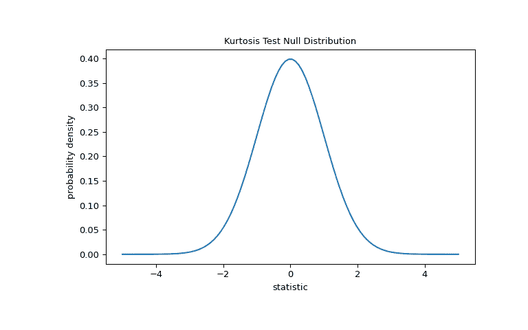
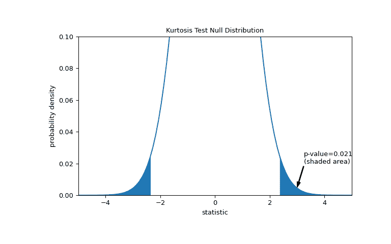
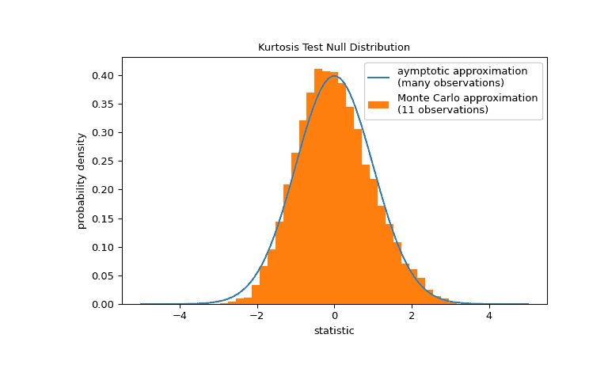

# `scipy.stats.kurtosistest`

> 原文：[`docs.scipy.org/doc/scipy-1.12.0/reference/generated/scipy.stats.kurtosistest.html#scipy.stats.kurtosistest`](https://docs.scipy.org/doc/scipy-1.12.0/reference/generated/scipy.stats.kurtosistest.html#scipy.stats.kurtosistest)

```py
scipy.stats.kurtosistest(a, axis=0, nan_policy='propagate', alternative='two-sided')
```

测试数据集是否具有正态峰度。

此函数检验假设，样本抽取自的总体峰度是正态分布的峰度。

参数：

**a**数组

样本数据的数组。

**axis**整数或 None, 可选

计算检验的轴线。默认为 0。如果为 None，则计算整个数组 *a*。

**nan_policy**{‘propagate’, ‘raise’, ‘omit’}, 可选

定义如何处理输入包含 nan 的情况。以下选项可用（默认为 ‘propagate’）：

+   ‘propagate’：返回 nan

+   ‘raise’：抛出错误

+   ‘omit’：执行计算时忽略 nan 值

**alternative**{‘two-sided’, ‘less’, ‘greater’}, 可选

定义备择假设。以下选项可用（默认为 ‘two-sided’）：

+   ‘two-sided’: 样本所在分布的峰度与正态分布不同。

+   ‘less’：样本所在分布的峰度小于正态分布的峰度

+   ‘greater’：样本所在分布的峰度大于正态分布的峰度

从版本 1.7.0 开始。

返回：

**statistic**浮点数

此检验的计算 z 分数。

**pvalue**浮点数

假设检验的 p 值。

注释

仅对 n>20 有效。此函数使用 [[1]](#r8ec449aaddfa-1) 中描述的方法。

参考文献

[1] (1,2)

参见例如 F. J. Anscombe, W. J. Glynn，“正态样本 b2 峰度统计量的分布”， Biometrika, vol. 70, pp. 227-234, 1983。

[2]

Shapiro, S. S., & Wilk, M. B. (1965). 方差分析检验正态性（完整样本）。 Biometrika, 52(3/4), 591-611.

[3]

B. Phipson 和 G. K. Smyth. “置换 p 值不应为零：在随机抽取置换时计算精确 p 值。” 统计遗传学与分子生物学应用 9.1 (2010)。

[4]

Panagiotakos, D. B. (2008). 生物医学研究中 p 值的价值. The open cardiovascular medicine journal, 2, 97.

示例

假设我们希望从测量中推断，医学研究中成年男性的体重不服从正态分布[[2]](#r8ec449aaddfa-2)。以下是记录在数组 `x` 中的体重（磅）。

```py
>>> import numpy as np
>>> x = np.array([148, 154, 158, 160, 161, 162, 166, 170, 182, 195, 236]) 
```

[1,2] 中的峰度检验首先基于样本（过量/费舍尔）峰度计算统计量。

```py
>>> from scipy import stats
>>> res = stats.kurtosistest(x)
>>> res.statistic
2.3048235214240873 
```

(该检验警告我们的样本观察值太少，无法进行检验。我们将在示例结束时返回这一点。) 因为正态分布的过量峰度为零（定义如此），所以从正态分布中抽取的样本的此统计量的大小趋于较低。

测试是通过比较统计量的观察值与零分布进行的：在零假设下，权重是从正态分布中抽取的统计量值的分布。

对于这个测试，对于非常大的样本，统计量的零分布是标准正态分布。

```py
>>> import matplotlib.pyplot as plt
>>> dist = stats.norm()
>>> kt_val = np.linspace(-5, 5, 100)
>>> pdf = dist.pdf(kt_val)
>>> fig, ax = plt.subplots(figsize=(8, 5))
>>> def kt_plot(ax):  # we'll reuse this
...     ax.plot(kt_val, pdf)
...     ax.set_title("Kurtosis Test Null Distribution")
...     ax.set_xlabel("statistic")
...     ax.set_ylabel("probability density")
>>> kt_plot(ax)
>>> plt.show() 
```



比较由 p 值量化：在双侧检验中，统计量为正时，零分布中大于观察统计量的元素和小于观察统计量的负值都被认为是“更极端”的值。

```py
>>> fig, ax = plt.subplots(figsize=(8, 5))
>>> kt_plot(ax)
>>> pvalue = dist.cdf(-res.statistic) + dist.sf(res.statistic)
>>> annotation = (f'p-value={pvalue:.3f}\n(shaded area)')
>>> props = dict(facecolor='black', width=1, headwidth=5, headlength=8)
>>> _ = ax.annotate(annotation, (3, 0.005), (3.25, 0.02), arrowprops=props)
>>> i = kt_val >= res.statistic
>>> ax.fill_between(kt_val[i], y1=0, y2=pdf[i], color='C0')
>>> i = kt_val <= -res.statistic
>>> ax.fill_between(kt_val[i], y1=0, y2=pdf[i], color='C0')
>>> ax.set_xlim(-5, 5)
>>> ax.set_ylim(0, 0.1)
>>> plt.show() 
```



```py
>>> res.pvalue
0.0211764592113868 
```

如果 p 值“小” - 也就是说，从一个正态分布的人群中取样数据，产生如此极端的统计值的概率很低 - 这可能被视为反对零假设的证据，支持备择假设：权重并非来自正态分布。请注意：

+   反之则不成立；也就是说，该检验不能用来支持零假设。

+   被认为“小”的值的阈值是在分析数据之前应该做出的选择 [[3]](#r8ec449aaddfa-3)，考虑到假阳性（错误地拒绝零假设）和假阴性（未能拒绝错误的零假设）的风险。

请注意，标准正态分布提供了零分布的渐近逼近；它仅适用于具有许多观察值的样本。这就是为什么我们在示例开始时收到了警告的原因；我们的样本非常小。在这种情况下，`scipy.stats.monte_carlo_test`可能提供更精确的，尽管是随机的精确 p 值的近似。

```py
>>> def statistic(x, axis):
...     # get just the skewtest statistic; ignore the p-value
...     return stats.kurtosistest(x, axis=axis).statistic
>>> res = stats.monte_carlo_test(x, stats.norm.rvs, statistic)
>>> fig, ax = plt.subplots(figsize=(8, 5))
>>> kt_plot(ax)
>>> ax.hist(res.null_distribution, np.linspace(-5, 5, 50),
...         density=True)
>>> ax.legend(['aymptotic approximation\n(many observations)',
...            'Monte Carlo approximation\n(11 observations)'])
>>> plt.show() 
```



```py
>>> res.pvalue
0.0272  # may vary 
```

此外，尽管它们具有随机性质，以这种方式计算的 p 值可以用来精确控制零假设的错误拒绝率 [[4]](#r8ec449aaddfa-4)。
