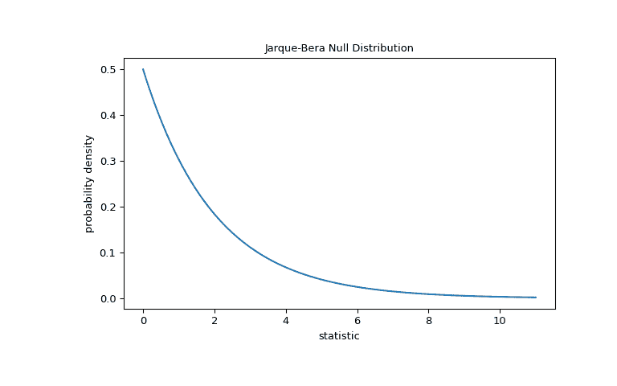
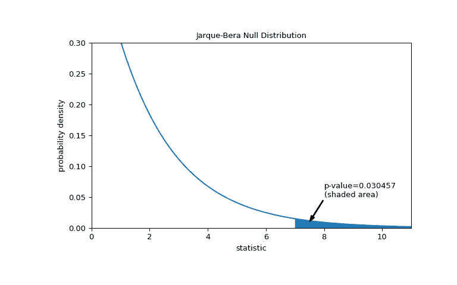
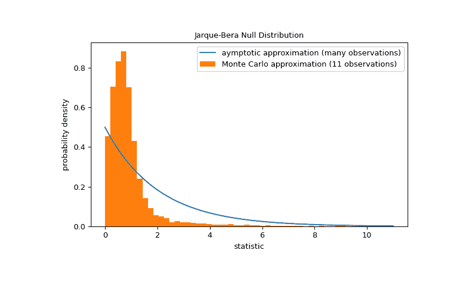

# `scipy.stats.jarque_bera`

> 原文链接：[`docs.scipy.org/doc/scipy-1.12.0/reference/generated/scipy.stats.jarque_bera.html#scipy.stats.jarque_bera`](https://docs.scipy.org/doc/scipy-1.12.0/reference/generated/scipy.stats.jarque_bera.html#scipy.stats.jarque_bera)

```py
scipy.stats.jarque_bera(x, *, axis=None, nan_policy='propagate', keepdims=False)
```

在样本数据上执行 Jarque-Bera 拟合度检验。

Jarque-Bera 检验测试样本数据的偏度和峰度是否与正态分布匹配。

请注意，此测试仅适用于足够大量的数据样本（>2000），因为测试统计量在渐近上具有自由度为 2 的卡方分布。

参数：

**x**类似数组

随机变量的观察。

**轴**整数或无，默认：无

如果是 int，则是计算统计量的输入轴。输入的每个轴切片（例如行）的统计量将出现在输出的相应元素中。如果为`None`，则在计算统计量之前将拉直输入。

**nan_policy**{‘propagate’，‘omit’，‘raise’}

定义如何处理输入的 NaN。

+   `propagate`：如果沿着计算统计量的轴切片（例如行）存在 NaN，则输出的相应条目将是 NaN。

+   `omit`：执行计算时将省略 NaN。如果在计算统计量的轴切片中剩余的数据不足，则输出的相应条目将是 NaN。

+   `raise`：如果存在 NaN，则将引发`ValueError`。

**keepdims**布尔值，默认：False

如果设置为 True，则减少的轴将作为大小为一的维度保留在结果中。通过此选项，结果将正确地广播到输入数组。

返回：

**结果**显著性结果

具有以下属性的对象：

统计量浮点数

测试统计量。

p 值浮点数

假设检验的 p 值。

注解

自 SciPy 1.9 开始，`np.matrix`输入（不建议在新代码中使用）在执行计算之前将转换为`np.ndarray`。在这种情况下，输出将是一个标量或适当形状的`np.ndarray`，而不是 2D 的`np.matrix`。类似地，虽然忽略掩码数组的屏蔽元素，输出将是一个标量或`np.ndarray`，而不是具有`mask=False`的掩码数组。

参考文献

[1]

Jarque, C. 和 Bera, A. (1980) “回归残差的正态性、等方差性和序列独立性的有效检验”，6 Econometric Letters 255-259.

[2]

Shapiro, S. S., & Wilk, M. B. (1965). 正态性的方差分析检验（完整样本）。Biometrika，52(3/4)，591-611。

[3]

B. Phipson 和 G. K. Smyth. “置换 p 值永远不应为零：在随机抽取置换时计算精确 p 值。” Statistical Applications in Genetics and Molecular Biology 9.1 (2010).

[4]

Panagiotakos, D. B. (2008). 生物医学研究中 p 值的价值。The open cardiovascular medicine journal, 2, 97.

示例

假设我们希望从测量中推断，医学研究中成年男性体重是否不服从正态分布[[2]](#r672102ebe967-2)。下面数组`x`记录了体重（磅）。

```py
>>> import numpy as np
>>> x = np.array([148, 154, 158, 160, 161, 162, 166, 170, 182, 195, 236]) 
```

Jarque-Bera 测试首先计算基于样本偏度和峰度的统计量。

```py
>>> from scipy import stats
>>> res = stats.jarque_bera(x)
>>> res.statistic
6.982848237344646 
```

因为正态分布具有零偏度和零（“过量”或“Fisher”）峰度，这个统计量的值对于从正态分布中抽取的样本 tend to 较低。

测试通过比较统计量的观察值与零分布来执行：该统计值派生的零假设下的统计值分布，即权重来自正态分布。对于 Jarque-Bera 测试，非常大样本的零分布是具有两自由度的卡方分布。

```py
>>> import matplotlib.pyplot as plt
>>> dist = stats.chi2(df=2)
>>> jb_val = np.linspace(0, 11, 100)
>>> pdf = dist.pdf(jb_val)
>>> fig, ax = plt.subplots(figsize=(8, 5))
>>> def jb_plot(ax):  # we'll reuse this
...     ax.plot(jb_val, pdf)
...     ax.set_title("Jarque-Bera Null Distribution")
...     ax.set_xlabel("statistic")
...     ax.set_ylabel("probability density")
>>> jb_plot(ax)
>>> plt.show() 
```



比较由 p 值量化：零分布中大于或等于统计量观察值的数值比例。

```py
>>> fig, ax = plt.subplots(figsize=(8, 5))
>>> jb_plot(ax)
>>> pvalue = dist.sf(res.statistic)
>>> annotation = (f'p-value={pvalue:.6f}\n(shaded area)')
>>> props = dict(facecolor='black', width=1, headwidth=5, headlength=8)
>>> _ = ax.annotate(annotation, (7.5, 0.01), (8, 0.05), arrowprops=props)
>>> i = jb_val >= res.statistic  # indices of more extreme statistic values
>>> ax.fill_between(jb_val[i], y1=0, y2=pdf[i])
>>> ax.set_xlim(0, 11)
>>> ax.set_ylim(0, 0.3)
>>> plt.show() 
```



```py
>>> res.pvalue
0.03045746622458189 
```

如果 p 值“小” - 也就是说，从正态分布人群中抽样产生统计量极端值的概率较低 - 这可能被视为反对零假设的证据，支持备选假设：体重未来自正态分布。请注意：

+   相反则不成立；即，该测试不用于提供支持零假设的证据。

+   将被认为是“小”的值的阈值是在分析数据之前应做出的选择[[3]](#r672102ebe967-3)，考虑到假阳性（错误地拒绝零假设）和假阴性（未能拒绝错误的零假设）的风险。

注意，卡方分布提供了零分布的渐近逼近；它仅对有大量观测样本的样本准确。对于像我们这样的小样本，`scipy.stats.monte_carlo_test`可能提供了一个更准确的，尽管是随机的，准确的 p 值近似。

```py
>>> def statistic(x, axis):
...     # underlying calculation of the Jarque Bera statistic
...     s = stats.skew(x, axis=axis)
...     k = stats.kurtosis(x, axis=axis)
...     return x.shape[axis]/6 * (s**2 + k**2/4)
>>> res = stats.monte_carlo_test(x, stats.norm.rvs, statistic,
...                              alternative='greater')
>>> fig, ax = plt.subplots(figsize=(8, 5))
>>> jb_plot(ax)
>>> ax.hist(res.null_distribution, np.linspace(0, 10, 50),
...         density=True)
>>> ax.legend(['aymptotic approximation (many observations)',
...            'Monte Carlo approximation (11 observations)'])
>>> plt.show() 
```



```py
>>> res.pvalue
0.0097  # may vary 
```

此外，尽管它们具有随机性质，通过这种方式计算的 p 值可以用来精确控制零假设的虚假拒绝率[[4]](#r672102ebe967-4)。
