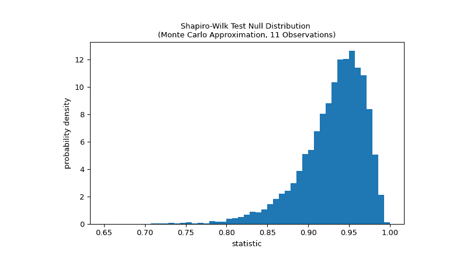
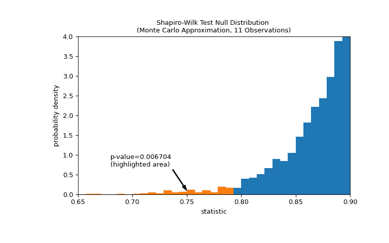

# `scipy.stats.shapiro`

> 原文链接：[`docs.scipy.org/doc/scipy-1.12.0/reference/generated/scipy.stats.shapiro.html#scipy.stats.shapiro`](https://docs.scipy.org/doc/scipy-1.12.0/reference/generated/scipy.stats.shapiro.html#scipy.stats.shapiro)

```py
scipy.stats.shapiro(x)
```

执行 Shapiro-Wilk 正态性检验。

**Shapiro-Wilk 测试**检验的零假设是数据来自正态分布。

参数：

**x**array_like

样本数据数组。

返回：

**统计量**float

检验统计量。

**P 值**float

假设检验的 P 值。

另请参见

`anderson`

Anderson-Darling 正态性检验

`kstest`

Kolmogorov-Smirnov 拟合优度检验。

注意事项

描述的算法见[[4]](#r06d6d75f824a-4)，但未实现所述的参数审查。对于 N > 5000，W 测试统计量是准确的，但 P 值可能不准确。

参考文献

[1]

[`www.itl.nist.gov/div898/handbook/prc/section2/prc213.htm`](https://www.itl.nist.gov/div898/handbook/prc/section2/prc213.htm) [DOI:10.18434/M32189](https://doi.org/10.18434/M32189)

[2] (1,2)

Shapiro, S. S. & Wilk, M.B, “方差分析正态性检验（完全样本）”，1965 年，《生物统计学》，第 52 卷，第 591-611 页，[DOI:10.2307/2333709](https://doi.org/10.2307/2333709)

[3]

Razali, N. M. & Wah, Y. B., “Shapiro-Wilk、Kolmogorov-Smirnov、Lilliefors 和 Anderson-Darling 测试的功效比较”，2011 年，《统计建模与分析杂志》，第 2 卷，第 21-33 页。

[4]

Royston P., “备注 AS R94: 关于算法 AS 181 的备注：W-测试用于正态性”，1995 年，《应用统计学》，第 44 卷，[DOI:10.2307/2986146](https://doi.org/10.2307/2986146)

[5]

Phipson B., and Smyth, G. K., “当排列随机抽取时，置换 P 值不应为零：计算精确 P 值”，2010 年，《统计应用于遗传学和分子生物学》，第 9 卷，[DOI:10.2202/1544-6115.1585](https://doi.org/10.2202/1544-6115.1585)

[6]

Panagiotakos, D. B., “在生物医学研究中 P 值的价值”，《开放心血管医学杂志》，2008 年，第 2 卷，第 97-99 页，[DOI:10.2174/1874192400802010097](https://doi.org/10.2174/1874192400802010097)

示例

假设我们希望根据测量数据推断医学研究中成年男性体重是否不服从正态分布[[2]](#r06d6d75f824a-2)。以下是记录在数组`x`中的成年男性体重（磅）。

```py
>>> import numpy as np
>>> x = np.array([148, 154, 158, 160, 161, 162, 166, 170, 182, 195, 236]) 
```

[[1]](#r06d6d75f824a-1)和[[2]](#r06d6d75f824a-2)的正态性检验首先基于观测值与正态分布的预期顺序统计量之间的关系计算统计量。

```py
>>> from scipy import stats
>>> res = stats.shapiro(x)
>>> res.statistic
0.7888147830963135 
```

该统计量的值对于从正态分布中抽取的样本趋于高（接近 1）。

该检验通过比较统计量的观察值与零分布进行：统计值形成的分布在零假设下，即权重是从正态分布中抽取的。对于这个正态性检验，零分布不容易精确计算，因此通常通过蒙特卡罗方法来近似，即从一个与`x`相同大小的正态分布中抽取许多样本，并计算每个统计量的值。

```py
>>> def statistic(x):
...     # Get only the `shapiro` statistic; ignore its p-value
...     return stats.shapiro(x).statistic
>>> ref = stats.monte_carlo_test(x, stats.norm.rvs, statistic,
...                              alternative='less')
>>> import matplotlib.pyplot as plt
>>> fig, ax = plt.subplots(figsize=(8, 5))
>>> bins = np.linspace(0.65, 1, 50)
>>> def plot(ax):  # we'll reuse this
...     ax.hist(ref.null_distribution, density=True, bins=bins)
...     ax.set_title("Shapiro-Wilk Test Null Distribution \n"
...                  "(Monte Carlo Approximation, 11 Observations)")
...     ax.set_xlabel("statistic")
...     ax.set_ylabel("probability density")
>>> plot(ax)
>>> plt.show() 
```



比较由 p 值量化：零分布中小于或等于统计量观察值的值的比例。

```py
>>> fig, ax = plt.subplots(figsize=(8, 5))
>>> plot(ax)
>>> annotation = (f'p-value={res.pvalue:.6f}\n(highlighted area)')
>>> props = dict(facecolor='black', width=1, headwidth=5, headlength=8)
>>> _ = ax.annotate(annotation, (0.75, 0.1), (0.68, 0.7), arrowprops=props)
>>> i_extreme = np.where(bins <= res.statistic)[0]
>>> for i in i_extreme:
...     ax.patches[i].set_color('C1')
>>> plt.xlim(0.65, 0.9)
>>> plt.ylim(0, 4)
>>> plt.show
>>> res.pvalue
0.006703833118081093 
```

如果 p 值“小” - 即从一个正态分布的总体中抽样数据，使得统计量的极端值的概率很低 - 这可能被视为反对零假设，支持备选假设：权重并非来自正态分布。注意：

+   逆反是不成立的；也就是说，该检验并不用于为零假设提供证据。

+   被视为“小”的值的阈值是在分析数据之前应作出的选择，考虑到假阳性（错误拒绝零假设）和假阴性（未能拒绝虚假的零假设）的风险 [[5]](#r06d6d75f824a-5)。


