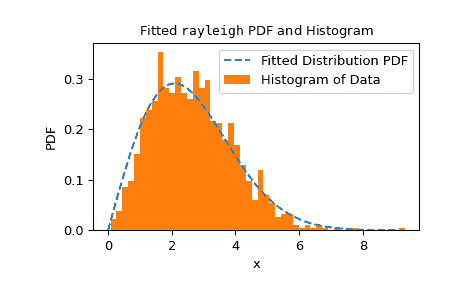
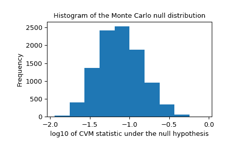

# `scipy.stats.goodness_of_fit`

> 原文链接：[`docs.scipy.org/doc/scipy-1.12.0/reference/generated/scipy.stats.goodness_of_fit.html#scipy.stats.goodness_of_fit`](https://docs.scipy.org/doc/scipy-1.12.0/reference/generated/scipy.stats.goodness_of_fit.html#scipy.stats.goodness_of_fit)

```py
scipy.stats.goodness_of_fit(dist, data, *, known_params=None, fit_params=None, guessed_params=None, statistic='ad', n_mc_samples=9999, random_state=None)
```

执行一个比较数据与分布族的拟合优度检验。

给定分布族和数据，执行空假设检验，即数据是否来自该族分布的检验。可以指定分布的任何已知参数。分布的剩余参数将拟合到数据中，并相应地计算检验的 p 值。提供了几种比较分布与数据的统计量。

参数：

**dist**`scipy.stats.rv_continuous`

代表空假设下的分布族的对象。

**data**1D array_like

要测试的有限未经审查的数据。

**known_params**dict，可选

包含已知分布参数名称-值对的字典。蒙特卡罗样本从假设的空假设分布中随机抽取这些参数值。在每个蒙特卡罗样本中，只有剩余的空假设分布族的未知参数被拟合到样本中；已知参数保持不变。如果所有分布族参数都已知，则省略将分布族拟合到每个样本的步骤。

**fit_params**dict，可选

包含已经拟合到数据的分布参数名称-值对的字典，例如使用`scipy.stats.fit`或*dist*的`fit`方法。蒙特卡罗样本从假设的空假设分布中抽取，使用这些指定的参数值。然而，在这些蒙特卡罗样本上，空假设分布族的这些以及所有其他未知参数在计算统计量之前被拟合。

**guessed_params**dict，可选

包含已经猜测的分布参数名称-值对的字典。这些参数始终被视为自由参数，并且被拟合到提供的*data*以及从空假设分布中抽取的蒙特卡罗样本中。这些*guessed_params*的目的是作为数值拟合过程的初始值使用。

**statistic**{“ad”, “ks”, “cvm”, “filliben”}，可选

用于将数据与分布进行比较的统计量，在将分布族的未知参数拟合到数据之后进行。Anderson-Darling（“ad”）[[1]](#r48df2cf935d3-1)、Kolmogorov-Smirnov（“ks”）[[1]](#r48df2cf935d3-1)、Cramer-von Mises（“cvm”）[[1]](#r48df2cf935d3-1) 和 Filliben（“filliben”）[[7]](#r48df2cf935d3-7) 统计量可用。

**n_mc_samples**int，默认值：9999

从零假设分布中抽取的蒙特卡洛样本数量。每个样本的样本量与给定的*data*相同。

**random_state**{None, int, [`numpy.random.Generator`](https://numpy.org/devdocs/reference/random/generator.html#numpy.random.Generator "(在 NumPy v2.0.dev0)")，

> [`numpy.random.RandomState`](https://numpy.org/devdocs/reference/random/legacy.html#numpy.random.RandomState "(在 NumPy v2.0.dev0)")，可选

用于生成蒙特卡洛样本的伪随机数生成器状态。

如果*random_state*为`None`（默认），则使用[`numpy.random.RandomState`](https://numpy.org/devdocs/reference/random/legacy.html#numpy.random.RandomState "(在 NumPy v2.0.dev0)")单例。如果*random_state*为整数，则使用新的`RandomState`实例，并使用*random_state*作为种子。如果*random_state*已经是`Generator`或`RandomState`实例，则使用提供的实例。

返回：

**res**GoodnessOfFitResult

一个具有以下属性的对象。

fit_result`FitResult`

一个表示提供的*dist*与*data*拟合情况的对象。此对象包括完全定义零假设分布的分布族参数值，即从中抽取蒙特卡洛样本的分布。

statisticfloat

比较提供的*data*与零假设分布的统计量值。

pvaluefloat

零分布中具有与提供的*data*的统计量值至少一样极端的元素的比例。

null_distributionndarray

每个从零假设分布抽取的蒙特卡洛样本的统计量值。

注意事项

这是一种广义的蒙特卡洛拟合优度检验过程，其特殊情况对应于各种 Anderson-Darling 测试、Lilliefors 测试等。该测试在文献[[2]](#r48df2cf935d3-2)、[[3]](#r48df2cf935d3-3)和[[4]](#r48df2cf935d3-4)中被描述为参数化自举检验。这是一个蒙特卡洛检验，其中从数据中估计了用于抽取样本的分布的参数。我们在以下描述中使用“蒙特卡洛”而不是“参数化自举”，以避免与更熟悉的非参数化自举混淆，并描述了测试的执行方式。

*传统的拟合优度检验*

传统上，对应于固定的显著性水平集的临界值是使用蒙特卡洛方法预先计算的。用户通过仅计算他们观察到的*数据*的测试统计值并将此值与表格化的临界值进行比较来执行测试。这种做法不太灵活，因为并非所有分布和已知和未知参数值的组合都有可用的表格。当从有限的表格数据插值临界值以与用户的样本大小和拟合参数值对应时，结果可能不准确。为了克服这些缺点，此函数允许用户执行适应其特定数据的蒙特卡洛试验。

*算法概述*

简言之，此例程执行以下步骤：

> 1.  将未知参数拟合到给定的*数据*，从而形成“零假设”分布，并计算此数据和分布对的统计量。
> 1.  
> 1.  从这个零假设分布中抽取随机样本。
> 1.  
> 1.  将未知参数拟合到每个随机样本。
> 1.  
> 1.  计算每个样本与拟合到样本的分布之间的统计量。
> 1.  
> 1.  将来自（1）的与*数据*相对应的统计值与来自（4）的随机样本的统计值进行比较。p 值是具有大于或等于观察数据的统计值的样本比例。

更详细地说，步骤如下。

首先，使用最大似然估计将指定的分布家族*dist*的任何未知参数拟合到提供的*数据*中。（一个例外是具有未知位置和尺度的正态分布：我们使用偏差校正标准差 `np.std(data, ddof=1)` 作为尺度，如[[1]](#r48df2cf935d3-1)中推荐的那样。）这些参数的值指定了分布家族的特定成员，称为“零假设”分布，即从中数据在零假设下进行抽样的分布。*统计量*，它比较数据与分布之间的关系，计算在*数据*和零假设分布之间的。

接下来，从零假设分布中抽取许多（具体为*n_mc_samples*）新样本，每个样本包含与*数据*相同数量的观测值。将分布家族*dist*的所有未知参数适应于*每个重新采样*，并计算每个样本与其相应拟合分布之间的*统计量*。这些统计量值形成蒙特卡洛零分布（不要与上面的“零假设”分布混淆）。

测试的 p 值是蒙特卡洛零分布中统计值的比例，这些统计值至少与所提供的*数据*的统计值一样极端。更确切地说，p 值由以下公式给出：

\[p = \frac{b + 1} {m + 1}\]

其中 \(b\) 是蒙特卡洛空分布中的统计值数量，这些值大于或等于为 *data* 计算的统计值，\(m\) 是蒙特卡洛空分布中元素的数量 (*n_mc_samples*)。将分子和分母各加 \(1\) 可以理解为将与 *data* 相对应的统计值包括在空分布中，但更正式的解释见文献 [[5]](#r48df2cf935d3-5)。

*限制*

由于必须对分布族的未知参数逐个拟合蒙特卡洛样本中的每一个，对于某些分布族而言，该测试可能非常缓慢；在 SciPy 中的大多数分布，通过数值优化进行分布拟合。

*反模式*

由于这个原因，可能会诱使将分布的参数（由用户预先拟合到 *data*）视为 *known_params*，因此在每个蒙特卡洛样本中拟合分布的需求被排除。这本质上是如何执行原始的科尔莫哥洛夫-斯米尔诺夫检验的。尽管这样的检验可以提供反对零假设的证据，但这样的检验在某种意义上是保守的，因为小的 p 值倾向于（极大地）高估发生第一类错误的概率（即虽然接受了零假设，但它是真实的），而检验的功效较低（即，即使零假设是错误的，也不太可能拒绝零假设）。这是因为蒙特卡洛样本不太可能与零假设分布以及 *data* 一致，从而增加了空分布中记录的统计值，使得更多的统计值超过 *data* 的统计值，从而增加了 p 值。

参考文献

[1] (1,2,3,4,5)

M. A. Stephens (1974). “适合性检验的经验分布函数统计量及其比较。” 《美国统计学会杂志》第 69 卷，第 730-737 页。

[2]

W. Stute, W. G. Manteiga, 和 M. P. Quindimil (1993). “基于自举法的拟合优度检验。” 《Metrika》40.1: 243-256。

[3]

C. Genest 和 B Rémillard (2008). “半参数模型中拟合优度检验的参数自举法的有效性。” 《法国数学与统计学院概率与统计学年刊》44.6。

[4]

I. Kojadinovic 和 J. Yan (2012). “基于加权自举的拟合优度检验：大样本参数自举的快速替代。” 《加拿大统计杂志》40.3: 480-500。

[5]

B. Phipson 和 G. K. Smyth (2010). “排列 P 值不应为零：在随机抽样排列时计算确切 P 值。” 《统计应用于遗传学和分子生物学》9.1。

[6]

H. W. Lilliefors (1967). “关于均值和方差未知的正态分布的科尔莫哥洛夫-斯米尔诺夫检验。” 《美国统计学会杂志》62.318: 399-402。

[7]

Filliben, James J.，“用于正态性的概率图相关系数检验。” Technometrics 17.1（1975）：111-117。

示例

一个广为人知的用于检验数据是否来自特定分布的零假设的测试是科尔莫哥罗夫-斯米尔诺夫（KS）检验，在 SciPy 中可通过`scipy.stats.ks_1samp`找到。假设我们希望测试以下数据：

```py
>>> import numpy as np
>>> from scipy import stats
>>> rng = np.random.default_rng()
>>> x = stats.uniform.rvs(size=75, random_state=rng) 
```

从正态分布中抽样。要执行 KS 检验，将比较观察数据的经验分布函数与（理论上的）正态分布的累积分布函数。当然，为了做到这一点，必须完全指定零假设下的正态分布。通常首先通过将分布的`loc`和`scale`参数拟合到观察数据，然后执行测试来完成此操作。

```py
>>> loc, scale = np.mean(x), np.std(x, ddof=1)
>>> cdf = stats.norm(loc, scale).cdf
>>> stats.ks_1samp(x, cdf)
KstestResult(statistic=0.1119257570456813, pvalue=0.2827756409939257) 
```

KS 测试的一个优点是可以精确和高效地计算 p 值 - 在零假设下获得测试统计量值的概率，该值与从观察数据中获得的值一样极端。`goodness_of_fit`只能近似这些结果。

```py
>>> known_params = {'loc': loc, 'scale': scale}
>>> res = stats.goodness_of_fit(stats.norm, x, known_params=known_params,
...                             statistic='ks', random_state=rng)
>>> res.statistic, res.pvalue
(0.1119257570456813, 0.2788) 
```

检验统计量完全匹配，但 p 值是通过形成“蒙特卡洛零分布”来估计的，即通过从`scipy.stats.norm`中提供的参数显式抽取随机样本，并计算每个统计量。至少与`res.statistic`一样极端的这些统计值的比例近似于通过`scipy.stats.ks_1samp`计算的精确 p 值。

然而，在许多情况下，我们更愿意仅测试数据是否来自正态分布族的任何成员之一，而不是特别来自具有拟合到观察样本的位置和比例的正态分布。在这种情况下，Lilliefors [[6]](#r48df2cf935d3-6)认为 KS 检验过于保守（即 p 值夸大了拒绝真空假设的实际概率），因此缺乏功效 - 即在真空假设实际为假时拒绝真空假设的能力。实际上，我们的 p 值约为 0.28，这远远大于在任何常见显著性水平下拒绝零假设的实际概率。

考虑为什么会这样。请注意，在上述 KS 检验中，统计量始终将数据与拟合到*观察数据*的正态分布的累积分布函数进行比较。这倾向于降低观察数据的统计量值，但在计算其他样本的统计量时（例如我们随机抽取的样本以形成蒙特卡罗零分布时），这种方式是“不公平”的。我们可以很容易地进行修正：每当我们计算样本的 KS 统计量时，我们使用拟合到*该样本*的正态分布的累积分布函数。在这种情况下，零分布未经精确计算，通常是使用上述的蒙特卡罗方法来近似的。这就是 `goodness_of_fit` 突出表现的地方。

```py
>>> res = stats.goodness_of_fit(stats.norm, x, statistic='ks',
...                             random_state=rng)
>>> res.statistic, res.pvalue
(0.1119257570456813, 0.0196) 
```

实际上，这个 p 值要小得多，足够小以（正确地）在常见的显著水平下拒绝零假设，包括 5% 和 2.5%。

然而，KS 统计量对所有与正态分布偏差不是很敏感。KS 统计量最初的优势在于能够理论上计算零分布，但现在我们可以通过计算来近似零分布，可以使用更敏感的统计量 - 从而得到更高的检验力。Anderson-Darling 统计量 [[1]](#r48df2cf935d3-1) 倾向于更为敏感，已经使用蒙特卡罗方法为各种显著水平和样本大小制表了此统计量的临界值。

```py
>>> res = stats.anderson(x, 'norm')
>>> print(res.statistic)
1.2139573337497467
>>> print(res.critical_values)
[0.549 0.625 0.75  0.875 1.041]
>>> print(res.significance_level)
[15\.  10\.   5\.   2.5  1\. ] 
```

在这里，统计量的观察值超过了对应于 1% 显著水平的临界值。这告诉我们观察数据的 p 值小于 1%，但确切值是多少？我们可以从这些（已经插值的）值中插值，但 `goodness_of_fit` 可以直接估计它。

```py
>>> res = stats.goodness_of_fit(stats.norm, x, statistic='ad',
...                             random_state=rng)
>>> res.statistic, res.pvalue
(1.2139573337497467, 0.0034) 
```

另一个优势是使用 `goodness_of_fit` 不受限于特定分布或已知参数与需从数据中估计参数的条件。相反，`goodness_of_fit` 可以对任何具有足够快速和可靠 `fit` 方法的分布相对快速地估计 p 值。例如，在这里我们使用 Cramer-von Mises 统计量对具有已知位置和未知尺度的 Rayleigh 分布进行拟合优度检验。

```py
>>> rng = np.random.default_rng()
>>> x = stats.chi(df=2.2, loc=0, scale=2).rvs(size=1000, random_state=rng)
>>> res = stats.goodness_of_fit(stats.rayleigh, x, statistic='cvm',
...                             known_params={'loc': 0}, random_state=rng) 
```

这个过程执行起来非常快速，但是为了检查 `fit` 方法的可靠性，我们应该检查拟合结果。

```py
>>> res.fit_result  # location is as specified, and scale is reasonable
 params: FitParams(loc=0.0, scale=2.1026719844231243)
 success: True
 message: 'The fit was performed successfully.'
>>> import matplotlib.pyplot as plt  # matplotlib must be installed to plot
>>> res.fit_result.plot()
>>> plt.show() 
```



如果分布未能尽可能地拟合观察数据，测试可能无法控制类型 I 错误率，即在零假设为真时拒绝零假设的概率。

我们还应该寻找零分布中的极端异常值，这些异常值可能是由于不可靠的拟合导致的。这些异常值不一定会使结果无效，但它们倾向于降低检验的功效。

```py
>>> _, ax = plt.subplots()
>>> ax.hist(np.log10(res.null_distribution))
>>> ax.set_xlabel("log10 of CVM statistic under the null hypothesis")
>>> ax.set_ylabel("Frequency")
>>> ax.set_title("Histogram of the Monte Carlo null distribution")
>>> plt.show() 
```



这个图看起来令人放心。

如果 `fit` 方法可靠运行，并且测试统计量的分布对拟合参数的值不是特别敏感，那么由 `goodness_of_fit` 提供的 p 值预计会是一个很好的近似。

```py
>>> res.statistic, res.pvalue
(0.2231991510248692, 0.0525) 
```
