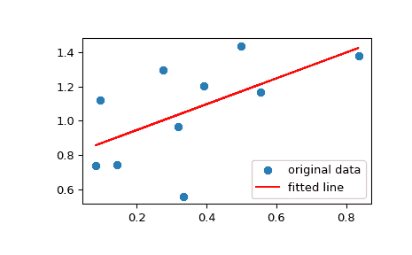

# `scipy.stats.linregress`

> 原文链接：[`docs.scipy.org/doc/scipy-1.12.0/reference/generated/scipy.stats.linregress.html#scipy.stats.linregress`](https://docs.scipy.org/doc/scipy-1.12.0/reference/generated/scipy.stats.linregress.html#scipy.stats.linregress)

```py
scipy.stats.linregress(x, y=None, alternative='two-sided')
```

为两组测量计算线性最小二乘回归。

参数:

**x, y**array_like

两组测量值。两个数组应具有相同的长度。如果仅给定 *x*（并且 `y=None`），则它必须是一个二维数组，其中一个维度的长度为 2。然后通过沿长度为 2 的维度分割数组来找到两组测量值。在 `y=None` 且 *x* 是一个 2x2 数组的情况下，`linregress(x)` 等同于 `linregress(x[0], x[1])`。

**alternative**{‘two-sided’, ‘less’, ‘greater’}, optional

定义备择假设。默认为‘two-sided’。提供以下选项：

+   ‘two-sided’: 回归线的斜率非零

+   ‘less’: 回归线的斜率小于零

+   ‘greater’: 回归线的斜率大于零

自 1.7.0 版本新增。

返回：

**result**`LinregressResult` 实例

返回值是一个带有以下属性的对象：

斜率 float

回归线的斜率。

截距 float

回归线的截距。

rvaluefloat

Pearson 相关系数。`rvalue` 的平方等于确定系数。

pvaluefloat

用 t-分布的 Wald 检验的检验统计量进行假设检验的 p 值，其零假设是斜率为零。参见上述 *alternative* 来获取备择假设。

stderrfloat

在残差正态性假设下，估计斜率（梯度）的标准误差。

intercept_stderrfloat

在残差正态性假设下，估计截距的标准误差。

另请参阅

`scipy.optimize.curve_fit`

使用非线性最小二乘拟合函数到数据。

`scipy.optimize.leastsq`

最小化一组方程的平方和。

注意事项

将缺失值视为成对处理：如果 *x* 中的值缺失，则 *y* 中对应的值被屏蔽。

为了与较早版本的 SciPy 兼容，返回值的行为类似于长度为 5 的 `namedtuple`，具有字段 `slope`、`intercept`、`rvalue`、`pvalue` 和 `stderr`，因此可以继续编写：

```py
slope, intercept, r, p, se = linregress(x, y) 
```

然而，使用该风格时，截距的标准误差不可用。为了访问所有计算值，包括截距的标准误差，请使用返回值作为具有属性的对象，例如：

```py
result = linregress(x, y)
print(result.intercept, result.intercept_stderr) 
```

示例

```py
>>> import numpy as np
>>> import matplotlib.pyplot as plt
>>> from scipy import stats
>>> rng = np.random.default_rng() 
```

生成一些数据：

```py
>>> x = rng.random(10)
>>> y = 1.6*x + rng.random(10) 
```

执行线性回归：

```py
>>> res = stats.linregress(x, y) 
```

决定系数（R 平方）：

```py
>>> print(f"R-squared: {res.rvalue**2:.6f}")
R-squared: 0.717533 
```

将数据与拟合线一起绘制：

```py
>>> plt.plot(x, y, 'o', label='original data')
>>> plt.plot(x, res.intercept + res.slope*x, 'r', label='fitted line')
>>> plt.legend()
>>> plt.show() 
```



计算斜率和截距的 95% 置信区间：

```py
>>> # Two-sided inverse Students t-distribution
>>> # p - probability, df - degrees of freedom
>>> from scipy.stats import t
>>> tinv = lambda p, df: abs(t.ppf(p/2, df)) 
```

```py
>>> ts = tinv(0.05, len(x)-2)
>>> print(f"slope (95%): {res.slope:.6f} +/- {ts*res.stderr:.6f}")
slope (95%): 1.453392 +/- 0.743465
>>> print(f"intercept (95%): {res.intercept:.6f}"
...       f" +/- {ts*res.intercept_stderr:.6f}")
intercept (95%): 0.616950 +/- 0.544475 
```
