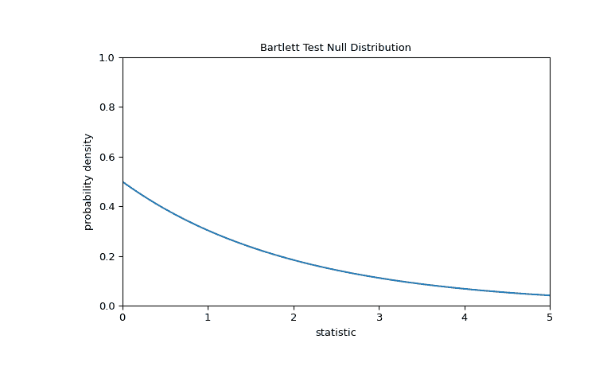

# `scipy.stats.bartlett`

> 原文链接：[`docs.scipy.org/doc/scipy-1.12.0/reference/generated/scipy.stats.bartlett.html#scipy.stats.bartlett`](https://docs.scipy.org/doc/scipy-1.12.0/reference/generated/scipy.stats.bartlett.html#scipy.stats.bartlett)

```py
scipy.stats.bartlett(*samples, axis=0, nan_policy='propagate', keepdims=False)
```

执行 Bartlett 的等方差性检验。

Bartlett 测试检验所有输入样本是否来自具有相等方差的总体的零假设。对于来自显著非正态分布的样本，Levene 的测试 `levene` 更为稳健。

参数：

**sample1, sample2, …**array_like

样本数据的数组。仅接受 1d 数组，它们可能有不同的长度。

**轴**int 或 None，默认为 0

如果是 int，则是计算统计量的输入轴。输入的每个轴切片（例如行）的统计量将出现在输出的相应元素中。如果是 `None`，则在计算统计量之前将展平输入。

**nan_policy**{‘propagate’, ‘omit’, ‘raise’}

定义如何处理输入 NaN。

+   `propagate`：如果在计算统计量的轴切片（例如行）中存在 NaN，则输出的相应条目将为 NaN。

+   `omit`：在执行计算时将省略 NaN。如果在计算统计量的轴切片中剩余的数据不足，则输出的相应条目将为 NaN。

+   `raise`：如果存在 NaN，则会引发 `ValueError`。

**keepdims**bool，默认为 False

如果设为 True，则减少的轴将作为大小为一的维度留在结果中。使用此选项，结果将正确传播到输入数组。

返回：

**统计量**float

检验统计量。

**pvalue**float

检验的 p 值。

另请参阅

`fligner`

一种用于 k 个方差相等的非参数检验

`levene`

一种用于 k 个方差相等的稳健参数检验

笔记

Conover 等人（1981）通过大量模拟研究了许多现有的参数和非参数检验，并得出结论，Fligner 和 Killeen（1976）以及 Levene（1960）提出的检验在正态性偏差和功效方面似乎更为优越（[[3]](#r69e8b73864bc-3)）。

自 SciPy 1.9 开始，将 `np.matrix` 输入（不建议新代码使用）转换为 `np.ndarray` 后再执行计算。在这种情况下，输出将是适当形状的标量或 `np.ndarray`，而不是 2D `np.matrix`。同样，虽然忽略掩码数组的屏蔽元素，但输出将是标量或 `np.ndarray`，而不是具有 `mask=False` 的屏蔽数组。

参考文献

[1]

[`www.itl.nist.gov/div898/handbook/eda/section3/eda357.htm`](https://www.itl.nist.gov/div898/handbook/eda/section3/eda357.htm)

[2]

Snedecor, George W. and Cochran, William G. (1989), 统计方法，第八版，爱荷华州立大学出版社。

[3]

Park, C. and Lindsay, B. G. (1999). Robust Scale Estimation and Hypothesis Testing based on Quadratic Inference Function. Technical Report #99-03, Center for Likelihood Studies, Pennsylvania State University.

[4]

Bartlett, M. S. (1937). Sufficiency and Statistical Tests 的特性。 伦敦皇家学会会议录 A 系列，数学和物理科学，第 160 卷，第 901 号，第 268-282 页。

[5]

C.I. BLISS (1952), 生物测定统计学：特别参考维生素，第 499-503 页，[DOI:10.1016/C2013-0-12584-6](https://doi.org/10.1016/C2013-0-12584-6)。

[6]

B. Phipson and G. K. Smyth. “置换 P 值永远不应为零：当置换随机抽取时计算确切的 P 值。” 遗传学和分子生物学中的统计应用 9.1（2010 年）。

[7]

Ludbrook, J., & Dudley, H. (1998). 为什么在生物医学研究中，置换检验优于 t 和 F 检验。 美国统计学家，52（2），127-132。

例子

在[[5]](#r69e8b73864bc-5)中，研究了维生素 C 对豚鼠牙齿生长的影响。 在一项对照研究中，60 名受试者分为小剂量，中剂量和大剂量组，分别每天摄取 0.5、1.0 和 2.0 毫克维生素 C。 42 天后，测量了牙齿生长情况。

下面的`small_dose`，`medium_dose`和`large_dose`数组记录了三组的牙齿生长测量结果，单位是微米。

```py
>>> import numpy as np
>>> small_dose = np.array([
...     4.2, 11.5, 7.3, 5.8, 6.4, 10, 11.2, 11.2, 5.2, 7,
...     15.2, 21.5, 17.6, 9.7, 14.5, 10, 8.2, 9.4, 16.5, 9.7
... ])
>>> medium_dose = np.array([
...     16.5, 16.5, 15.2, 17.3, 22.5, 17.3, 13.6, 14.5, 18.8, 15.5,
...     19.7, 23.3, 23.6, 26.4, 20, 25.2, 25.8, 21.2, 14.5, 27.3
... ])
>>> large_dose = np.array([
...     23.6, 18.5, 33.9, 25.5, 26.4, 32.5, 26.7, 21.5, 23.3, 29.5,
...     25.5, 26.4, 22.4, 24.5, 24.8, 30.9, 26.4, 27.3, 29.4, 23
... ]) 
```

`bartlett` 统计量对样本之间的方差差异敏感。

```py
>>> from scipy import stats
>>> res = stats.bartlett(small_dose, medium_dose, large_dose)
>>> res.statistic
0.6654670663030519 
```

当方差差异很大时，统计量的值往往较高。

我们可以通过比较统计量观察值与零假设下的零分布来检验组间方差的不平等：假设三组的总体方差相等的零假设下的统计量值的分布。

对于此测试，零分布遵循如下卡方分布。

```py
>>> import matplotlib.pyplot as plt
>>> k = 3  # number of samples
>>> dist = stats.chi2(df=k-1)
>>> val = np.linspace(0, 5, 100)
>>> pdf = dist.pdf(val)
>>> fig, ax = plt.subplots(figsize=(8, 5))
>>> def plot(ax):  # we'll reuse this
...     ax.plot(val, pdf, color='C0')
...     ax.set_title("Bartlett Test Null Distribution")
...     ax.set_xlabel("statistic")
...     ax.set_ylabel("probability density")
...     ax.set_xlim(0, 5)
...     ax.set_ylim(0, 1)
>>> plot(ax)
>>> plt.show() 
```



比较通过 p 值来量化：在零分布中大于或等于统计量观察值的值的比例。

```py
>>> fig, ax = plt.subplots(figsize=(8, 5))
>>> plot(ax)
>>> pvalue = dist.sf(res.statistic)
>>> annotation = (f'p-value={pvalue:.3f}\n(shaded area)')
>>> props = dict(facecolor='black', width=1, headwidth=5, headlength=8)
>>> _ = ax.annotate(annotation, (1.5, 0.22), (2.25, 0.3), arrowprops=props)
>>> i = val >= res.statistic
>>> ax.fill_between(val[i], y1=0, y2=pdf[i], color='C0')
>>> plt.show() 
```


```py
>>> res.pvalue
0.71696121509966 
```

如果 p 值“很小” - 也就是说，从具有相同方差的分布中抽取数据产生这样极端统计值的概率很低 - 这可能被视为支持备择假设的证据：组的方差不相等。请注意：

+   逆不成立；也就是说，此测试不能用来支持零假设。

+   被视为“小”的值的阈值是在分析数据之前应该做出的选择[[6]](#r69e8b73864bc-6)，考虑到假阳性（错误拒绝零假设）和假阴性（未能拒绝虚假零假设）的风险。

+   较小的 p 值并不是大效应的证据；相反，它们只能为“显著”效应提供证据，意味着在零假设下不太可能发生。

请注意，当观测值服从正态分布时，卡方分布提供零分布。对于从非正态总体中抽取的小样本，执行置换检验可能更为合适：在零假设下，所有三个样本均从同一总体中抽取，每个测量值在三个样本中被观察到的概率相等。因此，我们可以通过在观测值随机分割成三个样本的许多随机生成的分割中计算统计量来形成随机化的零分布。

```py
>>> def statistic(*samples):
...     return stats.bartlett(*samples).statistic
>>> ref = stats.permutation_test(
...     (small_dose, medium_dose, large_dose), statistic,
...     permutation_type='independent', alternative='greater'
... )
>>> fig, ax = plt.subplots(figsize=(8, 5))
>>> plot(ax)
>>> bins = np.linspace(0, 5, 25)
>>> ax.hist(
...     ref.null_distribution, bins=bins, density=True, facecolor="C1"
... )
>>> ax.legend(['aymptotic approximation\n(many observations)',
...            'randomized null distribution'])
>>> plot(ax)
>>> plt.show() 
```


```py
>>> ref.pvalue  # randomized test p-value
0.5387  # may vary 
```

请注意，此处计算的 p 值与`bartlett`提供的渐近近似存在显著差异。从置换检验中可以严格推导出的统计推断有限；尽管如此，在许多情况下，它们可能是首选方法[[7]](#r69e8b73864bc-7)。

以下是另一个通用示例，拒绝零假设的情况。

检验列表*a*、*b*和*c*是否来自具有相等方差的总体。

```py
>>> a = [8.88, 9.12, 9.04, 8.98, 9.00, 9.08, 9.01, 8.85, 9.06, 8.99]
>>> b = [8.88, 8.95, 9.29, 9.44, 9.15, 9.58, 8.36, 9.18, 8.67, 9.05]
>>> c = [8.95, 9.12, 8.95, 8.85, 9.03, 8.84, 9.07, 8.98, 8.86, 8.98]
>>> stat, p = stats.bartlett(a, b, c)
>>> p
1.1254782518834628e-05 
```

非常小的 p 值表明这些总体的方差不相等。

这并不令人意外，因为*b*的样本方差远大于*a*和*c*的样本方差：

```py
>>> [np.var(x, ddof=1) for x in [a, b, c]]
[0.007054444444444413, 0.13073888888888888, 0.008890000000000002] 
```
