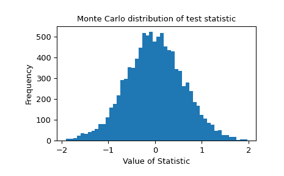

# `scipy.stats.monte_carlo_test`

> 原文：[`docs.scipy.org/doc/scipy-1.12.0/reference/generated/scipy.stats.monte_carlo_test.html#scipy.stats.monte_carlo_test`](https://docs.scipy.org/doc/scipy-1.12.0/reference/generated/scipy.stats.monte_carlo_test.html#scipy.stats.monte_carlo_test)

```py
scipy.stats.monte_carlo_test(data, rvs, statistic, *, vectorized=None, n_resamples=9999, batch=None, alternative='two-sided', axis=0)
```

执行蒙特卡洛假设检验。

*data*包含一个样本或一个或多个样本的序列。*rvs*指定了在空假设下*data*中样本的分布。给定*data*的*statistic*的值与使用*rvs*生成的*n_resamples*组样本集的统计量值进行比较。这给出了 p 值，即在空假设下观察到测试统计量的如此极端值的概率。

参数：

**data**数组或者数组序列

一组或者一系列观测值的数组。

**rvs**可调用函数或者可调用函数的元组

在空假设下生成随机变量的一个可调用函数或者一个可调用函数的序列。*rvs*的每个元素必须是一个接受关键字参数`size`的可调用函数（例如`rvs(size=(m, n))`），并返回该形状的 N 维数组样本。如果*rvs*是一个序列，则*rvs*中的可调用函数的数量必须与*data*中的样本数量匹配，即`len(rvs) == len(data)`。如果*rvs*是一个单一的可调用函数，则*data*被视为单个样本。

**statistic**可调用函数

要计算假设检验的 p 值的统计量。*statistic*必须是一个可调用函数，接受一个样本（例如`statistic(sample)`）或者`len(rvs)`个单独的样本（例如如果*rvs*包含两个可调用函数且*data*包含两个样本，则为`statistic(samples1, sample2)`），并返回相应的统计量。如果设置了*vectorized*为`True`，*statistic*还必须接受一个关键字参数*axis*，并且被向量化以计算沿着*data*中提供的*axis*的样本的统计量。

**vectorized**布尔值，可选

如果设置*vectorized*为`False`，则*statistic*不会传递关键字参数*axis*，并且预期仅计算 1D 样本的统计量。如果为`True`，则在传递 ND 样本数组时，*statistic*将传递关键字参数*axis*并且预期沿着*axis*计算统计量。如果为`None`（默认），如果*statistic*有参数*axis*，则*vectorized*将设置为`True`。使用向量化统计量通常可以减少计算时间。

**n_resamples**整数，默认值：9999

从*rvs*的每个可调用函数中抽取的样本数量。等效地，作为蒙特卡洛空假设使用的统计值的数量。

**batch**整数，可选

每次对*statistic*的调用中要处理的蒙特卡洛样本数。内存使用为 O(*batch* * `sample.size[axis]` )。默认为`None`，此时*batch*等于*n_resamples*。

**alternative**{‘双侧’, ‘小于’, ‘大于’}

要计算 p 值的备择假设。对于每个备择假设，p 值定义如下。

+   `'greater'` : 空分布中大于或等于观察到的检验统计量值的百分比。

+   `'less'` : 空分布中小于或等于观察到的检验统计量值的百分比。

+   `'two-sided'` : 上述 p 值中较小者的两倍。

**axis**int，默认值：0

*data*的轴（或*data*中的每个样本）用于计算统计量。

返回：

**res**MonteCarloTestResult

一个带有属性的对象：

statisticfloat or ndarray

观察数据的检验统计量。

pvaluefloat or ndarray

给定备选假设的 p 值。

null_distributionndarray

测试统计量在零假设下生成的值。

参考文献

[1]

B. Phipson 和 G. K. Smyth. “Permutation P-values Should Never Be Zero: Calculating Exact P-values When Permutations Are Randomly Drawn.” 统计遗传学和分子生物学应用 9.1 (2010).

示例

假设我们希望检验一个小样本是否来自正态分布。我们决定使用样本的偏度作为检验统计量，并且我们将认为 p 值为 0.05 是统计学显著的。

```py
>>> import numpy as np
>>> from scipy import stats
>>> def statistic(x, axis):
...     return stats.skew(x, axis) 
```

收集数据后，我们计算检验统计量的观察值。

```py
>>> rng = np.random.default_rng()
>>> x = stats.skewnorm.rvs(a=1, size=50, random_state=rng)
>>> statistic(x, axis=0)
0.12457412450240658 
```

要确定如果样本是从正态分布中抽取的，则观察到偏度的极端值的观察概率，我们可以执行蒙特卡罗假设检验。该测试将从它们的正态分布中随机抽取许多样本，计算每个样本的偏度，并将我们原始的偏度与此分布进行比较，以确定一个近似的 p 值。

```py
>>> from scipy.stats import monte_carlo_test
>>> # because our statistic is vectorized, we pass `vectorized=True`
>>> rvs = lambda size: stats.norm.rvs(size=size, random_state=rng)
>>> res = monte_carlo_test(x, rvs, statistic, vectorized=True)
>>> print(res.statistic)
0.12457412450240658
>>> print(res.pvalue)
0.7012 
```

在零假设下，获得一个小于或等于观察值的检验统计量的概率约为 70%。这比我们选择的 5%阈值要大，因此我们不能将其视为反对零假设的显著证据。

请注意，这个 p 值基本上与`scipy.stats.skewtest`的 p 值相匹配，后者依赖于基于样本偏度的渐近分布的检验统计量。

```py
>>> stats.skewtest(x).pvalue
0.6892046027110614 
```

对于小样本量，这个渐近逼近是无效的，但可以使用`monte_carlo_test`来处理任何大小的样本。

```py
>>> x = stats.skewnorm.rvs(a=1, size=7, random_state=rng)
>>> # stats.skewtest(x) would produce an error due to small sample
>>> res = monte_carlo_test(x, rvs, statistic, vectorized=True) 
```

提供测试统计量的蒙特卡罗分布以便进一步研究。

```py
>>> import matplotlib.pyplot as plt
>>> fig, ax = plt.subplots()
>>> ax.hist(res.null_distribution, bins=50)
>>> ax.set_title("Monte Carlo distribution of test statistic")
>>> ax.set_xlabel("Value of Statistic")
>>> ax.set_ylabel("Frequency")
>>> plt.show() 
```


