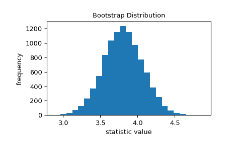
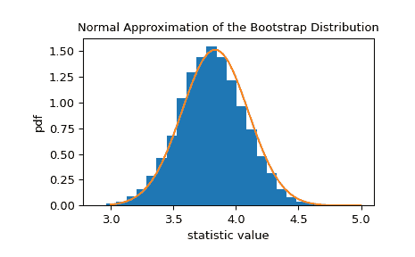

# `scipy.stats.bootstrap`

> 原文：[`docs.scipy.org/doc/scipy-1.12.0/reference/generated/scipy.stats.bootstrap.html#scipy.stats.bootstrap`](https://docs.scipy.org/doc/scipy-1.12.0/reference/generated/scipy.stats.bootstrap.html#scipy.stats.bootstrap)

```py
scipy.stats.bootstrap(data, statistic, *, n_resamples=9999, batch=None, vectorized=None, paired=False, axis=0, confidence_level=0.95, alternative='two-sided', method='BCa', bootstrap_result=None, random_state=None)
```

计算统计量的双侧自举置信区间。

当*method*为`'percentile'`且*alternative*为`'two-sided'`时，根据以下过程计算自举置信区间。

1.  重新采样数据：对*data*中的每个样本和每个*n_resamples*，从原始样本中取出相同大小的随机样本（有放回）。

1.  计算统计量的自举分布：对每组重新采样计算检验统计量。

1.  确定置信区间：找到自举分布的区间，该区间为

    +   关于中位数对称且

    +   包含重新采样统计值的*confidence_level*。

虽然`'percentile'`方法最直观，但实际上很少使用。有两种更常见的方法可用，`'basic'`（反向百分位）和`'BCa'`（偏差校正和加速），它们在执行步骤 3 时有所不同。

如果*data*中的样本是随机从各自分布中抽取的\(n\)次，则`bootstrap`返回的置信区间将大约包含*confidence_level*\(\, \times \, n\)次这些分布的统计值。

参数：

**data**数组的序列

*data*的每个元素都是来自底层分布的样本。

**statistic**可调用函数

要计算其置信区间的统计量。*statistic*必须是一个可调用函数，接受`len(data)`个样本作为单独的参数并返回结果统计量。如果设置了*vectorized*为`True`，则*statistic*还必须接受一个关键字参数*axis*并且能够对提供的*axis*进行向量化计算统计量。

**n_resamples**整型，默认值：`9999`

对统计量的自举分布进行的重新采样次数。

**batch**整型，可选

每次对*statistic*进行向量化调用时处理的重新采样次数。内存使用量为 O( *batch* * `n` )，其中 `n` 是样本大小。默认为 `None`，此时 `batch = n_resamples`（或对于 `method='BCa'`，`batch = max(n_resamples, n)`）。

**vectorized**布尔型，可选

如果设置了*vectorized*为`False`，则*statistic*将不会传递关键字参数*axis*，并且预计仅计算 1D 样本的统计量。如果为`True`，则当传递一个 ND 样本数组时，*statistic*将被传递关键字参数*axis*，并且预计将沿着提供的*axis*计算统计量。如果为`None`（默认），则如果*statistic*的参数中包含*axis*，则*vectorized*将被设置为`True`。使用向量化统计量通常会减少计算时间。

**paired**布尔型，默认值：`False`

统计量是否将*data*中相应样本的元素视为配对。

**axis**int，默认为`0`

在*data*中样本的轴线，计算*statistic*的轴线。

**confidence_level**float，默认为`0.95`

置信区间的置信水平。

**alternative**{`'two-sided'`, ‘less’, ‘greater’}，默认为`'two-sided'`

选择`'two-sided'`（默认）用于双侧置信区间，`'less'`用于下限为`-np.inf`的单侧置信区间，`'greater'`用于上限为`np.inf`的单侧置信区间。单侧置信区间的另一边界与两侧置信区间的*confidence_level*两倍离 1.0 的距离相同；例如，95% `'less'` 置信区间的上限与 90% `'two-sided'` 置信区间的上限相同。

**method**{‘percentile’, ‘basic’, ‘bca’}，默认为`'BCa'`

是否返回`'percentile'`自助法置信区间（`'percentile'`），`'basic'`（也称为‘reverse’）自助法置信区间（`'basic'`），或修正和加速的自助法置信区间（`'BCa'`）。

**bootstrap_result**BootstrapResult，可选

将上次调用`bootstrap`返回的结果对象包含在新的自助法分布中。例如，可以用来改变*confidence_level*，改变*method*，或查看执行额外重采样的效果，而不重复计算。

**random_state**{None, int, [`numpy.random.Generator`](https://numpy.org/devdocs/reference/random/generator.html#numpy.random.Generator "(在 NumPy v2.0.dev0 中)"),

> [`numpy.random.RandomState`](https://numpy.org/devdocs/reference/random/legacy.html#numpy.random.RandomState "(在 NumPy v2.0.dev0 中)")，可选

用于生成重采样的伪随机数生成器状态。

如果*random_state*为`None`（或*np.random*），则使用[`numpy.random.RandomState`](https://numpy.org/devdocs/reference/random/legacy.html#numpy.random.RandomState "(在 NumPy v2.0.dev0 中)")单例。如果*random_state*为 int，则使用种子为*random_state*的新的`RandomState`实例。如果*random_state*已经是`Generator`或`RandomState`实例，则使用该实例。

返回：

**res**BootstrapResult

一个具有属性的对象：

confidence_intervalConfidenceInterval

作为[`collections.namedtuple`](https://docs.python.org/3/library/collections.html#collections.namedtuple "(在 Python v3.12 中)")的自助法置信区间，具有*low*和*high*属性。

bootstrap_distributionndarray

自助法分布，即每个重采样的*statistic*值。最后一个维度对应于重采样（例如，`res.bootstrap_distribution.shape[-1] == n_resamples`）。

standard_errorfloat 或 ndarray

自助法标准误差，即自助法分布的样本标准偏差。

警告：

`DegenerateDataWarning`

当 `method='BCa'` 且自助法分布是退化的（例如所有元素相同）时生成。

注释

如果自助法分布是退化的（例如所有元素都相同），则置信区间的元素可能为 NaN，此时考虑使用另一 *method* 或检查 *data*，以指示其他分析可能更合适（例如所有观察结果相同）。

参考文献

[1]

B. Efron 和 R. J. Tibshirani，《自助法介绍》，Chapman & Hall/CRC，Boca Raton，FL，USA（1993）

[2]

Nathaniel E. Helwig，《自助法置信区间》，[`users.stat.umn.edu/~helwig/notes/bootci-Notes.pdf`](http://users.stat.umn.edu/~helwig/notes/bootci-Notes.pdf)

[3]

自助法（统计学），维基百科，[`en.wikipedia.org/wiki/Bootstrapping_%28statistics%29`](https://en.wikipedia.org/wiki/Bootstrapping_%28statistics%29)

示例

假设我们从一个未知分布中抽取了样本数据。

```py
>>> import numpy as np
>>> rng = np.random.default_rng()
>>> from scipy.stats import norm
>>> dist = norm(loc=2, scale=4)  # our "unknown" distribution
>>> data = dist.rvs(size=100, random_state=rng) 
```

我们对分布的标准偏差感兴趣。

```py
>>> std_true = dist.std()      # the true value of the statistic
>>> print(std_true)
4.0
>>> std_sample = np.std(data)  # the sample statistic
>>> print(std_sample)
3.9460644295563863 
```

自助法用于近似我们期望的变异性，如果我们重复从未知分布中抽取样本并每次计算样本的统计量。它通过反复用放回地从原始样本中重新抽取值并计算每个重新抽样的统计量来实现此目的。这导致了统计量的“自助法分布”。

```py
>>> import matplotlib.pyplot as plt
>>> from scipy.stats import bootstrap
>>> data = (data,)  # samples must be in a sequence
>>> res = bootstrap(data, np.std, confidence_level=0.9,
...                 random_state=rng)
>>> fig, ax = plt.subplots()
>>> ax.hist(res.bootstrap_distribution, bins=25)
>>> ax.set_title('Bootstrap Distribution')
>>> ax.set_xlabel('statistic value')
>>> ax.set_ylabel('frequency')
>>> plt.show() 
```



标准误差量化了这种变异性。它被计算为自助法分布的标准偏差。

```py
>>> res.standard_error
0.24427002125829136
>>> res.standard_error == np.std(res.bootstrap_distribution, ddof=1)
True 
```

统计量的自助法分布通常近似为具有与标准误差相等的尺度的正态分布。

```py
>>> x = np.linspace(3, 5)
>>> pdf = norm.pdf(x, loc=std_sample, scale=res.standard_error)
>>> fig, ax = plt.subplots()
>>> ax.hist(res.bootstrap_distribution, bins=25, density=True)
>>> ax.plot(x, pdf)
>>> ax.set_title('Normal Approximation of the Bootstrap Distribution')
>>> ax.set_xlabel('statistic value')
>>> ax.set_ylabel('pdf')
>>> plt.show() 
```



这表明，我们可以基于该正态分布的分位数构建统计量的 90%置信区间。

```py
>>> norm.interval(0.9, loc=std_sample, scale=res.standard_error)
(3.5442759991341726, 4.3478528599786) 
```

由于中心极限定理，该正态近似对样本下的各种统计量和分布是准确的；然而，在所有情况下该近似并不可靠。因为 `bootstrap` 被设计为适用于任意的底层分布和统计量，它使用更先进的技术来生成准确的置信区间。

```py
>>> print(res.confidence_interval)
ConfidenceInterval(low=3.57655333533867, high=4.382043696342881) 
```

如果我们从原始分布中抽取 1000 次样本，并为每个样本形成一个自助法置信区间，则该置信区间大约 90%的时间包含统计量的真值。

```py
>>> n_trials = 1000
>>> ci_contains_true_std = 0
>>> for i in range(n_trials):
...    data = (dist.rvs(size=100, random_state=rng),)
...    ci = bootstrap(data, np.std, confidence_level=0.9, n_resamples=1000,
...                   random_state=rng).confidence_interval
...    if ci[0] < std_true < ci[1]:
...        ci_contains_true_std += 1
>>> print(ci_contains_true_std)
875 
```

我们可以一次确定所有 1000 个样本的置信区间，而不是编写循环。

```py
>>> data = (dist.rvs(size=(n_trials, 100), random_state=rng),)
>>> res = bootstrap(data, np.std, axis=-1, confidence_level=0.9,
...                 n_resamples=1000, random_state=rng)
>>> ci_l, ci_u = res.confidence_interval 
```

在这里，*ci_l* 和 *ci_u* 包含 `n_trials = 1000` 个样本的每个置信区间。

```py
>>> print(ci_l[995:])
[3.77729695 3.75090233 3.45829131 3.34078217 3.48072829]
>>> print(ci_u[995:])
[4.88316666 4.86924034 4.32032996 4.2822427  4.59360598] 
```

再次强调，约 90%的情况下包含真实值，`std_true = 4`。

```py
>>> print(np.sum((ci_l < std_true) & (std_true < ci_u)))
900 
```

`bootstrap` 也可用于估计多样本统计量的置信区间，包括假设检验计算的那些。`scipy.stats.mood` 执行 Mood's 测试以检验等比例参数，它返回两个输出：一个统计量和一个 p 值。要获取测试统计量的置信区间，我们首先封装一个接受两个样本参数的函数，接受一个 *axis* 关键字参数，并仅返回统计量。

```py
>>> from scipy.stats import mood
>>> def my_statistic(sample1, sample2, axis):
...     statistic, _ = mood(sample1, sample2, axis=-1)
...     return statistic 
```

这里，我们使用“百分位数”方法，默认置信水平为 95%。

```py
>>> sample1 = norm.rvs(scale=1, size=100, random_state=rng)
>>> sample2 = norm.rvs(scale=2, size=100, random_state=rng)
>>> data = (sample1, sample2)
>>> res = bootstrap(data, my_statistic, method='basic', random_state=rng)
>>> print(mood(sample1, sample2)[0])  # element 0 is the statistic
-5.521109549096542
>>> print(res.confidence_interval)
ConfidenceInterval(low=-7.255994487314675, high=-4.016202624747605) 
```

标准误的 bootstrap 估计也可用。

```py
>>> print(res.standard_error)
0.8344963846318795 
```

成对样本统计量也适用。例如，考虑 Pearson 相关系数。

```py
>>> from scipy.stats import pearsonr
>>> n = 100
>>> x = np.linspace(0, 10, n)
>>> y = x + rng.uniform(size=n)
>>> print(pearsonr(x, y)[0])  # element 0 is the statistic
0.9962357936065914 
```

我们封装 `pearsonr` 函数，以便仅返回统计量。

```py
>>> def my_statistic(x, y):
...     return pearsonr(x, y)[0] 
```

我们使用 `paired=True` 调用 `bootstrap`。同时，由于 `my_statistic` 未矢量化以计算给定轴上的统计量，我们传入 `vectorized=False`。

```py
>>> res = bootstrap((x, y), my_statistic, vectorized=False, paired=True,
...                 random_state=rng)
>>> print(res.confidence_interval)
ConfidenceInterval(low=0.9950085825848624, high=0.9971212407917498) 
```

结果对象可以传回 `bootstrap` 进行额外的重采样：

```py
>>> len(res.bootstrap_distribution)
9999
>>> res = bootstrap((x, y), my_statistic, vectorized=False, paired=True,
...                 n_resamples=1001, random_state=rng,
...                 bootstrap_result=res)
>>> len(res.bootstrap_distribution)
11000 
```

或更改置信区间选项：

```py
>>> res2 = bootstrap((x, y), my_statistic, vectorized=False, paired=True,
...                  n_resamples=0, random_state=rng, bootstrap_result=res,
...                  method='percentile', confidence_level=0.9)
>>> np.testing.assert_equal(res2.bootstrap_distribution,
...                         res.bootstrap_distribution)
>>> res.confidence_interval
ConfidenceInterval(low=0.9950035351407804, high=0.9971170323404578) 
```

无需重复计算原始 bootstrap 分布。
