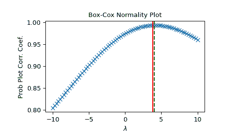

# `scipy.stats.boxcox_normmax`

> 原文：[`docs.scipy.org/doc/scipy-1.12.0/reference/generated/scipy.stats.boxcox_normmax.html#scipy.stats.boxcox_normmax`](https://docs.scipy.org/doc/scipy-1.12.0/reference/generated/scipy.stats.boxcox_normmax.html#scipy.stats.boxcox_normmax)

```py
scipy.stats.boxcox_normmax(x, brack=None, method='pearsonr', optimizer=None)
```

计算输入数据的最佳 Box-Cox 变换参数。

参数：

**x** array_like

输入数组。所有条目必须为正有限实数。

**brack** 2-元组，可选，默认为 (-2.0, 2.0)

默认 *optimize.brent* 求解器进行向下斜坡搜索的起始区间。请注意，这在大多数情况下并不重要；最终结果允许在此区间之外。如果传递了 *optimizer*，则 *brack* 必须为 None。

**method** str，可选

确定最佳变换参数（`boxcox` 的 `lmbda` 参数）的方法。选项包括：

‘pearsonr’（默认）

最大化皮尔逊相关系数，使 `y = boxcox(x)` 与 `y` 的期望值在 *x* 若为正态分布时保持一致。

‘mle’

最大化对数似然 `boxcox_llf`。这是 `boxcox` 中使用的方法。

‘all’

使用所有可用的优化方法，并返回所有结果。有助于比较不同的方法。

**optimizer** 可调用函数，可选

*optimizer* 是一个接受一个参数的可调用函数：

funcallable

要最小化的目标函数。*fun* 接受一个参数，即 Box-Cox 变换参数 *lmbda*，并返回在提供的参数处函数值（例如，负对数似然）。*optimizer* 的任务是找到最小化 *fun* 的 *lmbda* 值。

并返回一个对象，如 `scipy.optimize.OptimizeResult` 的实例，其中保存了属性 *x* 的最佳 *lmbda* 值。

更多信息请参见下面的示例或 `scipy.optimize.minimize_scalar` 的文档。

返回：

**maxlog** 浮点数或 ndarray

找到的最佳变换参数。对于 `method='all'`，这是一个数组而不是标量。

参见

`boxcox`、`boxcox_llf`、`boxcox_normplot`、`scipy.optimize.minimize_scalar` 的示例

示例

```py
>>> import numpy as np
>>> from scipy import stats
>>> import matplotlib.pyplot as plt 
```

我们可以生成一些数据，并以各种方式确定最佳的 `lmbda`：

```py
>>> rng = np.random.default_rng()
>>> x = stats.loggamma.rvs(5, size=30, random_state=rng) + 5
>>> y, lmax_mle = stats.boxcox(x)
>>> lmax_pearsonr = stats.boxcox_normmax(x) 
```

```py
>>> lmax_mle
2.217563431465757
>>> lmax_pearsonr
2.238318660200961
>>> stats.boxcox_normmax(x, method='all')
array([2.23831866, 2.21756343]) 
```

```py
>>> fig = plt.figure()
>>> ax = fig.add_subplot(111)
>>> prob = stats.boxcox_normplot(x, -10, 10, plot=ax)
>>> ax.axvline(lmax_mle, color='r')
>>> ax.axvline(lmax_pearsonr, color='g', ls='--') 
```

```py
>>> plt.show() 
```



或者，我们可以定义自己的*优化器*函数。假设我们只对区间[6, 7]上的*lmbda*值感兴趣，我们希望使用[`scipy.optimize.minimize_scalar`](https://scipy.optimize.minimize_scalar.html#scipy.optimize.minimize_scalar "scipy.optimize.minimize_scalar")，设置`method='bounded'`，并且在优化对数似然函数时希望使用更严格的公差。为此，我们定义一个接受位置参数*fun*的函数，并使用[`scipy.optimize.minimize_scalar`](https://scipy.optimize.minimize_scalar.html#scipy.optimize.minimize_scalar "scipy.optimize.minimize_scalar")来最小化*fun*，同时满足提供的边界和公差：

```py
>>> from scipy import optimize
>>> options = {'xatol': 1e-12}  # absolute tolerance on `x`
>>> def optimizer(fun):
...     return optimize.minimize_scalar(fun, bounds=(6, 7),
...                                     method="bounded", options=options)
>>> stats.boxcox_normmax(x, optimizer=optimizer)
6.000... 
```
