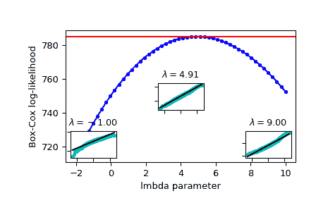

# `scipy.stats.boxcox_llf`

> 原文链接：[`docs.scipy.org/doc/scipy-1.12.0/reference/generated/scipy.stats.boxcox_llf.html#scipy.stats.boxcox_llf`](https://docs.scipy.org/doc/scipy-1.12.0/reference/generated/scipy.stats.boxcox_llf.html#scipy.stats.boxcox_llf)

```py
scipy.stats.boxcox_llf(lmb, data)
```

Box-Cox 对数似然函数。

参数：

**lmb** 标量

Box-Cox 转换的参数。详情请见 [`boxcox`](https://docs.scipy.org/doc/scipy-1.12.0/reference/generated/scipy.stats.boxcox.html#scipy.stats.boxcox "scipy.stats.boxcox")。

**data** array_like

计算 Box-Cox 对数似然函数的数据。如果 *data* 是多维的，则沿着第一轴计算对数似然。

返回：

**llf** 浮点数或者 ndarray

给定 *lmb* 的 Box-Cox 对数似然函数。对于 1-D *data* 是一个浮点数，否则是一个数组。

参见

[`boxcox`](https://docs.scipy.org/doc/scipy-1.12.0/reference/generated/scipy.stats.boxcox.html#scipy.stats.boxcox "scipy.stats.boxcox"), [`probplot`](https://docs.scipy.org/doc/scipy-1.12.0/reference/generated/scipy.stats.probplot.html#scipy.stats.probplot "scipy.stats.probplot"), [`boxcox_normplot`](https://docs.scipy.org/doc/scipy-1.12.0/reference/generated/scipy.stats.boxcox_normplot.html#scipy.stats.boxcox_normplot "scipy.stats.boxcox_normplot"), [`boxcox_normmax`](https://docs.scipy.org/doc/scipy-1.12.0/reference/generated/scipy.stats.boxcox_normmax.html#scipy.stats.boxcox_normmax "scipy.stats.boxcox_normmax")

注意事项

Box-Cox 对数似然函数在这里定义为

\[llf = (\lambda - 1) \sum_i(\log(x_i)) - N/2 \log(\sum_i (y_i - \bar{y})² / N),\]

其中 `y` 是经过 Box-Cox 变换的输入数据 `x`。

示例

```py
>>> import numpy as np
>>> from scipy import stats
>>> import matplotlib.pyplot as plt
>>> from mpl_toolkits.axes_grid1.inset_locator import inset_axes 
```

生成一些随机变量并计算它们的 Box-Cox 对数似然值，使用一系列 `lmbda` 值：

```py
>>> rng = np.random.default_rng()
>>> x = stats.loggamma.rvs(5, loc=10, size=1000, random_state=rng)
>>> lmbdas = np.linspace(-2, 10)
>>> llf = np.zeros(lmbdas.shape, dtype=float)
>>> for ii, lmbda in enumerate(lmbdas):
...     llf[ii] = stats.boxcox_llf(lmbda, x) 
```

同时使用 [`boxcox`](https://docs.scipy.org/doc/scipy-1.12.0/reference/generated/scipy.stats.boxcox.html#scipy.stats.boxcox "scipy.stats.boxcox") 找到最优 lmbda 值：

```py
>>> x_most_normal, lmbda_optimal = stats.boxcox(x) 
```

绘制以 lmbda 为函数的对数似然函数图。添加最优 lmbda 作为水平线来确认确实是最优值：

```py
>>> fig = plt.figure()
>>> ax = fig.add_subplot(111)
>>> ax.plot(lmbdas, llf, 'b.-')
>>> ax.axhline(stats.boxcox_llf(lmbda_optimal, x), color='r')
>>> ax.set_xlabel('lmbda parameter')
>>> ax.set_ylabel('Box-Cox log-likelihood') 
```

现在添加一些概率图，以展示通过 [`boxcox`](https://docs.scipy.org/doc/scipy-1.12.0/reference/generated/scipy.stats.boxcox.html#scipy.stats.boxcox "scipy.stats.boxcox") 变换的数据在对数似然函数最大化时看起来最接近正态分布：

```py
>>> locs = [3, 10, 4]  # 'lower left', 'center', 'lower right'
>>> for lmbda, loc in zip([-1, lmbda_optimal, 9], locs):
...     xt = stats.boxcox(x, lmbda=lmbda)
...     (osm, osr), (slope, intercept, r_sq) = stats.probplot(xt)
...     ax_inset = inset_axes(ax, width="20%", height="20%", loc=loc)
...     ax_inset.plot(osm, osr, 'c.', osm, slope*osm + intercept, 'k-')
...     ax_inset.set_xticklabels([])
...     ax_inset.set_yticklabels([])
...     ax_inset.set_title(r'$\lambda=%1.2f$' % lmbda) 
```

```py
>>> plt.show() 
```


