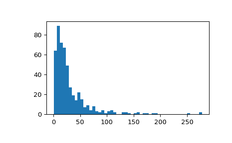
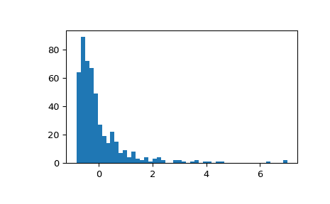
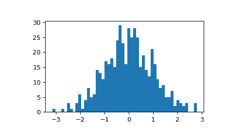

# `scipy.stats.gzscore`

> 原文链接：[`docs.scipy.org/doc/scipy-1.12.0/reference/generated/scipy.stats.gzscore.html#scipy.stats.gzscore`](https://docs.scipy.org/doc/scipy-1.12.0/reference/generated/scipy.stats.gzscore.html#scipy.stats.gzscore)

```py
scipy.stats.gzscore(a, *, axis=0, ddof=0, nan_policy='propagate')
```

计算几何标准分数。

计算样本中每个严格正值的几何 z 分数，相对于几何平均值和标准差。数学上，可以将几何 z 分数评估为：

```py
gzscore = log(a/gmu) / log(gsigma) 
```

其中`gmu`（或`gsigma`）是几何平均值（或标准差）。

参数：

**a**类似数组

样本数据。

**axis**整数或 None，可选

操作的轴。默认为 0。如果为 None，则在整个数组*a*上计算。

**ddof**整数，可选

在标准差计算中的自由度校正。默认为 0。

**nan_policy**{‘propagate’, ‘raise’, ‘omit’}，可选

定义输入包含 NaN 时的处理方式。‘propagate’返回 NaN，‘raise’引发错误，‘omit’执行计算时忽略 NaN 值。默认为‘propagate’。注意，当值为‘omit’时，输入中的 NaN 也会传播到输出，但它们不会影响对非 NaN 值计算的几何 z 分数。

返回：

**gzscore**类似数组

几何 z 分数，通过输入数组*a*的几何平均值和几何标准差标准化。

另请参见

`gmean`

几何平均值

`gstd`

几何标准差

`zscore`

标准分数

注意

此函数保留 ndarray 子类，并且也适用于矩阵和掩码数组（它使用`asanyarray`而不是`asarray`作为参数）。

新版本中的新功能 1.8。

参考文献

[1]

“几何标准分数”，*维基百科*，[`en.wikipedia.org/wiki/Geometric_standard_deviation#Geometric_standard_score`](https://en.wikipedia.org/wiki/Geometric_standard_deviation#Geometric_standard_score)。

示例

从对数正态分布中抽样：

```py
>>> import numpy as np
>>> from scipy.stats import zscore, gzscore
>>> import matplotlib.pyplot as plt 
```

```py
>>> rng = np.random.default_rng()
>>> mu, sigma = 3., 1.  # mean and standard deviation
>>> x = rng.lognormal(mu, sigma, size=500) 
```

显示样本的直方图：

```py
>>> fig, ax = plt.subplots()
>>> ax.hist(x, 50)
>>> plt.show() 
```



显示经典 z 分数标准化样本的直方图。分布被重新缩放，但其形状保持不变。

```py
>>> fig, ax = plt.subplots()
>>> ax.hist(zscore(x), 50)
>>> plt.show() 
```



证明几何 z 分数的分布被重新缩放并且准正态：

```py
>>> fig, ax = plt.subplots()
>>> ax.hist(gzscore(x), 50)
>>> plt.show() 
```


