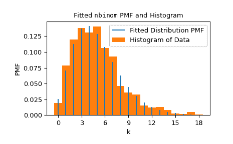

# `scipy.stats.fit`

> 原文：[`docs.scipy.org/doc/scipy-1.12.0/reference/generated/scipy.stats.fit.html#scipy.stats.fit`](https://docs.scipy.org/doc/scipy-1.12.0/reference/generated/scipy.stats.fit.html#scipy.stats.fit)

```py
scipy.stats.fit(dist, data, bounds=None, *, guess=None, method='mle', optimizer=<function differential_evolution>)
```

将离散或连续分布拟合到数据

给定分布、数据和分布参数的边界，返回参数的最大似然估计。

参数：

**dist**[`scipy.stats.rv_continuous`](https://docs.scipy.org/doc/scipy-1.12.0/reference/generated/scipy.stats.rv_continuous.html#scipy.stats.rv_continuous "scipy.stats.rv_continuous") 或 [`scipy.stats.rv_discrete`](https://docs.scipy.org/doc/scipy-1.12.0/reference/generated/scipy.stats.rv_discrete.html#scipy.stats.rv_discrete "scipy.stats.rv_discrete")

表示要适应数据的分布对象。

**data**1D array_like

要进行分布拟合的数据。如果数据包含任何 `np.nan`、`np.inf` 或 `-np.inf`，拟合方法将引发 `ValueError`。

**bounds**dict 或 元组序列，可选

如果是字典，则每个键是分布参数的名称，相应的值是该参数的下界和上界组成的元组。如果分布仅在该参数的有限值范围内定义，那么不需要该参数的条目；例如，某些分布的参数必须在 [0, 1] 区间内。位置 (`loc`) 和尺度 (`scale`) 参数的边界是可选的；默认情况下，它们分别固定为 0 和 1。

如果是一个序列，第 *i* 个元素是分布的第 *i* 个参数的下界和上界组成的元组。在这种情况下，必须提供所有分布形状参数的边界。可选地，位置和尺度的边界可以跟随分布形状参数。

如果要固定某个形状（例如已知的形状），则下界和上界可以相等。如果用户提供的下界或上界超出了分布定义域的边界，分布域的边界将替换用户提供的值。类似地，必须为整数的参数将被限制为用户提供边界内的整数值。

**guess**dict 或 array_like，可选

如果是字典，则每个键是分布的参数名称，相应的值是参数值的猜测。

如果是一个序列，第 *i* 个元素是分布的第 *i* 个参数的猜测值。在这种情况下，必须提供所有分布形状参数的猜测值。

如果未提供 *guess*，则不会将决策变量的猜测传递给优化器。如果提供了 *guess*，则会将任何缺失参数的猜测设置为下界和上界的均值。必须为整数的参数的猜测值将四舍五入为整数值，而位于用户提供边界和分布定义域交集之外的猜测值将被剪裁。

**method**{‘mle’, ‘mse’}

使用`method="mle"`（默认），通过最小化负对数似然函数来计算拟合。对于超出分布支持的观测值，应用大的有限惩罚（而不是无限的负对数似然）。使用`method="mse"`，通过最小化负对数产品间距函数来计算拟合。对于超出支持的观测值，应用相同的惩罚。我们遵循[[1]](#ra4db2bb0bf1d-1)的方法，该方法适用于具有重复观测样本。

**optimizer**callable, optional

*optimizer*是一个可调用对象，接受以下位置参数。

funcallable

要优化的目标函数。*fun*接受一个参数`x`，分布的候选形状参数，并返回给定`x`、*dist*和提供的*data*的目标函数值。*optimizer*的工作是找到最小化*fun*的决策变量值。

*optimizer*还必须接受以下关键字参数。

boundssequence of tuples

决策变量值的边界；每个元素将是包含决策变量下限和上限的元组。

如果提供了*guess*，*optimizer*还必须接受以下关键字参数。

x0array_like

每个决策变量的猜测。

如果分布有任何必须是整数的形状参数，或者如果分布是离散的且位置参数不固定，*optimizer*还必须接受以下关键字参数。

integralityarray_like of bools

对于每个决策变量，如果决策变量必须被限制为整数值，则为 True，如果决策变量是连续的，则为 False。

*optimizer*必须返回一个对象，例如`scipy.optimize.OptimizeResult`的实例，其中将决策变量的最优值保存在属性`x`中。如果提供了`fun`、`status`或`message`属性，它们将包含在由`fit`返回的结果对象中。

返回：

**result**`FitResult`

具有以下字段的对象。

paramsnamedtuple

包含分布形状参数、位置和（如果适用）尺度的最大似然估计的命名元组。

successbool 或 None

优化器是否考虑优化是否成功终止。

messagestr 或 None

优化器提供的任何状态消息。

对象具有以下方法：

nllf(params=None, data=None)

默认情况下，负对数似然函数在给定*数据*的拟合*params*处。接受包含分布的替代形状、位置和尺度以及替代数据数组的元组。

plot(ax=None)

将拟合分布的 PDF/PMF 叠加在数据的归一化直方图上。

另请参见

`rv_continuous`, `rv_discrete`

注意事项

当用户提供包含最大似然估计的紧密界限时，优化更有可能收敛到最大似然估计。例如，当将二项分布拟合到数据时，每个样本背后的实验数可能已知，在这种情况下，相应的形状参数`n`可以固定。

参考文献

[1]

邵勇照和 Marjorie G. Hahn. “最大间隔乘积方法：具有强一致性的统一表达。” 伊利诺伊数学期刊 43.3 (1999): 489-499。

例子

假设我们希望将分布拟合到以下数据。

```py
>>> import numpy as np
>>> from scipy import stats
>>> rng = np.random.default_rng()
>>> dist = stats.nbinom
>>> shapes = (5, 0.5)
>>> data = dist.rvs(*shapes, size=1000, random_state=rng) 
```

假设我们不知道数据是如何生成的，但我们怀疑它遵循负二项分布，参数为*n*和*p*。 (参见`scipy.stats.nbinom`.) 我们相信参数*n*小于 30，且参数*p*必须在区间[0, 1]内。我们将这些信息记录在变量*bounds*中，并将其传递给`fit`。

```py
>>> bounds = [(0, 30), (0, 1)]
>>> res = stats.fit(dist, data, bounds) 
```

`fit`在用户指定的*bounds*范围内搜索最佳与数据匹配的值（以最大似然估计的意义）。在这种情况下，它找到了与实际生成数据相似的形状值。

```py
>>> res.params
FitParams(n=5.0, p=0.5028157644634368, loc=0.0)  # may vary 
```

我们可以通过在数据的归一化直方图上叠加分布的概率质量函数（形状适合数据）来可视化结果。

```py
>>> import matplotlib.pyplot as plt  # matplotlib must be installed to plot
>>> res.plot()
>>> plt.show() 
```



注意，*n*的估计值恰好是整数；这是因为`nbinom` PMF 的定义域仅包含整数*n*，而`nbinom`对象“知道”这一点。`nbinom`还知道，形状*p*必须是介于 0 和 1 之间的值。在这种情况下 - 当分布的域对于参数是有限的时候 - 我们不需要为参数指定边界。

```py
>>> bounds = {'n': (0, 30)}  # omit parameter p using a `dict`
>>> res2 = stats.fit(dist, data, bounds)
>>> res2.params
FitParams(n=5.0, p=0.5016492009232932, loc=0.0)  # may vary 
```

如果我们希望强制分布在*n*固定为 6 的情况下进行拟合，我们可以将*n*的上下界都设为 6。然而，请注意，在这种情况下，优化的目标函数值通常会更差（更高）。

```py
>>> bounds = {'n': (6, 6)}  # fix parameter `n`
>>> res3 = stats.fit(dist, data, bounds)
>>> res3.params
FitParams(n=6.0, p=0.5486556076755706, loc=0.0)  # may vary
>>> res3.nllf() > res.nllf()
True  # may vary 
```

注意，前述示例的数值结果是典型的，但可能会有所不同，因为`fit`使用的默认优化器`scipy.optimize.differential_evolution`是随机的。然而，我们可以通过定制优化器的设置来确保可复现性 - 或者完全使用不同的优化器 - 使用*optimizer*参数。

```py
>>> from scipy.optimize import differential_evolution
>>> rng = np.random.default_rng()
>>> def optimizer(fun, bounds, *, integrality):
...     return differential_evolution(fun, bounds, strategy='best2bin',
...                                   seed=rng, integrality=integrality)
>>> bounds = [(0, 30), (0, 1)]
>>> res4 = stats.fit(dist, data, bounds, optimizer=optimizer)
>>> res4.params
FitParams(n=5.0, p=0.5015183149259951, loc=0.0) 
```
