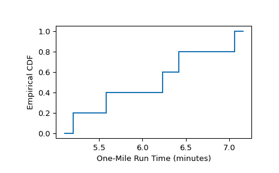

# `scipy.stats.ecdf`

> 原文：[`docs.scipy.org/doc/scipy-1.12.0/reference/generated/scipy.stats.ecdf.html#scipy.stats.ecdf`](https://docs.scipy.org/doc/scipy-1.12.0/reference/generated/scipy.stats.ecdf.html#scipy.stats.ecdf)

```py
scipy.stats.ecdf(sample)
```

样本的经验累积分布函数。

经验累积分布函数（ECDF）是样本底层分布的 CDF 的阶梯函数估计。此函数返回表示经验分布函数及其补集经验生存函数的对象。

参数：

**sample**1D 数组或`scipy.stats.CensoredData`

除了数组，支持`scipy.stats.CensoredData`的实例，包括未审查和右审查的观察结果。目前，其他`scipy.stats.CensoredData`的实例将导致`NotImplementedError`。

返回：

**res**`ECDFResult`

具有以下属性的对象。

cdf`EmpiricalDistributionFunction`

表示样本的经验累积分布函数的对象。

sf`EmpiricalDistributionFunction`

表示经验生存函数的对象。

*cdf*和*sf*属性本身具有以下属性。

quantilesndarray

定义经验 CDF/SF 的样本中的唯一值。

probabilitiesndarray

指数的*分位数*对应的概率点估计。

和以下方法：

evaluate(x)：

在参数处评估 CDF/SF。

plot(ax)：

在提供的坐标轴上绘制 CDF/SF。

confidence_interval(confidence_level=0.95)：

计算在*分位数*值周围 CDF/SF 的置信区间。

注意事项

当样本的每个观测是精确测量时，ECDF 在每个观测点[[1]](#r50f2a5c69eed-1)处按`1/len(sample)`递增。

当观测值为下限、上限或上下限时，数据被称为“审查”，*sample*可以作为`scipy.stats.CensoredData`的实例提供。

对于右审查数据，ECDF 由 Kaplan-Meier 估计器给出[[2]](#r50f2a5c69eed-2)；目前不支持其他形式的审查。

置信区间根据格林伍德公式或更近期的“指数格林伍德”公式计算，如[[4]](#r50f2a5c69eed-4)所述。

参考文献

[1] (1,2,3)

Conover, William Jay. 实用非参数统计. Vol. 350. John Wiley & Sons, 1999.

[2]

Kaplan, Edward L., and Paul Meier. “非参数估计来自不完整观测。” 美国统计协会杂志 53.282 (1958): 457-481.

[3]

Goel, Manish Kumar, Pardeep Khanna, and Jugal Kishore. “理解生存分析：Kaplan-Meier 估计。” 国际阿育吠陀研究杂志 1.4 (2010): 274.

[4]

Sawyer, Stanley. “生存分析中的格林伍德和指数格林伍德置信区间。” [`www.math.wustl.edu/~sawyer/handouts/greenwood.pdf`](https://www.math.wustl.edu/~sawyer/handouts/greenwood.pdf)

示例

**非截尾数据**

如在示例[[1]](#r50f2a5c69eed-1)第 79 页中，从一所高中的男生中随机选择了五个男生。他们的一英里跑步时间记录如下。

```py
>>> sample = [6.23, 5.58, 7.06, 6.42, 5.20]  # one-mile run times (minutes) 
```

经验分布函数，用来近似样本男生一英里跑步时间的总体分布函数，计算如下。

```py
>>> from scipy import stats
>>> res = stats.ecdf(sample)
>>> res.cdf.quantiles
array([5.2 , 5.58, 6.23, 6.42, 7.06])
>>> res.cdf.probabilities
array([0.2, 0.4, 0.6, 0.8, 1\. ]) 
```

要将结果绘制为阶跃函数：

```py
>>> import matplotlib.pyplot as plt
>>> ax = plt.subplot()
>>> res.cdf.plot(ax)
>>> ax.set_xlabel('One-Mile Run Time (minutes)')
>>> ax.set_ylabel('Empirical CDF')
>>> plt.show() 
```



**右截尾数据**

如在示例[[1]](#r50f2a5c69eed-1)第 91 页中，对十个汽车传动带的使用寿命进行了测试。五次测试因测试中的传动带断裂而结束，但其余测试因其他原因结束（例如，研究资金耗尽，但传动带仍然功能良好）。记录了传动带的行驶里程如下。

```py
>>> broken = [77, 47, 81, 56, 80]  # in thousands of miles driven
>>> unbroken = [62, 60, 43, 71, 37] 
```

在测试结束时仍然功能良好的传动带的精确寿命时间是未知的，但已知它们超过了记录在`unbroken`中的值。因此，这些观察被称为“右截尾”，并且使用`scipy.stats.CensoredData`来表示数据。

```py
>>> sample = stats.CensoredData(uncensored=broken, right=unbroken) 
```

经验生存函数计算如下。

```py
>>> res = stats.ecdf(sample)
>>> res.sf.quantiles
array([37., 43., 47., 56., 60., 62., 71., 77., 80., 81.])
>>> res.sf.probabilities
array([1\.   , 1\.   , 0.875, 0.75 , 0.75 , 0.75 , 0.75 , 0.5  , 0.25 , 0\.   ]) 
```

要将结果绘制为阶跃函数：

```py
>>> ax = plt.subplot()
>>> res.cdf.plot(ax)
>>> ax.set_xlabel('Fanbelt Survival Time (thousands of miles)')
>>> ax.set_ylabel('Empirical SF')
>>> plt.show() 
```


