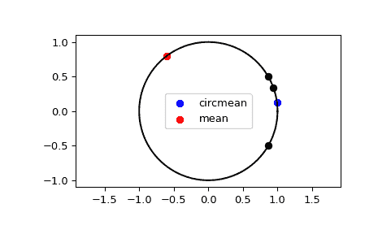

# `scipy.stats.circmean`

> 原文：[`docs.scipy.org/doc/scipy-1.12.0/reference/generated/scipy.stats.circmean.html#scipy.stats.circmean`](https://docs.scipy.org/doc/scipy-1.12.0/reference/generated/scipy.stats.circmean.html#scipy.stats.circmean)

```py
scipy.stats.circmean(samples, high=6.283185307179586, low=0, axis=None, nan_policy='propagate', *, keepdims=False)
```

计算范围内样本的圆均值。

参数：

**samples**类似数组

输入数组。

**high**float 或 int，可选

样本范围的高边界。默认为 `2*pi`。

**low**float 或 int，可选

样本范围的低边界。默认为 0。

**axis**int 或 None，默认为 None

如果是 int，则为计算统计量的输入轴。输入的每个轴切片（例如行）的统计量将出现在输出的相应元素中。如果为 `None`，则在计算统计量之前将对输入进行展平。

**nan_policy**{'propagate', 'omit', 'raise'}

定义如何处理输入的 NaN。

+   `propagate`: 如果计算统计量的轴切片（例如行）中存在 NaN，则输出的相应条目将为 NaN。

+   `omit`: 在执行计算时将忽略 NaN。如果在计算统计量的轴切片中剩余的数据不足，则输出的相应条目将为 NaN。

+   `raise`: 如果存在 NaN，则会引发 `ValueError`。

**keepdims**bool，默认为 False

如果设置为 True，则减少的轴将作为尺寸为一的维度保留在结果中。选择此选项可确保结果正确地广播到输入数组。

返回：

**circmean**float

圆均值。

另请参阅

`circstd`

圆标准差。

`circvar`

圆方差。

注意事项

从 SciPy 1.9 开始，`np.matrix` 输入（不建议用于新代码）在执行计算之前将转换为 `np.ndarray`。在这种情况下，输出将是适当形状的标量或 `np.ndarray`，而不是二维的 `np.matrix`。同样，虽然忽略掩码数组的屏蔽元素，输出将是标量或 `np.ndarray`，而不是具有 `mask=False` 的掩码数组。

示例

为简单起见，所有角度都以度数打印出来。

```py
>>> import numpy as np
>>> from scipy.stats import circmean
>>> import matplotlib.pyplot as plt
>>> angles = np.deg2rad(np.array([20, 30, 330]))
>>> circmean = circmean(angles)
>>> np.rad2deg(circmean)
7.294976657784009 
```

```py
>>> mean = angles.mean()
>>> np.rad2deg(mean)
126.66666666666666 
```

绘制并比较圆均值与算术平均值。

```py
>>> plt.plot(np.cos(np.linspace(0, 2*np.pi, 500)),
...          np.sin(np.linspace(0, 2*np.pi, 500)),
...          c='k')
>>> plt.scatter(np.cos(angles), np.sin(angles), c='k')
>>> plt.scatter(np.cos(circmean), np.sin(circmean), c='b',
...             label='circmean')
>>> plt.scatter(np.cos(mean), np.sin(mean), c='r', label='mean')
>>> plt.legend()
>>> plt.axis('equal')
>>> plt.show() 
```


