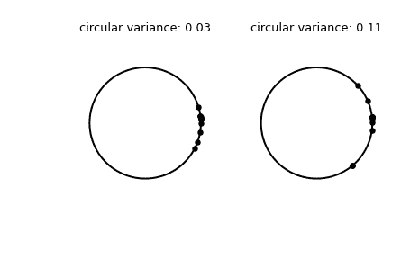

# `scipy.stats.circvar`

> 原文链接：[`docs.scipy.org/doc/scipy-1.12.0/reference/generated/scipy.stats.circvar.html#scipy.stats.circvar`](https://docs.scipy.org/doc/scipy-1.12.0/reference/generated/scipy.stats.circvar.html#scipy.stats.circvar)

```py
scipy.stats.circvar(samples, high=6.283185307179586, low=0, axis=None, nan_policy='propagate', *, keepdims=False)
```

计算假定在范围内的样本的圆形方差。

参数：

**samples**array_like

输入数组。

**high**float 或 int，可选

样本范围的高边界。默认为 `2*pi`。

**low**float 或 int，可选

样本范围的低边界。默认为 0。

**axis**int 或 None，默认为 None

如果是 int，则是计算统计量的输入的轴。输入的每个轴切片（例如行）的统计量将出现在输出的相应元素中。如果是 `None`，则在计算统计量之前会将输入展平。

**nan_policy**{‘propagate’, ‘omit’, ‘raise’}

定义如何处理输入的 NaN 值。

+   `propagate`: 如果在计算统计量的轴切片（例如行）中存在 NaN，则输出的相应条目将是 NaN。

+   `omit`: 在执行计算时将省略 NaN。如果在计算统计量的轴切片中剩余的数据不足，则输出的相应条目将为 NaN。

+   `raise`: 如果存在 NaN，则会引发 `ValueError`。

**keepdims**bool，默认为 False

如果设置为 True，则被缩减的轴会以尺寸为一的维度保留在结果中。使用此选项，结果将正确地与输入数组进行广播。

返回：

**circvar**float

圆形方差。

参见

`circmean`

圆形平均值。

`circstd`

圆形标准差。

注意

这里使用的圆形方差的定义是 `1-R`，其中 `R` 是平均结果向量。返回的值在范围 [0, 1] 内，0 表示无方差，1 表示大方差。在小角度的极限情况下，该值类似于“线性”方差的一半。

从 SciPy 1.9 开始，`np.matrix` 输入（不建议新代码使用）在执行计算之前会转换为 `np.ndarray`。在这种情况下，输出将是一个适当形状的标量或 `np.ndarray`，而不是一个 2D 的 `np.matrix`。同样地，忽略掩码数组的掩码元素后，输出将是一个标量或 `np.ndarray`，而不是带有 `mask=False` 的掩码数组。

参考文献

[1]

Fisher, N.I. *Statistical analysis of circular data*. Cambridge University Press, 1993.

示例

```py
>>> import numpy as np
>>> from scipy.stats import circvar
>>> import matplotlib.pyplot as plt
>>> samples_1 = np.array([0.072, -0.158, 0.077, 0.108, 0.286,
...                       0.133, -0.473, -0.001, -0.348, 0.131])
>>> samples_2 = np.array([0.111, -0.879, 0.078, 0.733, 0.421,
...                       0.104, -0.136, -0.867,  0.012,  0.105])
>>> circvar_1 = circvar(samples_1)
>>> circvar_2 = circvar(samples_2) 
```

绘制样本。

```py
>>> fig, (left, right) = plt.subplots(ncols=2)
>>> for image in (left, right):
...     image.plot(np.cos(np.linspace(0, 2*np.pi, 500)),
...                np.sin(np.linspace(0, 2*np.pi, 500)),
...                c='k')
...     image.axis('equal')
...     image.axis('off')
>>> left.scatter(np.cos(samples_1), np.sin(samples_1), c='k', s=15)
>>> left.set_title(f"circular variance: {np.round(circvar_1,  2)!r}")
>>> right.scatter(np.cos(samples_2), np.sin(samples_2), c='k', s=15)
>>> right.set_title(f"circular variance: {np.round(circvar_2,  2)!r}")
>>> plt.show() 
```


