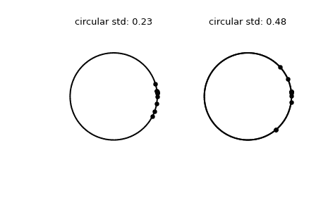

# `scipy.stats.circstd`

> 原文链接：[`docs.scipy.org/doc/scipy-1.12.0/reference/generated/scipy.stats.circstd.html#scipy.stats.circstd`](https://docs.scipy.org/doc/scipy-1.12.0/reference/generated/scipy.stats.circstd.html#scipy.stats.circstd)

```py
scipy.stats.circstd(samples, high=6.283185307179586, low=0, axis=None, nan_policy='propagate', *, normalize=False, keepdims=False)
```

计算假设样本在范围 [low, high] 中的圆形标准偏差。

参数：

**samples**：array_like

输入数组。

**high**：float 或 int，可选

样本范围的高边界。默认为 `2*pi`。

**low**：float 或 int，可选

样本范围的低边界。默认为 0。

**normalize**：boolean，可选

如果为 True，则返回的值等于 `sqrt(-2*log(R))`，并且不依赖于变量单位。如果为 False（默认），返回的值将按 `((high-low)/(2*pi))` 缩放。

**axis**：int 或 None，默认为 None

如果为整数，则计算统计量的输入轴（例如行）。输入的每个轴切片的统计量将出现在输出的相应元素中。如果为 `None`，则在计算统计量之前将进行展平。

**nan_policy**：{‘propagate’, ‘omit’, ‘raise’}

定义如何处理输入的 NaN。

+   `propagate`：如果在计算统计量的轴切片（例如行）中存在 NaN，则输出的对应条目将为 NaN。

+   `omit`：执行计算时将忽略 NaN。如果在计算统计量的轴切片中保留的数据不足，则输出的对应条目将为 NaN。

+   `raise`：如果存在 NaN，则会引发 `ValueError`。

**keepdims**：bool，默认为 False

如果设置为 True，则减少的轴将作为大小为一的维度保留在结果中。使用此选项，结果将正确广播到输入数组。

返回：

**circstd**：float

圆形标准偏差。

另请参见

`circmean`

圆形均值。

`circvar`

圆形方差。

注意

这使用了来自[[1]](#r35fafa2c005d-1)的圆形标准偏差的定义。本质上，计算如下。

```py
import numpy as np
C = np.cos(samples).mean()
S = np.sin(samples).mean()
R = np.sqrt(C**2 + S**2)
l = 2*np.pi / (high-low)
circstd = np.sqrt(-2*np.log(R)) / l 
```

在小角度极限下，它返回接近‘线性’标准偏差的数字。

从 SciPy 1.9 开始，`np.matrix` 输入（不推荐新代码使用）在执行计算之前将转换为 `np.ndarray`。在这种情况下，输出将是一个标量或适当形状的 `np.ndarray`，而不是 2D 的 `np.matrix`。类似地，虽然忽略掩码数组的掩码元素，但输出将是一个标量或 `np.ndarray`，而不是带有 `mask=False` 的掩码数组。

引用

[1]

Mardia, K. V. (1972). 2\. 在 *方向数据的统计* (pp. 18-24). Academic Press. [DOI:10.1016/C2013-0-07425-7](https://doi.org/10.1016/C2013-0-07425-7)。

示例

```py
>>> import numpy as np
>>> from scipy.stats import circstd
>>> import matplotlib.pyplot as plt
>>> samples_1 = np.array([0.072, -0.158, 0.077, 0.108, 0.286,
...                       0.133, -0.473, -0.001, -0.348, 0.131])
>>> samples_2 = np.array([0.111, -0.879, 0.078, 0.733, 0.421,
...                       0.104, -0.136, -0.867,  0.012,  0.105])
>>> circstd_1 = circstd(samples_1)
>>> circstd_2 = circstd(samples_2) 
```

绘制样本。

```py
>>> fig, (left, right) = plt.subplots(ncols=2)
>>> for image in (left, right):
...     image.plot(np.cos(np.linspace(0, 2*np.pi, 500)),
...                np.sin(np.linspace(0, 2*np.pi, 500)),
...                c='k')
...     image.axis('equal')
...     image.axis('off')
>>> left.scatter(np.cos(samples_1), np.sin(samples_1), c='k', s=15)
>>> left.set_title(f"circular std: {np.round(circstd_1,  2)!r}")
>>> right.plot(np.cos(np.linspace(0, 2*np.pi, 500)),
...            np.sin(np.linspace(0, 2*np.pi, 500)),
...            c='k')
>>> right.scatter(np.cos(samples_2), np.sin(samples_2), c='k', s=15)
>>> right.set_title(f"circular std: {np.round(circstd_2,  2)!r}")
>>> plt.show() 
```


