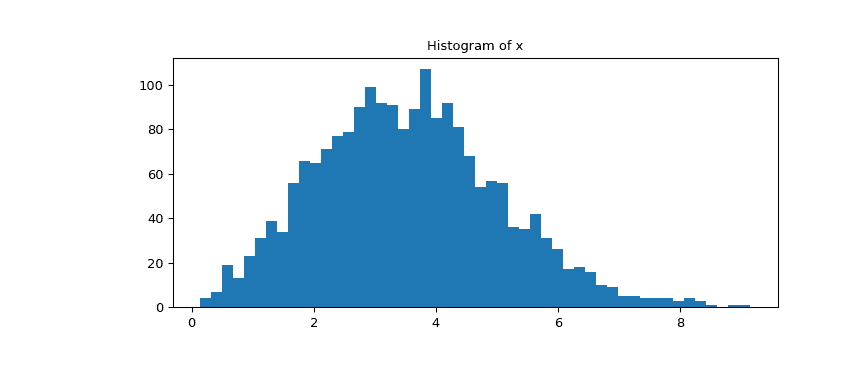
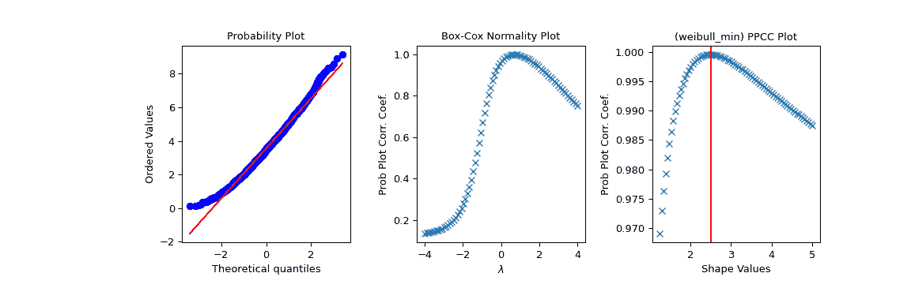

# `scipy.stats.ppcc_plot`

> 原文链接：[`docs.scipy.org/doc/scipy-1.12.0/reference/generated/scipy.stats.ppcc_plot.html#scipy.stats.ppcc_plot`](https://docs.scipy.org/doc/scipy-1.12.0/reference/generated/scipy.stats.ppcc_plot.html#scipy.stats.ppcc_plot)

```py
scipy.stats.ppcc_plot(x, a, b, dist='tukeylambda', plot=None, N=80)
```

计算并可选地绘制概率图相关系数。

概率图相关系数（PPCC）图可用于确定单参数分布族的最佳形状参数。它不能用于没有形状参数（如正态分布）或具有多个形状参数的分布。

默认情况下使用 Tukey-Lambda 分布（*stats.tukeylambda*）。Tukey-Lambda PPCC 图通过近似正态分布从长尾到短尾分布进行插值，因此在实践中特别有用。

参数：

**x** array_like

输入数组。

**a, b** 标量

使用的形状参数的下限和上限。

**dist** str 或 stats.distributions 实例，可选

分布或分布函数名称。也接受足够像 stats.distributions 实例的对象（即它们有 `ppf` 方法）。默认值为 `'tukeylambda'`。

**plot** 对象，可选

如果给定，则绘制 PPCC 对形状参数的图。*plot* 是一个具有 “plot” 和 “text” 方法的对象。可以使用 [`matplotlib.pyplot`](https://matplotlib.org/stable/api/pyplot_summary.html#module-matplotlib.pyplot "(在 Matplotlib v3.8.2 中)") 模块或 Matplotlib Axes 对象，或具有相同方法的自定义对象。默认值为 None，表示不创建图表。

**N** int，可选

水平轴上的点数（从 *a* 到 *b* 等距分布）。

返回：

**svals** ndarray

用于计算 *ppcc* 的形状值。

**ppcc** ndarray

计算的概率图相关系数值。

参见

`ppcc_max`，`probplot`，`boxcox_normplot`，`tukeylambda`

参考文献

J.J. Filliben，《正态性的概率图相关系数检验》，《Technometrics》，第 17 卷，第 111-117 页，1975 年。

示例

首先我们从形状参数为 2.5 的 Weibull 分布生成一些随机数据，并绘制数据的直方图：

```py
>>> import numpy as np
>>> from scipy import stats
>>> import matplotlib.pyplot as plt
>>> rng = np.random.default_rng()
>>> c = 2.5
>>> x = stats.weibull_min.rvs(c, scale=4, size=2000, random_state=rng) 
```

查看数据的直方图。

```py
>>> fig1, ax = plt.subplots(figsize=(9, 4))
>>> ax.hist(x, bins=50)
>>> ax.set_title('Histogram of x')
>>> plt.show() 
```



现在我们使用 PPCC 图及相关概率图和 Box-Cox normplot 探索这些数据。在我们预期 PPCC 值最大的形状参数 `c` 处绘制了一条红线：

```py
>>> fig2 = plt.figure(figsize=(12, 4))
>>> ax1 = fig2.add_subplot(1, 3, 1)
>>> ax2 = fig2.add_subplot(1, 3, 2)
>>> ax3 = fig2.add_subplot(1, 3, 3)
>>> res = stats.probplot(x, plot=ax1)
>>> res = stats.boxcox_normplot(x, -4, 4, plot=ax2)
>>> res = stats.ppcc_plot(x, c/2, 2*c, dist='weibull_min', plot=ax3)
>>> ax3.axvline(c, color='r')
>>> plt.show() 
```


