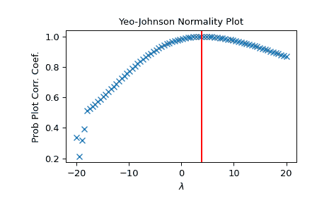

# `scipy.stats.yeojohnson_normplot`

> 原文：[`docs.scipy.org/doc/scipy-1.12.0/reference/generated/scipy.stats.yeojohnson_normplot.html#scipy.stats.yeojohnson_normplot`](https://docs.scipy.org/doc/scipy-1.12.0/reference/generated/scipy.stats.yeojohnson_normplot.html#scipy.stats.yeojohnson_normplot)

```py
scipy.stats.yeojohnson_normplot(x, la, lb, plot=None, N=80)
```

计算 Yeo-Johnson 正态性图的参数，并可选择显示它。

Yeo-Johnson 正态性图以图形方式显示最佳变换参数，以便在 `yeojohnson` 中获得接近正态的分布。

参数：

**x**array_like

输入数组。

**la, lb**scalar

传递给 `yeojohnson` 用于 Yeo-Johnson 变换的 `lmbda` 的下限和上限。如果生成了图形，则这也是图的水平轴的限制。

**plot**object, optional

如果提供，则绘制分位数和最小二乘拟合。*plot* 是一个必须具有“plot”和“text”方法的对象。可以使用 [`matplotlib.pyplot`](https://matplotlib.org/stable/api/pyplot_summary.html#module-matplotlib.pyplot "(在 Matplotlib v3.8.2 中)") 模块或 Matplotlib Axes 对象，或具有相同方法的自定义对象。默认为 None，表示不创建任何图。

**N**int, optional

水平轴上的点数（从 *la* 到 *lb* 等距分布）。

返回：

**lmbdas**ndarray

进行 Yeo-Johnson 变换的 `lmbda` 值。

**ppcc**ndarray

概率图相关系数，从 `probplot` 中获取，用于将 Box-Cox 变换后的输入 *x* 拟合到正态分布。

参见

`probplot`, `yeojohnson`, `yeojohnson_normmax`, `yeojohnson_llf`, `ppcc_max`

注意事项

即使给定 *plot*，调用 `boxcox_normplot` 后，图形也不会显示或保存；应在调用 `probplot` 后使用 `plt.show()` 或 `plt.savefig('figname.png')`。

版本 1.2.0 中的新功能。

示例

```py
>>> from scipy import stats
>>> import matplotlib.pyplot as plt 
```

生成一些非正态分布的数据，并创建一个 Yeo-Johnson 图：

```py
>>> x = stats.loggamma.rvs(5, size=500) + 5
>>> fig = plt.figure()
>>> ax = fig.add_subplot(111)
>>> prob = stats.yeojohnson_normplot(x, -20, 20, plot=ax) 
```

确定并绘制最佳 `lmbda`，将 `x` 转换并在同一图中绘制：

```py
>>> _, maxlog = stats.yeojohnson(x)
>>> ax.axvline(maxlog, color='r') 
```

```py
>>> plt.show() 
```


