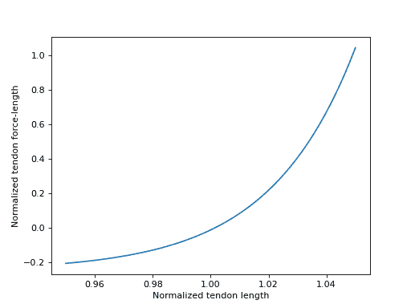
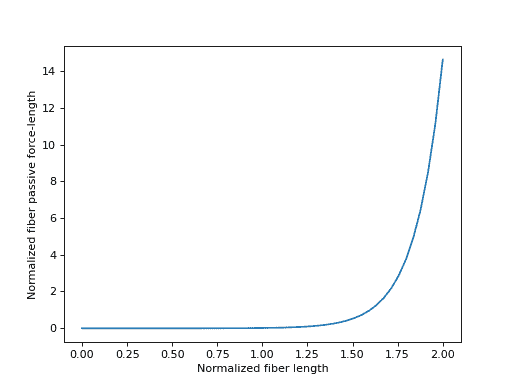
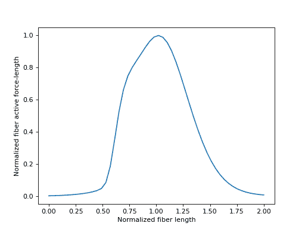
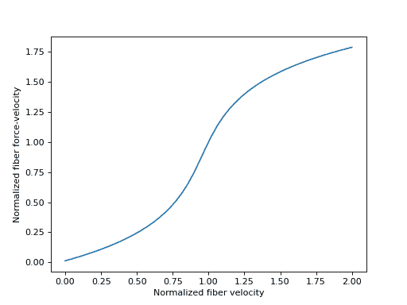
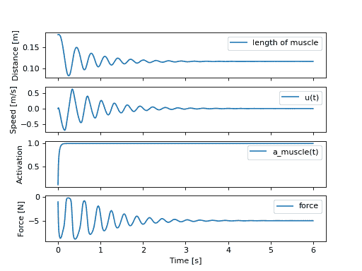

# 生物力学建模简介

> 原文：[`docs.sympy.org/latest/tutorials/physics/biomechanics/biomechanics.html`](https://docs.sympy.org/latest/tutorials/physics/biomechanics/biomechanics.html)

`sympy.physics.biomechanics` 提供了增强使用 `sympy.physics.mechanics` 创建的模型的功能，这些模型包括用于建模肌肉和肌腱的力元素。在本教程中，我们将介绍此模块的特性。

生物力学包的初始主要目的是介绍用于建模由[Hill 型肌肉模型](https://en.wikipedia.org/wiki/Hill%27s_muscle_model)产生的力的工具。这些模型生成基于肌肉的收缩状态和肌腱的被动伸展作用于生物体的骨骼结构上的力。在本教程中，我们介绍组成肌腱模型的元素，然后展示其在具体实现中的运行，即`MusculotendonDeGroote2016` 模型。

## 载荷

`sympy.physics.mechanics` 包括两种类型的载荷：`Force` 和 `Torque`。力表示沿着作用线方向的绑定向量量，而力矩是未绑定的向量，表示一对力的结果力矩。

一个非常常见的力模型示例是平行线性弹簧和线性阻尼器。质量为 \(m\) 的粒子，其由广义坐标 \(x(t)\) 描述的一维运动，具有线性弹簧和阻尼器系数 \(k\) 和 \(c\)，其运动方程如下所示：

\[m \ddot{x} = \sum F = -kx - c\dot{x}\]

在 SymPy 中，我们可以这样表达作用在粒子 \(P\) 上的力，该粒子在参考系 \(N\) 中运动，并且相对于固定在 \(N\) 中的点 \(O\) 的位置如下：

```py
>>> import sympy as sm
>>> import sympy.physics.mechanics as me 
```

```py
>>> k, c = sm.symbols('k, c', real=True, nonnegative=True)
>>> x = me.dynamicsymbols('x', real=True) 
```

```py
>>> N = me.ReferenceFrame('N')
>>> O, P = me.Point('O'), me.Point('P') 
```

```py
>>> P.set_pos(O, x*N.x)
>>> P.set_vel(N, x.diff()*N.x) 
```

```py
>>> force_on_P = me.Force(P, -k*P.pos_from(O) - c*P.vel(N))
>>> force_on_P
(P, (-c*Derivative(x(t), t) - k*x(t))*N.x) 
```

并且在 \(O\) 上会有一个等大而相反方向的力作用：

```py
>>> force_on_O = me.Force(O, k*P.pos_from(O) + c*P.vel(N))
>>> force_on_O
(O, (c*Derivative(x(t), t) + k*x(t))*N.x) 
```

由单一肌肉和肌腱施加到一组刚体上的力将是进一步开发的肌肉肌腱模型的主要输出。

## Pathways

肌肉及其相关的肌腱包裹在运动的骨骼系统周围，以及其他肌肉和器官。这带来了一个挑战，即确定肌肉和肌腱在接触到骨骼和器官时产生的力的作用线。我们引入了 `pathway` 模块来帮助管理几何关系到力的作用线的规范化。

上述弹簧阻尼器示例具有最简单的作用线定义，因此我们可以使用 `LinearPathway` 来建立该作用线。首先提供力将向两端点施加等大小但方向相反的应用点，路径的长度和两点之间的距离和两点之间的相对速度由 `length` 和 `extension_velocity` 路径计算。请注意，正速度意味着点正在远离彼此。还请注意，该公式处理了 \(x\) 是正数或负数的情况。

```py
>>> lpathway = me.LinearPathway(O, P)
>>> lpathway
LinearPathway(O, P)
>>> lpathway.length
Abs(x(t))
>>> lpathway.extension_velocity
sign(x(t))*Derivative(x(t), t) 
```

然后，`to_loads` 方法会采用一种符号约定的力量大小，其中正的大小会推动两个点远离彼此，并返回作用于这两个点的所有力的列表。

```py
>>> import pprint
>>> pprint.pprint(lpathway.to_loads(-k*x - k*x.diff()))
[Force(point=O, force=(k*x(t) + k*Derivative(x(t), t))*x(t)/Abs(x(t))*N.x),
 Force(point=P, force=(-k*x(t) - k*Derivative(x(t), t))*x(t)/Abs(x(t))*N.x)] 
```

可以用任意几何形状和任意数量的相互连接的粒子和刚体构造路径。例如，更复杂的路径是 `ObstacleSetPathway`。您可以指定两个路径端点之间的任意数量的中间点，力的驱动路径会沿着这些中间点连接 \(N\) 到 \(O\) 到 \(Q\) 到 \(R\) 到 \(P\)。这四个点各自会经历结果力。为简单起见，我们展示了仅弹簧力的效果。

```py
>>> Q, R = me.Point('Q'), me.Point('R')
>>> Q.set_pos(O, 1*N.y)
>>> R.set_pos(O, 1*N.x + 1*N.y)
>>> opathway = me.ObstacleSetPathway(O, Q, R, P)
>>> opathway.length
sqrt((x(t) - 1)**2 + 1) + 2
>>> opathway.extension_velocity
(x(t) - 1)*Derivative(x(t), t)/sqrt((x(t) - 1)**2 + 1)
>>> pprint.pprint(opathway.to_loads(-k*opathway.length))
[Force(point=O, force=k*(sqrt((x(t) - 1)**2 + 1) + 2)*N.y),
 Force(point=Q, force=- k*(sqrt((x(t) - 1)**2 + 1) + 2)*N.y),
 Force(point=Q, force=k*(sqrt((x(t) - 1)**2 + 1) + 2)*N.x),
 Force(point=R, force=- k*(sqrt((x(t) - 1)**2 + 1) + 2)*N.x),
 Force(point=R, force=k*(sqrt((x(t) - 1)**2 + 1) + 2)*(x(t) - 1)/sqrt((x(t) - 1)**2 + 1)*N.x - k*(sqrt((x(t) - 1)**2 + 1) + 2)/sqrt((x(t) - 1)**2 + 1)*N.y),
 Force(point=P, force=- k*(sqrt((x(t) - 1)**2 + 1) + 2)*(x(t) - 1)/sqrt((x(t) - 1)**2 + 1)*N.x + k*(sqrt((x(t) - 1)**2 + 1) + 2)/sqrt((x(t) - 1)**2 + 1)*N.y)] 
```

如果设定 \(x=1\)，就更容易看到力的集合是正确的：

```py
>>> for load in opathway.to_loads(-k*opathway.length):
...     pprint.pprint(me.Force(load[0], load[1].subs({x: 1})))
Force(point=O, force=3*k*N.y)
Force(point=Q, force=- 3*k*N.y)
Force(point=Q, force=3*k*N.x)
Force(point=R, force=- 3*k*N.x)
Force(point=R, force=- 3*k*N.y)
Force(point=P, force=3*k*N.y) 
```

你可以通过子类化`PathwayBase`来创建自己的路径。

## 包裹几何体

肌肉通常包裹在骨骼、组织或器官上。我们引入了包裹几何体和相关的包裹路径来帮助管理它们的复杂性。例如，如果两个路径端点位于圆柱体表面上，则力沿着连接端点的测地线的切线方向作用。`WrappingCylinder`对象计算了路径的复杂几何形状。然后，`WrappingPathway`利用这些几何形状构建力。沿着这条路径的弹簧力如下构建：

```py
>>> r = sm.symbols('r', real=True, nonegative=True)
>>> theta = me.dynamicsymbols('theta', real=True)
>>> O, P, Q = sm.symbols('O, P, Q', cls=me.Point)
>>> A = me.ReferenceFrame('A') 
```

```py
>>> A.orient_axis(N, theta, N.z) 
```

```py
>>> P.set_pos(O, r*N.x)
>>> Q.set_pos(O, N.z + r*A.x) 
```

```py
>>> cyl = me.WrappingCylinder(r, O, N.z)
>>> wpathway = me.WrappingPathway(P, Q, cyl)
>>> pprint.pprint(wpathway.to_loads(-k*wpathway.length))
[Force(point=P, force=- k*r*Abs(theta(t))*N.y - k*N.z),
 Force(point=Q, force=k*N.z + k*r*Abs(theta(t))*A.y),
 Force(point=O, force=k*r*Abs(theta(t))*N.y - k*r*Abs(theta(t))*A.y)] 
```

## 执行器

多体系统的模型通常具有时间变化的输入，如力或扭矩的大小。在许多情况下，这些指定的输入可以来自系统的状态甚至来自另一个动态系统的输出。`actuator`模块包含帮助管理这些力和扭矩输入模型的类。执行器旨在表示真实的物理组件。例如，上述弹簧-阻尼力可以通过子类化`ActuatorBase`并实现生成与该弹簧-阻尼执行器相关的负载的方法来创建。

```py
>>> N = me.ReferenceFrame('N')
>>> O, P = me.Point('O'), me.Point('P')
>>> P.set_pos(O, x*N.x) 
```

```py
>>> class SpringDamper(me.ActuatorBase):
...
...     # positive x spring is in tension
...     # negative x spring is in compression
...     def __init__(self, P1, P2, spring_constant, damper_constant):
...         self.P1 = P1
...         self.P2 = P2
...         self.k = spring_constant
...         self.c = damper_constant
...
...     def to_loads(self):
...         x = self.P2.pos_from(self.P1).magnitude()
...         v = x.diff(me.dynamicsymbols._t)
...         dir_vec = self.P2.pos_from(self.P1).normalize()
...         force_P1 = me.Force(self.P1,
...                             self.k*x*dir_vec + self.c*v*dir_vec)
...         force_P2 = me.Force(self.P2,
...                             -self.k*x*dir_vec - self.c*v*dir_vec)
...         return [force_P1, force_P2]
... 
```

```py
>>> spring_damper = SpringDamper(O, P, k, c)
>>> pprint.pprint(spring_damper.to_loads())
[Force(point=O, force=(c*x(t)*sign(x(t))*Derivative(x(t), t)/Abs(x(t)) + k*x(t))*N.x),
 Force(point=P, force=(-c*x(t)*sign(x(t))*Derivative(x(t), t)/Abs(x(t)) - k*x(t))*N.x)] 
```

还有一个`ForceActuator`，可以与路径对象无缝集成。你只需在子类的初始化中设置`.force`属性即可。

```py
>>> class SpringDamper(me.ForceActuator):
...
...     # positive x spring is in tension
...     # negative x spring is in compression
...     def __init__(self, pathway, spring_constant, damper_constant):
...         self.pathway = pathway
...         self.force = (-spring_constant*pathway.length -
...                       damper_constant*pathway.extension_velocity)
...
>>> spring_damper2 = SpringDamper(lpathway, k, c)
>>> pprint.pprint(spring_damper2.to_loads())
[Force(point=O, force=(c*sign(x(t))*Derivative(x(t), t) + k*Abs(x(t)))*x(t)/Abs(x(t))*N.x),
 Force(point=P, force=(-c*sign(x(t))*Derivative(x(t), t) - k*Abs(x(t)))*x(t)/Abs(x(t))*N.x)] 
```

这样就可以轻松地对其他路径应用弹簧-阻尼力，例如：

```py
>>> spring_damper3 = SpringDamper(wpathway, k, c)
>>> pprint.pprint(spring_damper3.to_loads())
[Force(point=P, force=r*(-c*r**2*theta(t)*Derivative(theta(t), t)/sqrt(r**2*theta(t)**2 + 1) - k*sqrt(r**2*theta(t)**2 + 1))*Abs(theta(t))/sqrt(r**2*theta(t)**2 + 1)*N.y + (-c*r**2*theta(t)*Derivative(theta(t), t)/sqrt(r**2*theta(t)**2 + 1) - k*sqrt(r**2*theta(t)**2 + 1))/sqrt(r**2*theta(t)**2 + 1)*N.z),
 Force(point=Q, force=- (-c*r**2*theta(t)*Derivative(theta(t), t)/sqrt(r**2*theta(t)**2 + 1) - k*sqrt(r**2*theta(t)**2 + 1))/sqrt(r**2*theta(t)**2 + 1)*N.z - r*(-c*r**2*theta(t)*Derivative(theta(t), t)/sqrt(r**2*theta(t)**2 + 1) - k*sqrt(r**2*theta(t)**2 + 1))*Abs(theta(t))/sqrt(r**2*theta(t)**2 + 1)*A.y),
 Force(point=O, force=- r*(-c*r**2*theta(t)*Derivative(theta(t), t)/sqrt(r**2*theta(t)**2 + 1) - k*sqrt(r**2*theta(t)**2 + 1))*Abs(theta(t))/sqrt(r**2*theta(t)**2 + 1)*N.y + r*(-c*r**2*theta(t)*Derivative(theta(t), t)/sqrt(r**2*theta(t)**2 + 1) - k*sqrt(r**2*theta(t)**2 + 1))*Abs(theta(t))/sqrt(r**2*theta(t)**2 + 1)*A.y)] 
```

## 激活动力学

当肌腱模型被激活时，它们能够产生主动收缩力。在生物学上，当肌纤维中的\(\textrm{Ca}^{2+}\)离子浓度足够高时，它们开始自发收缩。这种自发收缩状态称为“激活”。在生物力学模型中，通常用符号\(a(t)\)表示，它被视为在\([0, 1]\)范围内的归一化量。

生物体并不直接控制其肌肉中的\(\textrm{Ca}^{2+}\)离子浓度，而是其由大脑控制的神经系统向肌肉发送电信号，导致\(\textrm{Ca}^{2+}\)离子释放。这些离子扩散并在肌肉中增加浓度，导致激活。传输到肌肉以刺激收缩的电信号称为“兴奋”。在生物力学模型中，通常用符号\(e(t)\)表示，也被视为在区间\([0, 1]\)内的归一化量。

兴奋输入与激活状态之间的关系称为激活动力学。由于在生物力学模型中激活动力学非常普遍，SymPy 提供了`activation`模块，其中包含一些常见激活动力学模型的实现。这些模型包括基于[[DeGroote2016]](#degroote2016)论文方程的零阶激活动力学和一阶激活动力学。接下来我们将手动实现这些模型，并展示它们与 SymPy 提供的类的关系。

### 零阶

激活动力学的最简单模型假设\(\textrm{Ca}^{2+}\)离子的扩散是瞬时的。数学上，这给出了\(a(t) = e(t)\)，一个零阶常微分方程。

```py
>>> e = me.dynamicsymbols('e')
>>> e
e(t)
>>> a = e
>>> a
e(t) 
```

或者，您可以给\(a(t)\)自己的`dynamicsymbols`并使用替换，在任何方程中用\(e(t)\)替换它。

```py
>>> a = me.dynamicsymbols('a')
>>> zeroth_order_activation = {a: e}
>>> a.subs(zeroth_order_activation)
e(t) 
```

SymPy 提供了`ZerothOrderActivation`类，在`activation`模块中。这个类必须用单个参数`name`实例化，将一个名称与实例关联起来。这个名称应该在每个实例中是唯一的。

```py
>>> from sympy.physics.biomechanics import ZerothOrderActivation
>>> actz = ZerothOrderActivation('zeroth')
>>> actz
ZerothOrderActivation('zeroth') 
```

传递给`name`的参数试图确保在实例之间自动创建的`dynamicsymbols`对于\(e(t)\)和\(a(t)\)是唯一的。

```py
>>> actz.excitation
e_zeroth(t)
>>> actz.activation
e_zeroth(t) 
```

`ZerothOrderActivation` 是 `ActivationBase` 的子类，为模型的所有具体激活动力学类提供一致的接口。这包括一个方法来检查与模型相关联的常微分方程(s)。由于零阶激活动力学对应于零阶常微分方程，因此返回一个空列矩阵。

```py
>>> actz.rhs()
Matrix(0, 1, []) 
```

### 一阶

在实践中，\(\textrm{Ca}^{2+}\)离子的扩散和浓度增加并非瞬时完成。在真实的生物肌肉中，兴奋度的步增将导致激活的平稳逐渐增加。[[DeGroote2016]](#degroote2016) 使用一阶常微分方程模型来描述：

\[\begin{split}\frac{da}{dt} &= \left( \frac{1}{\tau_a \left(1 + 3a(t)\right)} (1 + 2f) + \frac{1 + 3a(t)}{4\tau_d} (1 - 2f) \right) \left(e(t) - a(t) \right) \\ f &= \frac{1}{2} \tanh{\left(b \left(e(t) -a(t)\right)\right)}\end{split}\]

其中 \(\tau_a\) 是激活的时间常数，\(\tau_d\) 是去激活的时间常数，\(b\) 是平滑系数。

```py
>>> tau_a, tau_d, b = sm.symbols('tau_a, tau_d, b')
>>> f = sm.tanh(b*(e - a))/2
>>> dadt = ((1/(tau_a*(1 + 3*a)))*(1 + 2*f) + ((1 + 3*a)/(4*tau_d))*(1 - 2*f))*(e - a) 
```

然后可以使用这个一阶常微分方程来在模拟中传播输入 \(e(t)\) 下的状态 \(a(t)\)。

与之前一样，SymPy 在 `activation` 模块中提供了类 `FirstOrderActivationDeGroote2016`。这个类是 `ActivationBase` 的另一个子类，使用从 [[DeGroote2016]](#degroote2016) 定义的一阶激活动力学模型。这个类必须用四个参数来实例化：名称和三个 sympifiable 对象，用来表示三个常数 \(\tau_a\)、\(\tau_d\) 和 \(b\)。

```py
>>> from sympy.physics.biomechanics import FirstOrderActivationDeGroote2016
>>> actf = FirstOrderActivationDeGroote2016('first', tau_a, tau_d, b)
>>> actf.excitation
e_first(t)
>>> actf.activation
a_first(t) 
```

这一阶常微分方程可以像之前一样访问，但这次返回一个长度为 1 的列向量。

```py
>>> actf.rhs()
Matrix([[((1/2 - tanh(b*(-a_first(t) + e_first(t)))/2)*(3*a_first(t)/2 + 1/2)/tau_d + (tanh(b*(-a_first(t) + e_first(t)))/2 + 1/2)/(tau_a*(3*a_first(t)/2 + 1/2)))*(-a_first(t) + e_first(t))]]) 
```

您还可以使用建议的每个常数的值来实例化该类。这些值为：\(\tau_a = 0.015\)，\(\tau_d = 0.060\)，和 \(b = 10.0\)。

```py
>>> actf2 = FirstOrderActivationDeGroote2016.with_defaults('first')
>>> actf2.rhs()
Matrix([[((1/2 - tanh(10.0*a_first(t) - 10.0*e_first(t))/2)/(0.0225*a_first(t) + 0.0075) + 16.6666666666667*(3*a_first(t)/2 + 1/2)*(tanh(10.0*a_first(t) - 10.0*e_first(t))/2 + 1/2))*(-a_first(t) + e_first(t))]])
>>> constants = {tau_a: sm.Float('0.015'), tau_d: sm.Float('0.060'), b: sm.Float('10.0')}
>>> actf.rhs().subs(constants)
Matrix([[(66.6666666666667*(1/2 - tanh(10.0*a_first(t) - 10.0*e_first(t))/2)/(3*a_first(t)/2 + 1/2) + 16.6666666666667*(3*a_first(t)/2 + 1/2)*(tanh(10.0*a_first(t) - 10.0*e_first(t))/2 + 1/2))*(-a_first(t) + e_first(t))]]) 
```

### 自定义

要创建您自己的激活动力学模型，您可以子类化`ActivationBase`并重写抽象方法。具体的类将符合预期的 API，并且会自动集成到`sympy.physics.mechanics`和`sympy.physics.biomechanics`的其余部分中。

## 肌肉肌腱曲线

多年来，已发布了许多不同配置的希尔型肌肉模型，其中包含不同的串联和并联元素组合。我们将考虑模型的一个非常常见版本，将肌腱建模为串联元件，而肌肉纤维则建模为三个并联元件：弹性元件、收缩元件和阻尼器。


示意图显示了四元素希尔型肌肉模型。\(SE\)是代表肌腱的串联元件，\(CE\)是收缩元件，\(EE\)是代表肌肉纤维弹性的并联元件，\(DE\)是阻尼器。

每个组成部分通常具有描述其特性曲线。接下来的子章节将描述并实现文章中描述的特性曲线[[DeGroote2016]](#degroote2016)。

### 肌腱力长度

通常将肌腱建模为刚性（不可伸长）和弹性元件。如果肌腱被视为刚性，肌腱长度不会改变，肌肉纤维的长度直接随着肌肉肌腱长度的变化而变化。刚性肌腱不具有相关的特性曲线；它本身没有任何产生力量的能力，只是直接传递由肌肉纤维产生的力量。

如果肌腱是弹性的，则通常被建模为非线性弹簧。因此，我们有了第一个特性曲线，即肌腱力长度曲线，它是标准化肌腱长度的函数：

\[\tilde{l}^T = \frac{l^T}{l^T_{slack}}\]

其中 \(l^T\) 是肌腱长度，\(l^T_{slack}\) 是“松弛肌腱长度”，一个代表在无力情况下的肌腱长度的常数。肌肉肌腱特性曲线是以“标准化”（或“无量纲”）量表述的，例如 \(\tilde{l}^T\)，因为这些曲线通用地适用于所有肌肉纤维和肌腱。通过选择不同的常数值，可以调整其属性以模拟特定的肌肉肌腱。在肌腱力长度特性中，通过调节 \(l^T_{slack}\) 来实现。较小的此常数值会导致肌腱更加僵硬。

肌腱力长度曲线\(fl^T\left(\tilde{l}^T\right)\)的方程来自[[DeGroote2016]](#degroote2016)：

\[fl^T\left(\tilde{l}^T\right) = c_0 \exp{c_3 \left( \tilde{l}^T - c_1 \right)} - c_2\]

要在 SymPy 中实现这一点，我们需要一个表示时间变化的动态符号，代表\(\tilde{l}^T\)，以及四个表示四个常数的符号。

```py
>>> l_T_tilde = me.dynamicsymbols('l_T_tilde')
>>> c0, c1, c2, c3 = sm.symbols('c0, c1, c2, c3') 
```

```py
>>> fl_T = c0*sm.exp(c3*(l_T_tilde - c1)) - c2
>>> fl_T
c0*exp(c3*(-c1 + l_T_tilde(t))) - c2 
```

或者，我们可以根据\(l^T\)和\(l^T_{slack}\)来定义这个。

```py
>>> l_T = me.dynamicsymbols('l_T')
>>> l_T_slack = sm.symbols('l_T_slack') 
```

```py
>>> fl_T = c0*sm.exp(c3*(l_T/l_T_slack - c1)) - c2
>>> fl_T
c0*exp(c3*(-c1 + l_T(t)/l_T_slack)) - c2 
```

SymPy 的`biomechanics`模块提供了这条确切曲线的类，`TendonForceLengthDeGroote2016`。它可以用五个参数实例化。第一个参数是\(\tilde{l}^T\)，它不一定是一个符号；它可以是一个表达式。其余四个参数都是常数。预期这些将是常数或可以转换为数值的 SymPy 类型。

```py
>>> from sympy.physics.biomechanics import TendonForceLengthDeGroote2016 
```

```py
>>> fl_T2 = TendonForceLengthDeGroote2016(l_T/l_T_slack, c0, c1, c2, c3)
>>> fl_T2
TendonForceLengthDeGroote2016(l_T(t)/l_T_slack, c0, c1, c2, c3) 
```

这个类是`Function`的子类，因此实现了用于替换、评估、微分等的通常 SymPy 方法。`doit`方法允许访问曲线的方程。

```py
>>> fl_T2.doit()
c0*exp(c3*(-c1 + l_T(t)/l_T_slack)) - c2 
```

该类提供了一个替代构造函数，允许它使用推荐的常数值在[[DeGroote2016]](#degroote2016)中预填充。这需要一个参数，再次对应于\(\tilde{l}^T\)，它可以是符号或表达式。

```py
>>> fl_T3 = TendonForceLengthDeGroote2016.with_defaults(l_T/l_T_slack)
>>> fl_T3
TendonForceLengthDeGroote2016(l_T(t)/l_T_slack, 0.2, 0.995, 0.25, 33.93669377311689) 
```

在上述内容中，常数已被替换为 SymPy 数值类型的实例，如`Float`。

`TendonForceLengthDeGroote2016`类还支持代码生成，因此与 SymPy 的代码打印机无缝集成。为了可视化这条曲线，我们可以使用`lambdify`在函数的实例上，它将创建一个可调用函数，用于对给定的\(\tilde{l}^T\)值进行评估。合理的\(\tilde{l}^T\)值落在范围\([0.95, 1.05]\)内，我们将在下面进行绘制。

```py
>>> import matplotlib.pyplot as plt
>>> import numpy as np
>>> from sympy.physics.biomechanics import TendonForceLengthDeGroote2016 
```

```py
>>> l_T_tilde = me.dynamicsymbols('l_T_tilde')
>>> fl_T = TendonForceLengthDeGroote2016.with_defaults(l_T_tilde)
>>> fl_T_callable = sm.lambdify(l_T_tilde, fl_T)
>>> l_T_tilde_num = np.linspace(0.95, 1.05) 
```

```py
>>> fig, ax = plt.subplots()
>>> _ = ax.plot(l_T_tilde_num, fl_T_callable(l_T_tilde_num))
>>> _ = ax.set_xlabel('Normalized tendon length')
>>> _ = ax.set_ylabel('Normalized tendon force-length') 
```

(`png`, `hires.png`, `pdf`)



推导弹性肌腱模型的肌腱肌腱动力学方程时，了解肌腱力长度特征曲线的反函数是很有用的。[[DeGroote2016]](#degroote2016) 中定义的曲线是可解析可逆的，这意味着我们可以直接根据给定的 \(fl^T\left(\tilde{l}^T\right)\) 确定 \(\tilde{l}^T = \left[fl^T\left(\tilde{l}^T\right)\right]^{-1}\)。

\[\tilde{l}^T = \left[fl^T\left(\tilde{l}^T\right)\right]^{-1} = \frac{\log{\frac{fl^T + c_2}{c_0}}}{c_3} + c_1\]

在 `生物力学` 中也有一个类 `TendonForceLengthInverseDeGroote2016`，与 `TendonForceLengthDeGroote2016` 行为相同。可以用五个参数实例化它，第一个参数是 \(fl^T\)，后面是四个常数，或者可以使用单参数的构造函数来实例化 \(fl^T\)。

```py
>>> from sympy.physics.biomechanics import TendonForceLengthInverseDeGroote2016 
```

```py
>>> fl_T_sym =me.dynamicsymbols('fl_T')
>>> fl_T_inv = TendonForceLengthInverseDeGroote2016(fl_T_sym, c0, c1, c2, c3)
>>> fl_T_inv
TendonForceLengthInverseDeGroote2016(fl_T(t), c0, c1, c2, c3) 
```

```py
>>> fl_T_inv2 = TendonForceLengthInverseDeGroote2016.with_defaults(fl_T_sym)
>>> fl_T_inv2
TendonForceLengthInverseDeGroote2016(fl_T(t), 0.2, 0.995, 0.25, 33.93669377311689) 
```

### 纤维被动力长度

用于建模肌肉纤维的第一个元素是纤维被动力长度。这本质上是另一个非线性弹簧，代表肌肉纤维的弹性特性。描述这个元素的特征曲线是关于归一化肌肉纤维长度的函数：

\[\tilde{l}^M = \frac{l^M}{l^M_{opt}}\]

其中 \(l^M\) 是肌肉纤维长度，\(l^M_{opt}\) 是“最佳纤维长度”，一个表示肌肉纤维在不产生被动弹性力的长度（也是肌肉纤维能够产生最大主动力的长度）。像调整 \(l^T_{slack}\) 以通过肌腱力长度特征来改变建模肌腱的刚度属性一样，我们可以调整 \(l^M_{opt}\) 以改变肌肉纤维的被动特性；减小 \(l^M_{opt}\) 将使建模肌肉纤维变得更加坚硬。

来自 [[DeGroote2016]](#degroote2016) 的肌肉纤维被动力长曲线 \(fl^M_{pas}\left(\tilde{l}^M\right)\) 的方程如下图所示：

\[fl^M_{pas} = \frac{\frac{\exp{c_1 \left(\tilde{l^M} - 1\right)}}{c_0} - 1}{\exp{c_1} - 1}\]

类似之前，在 SymPy 中实现这个过程需要一个表示时间变化的动态符号 \(\tilde{l}^M\) 和表示两个常数的符号。

```py
>>> l_M_tilde = me.dynamicsymbols('l_M_tilde')
>>> c0, c1 = sm.symbols('c0, c1') 
```

```py
>>> fl_M_pas = (sm.exp(c1*(l_M_tilde - 1)/c0) - 1)/(sm.exp(c1) - 1)
>>> fl_M_pas
(exp(c1*(l_M_tilde(t) - 1)/c0) - 1)/(exp(c1) - 1) 
```

或者，我们可以用\(l^M\)和\(l^M_{opt}\)定义这个。

```py
>>> l_M = me.dynamicsymbols('l_M')
>>> l_M_opt = sm.symbols('l_M_opt') 
```

```py
>>> fl_M_pas2 = (sm.exp(c1*(l_M/l_M_opt - 1)/c0) - 1)/(sm.exp(c1) - 1)
>>> fl_M_pas2
(exp(c1*(-1 + l_M(t)/l_M_opt)/c0) - 1)/(exp(c1) - 1) 
```

另外，SymPy 中的`biomechanics`模块提供了一个专门处理此曲线的类，`FiberForceLengthPassiveDeGroote2016`。可以用三个参数实例化此类。第一个参数是\(\tilde{l}^M\)，不一定是一个符号，可以是一个表达式。另外两个参数都是常数。预期这些将是常数或可以符号化的数值。

```py
>>> from sympy.physics.biomechanics import FiberForceLengthPassiveDeGroote2016 
```

```py
>>> fl_M_pas2 = FiberForceLengthPassiveDeGroote2016(l_M/l_M_opt, c0, c1)
>>> fl_M_pas2
FiberForceLengthPassiveDeGroote2016(l_M(t)/l_M_opt, c0, c1)
>>> fl_M_pas2.doit()
(exp(c1*(-1 + l_M(t)/l_M_opt)/c0) - 1)/(exp(c1) - 1) 
```

使用单参数的替代构造函数，可以创建一个已经预设使用[[DeGroote2016]](#degroote2016)推荐常数值的实例。

```py
>>> fl_M_pas3 = FiberForceLengthPassiveDeGroote2016.with_defaults(l_M/l_M_opt)
>>> fl_M_pas3
FiberForceLengthPassiveDeGroote2016(l_M(t)/l_M_opt, 0.6, 4.0)
>>> fl_M_pas3.doit()
2.37439874427164e-5*exp(6.66666666666667*l_M(t)/l_M_opt) - 0.0186573603637741 
```

\(\tilde{l}^M\)的合理值位于范围\([0.0, 2.0]\)，我们将在下面绘制。

```py
>>> import matplotlib.pyplot as plt
>>> import numpy as np
>>> from sympy.physics.biomechanics import FiberForceLengthPassiveDeGroote2016 
```

```py
>>> l_M_tilde = me.dynamicsymbols('l_M_tilde')
>>> fl_M_pas = FiberForceLengthPassiveDeGroote2016.with_defaults(l_M_tilde)
>>> fl_M_pas_callable = sm.lambdify(l_M_tilde, fl_M_pas)
>>> l_M_tilde_num = np.linspace(0.0, 2.0) 
```

```py
>>> fig, ax = plt.subplots()
>>> _ = ax.plot(l_M_tilde_num, fl_M_pas_callable(l_M_tilde_num))
>>> _ = ax.set_xlabel('Normalized fiber length')
>>> _ = ax.set_ylabel('Normalized fiber passive force-length') 
```

(`png`, `hires.png`, `pdf`)



要在制定肌腱动力学时，有时需要反转纤维被动力长度特性曲线。这条曲线的方程来自[[DeGroote2016]](#degroote2016)，可以再次进行解析反转。

\[\tilde{l}^M = \left[fl^M_{pas}\right]^{-1} = \frac{c_0 \log{\left(\exp{c_1} - 1\right)fl^M_{pas} + 1}}{c_1} + 1\]

在`biomechanics`中也有一个用于此目的的类，`FiberForceLengthPassiveInverseDeGroote2016`。可以用三个参数实例化此类，第一个是\(fl^M\)，后跟一对常数，或者使用单参数的替代构造函数来设置\(\tilde{l}^M\)。

```py
>>> from sympy.physics.biomechanics import FiberForceLengthPassiveInverseDeGroote2016 
```

```py
>>> fl_M_pas_sym =me.dynamicsymbols('fl_M_pas')
>>> fl_M_pas_inv = FiberForceLengthPassiveInverseDeGroote2016(fl_M_pas_sym, c0, c1)
>>> fl_M_pas_inv
FiberForceLengthPassiveInverseDeGroote2016(fl_M_pas(t), c0, c1) 
```

```py
>>> fl_M_pas_inv2 = FiberForceLengthPassiveInverseDeGroote2016.with_defaults(fl_M_pas_sym)
>>> fl_M_pas_inv2
FiberForceLengthPassiveInverseDeGroote2016(fl_M_pas(t), 0.6, 4.0) 
```

### 纤维主动力长度

当肌肉被激活时，它收缩产生力。这种现象由肌腱模型中平行纤维组分的收缩元素建模。纤维可以产生的力量取决于纤维的即时长度。描述纤维活动力长度曲线的特征曲线再次由 \(\tilde{l}^M\) 参数化。这条曲线呈“钟形”。对于非常小和非常大的 \(\tilde{l}^M\) 值，活动纤维力长度趋于零。当 \(\tilde{l}^M = l^M_{opt}\) 时，活动纤维力长度达到峰值，其值为 \(0.0\)。

来自 [[DeGroote2016]](#degroote2016) 的纤维活动力长度曲线 \(fl^M_{act}\left(\tilde{l}^M\right)\) 的方程为：

\[fl^M_{act}\left(\tilde{l}^M\right) = c_0 \exp{-\frac{1}{2}\left(\frac{\tilde{l}^M - c_1}{\left(c_2 + c_3 \tilde{l}^M\right)}\right)²} + c_4 \exp{-\frac{1}{2}\left(\frac{\tilde{l}^M - c_5}{\left(c_6 + c_7 \tilde{l}^M\right)}\right)²} + c_8 \exp{-\frac{1}{2}\left(\frac{\tilde{l}^M - c_9}{\left(c_{10} + c_{11} \tilde{l}^M\right)}\right)²}\]

在 SymPy 中实现这一点，我们需要一个表示时间变化的动态符号，表示 \(\tilde{l}^M\)，以及十二个表示十二个常数的符号。

```py
>>> constants = sm.symbols('c0:12')
>>> c0, c1, c2, c3, c4, c5, c6, c7, c8, c9, c10, c11 = constants 
```

```py
>>> fl_M_act = (c0*sm.exp(-(((l_M_tilde - c1)/(c2 + c3*l_M_tilde))**2)/2) + c4*sm.exp(-(((l_M_tilde - c5)/(c6 + c7*l_M_tilde))**2)/2) + c8*sm.exp(-(((l_M_tilde - c9)/(c10 + c11*l_M_tilde))**2)/2))
>>> fl_M_act
c0*exp(-(-c1 + l_M_tilde(t))**2/(2*(c2 + c3*l_M_tilde(t))**2)) + c4*exp(-(-c5 + l_M_tilde(t))**2/(2*(c6 + c7*l_M_tilde(t))**2)) + c8*exp(-(-c9 + l_M_tilde(t))**2/(2*(c10 + c11*l_M_tilde(t))**2)) 
```

SymPy 提供的确切曲线类是 `FiberForceLengthActiveDeGroote2016`，它可以用十三个参数实例化。第一个参数是 \(\tilde{l}^M\)，不一定需要是一个符号，可以是一个表达式。接下来的十二个参数都是常数。预期这些将是常数或可 sympify 的数值。

```py
>>> from sympy.physics.biomechanics import FiberForceLengthActiveDeGroote2016 
```

```py
>>> fl_M_act2 = FiberForceLengthActiveDeGroote2016(l_M/l_M_opt, *constants)
>>> fl_M_act2
FiberForceLengthActiveDeGroote2016(l_M(t)/l_M_opt, c0, c1, c2, c3, c4, c5, c6, c7, c8, c9, c10, c11)
>>> fl_M_act2.doit()
c0*exp(-(-c1 + l_M(t)/l_M_opt)**2/(2*(c2 + c3*l_M(t)/l_M_opt)**2)) + c4*exp(-(-c5 + l_M(t)/l_M_opt)**2/(2*(c6 + c7*l_M(t)/l_M_opt)**2)) + c8*exp(-(-c9 + l_M(t)/l_M_opt)**2/(2*(c10 + c11*l_M(t)/l_M_opt)**2)) 
```

使用单参数 \(\tilde{l}^M\) 的替代构造函数，我们可以创建一个实例，其常数值推荐在 [[DeGroote2016]](#degroote2016) 中。

```py
>>> fl_M_act3 = FiberForceLengthActiveDeGroote2016.with_defaults(l_M/l_M_opt)
>>> fl_M_act3
FiberForceLengthActiveDeGroote2016(l_M(t)/l_M_opt, 0.814, 1.06, 0.162, 0.0633, 0.433, 0.717, -0.0299, 0.2, 0.1, 1.0, 0.354, 0.0)
>>> fl_M_act3.doit()
0.1*exp(-3.98991349867535*(-1 + l_M(t)/l_M_opt)**2) + 0.433*exp(-12.5*(-0.717 + l_M(t)/l_M_opt)**2/(-0.1495 + l_M(t)/l_M_opt)**2) + 0.814*exp(-21.4067977442463*(-1 + 0.943396226415094*l_M(t)/l_M_opt)**2/(1 + 0.390740740740741*l_M(t)/l_M_opt)**2) 
```

合理的 \(\tilde{l}^M\) 值落在范围 \([0.0, 2.0]\) 内，我们将在下面绘制。

```py
>>> import matplotlib.pyplot as plt
>>> import numpy as np
>>> from sympy.physics.biomechanics import FiberForceLengthActiveDeGroote2016 
```

```py
>>> l_M_tilde = me.dynamicsymbols('l_M_tilde')
>>> fl_M_act = FiberForceLengthActiveDeGroote2016.with_defaults(l_M_tilde)
>>> fl_M_act_callable = sm.lambdify(l_M_tilde, fl_M_act)
>>> l_M_tilde_num = np.linspace(0.0, 2.0) 
```

```py
>>> fig, ax = plt.subplots()
>>> _ = ax.plot(l_M_tilde_num, fl_M_act_callable(l_M_tilde_num))
>>> _ = ax.set_xlabel('Normalized fiber length')
>>> _ = ax.set_ylabel('Normalized fiber active force-length') 
```

(`png`, `hires.png`, `pdf`)



对于纤维活动力长度特征曲线，不存在反曲线，因为每个 \(fl^M_{act}\) 的值对应多个 \(\tilde{l}^M\) 的值。

### 纤维力-速度

收缩元素产生的力量也是其长度变化速度的函数。描述收缩元素动态中与速度有关部分的特征曲线是肌肉纤维长度变化速度的函数：

\[\tilde{v}^M = \frac{v^M}{v^M_{max}}\]

这里的 \(v^M\) 是肌肉纤维的拉伸速度，\(v^M_{max}\) 是“最大纤维速度”，代表肌肉纤维在同心收缩时不能产生任何收缩力的速度常数。\(v^M_{max}\) 通常被赋予一个值 \(10 l^M_{opt}\)。

来自[[DeGroote2016]](#degroote2016)的纤维力-速度曲线 \(fv^M\left(\tilde{v}^M\right)\) 的方程是：

\[fv^M\left(\tilde{v}^M\right) = c_0 \log{\left(c_1 \tilde{v}^M + c_2\right) + \sqrt{\left(c_1 \tilde{v}^M + c_2\right)² + 1}} + c_3\]

类似之前，要在 SymPy 中实现这一点，我们需要一个表示 \(\tilde{v}^M\) 的时间变化动态符号，以及四个表示四个常数的符号。

```py
>>> v_M_tilde = me.dynamicsymbols('v_M_tilde')
>>> c0, c1, c2, c3 = sm.symbols('c0, c1, c2, c3') 
```

```py
>>> fv_M = c0*sm.log(c1*v_M_tilde + c2 + sm.sqrt((c1*v_M_tilde + c2)**2 + 1)) + c3
>>> fv_M
c0*log(c1*v_M_tilde(t) + c2 + sqrt((c1*v_M_tilde(t) + c2)**2 + 1)) + c3 
```

或者，我们可以根据 \(v^M\) 和 \(v^M_{max}\) 来定义这个曲线。

```py
>>> v_M = me.dynamicsymbols('v_M')
>>> v_M_max = sm.symbols('v_M_max') 
```

```py
>>> fv_M_pas2 = c0*sm.log(c1*v_M/v_M_max + c2 + sm.sqrt((c1*v_M/v_M_max + c2)**2 + 1)) + c3
>>> fv_M_pas2
c0*log(c1*v_M(t)/v_M_max + c2 + sqrt((c1*v_M(t)/v_M_max + c2)**2 + 1)) + c3 
```

SymPy 提供的精确曲线类是`FiberForceVelocityDeGroote2016`。它可以用五个参数实例化。第一个参数是 \(\tilde{v}^M\)，这不一定需要是一个符号，可以是一个表达式。接下来的四个参数都是常数。预期这些将是常数，或者是可以转换为数值的符号。

```py
>>> from sympy.physics.biomechanics import FiberForceVelocityDeGroote2016 
```

```py
>>> fv_M2 = FiberForceVelocityDeGroote2016(v_M/v_M_max, c0, c1, c2, c3)
>>> fv_M2
FiberForceVelocityDeGroote2016(v_M(t)/v_M_max, c0, c1, c2, c3)
>>> fv_M2.doit()
c0*log(c1*v_M(t)/v_M_max + c2 + sqrt((c1*v_M(t)/v_M_max + c2)**2 + 1)) + c3 
```

使用另一种构造函数，它接受一个参数 \(\tilde{v}^M\)，我们可以创建一个预先填充了推荐常数值的实例，这些值来自于[[DeGroote2016]](#degroote2016)。

```py
>>> fv_M3 = FiberForceVelocityDeGroote2016.with_defaults(v_M/v_M_max)
>>> fv_M3
FiberForceVelocityDeGroote2016(v_M(t)/v_M_max, -0.318, -8.149, -0.374, 0.886)
>>> fv_M3.doit()
0.886 - 0.318*log(8.149*sqrt((-0.0458952018652595 - v_M(t)/v_M_max)**2 + 0.0150588346410601) - 0.374 - 8.149*v_M(t)/v_M_max) 
```

合理的 \(\tilde{v}^M\) 值落在范围 \([-1.0, 1.0]\) 内，我们将在下面进行绘制。

```py
>>> import matplotlib.pyplot as plt
>>> import numpy as np
>>> from sympy.physics.biomechanics import FiberForceVelocityDeGroote2016 
```

```py
>>> v_M_tilde = me.dynamicsymbols('v_M_tilde')
>>> fv_M = FiberForceVelocityDeGroote2016.with_defaults(v_M_tilde)
>>> fv_M_callable = sm.lambdify(v_M_tilde, fv_M)
>>> v_M_tilde_num = np.linspace(-1.0, 1.0) 
```

```py
>>> fig, ax = plt.subplots()
>>> _ = ax.plot(l_M_tilde_num, fv_M_callable(v_M_tilde_num))
>>> _ = ax.set_xlabel('Normalized fiber velocity')
>>> _ = ax.set_ylabel('Normalized fiber force-velocity') 
```

(`png`, `hires.png`, `pdf`)



当制定肌腱动力学时，有时需要纤维力-速度特性曲线的反函数。这条曲线的方程来自于[[DeGroote2016]](#degroote2016)，同样可以进行解析反演。

\[\tilde{v}^M = \left[fv^M\right]^{-1} = \frac{\sinh{\frac{fv^M - c_3}{c_0}} - c_2}{c_1}\]

这个公式也在`biomechanics`中有一个类，名为`FiberForceVelocityInverseDeGroote2016`。它可以用五个参数实例化，第一个是 \(fv^M\)，后面四个是常数；或者可以用另一种构造函数，只需要一个参数 \(\tilde{v}^M\)。

```py
>>> from sympy.physics.biomechanics import FiberForceVelocityInverseDeGroote2016 
```

```py
>>> fv_M_sym = me.dynamicsymbols('fv_M')
>>> fv_M_inv = FiberForceVelocityInverseDeGroote2016(fv_M_sym, c0, c1, c2, c3)
>>> fv_M_inv
FiberForceVelocityInverseDeGroote2016(fv_M(t), c0, c1, c2, c3) 
```

```py
>>> fv_M_inv2 = FiberForceVelocityInverseDeGroote2016.with_defaults(fv_M_sym)
>>> fv_M_inv2
FiberForceVelocityInverseDeGroote2016(fv_M(t), -0.318, -8.149, -0.374, 0.886) 
```

### 纤维阻尼

在肌腱模型中，纤维阻尼可能是最简单的元素。它没有关联的特征曲线，通常被建模为简单的线性阻尼器。我们将使用 \(\beta\) 作为阻尼系数，阻尼力可以描述为：

\[f_{damp} = \beta \tilde{v}^M\]

[[DeGroote2016]](#degroote2016) 建议使用 \(\beta = 0.1\)。然而，SymPy 默认使用 \(\beta = 10\)。在进行前向模拟或解决最优控制问题时，这种增加阻尼通常不会显著影响肌腱动力学，但已经经验性地发现可以显著改善方程的数值条件。

## 肌腱动力学

### 刚性肌腱动力学

由于不可伸展的肌腱允许直接用肌腱长度表示肌肉纤维的归一化长度，刚性肌腱肌腱动力学实现起来相当直接。当不可伸展的肌腱 \(l^T = l^T_{slack}\)，归一化肌腱长度即为单位长度，\(\tilde{l}^T = 1\)。利用三角法，肌肉纤维长度可以表达为

\[l^M = \sqrt{\left(l^{MT} - l^T\right)² + \left(l^M_{opt} \sin{\alpha_{opt}} \right)²}\]

其中 \(\alpha_{opt}\) 是“最佳斜角”，是肌腱的另一个恒定特性，描述了肌肉纤维相对于与肌腱平行方向的角度（肌肉纤维的角度）。常见的简化假设是假设 \(\alpha_{opt} = 0\)，这样上述公式简化为

\[l^M = \sqrt{\left(l^{MT} - l^T\right)² + \left(l^M_{opt}\right)²}\]

当 \(\tilde{l}^M = \frac{l^M}{l^M_{opt}}\) 时，肌肉纤维速度可以表达为

\[v^M = v^{MT} \frac{l^{MT} - l^T_{slack}}{l^M}\]

如前所述，肌肉纤维可以归一化，\(\tilde{v}^M = \frac{v^M}{v^M_{max}}\)。利用上述曲线，我们可以将归一化肌肉纤维力（\(\tilde{F}^M\)) 表达为归一化肌腱长度（\(\tilde{l}^T\))、归一化纤维长度（\(\tilde{l}^M\))、归一化纤维速度（\(\tilde{v}^M\)) 和激活（\(a\)) 的函数。

\[\tilde{F}^M = a \cdot fl^M_{act}\left(\tilde{l}^M\right) \cdot fv^M\left(\tilde{v}^M\right) + fl^M_{pas}\left(\tilde{l}^M\right) + \beta \cdot \tilde{v}^M\]

我们引入一个新的常数 \(F^M_{max}\)，即“最大等长收缩力”，描述了在全激活和等长（\(v^M = 0\)）收缩状态下肌腱最多可以产生的力。考虑到斜角度，肌腱力（\(F^T\))，即施加在肌腱起点和插入点骨骼上的力，可以表示为：

\[F^T = F^M_{max} \cdot F^M \cdot \sqrt{1 - \sin{\alpha_{opt}}²}\]

我们可以使用上面介绍过的 SymPy 和肌腱曲线类来描述所有这些。我们将需要时间变化的动力学符号\(l^{MT}\)、\(v_{MT}\)和\(a\)。我们还需要常量符号\(l^T_{slack}\)、\(l^M_{opt}\)、\(F^M_{max}\)、\(v^M_{max}\)、\(\alpha_{opt}\)和\(\beta\)。

```py
>>> l_MT, v_MT, a = me.dynamicsymbols('l_MT, v_MT, a')
>>> l_T_slack, l_M_opt, F_M_max = sm.symbols('l_T_slack, l_M_opt, F_M_max')
>>> v_M_max, alpha_opt, beta = sm.symbols('v_M_max, alpha_opt, beta') 
```

```py
>>> l_M = sm.sqrt((l_MT - l_T_slack)**2 + (l_M_opt*sm.sin(alpha_opt))**2)
>>> l_M
sqrt(l_M_opt**2*sin(alpha_opt)**2 + (-l_T_slack + l_MT(t))**2) 
```

```py
>>> v_M = v_MT*(l_MT - l_T_slack)/l_M
>>> v_M
(-l_T_slack + l_MT(t))*v_MT(t)/sqrt(l_M_opt**2*sin(alpha_opt)**2 + (-l_T_slack + l_MT(t))**2) 
```

```py
>>> fl_M_pas = FiberForceLengthPassiveDeGroote2016.with_defaults(l_M/l_M_opt)
>>> fl_M_pas
FiberForceLengthPassiveDeGroote2016(sqrt(l_M_opt**2*sin(alpha_opt)**2 + (-l_T_slack + l_MT(t))**2)/l_M_opt, 0.6, 4.0) 
```

```py
>>> fl_M_act = FiberForceLengthActiveDeGroote2016.with_defaults(l_M/l_M_opt)
>>> fl_M_act
FiberForceLengthActiveDeGroote2016(sqrt(l_M_opt**2*sin(alpha_opt)**2 + (-l_T_slack + l_MT(t))**2)/l_M_opt, 0.814, 1.06, 0.162, 0.0633, 0.433, 0.717, -0.0299, 0.2, 0.1, 1.0, 0.354, 0.0) 
```

```py
>>> fv_M = FiberForceVelocityDeGroote2016.with_defaults(v_M/v_M_max)
>>> fv_M
FiberForceVelocityDeGroote2016((-l_T_slack + l_MT(t))*v_MT(t)/(v_M_max*sqrt(l_M_opt**2*sin(alpha_opt)**2 + (-l_T_slack + l_MT(t))**2)), -0.318, -8.149, -0.374, 0.886) 
```

```py
>>> F_M = a*fl_M_act*fv_M + fl_M_pas + beta*v_M/v_M_max
>>> F_M
beta*(-l_T_slack + l_MT(t))*v_MT(t)/(v_M_max*sqrt(l_M_opt**2*sin(alpha_opt)**2 + (-l_T_slack + l_MT(t))**2)) + a(t)*FiberForceLengthActiveDeGroote2016(sqrt(l_M_opt**2*sin(alpha_opt)**2 + (-l_T_slack + l_MT(t))**2)/l_M_opt, 0.814, 1.06, 0.162, 0.0633, 0.433, 0.717, -0.0299, 0.2, 0.1, 1.0, 0.354, 0.0)*FiberForceVelocityDeGroote2016((-l_T_slack + l_MT(t))*v_MT(t)/(v_M_max*sqrt(l_M_opt**2*sin(alpha_opt)**2 + (-l_T_slack + l_MT(t))**2)), -0.318, -8.149, -0.374, 0.886) + FiberForceLengthPassiveDeGroote2016(sqrt(l_M_opt**2*sin(alpha_opt)**2 + (-l_T_slack + l_MT(t))**2)/l_M_opt, 0.6, 4.0) 
```

```py
>>> F_T = F_M_max*F_M*sm.sqrt(1 - sm.sin(alpha_opt)**2)
>>> F_T
F_M_max*sqrt(1 - sin(alpha_opt)**2)*(beta*(-l_T_slack + l_MT(t))*v_MT(t)/(v_M_max*sqrt(l_M_opt**2*sin(alpha_opt)**2 + (-l_T_slack + l_MT(t))**2)) + a(t)*FiberForceLengthActiveDeGroote2016(sqrt(l_M_opt**2*sin(alpha_opt)**2 + (-l_T_slack + l_MT(t))**2)/l_M_opt, 0.814, 1.06, 0.162, 0.0633, 0.433, 0.717, -0.0299, 0.2, 0.1, 1.0, 0.354, 0.0)*FiberForceVelocityDeGroote2016((-l_T_slack + l_MT(t))*v_MT(t)/(v_M_max*sqrt(l_M_opt**2*sin(alpha_opt)**2 + (-l_T_slack + l_MT(t))**2)), -0.318, -8.149, -0.374, 0.886) + FiberForceLengthPassiveDeGroote2016(sqrt(l_M_opt**2*sin(alpha_opt)**2 + (-l_T_slack + l_MT(t))**2)/l_M_opt, 0.6, 4.0)) 
```

SymPy 提供了`MusculotendonDeGroote2016`类的刚性肌腱动力学实现，我们将在下面构建一个完整的简单肌腱模型时展示。

### 弹性肌腱动力学

弹性肌腱动力学更为复杂，因为我们不能直接用肌腱长度表达肌肉肌腱长度。相反，我们必须将肌腱中经历的力与肌肉纤维产生的力联系起来，确保两者处于平衡状态。为了在肌腱肌腱动力学中引入额外的状态变量，我们需要引入一个额外的一阶常微分方程。我们可以对这种状态进行多种选择，但其中一个最直观的选择可能是使用\(\tilde{l}^M\)。因此，我们需要创建肌腱力(\(F^T\))的表达式，以及对\(\frac{d \tilde{l}^M}{dt}\)进行一阶常微分方程的处理。\(l^M\)、\(l^T\)和\(\tilde{l}^T\)的计算方式与刚性肌腱动力学类似，记住我们已经有\(\tilde{l}^M\)作为已知值，因为它是一个状态变量。

\[\begin{split}l^M &= \tilde{l}^M \cdot l^M_{opt} \\ l^T &= l^{MT} - \sqrt{\left(l^M\right)² - \left(l^M_{opt} \sin{\alpha_{opt}}\right)²} \\ \tilde{l}^T &= \frac{l^T}{l^T_{slack}}\end{split}\]

使用\(\tilde{l}^T\)和肌腱力长度曲线（\(fl^T\left(\tilde{l}^T\right)\)），我们可以编写归一化和绝对肌腱力的方程：

\[\begin{split}\tilde{F}^T &= fl^T\left(\tilde{l}^T\right) \\ F^T &= F^M_{max} \cdot \tilde{F}^T\end{split}\]

要表达\(F^M\)，我们需要知道肌腱角的余弦值（\(\cos{\alpha}\)）。我们可以使用三角学来编写此方程：

\[\begin{split}\cos{\alpha} &= \frac{l^{MT} - l^T}{l^M} \\ F^M &= \frac{F^T}{\cos{\alpha}}\end{split}\]

如果我们假设阻尼系数\(\beta = 0\)，我们可以重新排列肌纤维力方程：

\[\tilde{F}^M = a \cdot fl^M_{act}\left(\tilde{l}^M\right) \cdot fv^M\left(\tilde{v}^M\right) + fl^M_{pas}\left(\tilde{l}^M\right) + \beta \cdot \tilde{v}^M\]

给出\(fv^M\left(\tilde{v}^M\right)\)：

\[fv^M\left(\tilde{v}^M\right) = \frac{\tilde{F}^M - fl^M_{pas}\left(\tilde{l}^M\right)}{a \cdot fl^M_{act}\left(\tilde{l}^M\right)}\]

使用反向纤维力-速度曲线，\(\left[fv^M\left(\tilde{v}^M\right)\right]^{-1}\)，并对\(\tilde{l}^M\)关于时间求导，我们最终可以写出\(\frac{d \tilde{l}^M}{dt}\)的方程：

\[\frac{d \tilde{l}^M}{dt} = \frac{v^M_{max}}{l^M_{opt}} \tilde{v}^M\]

要制定这些弹性肌腱肌肉肌腱动力学，我们不得不假设\(\beta = 0\)，这在前向模拟和最优控制问题中是次优的。可以制定具有阻尼的弹性肌腱肌肉肌腱动力学，但这需要一个更复杂的公式，除了额外的输入变量外还需要额外的状态变量，因此肌腱肌肉肌腱动力学必须作为代数微分方程而不是普通微分方程来实施。这些类型的具体公式不会在此处讨论，但感兴趣的读者可以参考`MusculotendonDeGroote2016`的文档字符串，其中它们已实施。

## 一个简单的肌腱模型

要展示肌肉对简单系统的影响，我们可以模拟一个质量为\(m\)的粒子，在重力的影响下，由肌肉抵抗重力拉动质量。质量\(m\)具有单一的广义坐标\(q\)和广义速度\(u\)，以描述其位置和运动。以下代码建立了运动学和重力作用以及相关的粒子：

```py
>>> import pprint
>>> import sympy as sm
>>> import sympy.physics.mechanics as me 
```

```py
>>> q, u = me.dynamicsymbols('q, u', real=True)
>>> m, g = sm.symbols('m, g', real=True, positive=True) 
```

```py
>>> N = me.ReferenceFrame('N')
>>> O, P = sm.symbols('O, P', cls=me.Point) 
```

```py
>>> P.set_pos(O, q*N.x)
>>> O.set_vel(N, 0)
>>> P.set_vel(N, u*N.x) 
```

```py
>>> gravity = me.Force(P, m*g*N.x) 
```

```py
>>> block = me.Particle('block', P, m) 
```

SymPy 生物力学包括肌腱肌肉肌腱执行器模型。在这里，我们将使用特定的肌腱肌肉肌腱模型实现。肌腱肌肉肌腱执行器使用两个输入组件实例化，即路径和激活动力学模型。执行器必须沿连接肌肉起始点和插入点的路径执行。我们的起始点将附着在固定点\(O\)上，插入到移动粒子\(P\)上。

```py
>>> from sympy.physics.mechanics.pathway import LinearPathway 
```

```py
>>> muscle_pathway = LinearPathway(O, P) 
```

一条路径具有附着点：

```py
>>> muscle_pathway.attachments
(O, P) 
```

并知道末端附着点之间的长度以及两个附着点之间的相对速度：

```py
>>> muscle_pathway.length
Abs(q(t))
>>> muscle_pathway.extension_velocity
sign(q(t))*Derivative(q(t), t) 
```

最后，路径可以确定作用在两个附着点上的力的大小：

```py
>>> muscle_pathway.to_loads(m*g)
[(O, - g*m*q(t)/Abs(q(t))*N.x), (P, g*m*q(t)/Abs(q(t))*N.x)] 
```

激活动力学模型表示了一组代数或普通微分方程，这些方程将肌肉兴奋与肌肉激活联系起来。在我们的情况下，我们将使用一个一阶普通微分方程，该方程从兴奋\(e(t)\)产生平滑但延迟的激活\(a(t)\)。

```py
>>> from sympy.physics.biomechanics import FirstOrderActivationDeGroote2016
>>> muscle_activation = FirstOrderActivationDeGroote2016.with_defaults('muscle') 
```

激活模型具有状态变量\(\mathbf{x}\)，输入变量\(\mathbf{r}\)，以及一些常数参数\(\mathbf{p}\)：

```py
>>> muscle_activation.x
Matrix([[a_muscle(t)]])
>>> muscle_activation.r
Matrix([[e_muscle(t)]])
>>> muscle_activation.p
Matrix(0, 1, []) 
```

请注意，常量参数的返回值为空。如果我们正常实例化 `FirstOrderActivationDeGroote2016`，那么我们将不得不提供 \(\tau_{a}\)、\(\tau_{d}\) 和 \(b\) 的三个值。如果这些是 `Symbol` 对象，那么它们将显示在返回的 `MutableDenseMatrix` 中。

这些与其一阶微分方程 \(\dot{a} = f(a, e, t)\) 相关：

```py
>>> muscle_activation.rhs()
Matrix([[((1/2 - tanh(10.0*a_muscle(t) - 10.0*e_muscle(t))/2)/(0.0225*a_muscle(t) + 0.0075) + 16.6666666666667*(3*a_muscle(t)/2 + 1/2)*(tanh(10.0*a_muscle(t) - 10.0*e_muscle(t))/2 + 1/2))*(-a_muscle(t) + e_muscle(t))]]) 
```

通过路径和激活动力学，使用它们创建的肌腱肌模型需要一些参数来定义肌肉和肌腱的特定属性。您需要指定肌腱松弛长度、峰值等长力、最佳纤维长度、最大纤维速度、最佳偏角和纤维阻尼系数。

```py
>>> from sympy.physics.biomechanics import MusculotendonDeGroote2016 
```

```py
>>> F_M_max, l_M_opt, l_T_slack = sm.symbols('F_M_max, l_M_opt, l_T_slack', real=True)
>>> v_M_max, alpha_opt, beta = sm.symbols('v_M_max, alpha_opt, beta', real=True) 
```

```py
>>> muscle = MusculotendonDeGroote2016.with_defaults(
...     'muscle',
...     muscle_pathway,
...     muscle_activation,
...     tendon_slack_length=l_T_slack,
...     peak_isometric_force=F_M_max,
...     optimal_fiber_length=l_M_opt,
...     maximal_fiber_velocity=v_M_max,
...     optimal_pennation_angle=alpha_opt,
...     fiber_damping_coefficient=beta,
... )
... 
```

因为这种肌腱肌致动器具有刚性肌腱模型，它具有与激活模型相同的状态和常微分方程：

```py
>>> muscle.musculotendon_dynamics
0
>>> muscle.x
Matrix([[a_muscle(t)]])
>>> muscle.r
Matrix([[e_muscle(t)]])
>>> muscle.p
Matrix([
[l_T_slack],
[  F_M_max],
[  l_M_opt],
[  v_M_max],
[alpha_opt],
[     beta]])
>>> muscle.rhs()
Matrix([[((1/2 - tanh(10.0*a_muscle(t) - 10.0*e_muscle(t))/2)/(0.0225*a_muscle(t) + 0.0075) + 16.6666666666667*(3*a_muscle(t)/2 + 1/2)*(tanh(10.0*a_muscle(t) - 10.0*e_muscle(t))/2 + 1/2))*(-a_muscle(t) + e_muscle(t))]]) 
```

肌腱肌提供额外的常微分方程以及应用于路径的肌肉特定力量：

```py
>>> muscle_loads = muscle.to_loads()
>>> pprint.pprint(muscle_loads)
[Force(point=O, force=F_M_max*(beta*(-l_T_slack + Abs(q(t)))*sign(q(t))*Derivative(q(t), t)/(v_M_max*sqrt(l_M_opt**2*sin(alpha_opt)**2 + (-l_T_slack + Abs(q(t)))**2)) + a_muscle(t)*FiberForceLengthActiveDeGroote2016(sqrt(l_M_opt**2*sin(alpha_opt)**2 + (-l_T_slack + Abs(q(t)))**2)/l_M_opt, 0.814, 1.06, 0.162, 0.0633, 0.433, 0.717, -0.0299, 0.2, 0.1, 1.0, 0.354, 0.0)*FiberForceVelocityDeGroote2016((-l_T_slack + Abs(q(t)))*sign(q(t))*Derivative(q(t), t)/(v_M_max*sqrt(l_M_opt**2*sin(alpha_opt)**2 + (-l_T_slack + Abs(q(t)))**2)), -0.318, -8.149, -0.374, 0.886) + FiberForceLengthPassiveDeGroote2016(sqrt(l_M_opt**2*sin(alpha_opt)**2 + (-l_T_slack + Abs(q(t)))**2)/l_M_opt, 0.6, 4.0))*q(t)*cos(alpha_opt)/Abs(q(t))*N.x),
 Force(point=P, force=- F_M_max*(beta*(-l_T_slack + Abs(q(t)))*sign(q(t))*Derivative(q(t), t)/(v_M_max*sqrt(l_M_opt**2*sin(alpha_opt)**2 + (-l_T_slack + Abs(q(t)))**2)) + a_muscle(t)*FiberForceLengthActiveDeGroote2016(sqrt(l_M_opt**2*sin(alpha_opt)**2 + (-l_T_slack + Abs(q(t)))**2)/l_M_opt, 0.814, 1.06, 0.162, 0.0633, 0.433, 0.717, -0.0299, 0.2, 0.1, 1.0, 0.354, 0.0)*FiberForceVelocityDeGroote2016((-l_T_slack + Abs(q(t)))*sign(q(t))*Derivative(q(t), t)/(v_M_max*sqrt(l_M_opt**2*sin(alpha_opt)**2 + (-l_T_slack + Abs(q(t)))**2)), -0.318, -8.149, -0.374, 0.886) + FiberForceLengthPassiveDeGroote2016(sqrt(l_M_opt**2*sin(alpha_opt)**2 + (-l_T_slack + Abs(q(t)))**2)/l_M_opt, 0.6, 4.0))*q(t)*cos(alpha_opt)/Abs(q(t))*N.x)] 
```

这些负载由描述长度和速度关系与肌肉纤维力量的各种函数组成。

现在我们有了肌肉和肌腱产生的力，系统的运动方程可以通过例如 Kane's 方法形成：

```py
>>> kane = me.KanesMethod(N, (q,), (u,), kd_eqs=(u - q.diff(),))
>>> Fr, Frs = kane.kanes_equations((block,), (muscle_loads + [gravity])) 
```

运动方程由运动学微分方程、动力学微分方程（牛顿第二定律）和肌肉激活微分方程组成。每个的显式形式可以如下形成：

```py
>>> dqdt = u
>>> dudt = kane.forcing[0]/m
>>> dadt = muscle.rhs()[0] 
```

现在我们可以创建一个数值函数，根据状态、输入和常量参数评估运动方程。首先通过符号列出每个：

```py
>>> a = muscle.a
>>> e = muscle.e
>>> state = [q, u, a]
>>> inputs = [e]
>>> constants = [m, g, F_M_max, l_M_opt, l_T_slack, v_M_max, alpha_opt, beta] 
```

然后，评估显式常微分方程右手边的数值函数是：

```py
>>> eval_eom = sm.lambdify((state, inputs, constants), (dqdt, dudt, dadt)) 
```

另外，数值评估肌肉力量也会很有趣，因此也创建一个函数：

```py
>>> force = muscle.force.xreplace({q.diff(): u})
>>> eval_force = sm.lambdify((state, constants), force) 
```

为了测试这些函数，我们需要一些合适的数值。这种肌肉能够产生最大 10N 的力量来提起一个质量为 0.5kg 的物体：

```py
>>> import numpy as np
>>> p_vals = np.array([
...     0.5,  # m [kg]
...     9.81,  # g [m/s/s]
...     10.0,  # F_M_max [N]
...     0.18,  # l_M_opt [m]
...     0.17,  # l_T_slack [m]
...     10.0,  # v_M_max [m/s]
...     0.0,  # alpha_opt
...     0.1,  # beta
... ])
... 
```

我们的肌腱是刚性的，所以肌肉的长度将是 \(q-l_{T_\textrm{slack}}\)，我们希望初始肌肉长度接近其产力峰值，因此我们选择 \(q_0=l_{M_\textrm{opt}} + l_{T_\textrm{slack}}\)。还让肌肉具有小的初始激活以产生非零力量：

```py
>>> x_vals = np.array([
...     p_vals[3] + p_vals[4],  # q [m]
...     0.0,  # u [m/s]
...     0.1,  # a [unitless]
... ])
... 
```

将兴奋设为 1.0 并测试数值函数：

```py
>>> r_vals = np.array([
...     1.0,  # e
... ])
...
>>> eval_eom(x_vals, r_vals, p_vals)
(0.0, 7.817106179880225, 92.30769105034035)
>>> eval_force(x_vals, p_vals)
-0.9964469100598874 
```

这两个函数工作，因此我们现在可以模拟这个系统，看看肌肉如何提起负载：

```py
>>> def eval_rhs(t, x):
...
...     r = np.array([1.0])
...
...     return eval_eom(x, r, p_vals)
...
>>> from scipy.integrate import solve_ivp
>>> t0, tf = 0.0, 6.0
>>> times = np.linspace(t0, tf, num=601)
>>> sol = solve_ivp(eval_rhs,
...                 (t0, tf),
...                 x_vals, t_eval=times)
...
>>> import matplotlib.pyplot as plt
>>> fig, axes = plt.subplots(4, 1, sharex=True)
>>> _ = axes[0].plot(sol.t, sol.y[0] - p_vals[4], label='length of muscle')
>>> _ = axes[0].set_ylabel('Distance [m]')
>>> _ = axes[1].plot(sol.t, sol.y[1], label=state[1])
>>> _ = axes[1].set_ylabel('Speed [m/s]')
>>> _ = axes[2].plot(sol.t, sol.y[2], label=state[2])
>>> _ = axes[2].set_ylabel('Activation')
>>> _ = axes[3].plot(sol.t, eval_force(sol.y, p_vals).T, label='force')
>>> _ = axes[3].set_ylabel('Force [N]')
>>> _ = axes[3].set_xlabel('Time [s]')
>>> _ = axes[0].legend(), axes[1].legend(), axes[2].legend(), axes[3].legend() 
```

(`png`, `hires.png`, `pdf`)



肌肉抵抗重力对质量施加力，使其达到平衡状态为 5 N。

## 参考文献

[DeGroote2016] (1,2,3,4,5,6,7,8,9,10,11,12,13,14,15,16)

De Groote, F., Kinney, A. L., Rao, A. V., & Fregly, B. J., 解决肌肉冗余问题的直接共轭最优控制问题公式评估, 生物医学工程学报, 44(10), (2016) pp. 2922-2936
