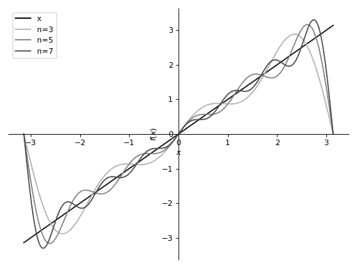
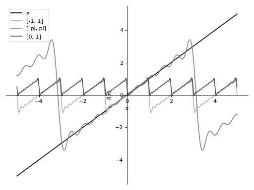

# Fourier 级数

> 原文：[`docs.sympy.org/latest/modules/series/fourier.html`](https://docs.sympy.org/latest/modules/series/fourier.html)

提供计算 Fourier 级数的方法。

```py
class sympy.series.fourier.FourierSeries(*args)
```

表示 Fourier 正弦/余弦级数。

Explanation

此类仅表示 Fourier 级数。不执行任何计算。

如何计算 Fourier 级数，请参见`fourier_series()`的文档字符串。

参见

`sympy.series.fourier.fourier_series`

```py
scale(s)
```

通过与 x 无关的项来缩放函数。

Explanation

f(x) -> s * f(x)

如果已计算出 f(x)的 Fourier 级数，则此方法很快。

Examples

```py
>>> from sympy import fourier_series, pi
>>> from sympy.abc import x
>>> s = fourier_series(x**2, (x, -pi, pi))
>>> s.scale(2).truncate()
-8*cos(x) + 2*cos(2*x) + 2*pi**2/3 
```

```py
scalex(s)
```

通过与 x 无关的项来缩放 x。

Explanation

f(x) -> f(s*x)

如果已计算出 f(x)的 Fourier 级数，则此方法很快。

Examples

```py
>>> from sympy import fourier_series, pi
>>> from sympy.abc import x
>>> s = fourier_series(x**2, (x, -pi, pi))
>>> s.scalex(2).truncate()
-4*cos(2*x) + cos(4*x) + pi**2/3 
```

```py
shift(s)
```

将函数按独立于 x 的项移位。

Explanation

f(x) -> f(x) + s

如果已计算出 f(x)的 Fourier 级数，则此方法很快。

Examples

```py
>>> from sympy import fourier_series, pi
>>> from sympy.abc import x
>>> s = fourier_series(x**2, (x, -pi, pi))
>>> s.shift(1).truncate()
-4*cos(x) + cos(2*x) + 1 + pi**2/3 
```

```py
shiftx(s)
```

通过与 x 无关的项来移位 x。

Explanation

f(x) -> f(x + s)

如果已计算出 f(x)的 Fourier 级数，则此方法很快。

Examples

```py
>>> from sympy import fourier_series, pi
>>> from sympy.abc import x
>>> s = fourier_series(x**2, (x, -pi, pi))
>>> s.shiftx(1).truncate()
-4*cos(x + 1) + cos(2*x + 2) + pi**2/3 
```

```py
sigma_approximation(n=3)
```

返回关于阶数 n 的 Fourier 级数的\(\sigma\)-近似。

参数：

**n** : int

> 在近似中考虑的最高阶数。

返回：

表达式：

> 将函数展开为 Fourier 级数的 Sigma 近似。

Explanation

Sigma 近似调整 Fourier 求和以消除在不连续点处可能发生的吉布斯现象。对于周期为 T 的函数的 sigma-近似级数可以写成

\[s(\theta) = \frac{1}{2} a_0 + \sum _{k=1}^{m-1} \operatorname{sinc} \Bigl( \frac{k}{m} \Bigr) \cdot \left[ a_k \cos \Bigl( \frac{2\pi k}{T} \theta \Bigr) + b_k \sin \Bigl( \frac{2\pi k}{T} \theta \Bigr) \right],\]

其中\(a_0, a_k, b_k, k=1,\ldots,{m-1}\)是标准 Fourier 级数系数，\(\operatorname{sinc} \Bigl( \frac{k}{m} \Bigr)\)是以标准化的\(\operatorname{sinc}\)函数表示的 Lanczos \(\sigma\)因子。

Examples

```py
>>> from sympy import fourier_series, pi
>>> from sympy.abc import x
>>> s = fourier_series(x, (x, -pi, pi))
>>> s.sigma_approximation(4)
2*sin(x)*sinc(pi/4) - 2*sin(2*x)/pi + 2*sin(3*x)*sinc(3*pi/4)/3 
```

Notes

`sigma_approximation()`的行为与`truncate()`不同 - 它获取小于 n 的所有非零项，而不是前 n 个非零项。

参见

`sympy.series.fourier.FourierSeries.truncate`

References

[R830]

[`en.wikipedia.org/wiki/Gibbs_phenomenon`](https://en.wikipedia.org/wiki/Gibbs_phenomenon)

[R831]

[`en.wikipedia.org/wiki/Sigma_approximation`](https://en.wikipedia.org/wiki/Sigma_approximation)

```py
truncate(n=3)
```

返回级数的前 n 个非零项。

如果`n`为 None，则返回一个迭代器。

参数：

**n** : int 或 None

> 近似值的非零项数或无。

返回：

表达式或迭代器：

> 将函数近似展开为傅里叶级数。

示例

```py
>>> from sympy import fourier_series, pi
>>> from sympy.abc import x
>>> s = fourier_series(x, (x, -pi, pi))
>>> s.truncate(4)
2*sin(x) - sin(2*x) + 2*sin(3*x)/3 - sin(4*x)/2 
```

参见

`sympy.series.fourier.FourierSeries.sigma_approximation`

```py
sympy.series.fourier.fourier_series(f, limits=None, finite=True)
```

计算傅里叶三角级数展开。

参数：

**限制**：（sym，start，end），可选

> *sym* 表示计算级数时所使用的符号。
> 
> *start* 和 *end* 表示傅里叶级数收敛到给定函数的区间的起始和结束。
> 
> 默认范围指定为 \(-\pi\) 至 \(\pi\)。

返回：

傅里叶级数

> 表示傅里叶三角级数的符号对象。

解释

定义在区间 \((a, b)\) 上的傅里叶三角级数为：

\[\frac{a_0}{2} + \sum_{n=1}^{\infty} (a_n \cos(\frac{2n \pi x}{L}) + b_n \sin(\frac{2n \pi x}{L}))\]

其系数为：

\[L = b - a\]\[a_0 = \frac{2}{L} \int_{a}^{b}{f(x) dx}\]\[a_n = \frac{2}{L} \int_{a}^{b}{f(x) \cos(\frac{2n \pi x}{L}) dx}\]\[b_n = \frac{2}{L} \int_{a}^{b}{f(x) \sin(\frac{2n \pi x}{L}) dx}\]

函数 \(f(x)\) 是否应周期性地给出的条件超出必要，因为只需考虑系列在给定区间内收敛到 \(f(x)\)，而不是整个实数线上。

这也为计算带来了很多便利，因为您无需通过分段、模运算来人为地使 \(f(x)\) 成为周期函数，而是可以在区间 \((a, b)\) 中塑造函数，使其看起来像期望的周期函数，计算出的级数将自动成为 \(f(x)\) 周期版本的级数。

该属性在下面的示例部分有所说明。

示例

计算 \(f(x) = x²\) 的傅里叶级数：

```py
>>> from sympy import fourier_series, pi
>>> from sympy.abc import x
>>> f = x**2
>>> s = fourier_series(f, (x, -pi, pi))
>>> s1 = s.truncate(n=3)
>>> s1
-4*cos(x) + cos(2*x) + pi**2/3 
```

傅里叶级数的移动：

```py
>>> s.shift(1).truncate()
-4*cos(x) + cos(2*x) + 1 + pi**2/3
>>> s.shiftx(1).truncate()
-4*cos(x + 1) + cos(2*x + 2) + pi**2/3 
```

傅里叶级数的缩放：

```py
>>> s.scale(2).truncate()
-8*cos(x) + 2*cos(2*x) + 2*pi**2/3
>>> s.scalex(2).truncate()
-4*cos(2*x) + cos(4*x) + pi**2/3 
```

计算 \(f(x) = x\) 的傅里叶级数：

这说明了截断到更高阶会有更好的收敛性。

```py
>>> from sympy import fourier_series, pi, plot
>>> from sympy.abc import x
>>> f = x
>>> s = fourier_series(f, (x, -pi, pi))
>>> s1 = s.truncate(n = 3)
>>> s2 = s.truncate(n = 5)
>>> s3 = s.truncate(n = 7)
>>> p = plot(f, s1, s2, s3, (x, -pi, pi), show=False, legend=True) 
```

```py
>>> p[0].line_color = (0, 0, 0)
>>> p[0].label = 'x'
>>> p[1].line_color = (0.7, 0.7, 0.7)
>>> p[1].label = 'n=3'
>>> p[2].line_color = (0.5, 0.5, 0.5)
>>> p[2].label = 'n=5'
>>> p[3].line_color = (0.3, 0.3, 0.3)
>>> p[3].label = 'n=7' 
```

```py
>>> p.show() 
```

（`png`，`hires.png`，`pdf`）



这说明了当指定不同范围时，级数如何收敛到不同的锯齿波。

```py
>>> s1 = fourier_series(x, (x, -1, 1)).truncate(10)
>>> s2 = fourier_series(x, (x, -pi, pi)).truncate(10)
>>> s3 = fourier_series(x, (x, 0, 1)).truncate(10)
>>> p = plot(x, s1, s2, s3, (x, -5, 5), show=False, legend=True) 
```

```py
>>> p[0].line_color = (0, 0, 0)
>>> p[0].label = 'x'
>>> p[1].line_color = (0.7, 0.7, 0.7)
>>> p[1].label = '[-1, 1]'
>>> p[2].line_color = (0.5, 0.5, 0.5)
>>> p[2].label = '[-pi, pi]'
>>> p[3].line_color = (0.3, 0.3, 0.3)
>>> p[3].label = '[0, 1]' 
```

```py
>>> p.show() 
```

（`png`，`hires.png`，`pdf`）



注释

由于计算 an、bn 所需的积分而导致傅里叶级数计算较慢。

通过在已计算的傅里叶级数上使用移位和缩放，而不是重新计算，可以更快地计算函数的傅里叶级数。

例如，如果已知`x**2`的傅里叶级数，则通过移位 `-1` 可以找到`x**2 - 1`的傅里叶级数。

另见

`sympy.series.fourier.FourierSeries`

参考资料

[R832]

[`mathworld.wolfram.com/FourierSeries.html`](https://mathworld.wolfram.com/FourierSeries.html)
