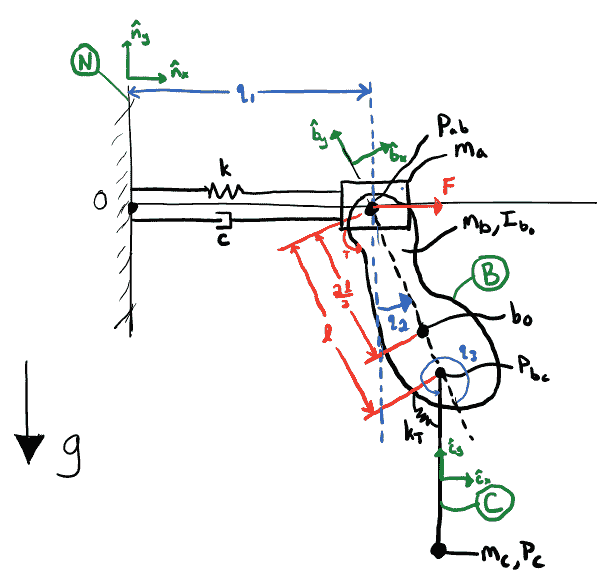

# 多自由度完整约束系统

> 原文：[`docs.sympy.org/latest/modules/physics/mechanics/examples/multi_degree_freedom_holonomic_system.html`](https://docs.sympy.org/latest/modules/physics/mechanics/examples/multi_degree_freedom_holonomic_system.html)

在这个例子中，我们演示了`sympy.physics.mechanics`提供的功能，用于推导包括粒子和刚体的完整约束系统的运动方程（EOM），其中包括贡献的力和扭矩，其中一些是指定的力和扭矩。系统如下图所示：



系统将使用`System`进行建模。首先，我们需要创建`dynamicsymbols()`来描述上述图中显示的系统。在这种情况下，广义坐标\(q_1\)表示块离墙的横向距离，\(q_2\)表示复合摆杆相对垂直的角度，\(q_3\)表示简单摆杆相对复合摆杆的角度。广义速度\(u_1\)表示块的横向速度，\(u_2\)表示复合摆杆的横向速度，\(u_3\)表示 C 相对于 B 的角速度。

我们还创建一些`symbols()`来表示摆杆的长度和质量，以及重力和其他因素。

```py
>>> from sympy import zeros, symbols
>>> from sympy.physics.mechanics import *
>>> q1, q2, q3, u1, u2, u3 = dynamicsymbols('q1, q2, q3, u1, u2, u3')
>>> F, T = dynamicsymbols('F, T')
>>> l, k, c, g, kT = symbols('l, k, c, g, kT')
>>> ma, mb, mc, IBzz= symbols('ma, mb, mc, IBzz') 
```

定义了所有符号后，我们现在可以定义各个物体，并初始化我们的`System`实例。

```py
>>> wall = RigidBody('N')
>>> block = Particle('A', mass=ma)
>>> compound_pend = RigidBody('B', mass=mb)
>>> compound_pend.central_inertia = inertia(compound_pend.frame, 0, 0, IBzz)
>>> simple_pend = Particle('C', mass=mc)
>>> system = System.from_newtonian(wall)
>>> system.add_bodies(block, compound_pend, simple_pend) 
```

接下来，我们使用关节将物体连接起来以建立运动学。请注意，我们为两个粒子指定了中间框架，因为粒子本身没有相关联的框架。

```py
>>> block_frame = ReferenceFrame('A')
>>> block.masscenter.set_vel(block_frame, 0)
>>> slider = PrismaticJoint('J1', wall, block, coordinates=q1, speeds=u1,
...                         child_interframe=block_frame)
>>> rev1 = PinJoint('J2', block, compound_pend, coordinates=q2, speeds=u2,
...                 joint_axis=wall.z, child_point=l*2/3*compound_pend.y,
...                 parent_interframe=block_frame)
>>> simple_pend_frame = ReferenceFrame('C')
>>> simple_pend.masscenter.set_vel(simple_pend_frame, 0)
>>> rev2 = PinJoint('J3', compound_pend, simple_pend, coordinates=q3,
...                 speeds=u3, joint_axis=compound_pend.z,
...                 parent_point=-l/3*compound_pend.y,
...                 child_point=l*simple_pend_frame.y,
...                 child_interframe=simple_pend_frame)

>>> system.add_joints(slider, rev1, rev2) 
```

现在我们可以对物体施加载荷（力和扭矩），重力作用于所有物体，线性弹簧和阻尼器作用于块和墙，旋转线性弹簧作用于 C 相对于 B，指定的扭矩 T 作用于复合摆杆和块，指定的力 F 作用于块。

```py
>>> system.apply_uniform_gravity(-g * wall.y)
>>> system.add_loads(Force(block, F * wall.x))
>>> spring_damper_path = LinearPathway(wall.masscenter, block.masscenter)
>>> system.add_actuators(
...     LinearSpring(k, spring_damper_path),
...     LinearDamper(c, spring_damper_path),
...     TorqueActuator(T, wall.z, compound_pend, wall),
...     TorqueActuator(kT * q3, wall.z, compound_pend, simple_pend_frame),
... ) 
```

系统设置完成后，我们现在可以在后台使用`KanesMethod`来形成运动方程。

```py
>>> system.form_eoms(explicit_kinematics=True)
Matrix([
[                                -c*u1(t) - k*q1(t) + 2*l*mb*u2(t)**2*sin(q2(t))/3 - l*mc*(-sin(q2(t))*sin(q3(t)) + cos(q2(t))*cos(q3(t)))*Derivative(u3(t), t) - l*mc*(-sin(q2(t))*cos(q3(t)) - sin(q3(t))*cos(q2(t)))*(u2(t) + u3(t))**2 + l*mc*u2(t)**2*sin(q2(t)) - (2*l*mb*cos(q2(t))/3 + mc*(l*(-sin(q2(t))*sin(q3(t)) + cos(q2(t))*cos(q3(t))) + l*cos(q2(t))))*Derivative(u2(t), t) - (ma + mb + mc)*Derivative(u1(t), t) + F(t)],
[-2*g*l*mb*sin(q2(t))/3 - g*l*mc*(sin(q2(t))*cos(q3(t)) + sin(q3(t))*cos(q2(t))) - g*l*mc*sin(q2(t)) + l**2*mc*(u2(t) + u3(t))**2*sin(q3(t)) - l**2*mc*u2(t)**2*sin(q3(t)) - mc*(l**2*cos(q3(t)) + l**2)*Derivative(u3(t), t) - (2*l*mb*cos(q2(t))/3 + mc*(l*(-sin(q2(t))*sin(q3(t)) + cos(q2(t))*cos(q3(t))) + l*cos(q2(t))))*Derivative(u1(t), t) - (IBzz + 4*l**2*mb/9 + mc*(2*l**2*cos(q3(t)) + 2*l**2))*Derivative(u2(t), t) + T(t)],
[                                                                                                                                                                        -g*l*mc*(sin(q2(t))*cos(q3(t)) + sin(q3(t))*cos(q2(t))) - kT*q3(t) - l**2*mc*u2(t)**2*sin(q3(t)) - l**2*mc*Derivative(u3(t), t) - l*mc*(-sin(q2(t))*sin(q3(t)) + cos(q2(t))*cos(q3(t)))*Derivative(u1(t), t) - mc*(l**2*cos(q3(t)) + l**2)*Derivative(u2(t), t)]])

>>> system.mass_matrix_full
Matrix([
[1, 0, 0,                                                                                            0,                                                                                            0,                                                     0],
[0, 1, 0,                                                                                            0,                                                                                            0,                                                     0],
[0, 0, 1,                                                                                            0,                                                                                            0,                                                     0],
[0, 0, 0,                                                                                 ma + mb + mc, 2*l*mb*cos(q2(t))/3 + mc*(l*(-sin(q2(t))*sin(q3(t)) + cos(q2(t))*cos(q3(t))) + l*cos(q2(t))), l*mc*(-sin(q2(t))*sin(q3(t)) + cos(q2(t))*cos(q3(t)))],
[0, 0, 0, 2*l*mb*cos(q2(t))/3 + mc*(l*(-sin(q2(t))*sin(q3(t)) + cos(q2(t))*cos(q3(t))) + l*cos(q2(t))),                                         IBzz + 4*l**2*mb/9 + mc*(2*l**2*cos(q3(t)) + 2*l**2),                           mc*(l**2*cos(q3(t)) + l**2)],
[0, 0, 0,                                        l*mc*(-sin(q2(t))*sin(q3(t)) + cos(q2(t))*cos(q3(t))),                                                                  mc*(l**2*cos(q3(t)) + l**2),                                               l**2*mc]])

>>> system.forcing_full
Matrix([
[                                                                                                                                                                           u1(t)],
[                                                                                                                                                                           u2(t)],
[                                                                                                                                                                           u3(t)],
[                  -c*u1(t) - k*q1(t) + 2*l*mb*u2(t)**2*sin(q2(t))/3 - l*mc*(-sin(q2(t))*cos(q3(t)) - sin(q3(t))*cos(q2(t)))*(u2(t) + u3(t))**2 + l*mc*u2(t)**2*sin(q2(t)) + F(t)],
[-2*g*l*mb*sin(q2(t))/3 - g*l*mc*(sin(q2(t))*cos(q3(t)) + sin(q3(t))*cos(q2(t))) - g*l*mc*sin(q2(t)) + l**2*mc*(u2(t) + u3(t))**2*sin(q3(t)) - l**2*mc*u2(t)**2*sin(q3(t)) + T(t)],
[                                                                                -g*l*mc*(sin(q2(t))*cos(q3(t)) + sin(q3(t))*cos(q2(t))) - kT*q3(t) - l**2*mc*u2(t)**2*sin(q3(t))]]) 
```
