# 梁（文档字符串）

> 原文：[`docs.sympy.org/latest/modules/physics/continuum_mechanics/beam.html`](https://docs.sympy.org/latest/modules/physics/continuum_mechanics/beam.html)

该模块可用于解决力学中带有奇性函数的二维梁弯曲问题。

```py
class sympy.physics.continuum_mechanics.beam.Beam(length, elastic_modulus, second_moment, area=A, variable=x, base_char='C')
```

梁是一种通过抵抗弯曲主要承受载荷的结构元素。梁的特征在于其横截面轮廓（截面二阶矩）、长度和材料。

注意

在解决梁弯曲问题时必须使用一致的符号约定；结果将自动遵循所选择的符号约定。然而，所选择的符号约定必须遵守以下规则：在梁轴的正侧（相对于当前截面），给定正剪力的载荷力产生负弯矩，如下所示（弯曲箭头显示正弯矩和旋转）：

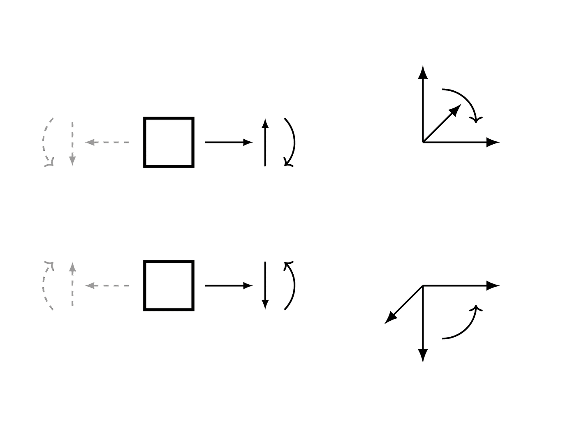

例子

有一根长度为 4 米的梁。从梁的中点到末端施加了一个恒定分布载荷 6 N/m。梁下面有两个简支，一个在起点，另一个在梁的终点。梁的末端受到限制。

使用向下力为正的符号约定。

```py
>>> from sympy.physics.continuum_mechanics.beam import Beam
>>> from sympy import symbols, Piecewise
>>> E, I = symbols('E, I')
>>> R1, R2 = symbols('R1, R2')
>>> b = Beam(4, E, I)
>>> b.apply_load(R1, 0, -1)
>>> b.apply_load(6, 2, 0)
>>> b.apply_load(R2, 4, -1)
>>> b.bc_deflection = [(0, 0), (4, 0)]
>>> b.boundary_conditions
{'deflection': [(0, 0), (4, 0)], 'slope': []}
>>> b.load
R1*SingularityFunction(x, 0, -1) + R2*SingularityFunction(x, 4, -1) + 6*SingularityFunction(x, 2, 0)
>>> b.solve_for_reaction_loads(R1, R2)
>>> b.load
-3*SingularityFunction(x, 0, -1) + 6*SingularityFunction(x, 2, 0) - 9*SingularityFunction(x, 4, -1)
>>> b.shear_force()
3*SingularityFunction(x, 0, 0) - 6*SingularityFunction(x, 2, 1) + 9*SingularityFunction(x, 4, 0)
>>> b.bending_moment()
3*SingularityFunction(x, 0, 1) - 3*SingularityFunction(x, 2, 2) + 9*SingularityFunction(x, 4, 1)
>>> b.slope()
(-3*SingularityFunction(x, 0, 2)/2 + SingularityFunction(x, 2, 3) - 9*SingularityFunction(x, 4, 2)/2 + 7)/(E*I)
>>> b.deflection()
(7*x - SingularityFunction(x, 0, 3)/2 + SingularityFunction(x, 2, 4)/4 - 3*SingularityFunction(x, 4, 3)/2)/(E*I)
>>> b.deflection().rewrite(Piecewise)
(7*x - Piecewise((x**3, x >= 0), (0, True))/2
 - 3*Piecewise(((x - 4)**3, x >= 4), (0, True))/2
 + Piecewise(((x - 2)**4, x >= 2), (0, True))/4)/(E*I) 
```

计算长度为 L 的完全符号梁的支反应。梁下面有两个简支，一个在起点，另一个在梁的终点。梁的末端受到限制。梁上载荷为：

+   一个向下的点载荷 P1，在 L/4 处施加

+   一个向上的点载荷 P2，在 L/8 处施加

+   一个逆时针力矩 M1，在 L/2 处施加

+   一个顺时针力矩 M2，在 3*L/4 处施加

+   一个分布恒定载荷 q1，向下施加，从 L/2 开始到 3*L/4

+   一个分布恒定载荷 q2，向上施加，从 3*L/4 开始到 L

不需要为符号负载做任何假设。但是，定义一个正长度将有助于算法计算解决方案。

```py
>>> E, I = symbols('E, I')
>>> L = symbols("L", positive=True)
>>> P1, P2, M1, M2, q1, q2 = symbols("P1, P2, M1, M2, q1, q2")
>>> R1, R2 = symbols('R1, R2')
>>> b = Beam(L, E, I)
>>> b.apply_load(R1, 0, -1)
>>> b.apply_load(R2, L, -1)
>>> b.apply_load(P1, L/4, -1)
>>> b.apply_load(-P2, L/8, -1)
>>> b.apply_load(M1, L/2, -2)
>>> b.apply_load(-M2, 3*L/4, -2)
>>> b.apply_load(q1, L/2, 0, 3*L/4)
>>> b.apply_load(-q2, 3*L/4, 0, L)
>>> b.bc_deflection = [(0, 0), (L, 0)]
>>> b.solve_for_reaction_loads(R1, R2)
>>> print(b.reaction_loads[R1])
(-3*L**2*q1 + L**2*q2 - 24*L*P1 + 28*L*P2 - 32*M1 + 32*M2)/(32*L)
>>> print(b.reaction_loads[R2])
(-5*L**2*q1 + 7*L**2*q2 - 8*L*P1 + 4*L*P2 + 32*M1 - 32*M2)/(32*L) 
```

```py
property applied_loads
```

返回施加在梁对象上的所有载荷的列表。列表中的每个载荷都是形式为（值，起始，顺序，结束）的元组。

例子

有一根长度为 4 米的梁。在梁的起点以顺时针方向施加了一个大小为 3 Nm 的力矩。从距离起点 2 米处梁顶部施加了大小为 4 N 的点载荷。另一个大小为 5 N 的点载荷在同一位置施加。

```py
>>> from sympy.physics.continuum_mechanics.beam import Beam
>>> from sympy import symbols
>>> E, I = symbols('E, I')
>>> b = Beam(4, E, I)
>>> b.apply_load(-3, 0, -2)
>>> b.apply_load(4, 2, -1)
>>> b.apply_load(5, 2, -1)
>>> b.load
-3*SingularityFunction(x, 0, -2) + 9*SingularityFunction(x, 2, -1)
>>> b.applied_loads
[(-3, 0, -2, None), (4, 2, -1, None), (5, 2, -1, None)] 
```

```py
apply_load(value, start, order, end=None)
```

此方法将所给定的载荷加到特定的梁对象上。

参数：

**value**：可符号化

> 插入的值应具有单位 [Force/(Distance**(n+1)]，其中 n 是施加载荷的顺序。施加载荷的单位：
> 
> > +   对于弯矩，单位 = kN*m
> > +   
> > +   对于点载荷，单位 = kN
> > +   
> > +   对于恒定分布载荷，单位 = kN/m
> > +   
> > +   对于坡道载荷，单位 = kN/m/m
> > +   
> > +   对于抛物线坡道载荷，单位 = kN/m/m/m
> > +   
> > +   … 等等。

**start**：可符号化

> 应用载荷的起始点。对于点力和点力矩，这是应用位置。

**order**：整数

> 应用载荷的顺序。
> 
> > +   对于力矩，order = -2
> > +   
> > +   对于点载荷，order = -1
> > +   
> > +   对于恒定分布载荷，order = 0
> > +   
> > +   对于坡道载荷，order = 1
> > +   
> > +   对于抛物线坡道载荷，order = 2
> > +   
> > +   …等等。

**end**：可符号化，可选

> 如果载荷在梁的长度内有一个端点，则可以使用的可选参数。

示例

有一根长度为 4 米的梁。在梁的起点顺时针方向施加一个大小为 3 Nm 的力矩。从梁的顶部在距起点 2 米处施加一个大小为 4 N 的点载荷，以及在距离梁起点 2 米到 3 米处施加一个大小为 2 N/m 的抛物线坡道载荷。

```py
>>> from sympy.physics.continuum_mechanics.beam import Beam
>>> from sympy import symbols
>>> E, I = symbols('E, I')
>>> b = Beam(4, E, I)
>>> b.apply_load(-3, 0, -2)
>>> b.apply_load(4, 2, -1)
>>> b.apply_load(-2, 2, 2, end=3)
>>> b.load
-3*SingularityFunction(x, 0, -2) + 4*SingularityFunction(x, 2, -1) - 2*SingularityFunction(x, 2, 2) + 2*SingularityFunction(x, 3, 0) + 4*SingularityFunction(x, 3, 1) + 2*SingularityFunction(x, 3, 2) 
```

```py
apply_support(loc, type='fixed')
```

此方法将支持应用于特定的梁对象，并返回未知反应载荷符号。

参数：

**loc**：可符号化的

> 支座应用位置的点位。

**type**：字符串

> 确定应用的梁支座类型。要应用零自由度的支座结构，type = “fixed”；要应用一个自由度的支座结构，type = “pin”；要应用两个自由度的支座结构，type = “roller”

返回：

符号或符号元组

> 未知反应载荷作为符号。- 如果 type = “pin”或“roller”，则为 Symbol(reaction_force)；如果 type = “fixed”，则为 Symbol(reaction_force)，Symbol(reaction_moment)

示例

有一根长度为 20 米的梁。在梁的末端顺时针方向施加一个大小为 100 Nm 的力矩。从梁的顶部在距起点 10 米处施加一个大小为 8 N 的点载荷。在梁的起点有一个固定支座，末端有一个滚动支座。

使用上升力和顺时针力矩为正的符号约定。

```py
>>> from sympy.physics.continuum_mechanics.beam import Beam
>>> from sympy import symbols
>>> E, I = symbols('E, I')
>>> b = Beam(20, E, I)
>>> p0, m0 = b.apply_support(0, 'fixed')
>>> p1 = b.apply_support(20, 'roller')
>>> b.apply_load(-8, 10, -1)
>>> b.apply_load(100, 20, -2)
>>> b.solve_for_reaction_loads(p0, m0, p1)
>>> b.reaction_loads
{M_0: 20, R_0: -2, R_20: 10}
>>> b.reaction_loads[p0]
-2
>>> b.load
20*SingularityFunction(x, 0, -2) - 2*SingularityFunction(x, 0, -1)
- 8*SingularityFunction(x, 10, -1) + 100*SingularityFunction(x, 20, -2)
+ 10*SingularityFunction(x, 20, -1) 
```

```py
property area
```

梁的横截面积。

```py
bending_moment()
```

返回一个 Singularity Function 表达式，表示 Beam 对象的弯矩曲线。

示例

有一根长度为 30 米的梁。在梁的末端顺时针方向施加一个大小为 120 Nm 的力矩。从梁的起点顶部施加一个大小为 8 N 的点载荷。梁下有两个简支。一个在末端，另一个距起点 10 米处。在两个支座处都限制挠度。

使用上升力和顺时针力矩为正的符号约定。

```py
>>> from sympy.physics.continuum_mechanics.beam import Beam
>>> from sympy import symbols
>>> E, I = symbols('E, I')
>>> R1, R2 = symbols('R1, R2')
>>> b = Beam(30, E, I)
>>> b.apply_load(-8, 0, -1)
>>> b.apply_load(R1, 10, -1)
>>> b.apply_load(R2, 30, -1)
>>> b.apply_load(120, 30, -2)
>>> b.bc_deflection = [(10, 0), (30, 0)]
>>> b.solve_for_reaction_loads(R1, R2)
>>> b.bending_moment()
8*SingularityFunction(x, 0, 1) - 6*SingularityFunction(x, 10, 1) - 120*SingularityFunction(x, 30, 0) - 2*SingularityFunction(x, 30, 1) 
```

```py
property boundary_conditions
```

返回应用在梁上的边界条件字典。字典有三个关键词，分别是 moment、slope 和 deflection。每个关键词的值是一个元组列表，每个元组以(location, value)的格式表示边界条件的位置和值。

示例

有一根长度为 4 米的梁。在 0 处的弯矩应为 4，在 4 处应为 0。梁在 0 处的斜率应为 1。挠度在 0 处应为 2。

```py
>>> from sympy.physics.continuum_mechanics.beam import Beam
>>> from sympy import symbols
>>> E, I = symbols('E, I')
>>> b = Beam(4, E, I)
>>> b.bc_deflection = [(0, 2)]
>>> b.bc_slope = [(0, 1)]
>>> b.boundary_conditions
{'deflection': [(0, 2)], 'slope': [(0, 1)]} 
```

这里梁的挠度应在`0`处为`2`。类似地，梁在`0`处的斜率应为`1`。

```py
property cross_section
```

梁的横截面

```py
deflection()
```

返回表示梁弹性曲线或挠度的奇异函数表达式。

示例

有一根长度为 30 米的梁。在梁的末端顺时针方向施加了 120 Nm 大小的弯矩。从梁的起点顶部施加了 8 N 大小的点载荷。梁下方有两个简支。一个在梁的末端，另一个距起点 10 米处。在两个支座处限制挠度。

使用上升力和顺时针力矩为正的符号约定。

```py
>>> from sympy.physics.continuum_mechanics.beam import Beam
>>> from sympy import symbols
>>> E, I = symbols('E, I')
>>> R1, R2 = symbols('R1, R2')
>>> b = Beam(30, E, I)
>>> b.apply_load(-8, 0, -1)
>>> b.apply_load(R1, 10, -1)
>>> b.apply_load(R2, 30, -1)
>>> b.apply_load(120, 30, -2)
>>> b.bc_deflection = [(10, 0), (30, 0)]
>>> b.solve_for_reaction_loads(R1, R2)
>>> b.deflection()
(4000*x/3 - 4*SingularityFunction(x, 0, 3)/3 + SingularityFunction(x, 10, 3)
 + 60*SingularityFunction(x, 30, 2) + SingularityFunction(x, 30, 3)/3 - 12000)/(E*I) 
```

```py
draw(pictorial=True)
```

返回表示梁图的绘图对象。特别是，图表可能包括：

+   梁。

+   垂直黑箭头代表点载荷和支反力（如果已使用`apply_load`方法添加）。

+   圆形箭头表示弯矩。

+   阴影区域表示分布载荷。

+   如果`apply_support`已执行。

+   如果使用`join`方法创建了复合梁，并指定了铰链，它将显示为白色圆盘。

图表显示梁的上侧正载荷和下侧负载荷。如果两个或更多分布载荷沿相同区域的相同方向作用，则函数将将它们相加。

注意

用户在输入载荷值时必须小心。绘图函数假定一种符号约定，用于绘制载荷。给定右手坐标系与 XYZ 坐标，假定梁的长度沿正 X 轴。绘图函数将正载荷（带有 n > -2）识别为沿负 Y 方向作用的载荷和正力矩作用的正 Z 方向。

参数：

**图解**：布尔值（默认=True）

> 设置`pictorial=True`将仅创建梁图的图解（按比例缩放）。另一方面，`pictorial=False`将在图表上创建具有精确尺寸的梁图。

示例

```py
>>> from sympy.physics.continuum_mechanics.beam import Beam
>>> from sympy import symbols
>>> P1, P2, M = symbols('P1, P2, M')
>>> E, I = symbols('E, I')
>>> b = Beam(50, 20, 30)
>>> b.apply_load(-10, 2, -1)
>>> b.apply_load(15, 26, -1)
>>> b.apply_load(P1, 10, -1)
>>> b.apply_load(-P2, 40, -1)
>>> b.apply_load(90, 5, 0, 23)
>>> b.apply_load(10, 30, 1, 50)
>>> b.apply_load(M, 15, -2)
>>> b.apply_load(-M, 30, -2)
>>> p50 = b.apply_support(50, "pin")
>>> p0, m0 = b.apply_support(0, "fixed")
>>> p20 = b.apply_support(20, "roller")
>>> p = b.draw()  
>>> p  
Plot object containing:
[0]: cartesian line: 25*SingularityFunction(x, 5, 0) - 25*SingularityFunction(x, 23, 0)
+ SingularityFunction(x, 30, 1) - 20*SingularityFunction(x, 50, 0)
- SingularityFunction(x, 50, 1) + 5 for x over (0.0, 50.0)
[1]: cartesian line: 5 for x over (0.0, 50.0)
...
>>> p.show() 
```

(`png`, `hires.png`, `pdf`)

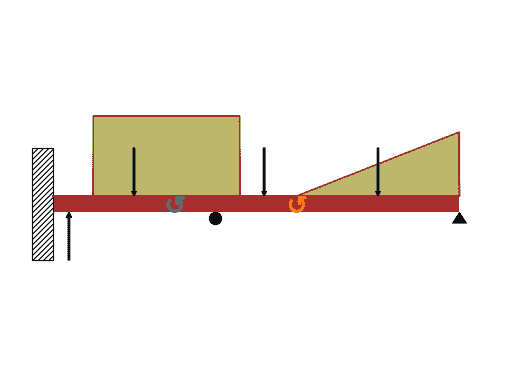

```py
property elastic_modulus
```

杨氏模量的梁。

```py
property ild_moment
```

返回 I.L.D.弯矩方程。

```py
property ild_reactions
```

返回一个字典，表示 I.L.D.反力。

```py
property ild_shear
```

返回 I.L.D.剪切方程。

```py
join(beam, via='fixed')
```

此方法将两个梁连接以形成新的复合梁系统。传递的 Beam 类实例附加到调用对象的右端。此方法可用于形成具有弹性模量或二阶矩不连续值的梁。

参数：

**梁**：Beam 类对象

> 将与调用对象右侧连接的 Beam 对象。

**通过**：字符串

> 说明两个梁对象如何连接 - 对于轴向固定的梁，通过=”fixed” - 对于通过铰链连接的梁，通过=”hinge”

示例

有一根长度为 4 米的悬臂梁。前 2 米的惯性矩为\(1.5*I\)，末端为\(I\)。在自由端施加一个大小为 4 N 的点载荷。

```py
>>> from sympy.physics.continuum_mechanics.beam import Beam
>>> from sympy import symbols
>>> E, I = symbols('E, I')
>>> R1, R2 = symbols('R1, R2')
>>> b1 = Beam(2, E, 1.5*I)
>>> b2 = Beam(2, E, I)
>>> b = b1.join(b2, "fixed")
>>> b.apply_load(20, 4, -1)
>>> b.apply_load(R1, 0, -1)
>>> b.apply_load(R2, 0, -2)
>>> b.bc_slope = [(0, 0)]
>>> b.bc_deflection = [(0, 0)]
>>> b.solve_for_reaction_loads(R1, R2)
>>> b.load
80*SingularityFunction(x, 0, -2) - 20*SingularityFunction(x, 0, -1) + 20*SingularityFunction(x, 4, -1)
>>> b.slope()
(-((-80*SingularityFunction(x, 0, 1) + 10*SingularityFunction(x, 0, 2) - 10*SingularityFunction(x, 4, 2))/I + 120/I)/E + 80.0/(E*I))*SingularityFunction(x, 2, 0)
- 0.666666666666667*(-80*SingularityFunction(x, 0, 1) + 10*SingularityFunction(x, 0, 2) - 10*SingularityFunction(x, 4, 2))*SingularityFunction(x, 0, 0)/(E*I)
+ 0.666666666666667*(-80*SingularityFunction(x, 0, 1) + 10*SingularityFunction(x, 0, 2) - 10*SingularityFunction(x, 4, 2))*SingularityFunction(x, 2, 0)/(E*I) 
```

```py
property length
```

梁的长度。

```py
property load
```

返回表示梁对象载荷分布曲线的奇异函数表达式。

示例

有一根长度为 4 米的梁。在梁的起点顺时针方向施加一个大小为 3 Nm 的弯矩。从梁的起点 2 米处顶部施加一个 4 N 的点载荷，以及从梁的起点 3 米处开始施加大小为 2 N/m 的抛物线坡度载荷。

```py
>>> from sympy.physics.continuum_mechanics.beam import Beam
>>> from sympy import symbols
>>> E, I = symbols('E, I')
>>> b = Beam(4, E, I)
>>> b.apply_load(-3, 0, -2)
>>> b.apply_load(4, 2, -1)
>>> b.apply_load(-2, 3, 2)
>>> b.load
-3*SingularityFunction(x, 0, -2) + 4*SingularityFunction(x, 2, -1) - 2*SingularityFunction(x, 3, 2) 
```

```py
max_bmoment()
```

返回梁对象中最大剪力及其坐标。

```py
max_deflection()
```

返回梁对象中最大挠度点及其对应的挠度值。

```py
max_shear_force()
```

返回梁对象中最大剪力及其坐标。

```py
plot_bending_moment(subs=None)
```

返回梁对象中弯矩曲线的绘图。

参数：

**subs**：字典

> 包含符号作为键和相应值的 Python 字典。

示例

有一根长度为 8 米的梁。从梁的中点到末端施加一个 10 KN/m 的恒定分布载荷。梁下方有两个简支，一个在起点，另一个在终点。此外，从梁顶部距起点 4 米处施加一个 5 KN 的点载荷。取 E = 200 GPa 和 I = 400*(10**-6) 米**4。

使用向下力为正的符号约定。

```py
>>> from sympy.physics.continuum_mechanics.beam import Beam
>>> from sympy import symbols
>>> R1, R2 = symbols('R1, R2')
>>> b = Beam(8, 200*(10**9), 400*(10**-6))
>>> b.apply_load(5000, 2, -1)
>>> b.apply_load(R1, 0, -1)
>>> b.apply_load(R2, 8, -1)
>>> b.apply_load(10000, 4, 0, end=8)
>>> b.bc_deflection = [(0, 0), (8, 0)]
>>> b.solve_for_reaction_loads(R1, R2)
>>> b.plot_bending_moment()
Plot object containing:
[0]: cartesian line: 13750*SingularityFunction(x, 0, 1) - 5000*SingularityFunction(x, 2, 1)
- 5000*SingularityFunction(x, 4, 2) + 31250*SingularityFunction(x, 8, 1)
+ 5000*SingularityFunction(x, 8, 2) for x over (0.0, 8.0) 
```

(`png`, `hires.png`, `pdf`)

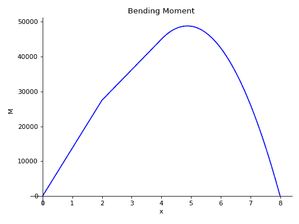

```py
plot_deflection(subs=None)
```

返回梁对象挠曲线的绘图。

参数：

**subs**：字典

> 包含符号作为键和相应值的 Python 字典。

示例

有一根长度为 8 米的梁。从梁的中点到末端施加一个 10 KN/m 的恒定分布载荷。梁下方有两个简支，一个在起点，另一个在终点。此外，从梁顶部距起点 4 米处施加一个 5 KN 的点载荷。取 E = 200 GPa 和 I = 400*(10**-6) 米**4。

使用向下力为正的符号约定。

```py
>>> from sympy.physics.continuum_mechanics.beam import Beam
>>> from sympy import symbols
>>> R1, R2 = symbols('R1, R2')
>>> b = Beam(8, 200*(10**9), 400*(10**-6))
>>> b.apply_load(5000, 2, -1)
>>> b.apply_load(R1, 0, -1)
>>> b.apply_load(R2, 8, -1)
>>> b.apply_load(10000, 4, 0, end=8)
>>> b.bc_deflection = [(0, 0), (8, 0)]
>>> b.solve_for_reaction_loads(R1, R2)
>>> b.plot_deflection()
Plot object containing:
[0]: cartesian line: 0.00138541666666667*x - 2.86458333333333e-5*SingularityFunction(x, 0, 3)
+ 1.04166666666667e-5*SingularityFunction(x, 2, 3) + 5.20833333333333e-6*SingularityFunction(x, 4, 4)
- 6.51041666666667e-5*SingularityFunction(x, 8, 3) - 5.20833333333333e-6*SingularityFunction(x, 8, 4)
for x over (0.0, 8.0) 
```

(`png`, `hires.png`, `pdf`)

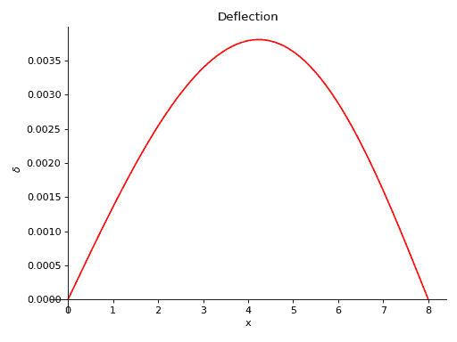

```py
plot_ild_moment(subs=None)
```

在移动载荷的作用下，为弯矩作用线图绘制函数。此函数应在调用 solve_for_ild_moment()后调用。

参数：

**subs**：字典

> 包含符号作为键和相应值的 Python 字典。

示例

有一根长度为 12 米的梁。梁下方有两个简支，一个在起点，另一个在 8 米处。在 1kN 移动载荷的作用下，在距离起点 4 米处的弯矩 I.L.D.作图。

使用下行力的符号约定为正。

```py
>>> from sympy import symbols
>>> from sympy.physics.continuum_mechanics.beam import Beam
>>> E, I = symbols('E, I')
>>> R_0, R_8 = symbols('R_0, R_8')
>>> b = Beam(12, E, I)
>>> p0 = b.apply_support(0, 'roller')
>>> p8 = b.apply_support(8, 'roller')
>>> b.solve_for_ild_reactions(1, R_0, R_8)
>>> b.solve_for_ild_moment(4, 1, R_0, R_8)
>>> b.ild_moment
Piecewise((-x/2, x < 4), (x/2 - 4, x > 4))
>>> b.plot_ild_moment()
Plot object containing:
[0]: cartesian line: Piecewise((-x/2, x < 4), (x/2 - 4, x > 4)) for x over (0.0, 12.0) 
```

(`png`, `hires.png`, `pdf`)

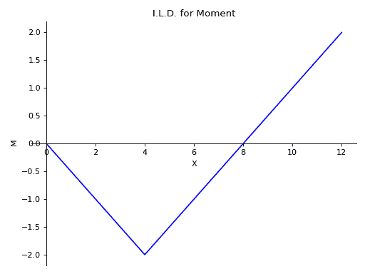

```py
plot_ild_reactions(subs=None)
```

在移动载荷的作用下，为反力作用线图绘制函数。此函数应在调用 solve_for_ild_reactions()后调用。

参数：

**subs**：字典

> 包含符号作为键和相应值的 Python 字典。

示例

有一根长度为 10 米的梁。梁上还施加了一个大小为 5KN 的点载荷，距离起点 4 米处。梁下方有两个简支，一个位于起点，另一个距离起点 7 米处。在 1kN 移动载荷的作用下，在两个支点处的反应作用线方程作图。

使用下行力的符号约定为正。

```py
>>> from sympy import symbols
>>> from sympy.physics.continuum_mechanics.beam import Beam
>>> E, I = symbols('E, I')
>>> R_0, R_7 = symbols('R_0, R_7')
>>> b = Beam(10, E, I)
>>> p0 = b.apply_support(0, 'roller')
>>> p7 = b.apply_support(7, 'roller')
>>> b.apply_load(5,4,-1)
>>> b.solve_for_ild_reactions(1,R_0,R_7)
>>> b.ild_reactions
{R_0: x/7 - 22/7, R_7: -x/7 - 20/7}
>>> b.plot_ild_reactions()
PlotGrid object containing:
Plot[0]:Plot object containing:
[0]: cartesian line: x/7 - 22/7 for x over (0.0, 10.0)
Plot[1]:Plot object containing:
[0]: cartesian line: -x/7 - 20/7 for x over (0.0, 10.0) 
```

(`png`, `hires.png`, `pdf`)

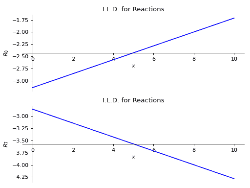

```py
plot_ild_shear(subs=None)
```

在移动载荷的作用下，为剪力作用线图绘制函数。此函数应在调用 solve_for_ild_shear()后调用。

参数：

**subs**：字典

> 包含符号作为键和相应值的 Python 字典。

示例

有一根长度为 12 米的梁。梁下方有两个简支，一个在起点，另一个在 8 米处。在 1kN 移动载荷的作用下，在距离起点 4 米处的剪力 I.L.D.作图。

使用下行力的符号约定为正。

```py
>>> from sympy import symbols
>>> from sympy.physics.continuum_mechanics.beam import Beam
>>> E, I = symbols('E, I')
>>> R_0, R_8 = symbols('R_0, R_8')
>>> b = Beam(12, E, I)
>>> p0 = b.apply_support(0, 'roller')
>>> p8 = b.apply_support(8, 'roller')
>>> b.solve_for_ild_reactions(1, R_0, R_8)
>>> b.solve_for_ild_shear(4, 1, R_0, R_8)
>>> b.ild_shear
Piecewise((x/8, x < 4), (x/8 - 1, x > 4))
>>> b.plot_ild_shear()
Plot object containing:
[0]: cartesian line: Piecewise((x/8, x < 4), (x/8 - 1, x > 4)) for x over (0.0, 12.0) 
```

(`png`, `hires.png`, `pdf`)

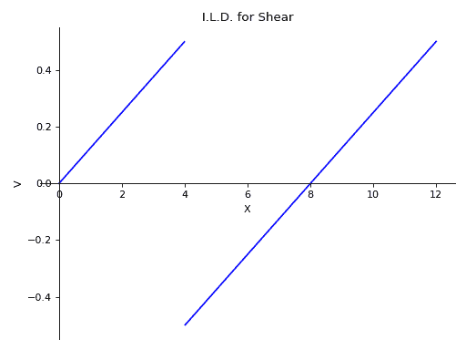

```py
plot_loading_results(subs=None)
```

返回梁对象的剪力、弯矩、斜率和挠度的子图。

参数：

**subs**：字典

> Python 字典包含符号作为键和其对应值。

示例

有一根长度为 8 米的梁。从梁的中点至末端施加均布的 10 千牛每米的恒定分布载荷。梁下有两个简支，一个在起点，另一个在终点。梁顶部还施加了一个距起点 4 米处的大小为 5 千牛的集中力。取 E = 200 GPa 和 I = 400*(10**-6) 米⁴。

使用向下力为正的符号约定。

```py
>>> from sympy.physics.continuum_mechanics.beam import Beam
>>> from sympy import symbols
>>> R1, R2 = symbols('R1, R2')
>>> b = Beam(8, 200*(10**9), 400*(10**-6))
>>> b.apply_load(5000, 2, -1)
>>> b.apply_load(R1, 0, -1)
>>> b.apply_load(R2, 8, -1)
>>> b.apply_load(10000, 4, 0, end=8)
>>> b.bc_deflection = [(0, 0), (8, 0)]
>>> b.solve_for_reaction_loads(R1, R2)
>>> axes = b.plot_loading_results() 
```

(`png`, `hires.png`, `pdf`)

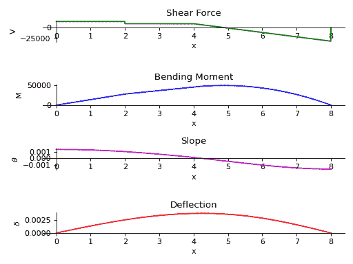

```py
plot_shear_force(subs=None)
```

返回梁对象中存在的剪力图。

参数：

**subs**：字典

> Python 字典包含符号作为键和其对应值。

示例

有一根长度为 8 米的梁。从梁的中点至末端施加均布的 10 千牛每米的恒定分布载荷。梁下有两个简支，一个在起点，另一个在终点。梁顶部还施加了一个距起点 4 米处的大小为 5 千牛的集中力。取 E = 200 GPa 和 I = 400*(10**-6) 米⁴。

使用向下力为正的符号约定。

```py
>>> from sympy.physics.continuum_mechanics.beam import Beam
>>> from sympy import symbols
>>> R1, R2 = symbols('R1, R2')
>>> b = Beam(8, 200*(10**9), 400*(10**-6))
>>> b.apply_load(5000, 2, -1)
>>> b.apply_load(R1, 0, -1)
>>> b.apply_load(R2, 8, -1)
>>> b.apply_load(10000, 4, 0, end=8)
>>> b.bc_deflection = [(0, 0), (8, 0)]
>>> b.solve_for_reaction_loads(R1, R2)
>>> b.plot_shear_force()
Plot object containing:
[0]: cartesian line: 13750*SingularityFunction(x, 0, 0) - 5000*SingularityFunction(x, 2, 0)
- 10000*SingularityFunction(x, 4, 1) + 31250*SingularityFunction(x, 8, 0)
+ 10000*SingularityFunction(x, 8, 1) for x over (0.0, 8.0) 
```

(`png`, `hires.png`, `pdf`)

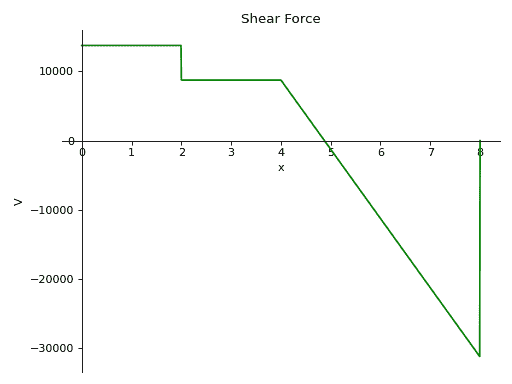

```py
plot_shear_stress(subs=None)
```

返回梁对象中存在的剪切应力图。

参数：

**subs**：字典

> Python 字典包含符号作为键和其对应值。

示例

有一根长度为 8 米、横截面积为 2 平方米的梁。从梁的中点至末端施加均布的 10 千牛每米的恒定分布载荷。梁下有两个简支，一个在起点，另一个在终点。梁顶部还施加了一个距起点 4 米处的大小为 5 千牛的集中力。取 E = 200 GPa 和 I = 400*(10**-6) 米⁴。

使用向下力为正的符号约定。

```py
>>> from sympy.physics.continuum_mechanics.beam import Beam
>>> from sympy import symbols
>>> R1, R2 = symbols('R1, R2')
>>> b = Beam(8, 200*(10**9), 400*(10**-6), 2)
>>> b.apply_load(5000, 2, -1)
>>> b.apply_load(R1, 0, -1)
>>> b.apply_load(R2, 8, -1)
>>> b.apply_load(10000, 4, 0, end=8)
>>> b.bc_deflection = [(0, 0), (8, 0)]
>>> b.solve_for_reaction_loads(R1, R2)
>>> b.plot_shear_stress()
Plot object containing:
[0]: cartesian line: 6875*SingularityFunction(x, 0, 0) - 2500*SingularityFunction(x, 2, 0)
- 5000*SingularityFunction(x, 4, 1) + 15625*SingularityFunction(x, 8, 0)
+ 5000*SingularityFunction(x, 8, 1) for x over (0.0, 8.0) 
```

(`png`, `hires.png`, `pdf`)

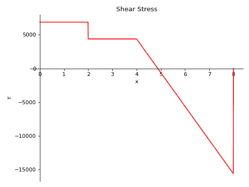

```py
plot_slope(subs=None)
```

返回梁对象挠度曲线的斜率图。

参数：

**subs**：字典

> Python 字典，包含符号作为键和相应值。

示例

有一根长度为 8 米的梁。从梁的中点到末端施加大小为 10 KN/m 的常分布载荷。梁下有两个简支，一个在起点，另一个在梁的末端。从梁顶部距离起点 4 米处施加大小为 5 KN 的点载荷。取 E = 200 GPa 和 I = 400*(10**-6) 米的四次方。

使用向下力为正的符号约定。

```py
>>> from sympy.physics.continuum_mechanics.beam import Beam
>>> from sympy import symbols
>>> R1, R2 = symbols('R1, R2')
>>> b = Beam(8, 200*(10**9), 400*(10**-6))
>>> b.apply_load(5000, 2, -1)
>>> b.apply_load(R1, 0, -1)
>>> b.apply_load(R2, 8, -1)
>>> b.apply_load(10000, 4, 0, end=8)
>>> b.bc_deflection = [(0, 0), (8, 0)]
>>> b.solve_for_reaction_loads(R1, R2)
>>> b.plot_slope()
Plot object containing:
[0]: cartesian line: -8.59375e-5*SingularityFunction(x, 0, 2) + 3.125e-5*SingularityFunction(x, 2, 2)
+ 2.08333333333333e-5*SingularityFunction(x, 4, 3) - 0.0001953125*SingularityFunction(x, 8, 2)
- 2.08333333333333e-5*SingularityFunction(x, 8, 3) + 0.00138541666666667 for x over (0.0, 8.0) 
```

(`png`, `hires.png`, `pdf`)

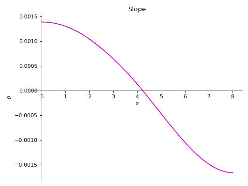

```py
point_cflexure()
```

返回具有零弯矩的点集，并且梁对象的弯矩曲线从负变为正或反之亦然。

示例

有一个长度为 10 米的悬臂梁。梁下方有两个简支。一个在起点，另一个距离起点 6 米处。点载荷大小分别为 10KN 和 20KN 施加在距离起点 2 米和 4 米处。还有一个均匀分布载荷，从距离起点 6 米处开始，大小为 3KN/m。使用向上力和顺时针力矩为正的符号约定。

```py
>>> from sympy.physics.continuum_mechanics.beam import Beam
>>> from sympy import symbols
>>> E, I = symbols('E, I')
>>> b = Beam(10, E, I)
>>> b.apply_load(-4, 0, -1)
>>> b.apply_load(-46, 6, -1)
>>> b.apply_load(10, 2, -1)
>>> b.apply_load(20, 4, -1)
>>> b.apply_load(3, 6, 0)
>>> b.point_cflexure()
[10/3] 
```

```py
property reaction_loads
```

返回字典中的反应力。

```py
remove_load(value, start, order, end=None)
```

此方法移除梁对象上的特定负载。如果传递的负载作为参数不在梁上，则返回一个 ValueError。

参数：

**值**：可符号化

> 应用载荷的大小。

**开始**：可符号化

> 应用载荷的起始点。对于点力矩和点力，这是应用位置。

**顺序**：整数

> 应用载荷的顺序。- 对于力矩，顺序= -2 - 对于点载荷，顺序= -1 - 对于恒定分布载荷，顺序= 0 - 对于斜坡载荷，顺序= 1 - 对于抛物线斜坡载荷，顺序= 2 - ... 依此类推。

**结束**：可符号化，可选

> 如果负载在梁的长度内有一个端点，可以使用可选参数。

示例

有一根长度为 4 米的梁。以顺时针方向在梁的起点施加大小为 3 Nm 的力矩。从梁顶部距离起点 2 米处施加大小为 4 N 的点载荷，以及从梁下方施加的大小为 2 N/m 的抛物线斜坡载荷，从距离梁起点 3 米处开始，一直延伸到 2 米处。

```py
>>> from sympy.physics.continuum_mechanics.beam import Beam
>>> from sympy import symbols
>>> E, I = symbols('E, I')
>>> b = Beam(4, E, I)
>>> b.apply_load(-3, 0, -2)
>>> b.apply_load(4, 2, -1)
>>> b.apply_load(-2, 2, 2, end=3)
>>> b.load
-3*SingularityFunction(x, 0, -2) + 4*SingularityFunction(x, 2, -1) - 2*SingularityFunction(x, 2, 2) + 2*SingularityFunction(x, 3, 0) + 4*SingularityFunction(x, 3, 1) + 2*SingularityFunction(x, 3, 2)
>>> b.remove_load(-2, 2, 2, end = 3)
>>> b.load
-3*SingularityFunction(x, 0, -2) + 4*SingularityFunction(x, 2, -1) 
```

```py
property second_moment
```

梁的截面二阶矩。

```py
shear_force()
```

返回表示梁对象的剪力曲线的奇异函数表达式。

示例

长度为 30 米的梁上施加了 120 Nm 的顺时针方向力矩。起始点上从梁顶施加了 8 N 的点载荷。梁下有两个简支，一个在末端，另一个距起点 10 米处。在两个支座处都限制了挠度。

使用向上力和顺时针力矩为正的符号约定。

```py
>>> from sympy.physics.continuum_mechanics.beam import Beam
>>> from sympy import symbols
>>> E, I = symbols('E, I')
>>> R1, R2 = symbols('R1, R2')
>>> b = Beam(30, E, I)
>>> b.apply_load(-8, 0, -1)
>>> b.apply_load(R1, 10, -1)
>>> b.apply_load(R2, 30, -1)
>>> b.apply_load(120, 30, -2)
>>> b.bc_deflection = [(10, 0), (30, 0)]
>>> b.solve_for_reaction_loads(R1, R2)
>>> b.shear_force()
8*SingularityFunction(x, 0, 0) - 6*SingularityFunction(x, 10, 0) - 120*SingularityFunction(x, 30, -1) - 2*SingularityFunction(x, 30, 0) 
```

```py
shear_stress()
```

返回表示梁对象的剪切应力曲线的表达式。

```py
slope()
```

返回一个表示梁对象弹性曲线斜率的奇异函数表达式。

示例

长度为 30 米的梁上施加了 120 Nm 的顺时针方向力矩。起始点上从梁顶施加了 8 N 的点载荷。梁下有两个简支，一个在末端，另一个距起点 10 米处。在两个支座处都限制了挠度。

使用向上力和顺时针力矩为正的符号约定。

```py
>>> from sympy.physics.continuum_mechanics.beam import Beam
>>> from sympy import symbols
>>> E, I = symbols('E, I')
>>> R1, R2 = symbols('R1, R2')
>>> b = Beam(30, E, I)
>>> b.apply_load(-8, 0, -1)
>>> b.apply_load(R1, 10, -1)
>>> b.apply_load(R2, 30, -1)
>>> b.apply_load(120, 30, -2)
>>> b.bc_deflection = [(10, 0), (30, 0)]
>>> b.solve_for_reaction_loads(R1, R2)
>>> b.slope()
(-4*SingularityFunction(x, 0, 2) + 3*SingularityFunction(x, 10, 2)
 + 120*SingularityFunction(x, 30, 1) + SingularityFunction(x, 30, 2) + 4000/3)/(E*I) 
```

```py
solve_for_ild_moment(distance, value, *reactions)
```

确定受移动载荷影响下特定点处弯矩影响线图方程。

参数：

**距离**：整数

> 点距离梁起点的距离，用于确定方程。

**数值**：整数

> 移动载荷的大小

**反力：**

> 施加在梁上的反力。

示例

长度为 12 米的梁。梁下有两个简支，一个在起点，另一个在距离 8 米处。计算在 1kN 移动载荷作用下，距离 4 米处的弯矩的 I.L.D.方程。

使用向下力为正的符号约定。

```py
>>> from sympy import symbols
>>> from sympy.physics.continuum_mechanics.beam import Beam
>>> E, I = symbols('E, I')
>>> R_0, R_8 = symbols('R_0, R_8')
>>> b = Beam(12, E, I)
>>> p0 = b.apply_support(0, 'roller')
>>> p8 = b.apply_support(8, 'roller')
>>> b.solve_for_ild_reactions(1, R_0, R_8)
>>> b.solve_for_ild_moment(4, 1, R_0, R_8)
>>> b.ild_moment
Piecewise((-x/2, x < 4), (x/2 - 4, x > 4)) 
```

```py
solve_for_ild_reactions(value, *reactions)
```

确定受移动载荷影响下特定点处反力影响线图方程。

参数：

**数值**：整数

> 移动载荷的大小

**反力：**

> 施加在梁上的反力。

示例

长度为 10 米的梁。梁下有两个简支，一个在起点，另一个在梁的末端。计算在 1kN 移动载荷作用下的反力的 I.L.D.方程。

使用向下力为正的符号约定。

```py
>>> from sympy import symbols
>>> from sympy.physics.continuum_mechanics.beam import Beam
>>> E, I = symbols('E, I')
>>> R_0, R_10 = symbols('R_0, R_10')
>>> b = Beam(10, E, I)
>>> p0 = b.apply_support(0, 'roller')
>>> p10 = b.apply_support(10, 'roller')
>>> b.solve_for_ild_reactions(1,R_0,R_10)
>>> b.ild_reactions
{R_0: x/10 - 1, R_10: -x/10} 
```

```py
solve_for_ild_shear(distance, value, *reactions)
```

确定受移动载荷影响下特定点处剪力影响线图方程。

参数：

**距离**：整数

> 点距离梁起点的距离，用于确定方程。

**数值**：整数

> 移动载荷的大小

**反力：**

> 施加在梁上的反力。

示例

长度为 12 米的梁。梁下有两个简支，一个在起点，另一个在距离 8 米处。计算在 1kN 移动载荷作用下，距离 4 米处的剪力的 I.L.D.方程。

使用向下力为正的符号约定。

```py
>>> from sympy import symbols
>>> from sympy.physics.continuum_mechanics.beam import Beam
>>> E, I = symbols('E, I')
>>> R_0, R_8 = symbols('R_0, R_8')
>>> b = Beam(12, E, I)
>>> p0 = b.apply_support(0, 'roller')
>>> p8 = b.apply_support(8, 'roller')
>>> b.solve_for_ild_reactions(1, R_0, R_8)
>>> b.solve_for_ild_shear(4, 1, R_0, R_8)
>>> b.ild_shear
Piecewise((x/8, x < 4), (x/8 - 1, x > 4)) 
```

```py
solve_for_reaction_loads(*reactions)
```

解算反力。

示例

一根长度为 30 米的梁。在梁的末端以顺时针方向施加了 120 Nm 的力矩。从梁的起点顶部施加了 8 N 的点载荷。梁下方有两个简支点。一个在末端，另一个距离起点 10 米处。在两个支点处梁的挠度被限制。

使用向上力和顺时针力矩为正的符号约定。

```py
>>> from sympy.physics.continuum_mechanics.beam import Beam
>>> from sympy import symbols
>>> E, I = symbols('E, I')
>>> R1, R2 = symbols('R1, R2')
>>> b = Beam(30, E, I)
>>> b.apply_load(-8, 0, -1)
>>> b.apply_load(R1, 10, -1)  # Reaction force at x = 10
>>> b.apply_load(R2, 30, -1)  # Reaction force at x = 30
>>> b.apply_load(120, 30, -2)
>>> b.bc_deflection = [(10, 0), (30, 0)]
>>> b.load
R1*SingularityFunction(x, 10, -1) + R2*SingularityFunction(x, 30, -1)
 - 8*SingularityFunction(x, 0, -1) + 120*SingularityFunction(x, 30, -2)
>>> b.solve_for_reaction_loads(R1, R2)
>>> b.reaction_loads
{R1: 6, R2: 2}
>>> b.load
-8*SingularityFunction(x, 0, -1) + 6*SingularityFunction(x, 10, -1)
 + 120*SingularityFunction(x, 30, -2) + 2*SingularityFunction(x, 30, -1) 
```

```py
property variable
```

一个符号，可用作沿梁长度表示载荷分布、剪力曲线、弯矩、斜率曲线和挠度曲线的变量。默认情况下设置为`Symbol('x')`，但此属性可变。

示例

```py
>>> from sympy.physics.continuum_mechanics.beam import Beam
>>> from sympy import symbols
>>> E, I, A = symbols('E, I, A')
>>> x, y, z = symbols('x, y, z')
>>> b = Beam(4, E, I)
>>> b.variable
x
>>> b.variable = y
>>> b.variable
y
>>> b = Beam(4, E, I, A, z)
>>> b.variable
z 
```

```py
class sympy.physics.continuum_mechanics.beam.Beam3D(length, elastic_modulus, shear_modulus, second_moment, area, variable=x)
```

此类处理施加在 3D 空间任意方向的载荷，以及不同轴向的二阶矩值不等的情况。

注意

在解决梁弯曲问题时必须使用一致的符号约定；结果将自动遵循所选择的符号约定。此类假设任何类型的分布载荷/力矩都施加在梁的跨度上。

示例

一根长度为 l 米的梁。从起点到梁末端沿 y 轴施加了大小为 q 的恒定分布载荷。从起点到梁末端沿 z 轴施加了大小为 m 的恒定分布力矩。梁在两端固定，因此两端的挠度被限制。

```py
>>> from sympy.physics.continuum_mechanics.beam import Beam3D
>>> from sympy import symbols, simplify, collect, factor
>>> l, E, G, I, A = symbols('l, E, G, I, A')
>>> b = Beam3D(l, E, G, I, A)
>>> x, q, m = symbols('x, q, m')
>>> b.apply_load(q, 0, 0, dir="y")
>>> b.apply_moment_load(m, 0, -1, dir="z")
>>> b.shear_force()
[0, -q*x, 0]
>>> b.bending_moment()
[0, 0, -m*x + q*x**2/2]
>>> b.bc_slope = [(0, [0, 0, 0]), (l, [0, 0, 0])]
>>> b.bc_deflection = [(0, [0, 0, 0]), (l, [0, 0, 0])]
>>> b.solve_slope_deflection()
>>> factor(b.slope())
[0, 0, x*(-l + x)*(-A*G*l**3*q + 2*A*G*l**2*q*x - 12*E*I*l*q
 - 72*E*I*m + 24*E*I*q*x)/(12*E*I*(A*G*l**2 + 12*E*I))]
>>> dx, dy, dz = b.deflection()
>>> dy = collect(simplify(dy), x)
>>> dx == dz == 0
True
>>> dy == (x*(12*E*I*l*(A*G*l**2*q - 2*A*G*l*m + 12*E*I*q)
... + x*(A*G*l*(3*l*(A*G*l**2*q - 2*A*G*l*m + 12*E*I*q) + x*(-2*A*G*l**2*q + 4*A*G*l*m - 24*E*I*q))
... + A*G*(A*G*l**2 + 12*E*I)*(-2*l**2*q + 6*l*m - 4*m*x + q*x**2)
... - 12*E*I*q*(A*G*l**2 + 12*E*I)))/(24*A*E*G*I*(A*G*l**2 + 12*E*I)))
True 
```

参考资料

[R729]

[`homes.civil.aau.dk/jc/FemteSemester/Beams3D.pdf`](https://homes.civil.aau.dk/jc/FemteSemester/Beams3D.pdf)

```py
angular_deflection()
```

返回 x 的函数，描述由梁上 x 轴上的力矩引起的角偏转如何随 x 变化。

```py
apply_load(value, start, order, dir='y')
```

此方法将力载荷添加到特定的梁对象上。

参数：

**value** : 可用 SymPy 处理的类型

> 施加载荷的大小。

**dir** : 字符串

> 施加载荷的轴线。

**order** : 整数

> 施加载荷的顺序。- 对于点载荷，order=-1 - 对于恒定分布载荷，order=0 - 对于斜坡载荷，order=1 - 对于抛物线斜坡载荷，order=2 - ...以此类推。

```py
apply_moment_load(value, start, order, dir='y')
```

此方法将力矩载荷添加到特定的梁对象上。

参数：

**value** : 可用 SymPy 处理的类型

> 施加力矩的大小。

**dir** : 字符串

> 施加力矩的轴线。

**order** : 整数

> 施加载荷的顺序。- 对于点力矩，order=-2 - 对于恒定分布力矩，order=-1 - 对于斜坡力矩，order=0 - 对于抛物线斜坡力矩，order=1 - ...以此类推。

```py
property area
```

梁的横截面积。

```py
axial_force()
```

返回梁对象内部的轴向剪力表达式。

```py
axial_stress()
```

返回梁对象内部轴向应力的表达式。

```py
bending_moment()
```

返回三个表达式的列表，表示梁对象沿三个轴的弯矩曲线。

```py
property boundary_conditions
```

返回一个包含梁上应用的边界条件字典。字典有两个关键字，即斜率和挠度。每个关键字的值是一个元组列表，每个元组包含格式为（位置，值）的边界条件的位置和值。进一步，每个值都是对应于该位置处三个轴上的斜率或挠度值的列表。

示例

有一根长度为 4 米的梁。在 x 轴上，起点处的斜率应为 4，其他轴上为 0。在梁的另一端，沿着所有三个轴的挠度应为零。

```py
>>> from sympy.physics.continuum_mechanics.beam import Beam3D
>>> from sympy import symbols
>>> l, E, G, I, A, x = symbols('l, E, G, I, A, x')
>>> b = Beam3D(30, E, G, I, A, x)
>>> b.bc_slope = [(0, (4, 0, 0))]
>>> b.bc_deflection = [(4, [0, 0, 0])]
>>> b.boundary_conditions
{'deflection': [(4, [0, 0, 0])], 'slope': [(0, (4, 0, 0))]} 
```

在这里，梁的挠度应在`4`处沿着所有三个轴为`0`。类似地，梁在`0`处沿 x 轴的斜率应为`4`，y 轴和 z 轴为`0`。

```py
deflection()
```

返回一个表示梁上挠曲线的三元素列表。

```py
property load_vector
```

返回一个包含载荷向量的三元素列表。

```py
max_bending_moment()
```

返回梁对象中所有方向上最大弯矩点及其对应的弯矩值，作为列表。必须在使用此函数之前调用 solve_for_reaction_loads()。

示例

有一根长度为 20 米的梁。两端支承于滚轮上。沿 y 轴施加斜率为 12 的线性载荷。沿 z 轴从起点到终点施加 15N 的恒定分布载荷。

```py
>>> from sympy.physics.continuum_mechanics.beam import Beam3D
>>> from sympy import symbols
>>> l, E, G, I, A, x = symbols('l, E, G, I, A, x')
>>> b = Beam3D(20, 40, 21, 100, 25, x)
>>> b.apply_load(15, start=0, order=0, dir="z")
>>> b.apply_load(12*x, start=0, order=0, dir="y")
>>> b.bc_deflection = [(0, [0, 0, 0]), (20, [0, 0, 0])]
>>> R1, R2, R3, R4 = symbols('R1, R2, R3, R4')
>>> b.apply_load(R1, start=0, order=-1, dir="z")
>>> b.apply_load(R2, start=20, order=-1, dir="z")
>>> b.apply_load(R3, start=0, order=-1, dir="y")
>>> b.apply_load(R4, start=20, order=-1, dir="y")
>>> b.solve_for_reaction_loads(R1, R2, R3, R4)
>>> b.max_bending_moment()
[(0, 0), (20, 3000), (20, 16000)] 
```

```py
max_bmoment()
```

返回梁对象中所有方向上最大弯矩点及其对应的弯矩值，作为列表。必须在使用此函数之前调用 solve_for_reaction_loads()。

示例

有一根长度为 20 米的梁。两端支承于滚轮上。沿 y 轴施加斜率为 12 的线性载荷。沿 z 轴从起点到终点施加 15N 的恒定分布载荷。

```py
>>> from sympy.physics.continuum_mechanics.beam import Beam3D
>>> from sympy import symbols
>>> l, E, G, I, A, x = symbols('l, E, G, I, A, x')
>>> b = Beam3D(20, 40, 21, 100, 25, x)
>>> b.apply_load(15, start=0, order=0, dir="z")
>>> b.apply_load(12*x, start=0, order=0, dir="y")
>>> b.bc_deflection = [(0, [0, 0, 0]), (20, [0, 0, 0])]
>>> R1, R2, R3, R4 = symbols('R1, R2, R3, R4')
>>> b.apply_load(R1, start=0, order=-1, dir="z")
>>> b.apply_load(R2, start=20, order=-1, dir="z")
>>> b.apply_load(R3, start=0, order=-1, dir="y")
>>> b.apply_load(R4, start=20, order=-1, dir="y")
>>> b.solve_for_reaction_loads(R1, R2, R3, R4)
>>> b.max_bending_moment()
[(0, 0), (20, 3000), (20, 16000)] 
```

```py
max_deflection()
```

返回梁对象中所有方向上最大挠度点及其对应的挠度值，作为列表。必须在使用此函数之前调用 solve_for_reaction_loads()和 solve_slope_deflection()。

示例

有一根长度为 20 米的梁。两端支承于滚轮上。沿 y 轴施加斜率为 12 的线性载荷。沿 z 轴从起点到终点施加 15N 的恒定分布载荷。

```py
>>> from sympy.physics.continuum_mechanics.beam import Beam3D
>>> from sympy import symbols
>>> l, E, G, I, A, x = symbols('l, E, G, I, A, x')
>>> b = Beam3D(20, 40, 21, 100, 25, x)
>>> b.apply_load(15, start=0, order=0, dir="z")
>>> b.apply_load(12*x, start=0, order=0, dir="y")
>>> b.bc_deflection = [(0, [0, 0, 0]), (20, [0, 0, 0])]
>>> R1, R2, R3, R4 = symbols('R1, R2, R3, R4')
>>> b.apply_load(R1, start=0, order=-1, dir="z")
>>> b.apply_load(R2, start=20, order=-1, dir="z")
>>> b.apply_load(R3, start=0, order=-1, dir="y")
>>> b.apply_load(R4, start=20, order=-1, dir="y")
>>> b.solve_for_reaction_loads(R1, R2, R3, R4)
>>> b.solve_slope_deflection()
>>> b.max_deflection()
[(0, 0), (10, 495/14), (-10 + 10*sqrt(10793)/43, (10 - 10*sqrt(10793)/43)**3/160 - 20/7 + (10 - 10*sqrt(10793)/43)**4/6400 + 20*sqrt(10793)/301 + 27*(10 - 10*sqrt(10793)/43)**2/560)] 
```

```py
max_shear_force()
```

返回梁对象中所有方向上最大剪力点及其对应的剪力值，作为列表。必须在使用此函数之前调用 solve_for_reaction_loads()。

示例

有一根长度为 20 米的梁。两端支承于滚轮上。沿 y 轴施加斜率为 12 的线性载荷。沿 z 轴从起点到终点施加 15N 的恒定分布载荷。

```py
>>> from sympy.physics.continuum_mechanics.beam import Beam3D
>>> from sympy import symbols
>>> l, E, G, I, A, x = symbols('l, E, G, I, A, x')
>>> b = Beam3D(20, 40, 21, 100, 25, x)
>>> b.apply_load(15, start=0, order=0, dir="z")
>>> b.apply_load(12*x, start=0, order=0, dir="y")
>>> b.bc_deflection = [(0, [0, 0, 0]), (20, [0, 0, 0])]
>>> R1, R2, R3, R4 = symbols('R1, R2, R3, R4')
>>> b.apply_load(R1, start=0, order=-1, dir="z")
>>> b.apply_load(R2, start=20, order=-1, dir="z")
>>> b.apply_load(R3, start=0, order=-1, dir="y")
>>> b.apply_load(R4, start=20, order=-1, dir="y")
>>> b.solve_for_reaction_loads(R1, R2, R3, R4)
>>> b.max_shear_force()
[(0, 0), (20, 2400), (20, 300)] 
```

```py
property moment_load_vector
```

返回一个表示梁上弯矩载荷的三元素列表。

```py
plot_bending_moment(dir='all', subs=None)
```

返回一个图表，显示梁对象中所有三个方向的弯矩。

参数：

**dir** ：字符串（默认

> 需要绘制弯矩图的方向。如果未指定方向，则显示所有图。

**subs** : dictionary

> 包含符号及其对应值的 Python 字典。

示例

一根长度为 20 米的梁。两端支承有滚轮。沿 y 轴施加斜率为 12 的线性载荷。从起点到终点沿 z 轴施加 15N 的恒定分布载荷。

```py
>>> from sympy.physics.continuum_mechanics.beam import Beam3D
>>> from sympy import symbols
>>> l, E, G, I, A, x = symbols('l, E, G, I, A, x')
>>> b = Beam3D(20, E, G, I, A, x)
>>> b.apply_load(15, start=0, order=0, dir="z")
>>> b.apply_load(12*x, start=0, order=0, dir="y")
>>> b.bc_deflection = [(0, [0, 0, 0]), (20, [0, 0, 0])]
>>> R1, R2, R3, R4 = symbols('R1, R2, R3, R4')
>>> b.apply_load(R1, start=0, order=-1, dir="z")
>>> b.apply_load(R2, start=20, order=-1, dir="z")
>>> b.apply_load(R3, start=0, order=-1, dir="y")
>>> b.apply_load(R4, start=20, order=-1, dir="y")
>>> b.solve_for_reaction_loads(R1, R2, R3, R4)
>>> b.plot_bending_moment()
PlotGrid object containing:
Plot[0]:Plot object containing:
[0]: cartesian line: 0 for x over (0.0, 20.0)
Plot[1]:Plot object containing:
[0]: cartesian line: -15*x**2/2 for x over (0.0, 20.0)
Plot[2]:Plot object containing:
[0]: cartesian line: 2*x**3 for x over (0.0, 20.0) 
```

(`png`, `hires.png`, `pdf`)

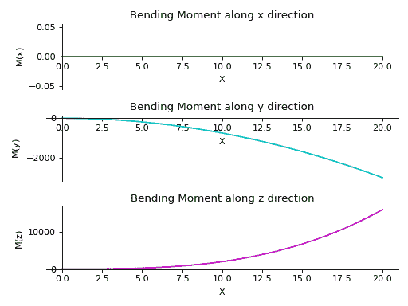

```py
plot_deflection(dir='all', subs=None)
```

返回 Beam 对象中所有三个方向的挠曲图。

参数：

**dir** : string (default

> 需要绘制挠曲图的方向。如果未指定方向，则显示所有图。

**subs** : dictionary

> 包含符号及其对应值的 Python 字典。

示例

一根长度为 20 米的梁。两端支承有滚轮。沿 y 轴施加斜率为 12 的线性载荷。从起点到终点沿 z 轴施加 15N 的恒定分布载荷。

```py
>>> from sympy.physics.continuum_mechanics.beam import Beam3D
>>> from sympy import symbols
>>> l, E, G, I, A, x = symbols('l, E, G, I, A, x')
>>> b = Beam3D(20, 40, 21, 100, 25, x)
>>> b.apply_load(15, start=0, order=0, dir="z")
>>> b.apply_load(12*x, start=0, order=0, dir="y")
>>> b.bc_deflection = [(0, [0, 0, 0]), (20, [0, 0, 0])]
>>> R1, R2, R3, R4 = symbols('R1, R2, R3, R4')
>>> b.apply_load(R1, start=0, order=-1, dir="z")
>>> b.apply_load(R2, start=20, order=-1, dir="z")
>>> b.apply_load(R3, start=0, order=-1, dir="y")
>>> b.apply_load(R4, start=20, order=-1, dir="y")
>>> b.solve_for_reaction_loads(R1, R2, R3, R4)
>>> b.solve_slope_deflection()
>>> b.plot_deflection()
PlotGrid object containing:
Plot[0]:Plot object containing:
[0]: cartesian line: 0 for x over (0.0, 20.0)
Plot[1]:Plot object containing:
[0]: cartesian line: x**5/40000 - 4013*x**3/90300 + 26*x**2/43 + 1520*x/903 for x over (0.0, 20.0)
Plot[2]:Plot object containing:
[0]: cartesian line: x**4/6400 - x**3/160 + 27*x**2/560 + 2*x/7 for x over (0.0, 20.0) 
```

(`png`, `hires.png`, `pdf`)

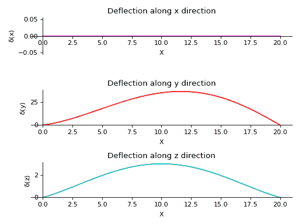

```py
plot_loading_results(dir='x', subs=None)
```

返回 Beam 对象沿指定方向的剪力、弯矩、斜率和挠曲的子图。

参数：

**dir** : string (default

> 需要绘制的方向。如果未指定方向，则显示沿 x 轴的图。

**subs** : dictionary

> 包含符号及其对应值的 Python 字典。

示例

一根长度为 20 米的梁。两端支承有滚轮。沿 y 轴施加斜率为 12 的线性载荷。从起点到终点沿 z 轴施加 15N 的恒定分布载荷。

```py
>>> from sympy.physics.continuum_mechanics.beam import Beam3D
>>> from sympy import symbols
>>> l, E, G, I, A, x = symbols('l, E, G, I, A, x')
>>> b = Beam3D(20, E, G, I, A, x)
>>> subs = {E:40, G:21, I:100, A:25}
>>> b.apply_load(15, start=0, order=0, dir="z")
>>> b.apply_load(12*x, start=0, order=0, dir="y")
>>> b.bc_deflection = [(0, [0, 0, 0]), (20, [0, 0, 0])]
>>> R1, R2, R3, R4 = symbols('R1, R2, R3, R4')
>>> b.apply_load(R1, start=0, order=-1, dir="z")
>>> b.apply_load(R2, start=20, order=-1, dir="z")
>>> b.apply_load(R3, start=0, order=-1, dir="y")
>>> b.apply_load(R4, start=20, order=-1, dir="y")
>>> b.solve_for_reaction_loads(R1, R2, R3, R4)
>>> b.solve_slope_deflection()
>>> b.plot_loading_results('y',subs)
PlotGrid object containing:
Plot[0]:Plot object containing:
[0]: cartesian line: -6*x**2 for x over (0.0, 20.0)
Plot[1]:Plot object containing:
[0]: cartesian line: -15*x**2/2 for x over (0.0, 20.0)
Plot[2]:Plot object containing:
[0]: cartesian line: -x**3/1600 + 3*x**2/160 - x/8 for x over (0.0, 20.0)
Plot[3]:Plot object containing:
[0]: cartesian line: x**5/40000 - 4013*x**3/90300 + 26*x**2/43 + 1520*x/903 for x over (0.0, 20.0) 
```

(`png`, `hires.png`, `pdf`)

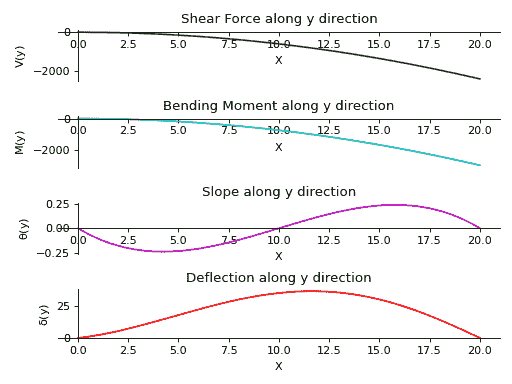

```py
plot_shear_force(dir='all', subs=None)
```

返回 Beam 对象中所有三个方向的剪力图。

参数：

**dir** : string (default

> 需要绘制剪力图的方向。如果未指定方向，则显示所有图。

**subs** : dictionary

> 包含符号及其对应值的 Python 字典。

示例

钢筋束的长度为 20 米。它由两端的滚轮支撑。沿 y 轴施加斜率为 12 的线性载荷。从起点到终点沿 z 轴施加 15 牛顿的恒定分布载荷。

```py
>>> from sympy.physics.continuum_mechanics.beam import Beam3D
>>> from sympy import symbols
>>> l, E, G, I, A, x = symbols('l, E, G, I, A, x')
>>> b = Beam3D(20, E, G, I, A, x)
>>> b.apply_load(15, start=0, order=0, dir="z")
>>> b.apply_load(12*x, start=0, order=0, dir="y")
>>> b.bc_deflection = [(0, [0, 0, 0]), (20, [0, 0, 0])]
>>> R1, R2, R3, R4 = symbols('R1, R2, R3, R4')
>>> b.apply_load(R1, start=0, order=-1, dir="z")
>>> b.apply_load(R2, start=20, order=-1, dir="z")
>>> b.apply_load(R3, start=0, order=-1, dir="y")
>>> b.apply_load(R4, start=20, order=-1, dir="y")
>>> b.solve_for_reaction_loads(R1, R2, R3, R4)
>>> b.plot_shear_force()
PlotGrid object containing:
Plot[0]:Plot object containing:
[0]: cartesian line: 0 for x over (0.0, 20.0)
Plot[1]:Plot object containing:
[0]: cartesian line: -6*x**2 for x over (0.0, 20.0)
Plot[2]:Plot object containing:
[0]: cartesian line: -15*x for x over (0.0, 20.0) 
```

（`png`, `hires.png`, `pdf`)

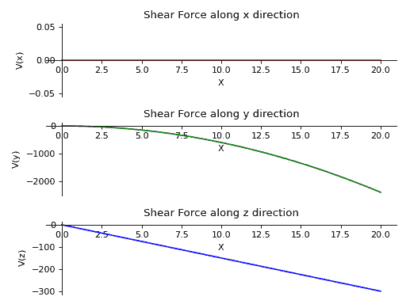

```py
plot_shear_stress(dir='all', subs=None)
```

返回表示钢束对象沿所有三个方向的剪切应力曲线的图。

参数：

**dir**：字符串（默认

> 需要绘制剪切应力图的方向。如果未指定方向，则显示所有图形。

**subs**：字典

> 包含符号作为键和相应值的 Python 字典。

示例

钢筋束的长度为 20 米，横截面积为 2 平方米。它由两端的滚轮支撑。沿 y 轴施加斜率为 12 的线性载荷。从起点到终点沿 z 轴施加 15 牛顿的恒定分布载荷。

```py
>>> from sympy.physics.continuum_mechanics.beam import Beam3D
>>> from sympy import symbols
>>> l, E, G, I, A, x = symbols('l, E, G, I, A, x')
>>> b = Beam3D(20, E, G, I, 2, x)
>>> b.apply_load(15, start=0, order=0, dir="z")
>>> b.apply_load(12*x, start=0, order=0, dir="y")
>>> b.bc_deflection = [(0, [0, 0, 0]), (20, [0, 0, 0])]
>>> R1, R2, R3, R4 = symbols('R1, R2, R3, R4')
>>> b.apply_load(R1, start=0, order=-1, dir="z")
>>> b.apply_load(R2, start=20, order=-1, dir="z")
>>> b.apply_load(R3, start=0, order=-1, dir="y")
>>> b.apply_load(R4, start=20, order=-1, dir="y")
>>> b.solve_for_reaction_loads(R1, R2, R3, R4)
>>> b.plot_shear_stress()
PlotGrid object containing:
Plot[0]:Plot object containing:
[0]: cartesian line: 0 for x over (0.0, 20.0)
Plot[1]:Plot object containing:
[0]: cartesian line: -3*x**2 for x over (0.0, 20.0)
Plot[2]:Plot object containing:
[0]: cartesian line: -15*x/2 for x over (0.0, 20.0) 
```

（`png`, `hires.png`, `pdf`)

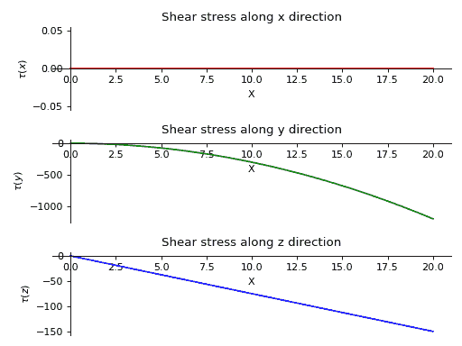

```py
plot_slope(dir='all', subs=None)
```

返回一个表示钢束对象沿所有三个方向的斜率的图。

参数：

**dir**：字符串（默认

> 需要绘制斜率图的方向。如果未指定方向，则显示所有图形。

**subs**：字典

> 包含符号作为键和相应值的 Python 字典。

示例

钢筋束的长度为 20 米。它由两端的滚轮支撑。沿 y 轴施加斜率为 12 的线性载荷。从起点到终点沿 z 轴施加 15 牛顿的恒定分布载荷。

```py
>>> from sympy.physics.continuum_mechanics.beam import Beam3D
>>> from sympy import symbols
>>> l, E, G, I, A, x = symbols('l, E, G, I, A, x')
>>> b = Beam3D(20, 40, 21, 100, 25, x)
>>> b.apply_load(15, start=0, order=0, dir="z")
>>> b.apply_load(12*x, start=0, order=0, dir="y")
>>> b.bc_deflection = [(0, [0, 0, 0]), (20, [0, 0, 0])]
>>> R1, R2, R3, R4 = symbols('R1, R2, R3, R4')
>>> b.apply_load(R1, start=0, order=-1, dir="z")
>>> b.apply_load(R2, start=20, order=-1, dir="z")
>>> b.apply_load(R3, start=0, order=-1, dir="y")
>>> b.apply_load(R4, start=20, order=-1, dir="y")
>>> b.solve_for_reaction_loads(R1, R2, R3, R4)
>>> b.solve_slope_deflection()
>>> b.plot_slope()
PlotGrid object containing:
Plot[0]:Plot object containing:
[0]: cartesian line: 0 for x over (0.0, 20.0)
Plot[1]:Plot object containing:
[0]: cartesian line: -x**3/1600 + 3*x**2/160 - x/8 for x over (0.0, 20.0)
Plot[2]:Plot object containing:
[0]: cartesian line: x**4/8000 - 19*x**2/172 + 52*x/43 for x over (0.0, 20.0) 
```

（`png`, `hires.png`, `pdf`)

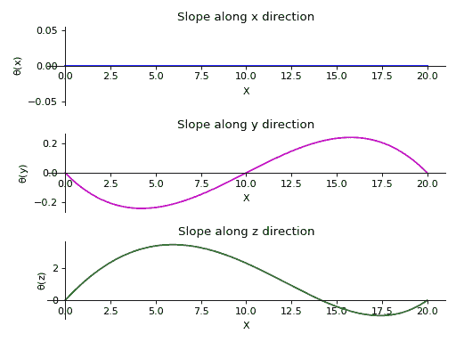

```py
polar_moment()
```

返回关于质心的 X 轴的钢筋的极点矩。

示例

```py
>>> from sympy.physics.continuum_mechanics.beam import Beam3D
>>> from sympy import symbols
>>> l, E, G, I, A = symbols('l, E, G, I, A')
>>> b = Beam3D(l, E, G, I, A)
>>> b.polar_moment()
2*I
>>> I1 = [9, 15]
>>> b = Beam3D(l, E, G, I1, A)
>>> b.polar_moment()
24 
```

```py
property second_moment
```

钢筋的截面惯性矩。

```py
shear_force()
```

返回表示钢束对象沿所有三个轴的剪切力曲线的三个表达式列表。

```py
property shear_modulus
```

钢筋的杨氏模量。

```py
shear_stress()
```

返回表示钢束对象沿所有三个轴的剪切应力曲线的三个表达式列表。

```py
slope()
```

返回表示钢束对象沿所有三个轴的挠度曲线斜率的三个元素列表。

```py
solve_for_reaction_loads(*reaction)
```

解决反应力问题。

示例

有一根长度为 30 米的梁。它在两端由滚轮支撑。从起点到终点沿着 y 轴施加 8 N 的恒定分布载荷。沿着 z 轴施加斜率为 9 的线性载荷。

```py
>>> from sympy.physics.continuum_mechanics.beam import Beam3D
>>> from sympy import symbols
>>> l, E, G, I, A, x = symbols('l, E, G, I, A, x')
>>> b = Beam3D(30, E, G, I, A, x)
>>> b.apply_load(8, start=0, order=0, dir="y")
>>> b.apply_load(9*x, start=0, order=0, dir="z")
>>> b.bc_deflection = [(0, [0, 0, 0]), (30, [0, 0, 0])]
>>> R1, R2, R3, R4 = symbols('R1, R2, R3, R4')
>>> b.apply_load(R1, start=0, order=-1, dir="y")
>>> b.apply_load(R2, start=30, order=-1, dir="y")
>>> b.apply_load(R3, start=0, order=-1, dir="z")
>>> b.apply_load(R4, start=30, order=-1, dir="z")
>>> b.solve_for_reaction_loads(R1, R2, R3, R4)
>>> b.reaction_loads
{R1: -120, R2: -120, R3: -1350, R4: -2700} 
```

```py
solve_for_torsion()
```

解决由于在 x 方向施加的扭转矩而导致的角偏转，即从梁内或外施加。

这里，正扭矩意味着扭矩方向为正，即沿着梁轴向外。同样，负扭矩表示扭矩进入梁截面。

示例

```py
>>> from sympy.physics.continuum_mechanics.beam import Beam3D
>>> from sympy import symbols
>>> l, E, G, I, A, x = symbols('l, E, G, I, A, x')
>>> b = Beam3D(20, E, G, I, A, x)
>>> b.apply_moment_load(4, 4, -2, dir='x')
>>> b.apply_moment_load(4, 8, -2, dir='x')
>>> b.apply_moment_load(4, 8, -2, dir='x')
>>> b.solve_for_torsion()
>>> b.angular_deflection().subs(x, 3)
18/(G*I) 
```

```py
torsional_moment()
```

返回梁对象内存在的扭转力矩表达式。
