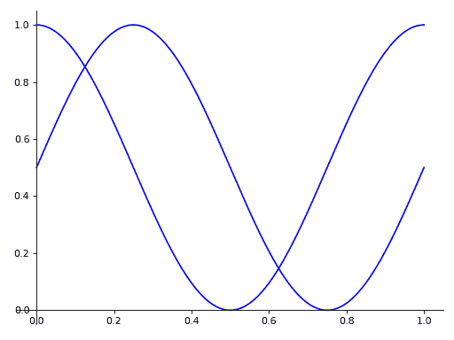
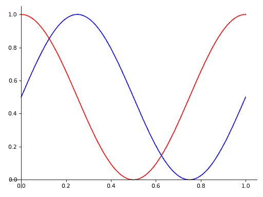
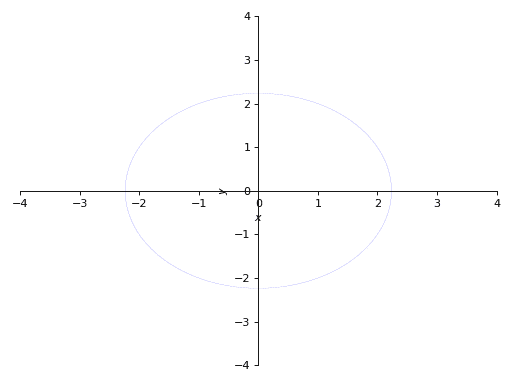
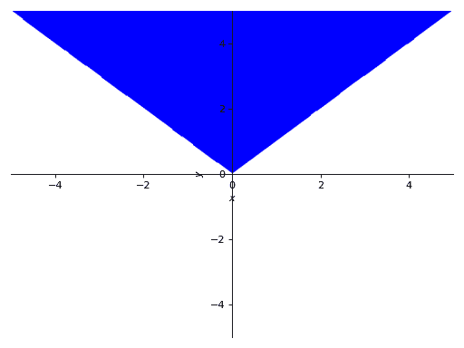

# 绘图

> 原文链接：[`docs.sympy.org/latest/modules/plotting.html`](https://docs.sympy.org/latest/modules/plotting.html)

## 简介

绘图模块允许您制作二维和三维图。当前，绘图使用[`matplotlib`](https://matplotlib.org/stable/index.html#module-matplotlib "(在 Matplotlib v3.9.0 中)")作为后端渲染。如果您没有[`matplotlib`](https://matplotlib.org/stable/index.html#module-matplotlib "(在 Matplotlib v3.9.0 中)")，也可以使用`TextBackend`绘制二维图。

绘图模块包含以下函数：

+   `plot()`：绘制二维线图。

+   `plot_parametric()`：绘制二维参数化图。

+   `plot_implicit()`：绘制二维隐式和区域图。

+   `plot3d()`：绘制二变量函数的三维图。

+   `plot3d_parametric_line()`：绘制由参数定义的三维线图。

+   `plot3d_parametric_surface()`：绘制三维参数化表面图。

上述函数仅用于方便和易用性。通过将相应的`Series`类传递给`Plot`，可以绘制任何绘图。

## 绘图类

```py
class sympy.plotting.plot.Plot(*args, title=None, xlabel=None, ylabel=None, zlabel=None, aspect_ratio='auto', xlim=None, ylim=None, axis_center='auto', axis=True, xscale='linear', yscale='linear', legend=False, autoscale=True, margin=0, annotations=None, markers=None, rectangles=None, fill=None, backend='default', size=None, **kwargs)
```

所有后端的基类。后端表示绘图库，它实现了必要的功能，以便使用 SymPy 绘图函数。

对于交互式工作，函数`plot()`更适合。

此类允许使用多个后端（[`matplotlib`](https://matplotlib.org/stable/index.html#module-matplotlib "(在 Matplotlib v3.9.0 中)")、文本绘图、旧的 SymPy pyglet 模块、Google Charts API 等）绘制 SymPy 表达式。

图形可以包含任意数量的 SymPy 表达式、点坐标列表等的绘图。绘图类有一个私有属性 _series，其中包含所有要绘制的数据系列（线条或表面的表达式、点列表等（所有 BaseSeries 的子类））。这些数据系列是由`from sympy import *`未导入的类的实例。

图形的定制有两个级别。全局选项涉及整个图形（例如标题、xlabel、scale 等），数据系列选项涉及每个数据系列（例如名称）和美学效果（例如颜色、点形状、线型等）。

选项和美学之间的区别在于，美学可以是坐标的函数（或参数在参数化图中）。美学支持的值有：

+   None（后端使用默认值）

+   一个常数

+   一个变量的函数（第一个坐标或参数）

+   两个变量的函数（第一个和第二个坐标或参数）

+   一个三个变量的函数（仅适用于非参数化的 3D 绘图）

它们的实现取决于后端，因此在某些后端中可能无法工作。

如果绘图是参数化的，美学函数的阶数允许它，美学是在参数上计算的而不是在坐标上计算的。如果阶数不允许在参数上计算，则在坐标上进行计算。

目前仅支持笛卡尔坐标，但您可以使用参数化绘图在极坐标、球坐标和柱坐标中绘制。

构造函数 Plot 的参数必须是 BaseSeries 的子类。

任何全局选项都可以指定为关键字参数。

图的全局选项包括：

+   title : str

+   xlabel : str or Symbol

+   ylabel : str or Symbol

+   zlabel : str or Symbol

+   legend : bool

+   xscale : {‘linear’, ‘log’}

+   yscale : {‘linear’, ‘log’}

+   axis : bool

+   axis_center : tuple of two floats or {‘center’, ‘auto’}

+   xlim : tuple of two floats

+   ylim : tuple of two floats

+   aspect_ratio : tuple of two floats or {‘auto’}

+   autoscale : bool

+   margin : float in [0, 1]

+   backend : {‘default’, ‘matplotlib’, ‘text’} 或者 BaseBackend 的子类

+   size : optional tuple of two floats, (width, height); default: None

每个数据系列的选项和美学是：在基本系列中没有。有关子类的选项，请参阅下文。

一些数据系列支持额外的美学或选项：

`LineOver1DRangeSeries`，`Parametric2DLineSeries`和`Parametric3DLineSeries`支持以下功能：

美学：

+   line_color 字符串、浮点数或函数，可选

    指定绘图的颜色，这取决于使用的后端。

    例如，如果使用的是`MatplotlibBackend`，那么 Matplotlib 的字符串颜色是可以接受的（`"red"`，`"r"`，`"cyan"`，`"c"`，...）。或者，我们可以使用一个浮点数，0 < color < 1，包裹在字符串中（例如，`line_color="0.5"`）来指定灰度颜色。另外，我们可以指定一个返回单个浮点值的函数：这将用于应用颜色循环（例如，`line_color=lambda x: math.cos(x)`）。

    请注意，通过设置`line_color`，它将同时应用于所有的数据系列。

选项：

+   label : str

+   steps : bool

+   integers_only : bool

`SurfaceOver2DRangeSeries`和`ParametricSurfaceSeries`支持以下内容：

美观：

+   surface_color：返回浮点数的函数。

注意事项

绘图模块的工作方式：

1.  每当调用绘图函数时，处理提供的表达式并创建`BaseSeries`类的实例列表，其中包含绘制表达式所需的信息（例如表达式、范围、系列名称等）。最终，这些对象将生成要绘制的数值数据。

1.  实例化`Plot`类的子类（从现在起称为后端），其中存储系列列表和绘图的主要属性（例如坐标轴标签、标题等）。后端实现生成实际图形的逻辑，使用某些绘图库。

1.  当执行`show`命令时，数据系列会逐个处理以生成数值数据，并根据 Plot 实例中存储的值设置坐标轴标签、标题等。

后端应检查其是否支持提供的数据系列（例如`TextBackend`仅支持`LineOver1DRangeSeries`）。

后端需要知道如何使用它所提供的数据系列类。注意，当前实现的`*Series`类是“matplotlib 中心”的：`get_points`和`get_meshes`方法返回的数值数据预期直接供 Matplotlib 使用。因此，新的后端需要预处理数值数据，使其兼容所选的绘图库。请注意，未来的 SymPy 版本可能改进`*Series`类，以返回“非 matplotlib 中心”的数值数据，因此如果您编写新的后端，必须负责在每个 SymPy 版本上检查其是否有效。

请查看`MatplotlibBackend`源代码，了解后端应如何编码。

为了供 SymPy 绘图函数使用，后端必须实现以下方法：

+   show(self)：用于循环处理数据系列，生成数值数据。

    数据，绘制它，并设置坐标轴标签、标题等。

+   save(self, path)：用于将当前绘图保存到指定的文件中。

    路径。

+   close(self)：用于关闭当前的绘图后端（注意：某些绘图

    库不支持此功能。在这种情况下，只需发出警告）。

```py
property annotations
```

自版本 1.13 起弃用。

```py
append(arg)
```

将一个图的系列的元素添加到现有图中。

示例

考虑两个 `Plot` 对象，`p1` 和 `p2`。要将第二个图的第一个系列对象添加到第一个图中，请使用 `append` 方法，如下所示：

```py
>>> from sympy import symbols
>>> from sympy.plotting import plot
>>> x = symbols('x')
>>> p1 = plot(x*x, show=False)
>>> p2 = plot(x, show=False)
>>> p1.append(p2[0])
>>> p1
Plot object containing:
[0]: cartesian line: x**2 for x over (-10.0, 10.0)
[1]: cartesian line: x for x over (-10.0, 10.0)
>>> p1.show() 
```

(`png`, `hires.png`, `pdf`)


另请参阅

`extend`

```py
extend(arg)
```

从另一个图中添加所有系列。

示例

考虑两个 `Plot` 对象，`p1` 和 `p2`。要将第二个图添加到第一个图中，请使用 `extend` 方法，如下所示：

```py
>>> from sympy import symbols
>>> from sympy.plotting import plot
>>> x = symbols('x')
>>> p1 = plot(x**2, show=False)
>>> p2 = plot(x, -x, show=False)
>>> p1.extend(p2)
>>> p1
Plot object containing:
[0]: cartesian line: x**2 for x over (-10.0, 10.0)
[1]: cartesian line: x for x over (-10.0, 10.0)
[2]: cartesian line: -x for x over (-10.0, 10.0)
>>> p1.show() 
```

(`png`, `hires.png`, `pdf`)


```py
property fill
```

自 1.13 版本起已弃用。

```py
property markers
```

自 1.13 版本起已弃用。

```py
property rectangles
```

自 1.13 版本起已弃用。

## 绘图函数参考

```py
sympy.plotting.plot.plot(*args, show=True, **kwargs)
```

将单变量函数绘制为曲线。

参数：

**args :**

> 第一个参数是表示要绘制的单变量函数的表达式。
> 
> 最后一个参数是表示自由变量范围的三元组。例如 `(x, 0, 5)`
> 
> 典型用法示例如下：
> 
> +   绘制单一表达式和单一范围。
> +   
>     `plot(expr, range, **kwargs)`
>     
> +   绘制单一表达式，默认范围为 (-10, 10)。
> +   
>     `plot(expr, **kwargs)`
>     
> +   用单一范围绘制多个表达式。
> +   
>     `plot(expr1, expr2, ..., range, **kwargs)`
>     
> +   绘制多个表达式和多个范围。
> +   
>     `plot((expr1, range1), (expr2, range2), ..., **kwargs)`
>     
> 最佳实践是显式指定范围，因为如果实施更高级的默认范围检测算法，可能会更改默认范围。

**show**：布尔值，可选

> 默认值设置为 `True`。将 `show` 设置为 `False`，函数将不显示绘图。然后可以通过调用 `save()` 和 `show()` 方法来保存或显示 `Plot` 类的返回实例。

**line_color**：字符串、浮点数或函数，可选

> 指定绘图的颜色。请参阅 `Plot` 以了解如何设置绘图颜色。注意，通过设置 `line_color`，可以同时应用于所有系列。

**title**：字符串，可选

> 绘图的标题。如果图仅有一个表达式，则设置为表达式的 LaTeX 表示。

**label**：字符串，可选

> 图中表达式的标签。调用 `legend` 时将使用该标签。默认为表达式的名称。例如 `sin(x)`

**xlabel**：字符串或表达式，可选

> x 轴的标签。

**ylabel**：字符串或表达式，可选

> y 轴的标签。

**xscale**：'linear' 或 'log'，可选

> 设置 x 轴的缩放。

**yscale** : ‘linear’ or ‘log’, optional

> 设置 y 轴的缩放。

**axis_center** : (float, float), optional

> 两个浮点数元组，表示中心的坐标或者{‘center’, ‘auto’}

**xlim** : (float, float), optional

> 表示 x 轴限制的` (min, max)`。

**ylim** : (float, float), optional

> 表示 y 轴限制的` (min, max)`。

**annotations** : list, optional

> 一系列字典，指定所需注释的类型。字典中的键应当与[`matplotlib`](https://matplotlib.org/stable/index.html#module-matplotlib "(在 Matplotlib v3.9.0)")的[`annotate()`](https://matplotlib.org/stable/api/_as-gen/matplotlib.axes.Axes.annotate.html#matplotlib.axes.Axes.annotate "(在 Matplotlib v3.9.0)")方法的参数相对应。

**markers** : list, optional

> 一系列字典，指定所需标记的类型。字典中的键应当与[`matplotlib`](https://matplotlib.org/stable/index.html#module-matplotlib "(在 Matplotlib v3.9.0)")的[`plot()`](https://matplotlib.org/stable/api/_as_gen/matplotlib.pyplot.plot.html#matplotlib.pyplot.plot "(在 Matplotlib v3.9.0)")函数的参数及其与标记相关的关键参数相对应。

**rectangles** : list, optional

> 一系列字典，指定要绘制的矩形的尺寸。字典中的键应当与[`matplotlib`](https://matplotlib.org/stable/index.html#module-matplotlib "(在 Matplotlib v3.9.0)")的[`Rectangle`](https://matplotlib.org/stable/api/_as-gen/matplotlib.patches.Rectangle.html#matplotlib.patches.Rectangle "(在 Matplotlib v3.9.0)")类的参数相对应。

**fill** : dict, optional

> 绘图所需的颜色填充类型的字典。字典中的键应当与[`matplotlib`](https://matplotlib.org/stable/index.html#module-matplotlib "(在 Matplotlib v3.9.0)")的[`fill_between()`](https://matplotlib.org/stable/api/_as_gen/matplotlib.axes.Axes.fill_between.html#matplotlib.axes.Axes.fill_between "(在 Matplotlib v3.9.0)")方法的参数相对应。

**adaptive** : bool, optional

> 默认值设置为`True`。将 adaptive 设置为`False`并指定`n`以进行均匀采样。
> 
> 绘图使用自适应算法递归采样以准确绘制。自适应算法使用接近两点中点附近的随机点进行进一步采样。因此，相同的绘图可能会略有不同。

**depth** : int, optional

> 自适应算法的递归深度。深度值为\(n\)时最多采样\(2^{n}\)个点。
> 
> 如果`adaptive`标志设置为`False`，则此项将被忽略。

**n** : int, optional

> 当`adaptive`设置为`False`时使用。函数在`n`个点处均匀采样。如果`adaptive`标志设置为`True`，则将被忽略。此关键字参数替换了`nb_of_points`，应视为已弃用。

**size**：(float, float)，可选

> 以英寸为单位的元组形式（宽度，高度）来指定整个图形的大小。默认值为`None`，意味着大小将由默认后端设置。

示例

```py
>>> from sympy import symbols
>>> from sympy.plotting import plot
>>> x = symbols('x') 
```

单一绘图

```py
>>> plot(x**2, (x, -5, 5))
Plot object containing:
[0]: cartesian line: x**2 for x over (-5.0, 5.0) 
```

(`png`, `hires.png`, `pdf`)


单一范围内的多个绘图。

```py
>>> plot(x, x**2, x**3, (x, -5, 5))
Plot object containing:
[0]: cartesian line: x for x over (-5.0, 5.0)
[1]: cartesian line: x**2 for x over (-5.0, 5.0)
[2]: cartesian line: x**3 for x over (-5.0, 5.0) 
```

(`png`, `hires.png`, `pdf`)


使用不同范围绘制多个图形。

```py
>>> plot((x**2, (x, -6, 6)), (x, (x, -5, 5)))
Plot object containing:
[0]: cartesian line: x**2 for x over (-6.0, 6.0)
[1]: cartesian line: x for x over (-5.0, 5.0) 
```

(`png`, `hires.png`, `pdf`)


无自适应采样。

```py
>>> plot(x**2, adaptive=False, n=400)
Plot object containing:
[0]: cartesian line: x**2 for x over (-10.0, 10.0) 
```

(`png`, `hires.png`, `pdf`)


另请参阅

`绘图`，`1D 范围系列线`

```py
sympy.plotting.plot.plot_parametric(*args, show=True, **kwargs)
```

绘制二维参数曲线。

参数：

**args**

> 常见规范包括：
> 
> +   绘制带有范围的单一参数曲线
> +   
>     `plot_parametric((expr_x, expr_y), range)`
>     
> +   使用相同范围绘制多个参数曲线
> +   
>     `plot_parametric((expr_x, expr_y), ..., range)`
>     
> +   使用不同范围绘制多个参数曲线
> +   
>     `plot_parametric((expr_x, expr_y, range), ...)`
>     
> `expr_x` 是表示参数函数 \(x\) 分量的表达式。
> 
> `expr_y` 是表示参数函数 \(y\) 分量的表达式。
> 
> `range` 是一个三元组，表示参数符号、起始值和结束值。例如，`(u, 0, 5)`。
> 
> 如果未指定范围，则使用默认范围 (-10, 10)。
> 
> 然而，如果参数被指定为 `(expr_x, expr_y, range), ...`，则必须手动指定每个表达式的范围。
> 
> 如果实现了更先进的算法，将更改默认范围。

**adaptive**：布尔值，可选

> 指定是否使用自适应采样。
> 
> 默认值设置为 `True`。将 `adaptive` 设置为 `False`，并指定 `n`，如果需要均匀采样。

**depth** : 整数，可选

> 自适应算法的递归深度。深度为值 \(n\) 时，最多采样 \(2^n\) 个点。

**n** : 整数，可选

> 当 `adaptive` 标志设置为 `False` 时使用。指定用于均匀采样的点数。此关键字参数替换了已被视为弃用的 `nb_of_points`。

**line_color** : 字符串、浮点数或函数，可选

> 指定图的颜色。查看 `Plot` 以了解如何为图设置颜色。注意，通过设置 `line_color`，将同时应用于所有系列。

**label** : 字符串，可选

> 图中表达式的标签。调用 `legend` 时会使用。默认为表达式的名称。例如 `sin(x)`

**xlabel** : 字符串，可选

> x 轴的标签。

**ylabel** : 字符串，可选

> y 轴的标签。

**xscale** : ‘linear’ 或 ‘log’，可选

> 设置 x 轴的缩放。

**yscale** : ‘linear’ 或 ‘log’，可选

> 设置 y 轴的缩放。

**axis_center** : (浮点数, 浮点数)，可选

> 两个浮点数元组，表示中心坐标或 {‘center’, ‘auto’}

**xlim** : (浮点数, 浮点数)，可选

> 表示 x 轴限制的元组，`` (min, max)` ``。

**ylim** : (浮点数, 浮点数)，可选

> 表示 y 轴限制的元组，`` (min, max)` ``。

**size** : (浮点数, 浮点数)，可选

> 以英寸为单位的整体图形大小元组（宽度，高度）。默认值为 `None`，意味着大小将由默认后端设置。

示例

```py
>>> from sympy import plot_parametric, symbols, cos, sin
>>> u = symbols('u') 
```

一个表达式的参数图：

```py
>>> plot_parametric((cos(u), sin(u)), (u, -5, 5))
Plot object containing:
[0]: parametric cartesian line: (cos(u), sin(u)) for u over (-5.0, 5.0) 
```

(`png`, `hires.png`, `pdf`)


带有相同范围的多个表达式的参数图：

```py
>>> plot_parametric((cos(u), sin(u)), (u, cos(u)), (u, -10, 10))
Plot object containing:
[0]: parametric cartesian line: (cos(u), sin(u)) for u over (-10.0, 10.0)
[1]: parametric cartesian line: (u, cos(u)) for u over (-10.0, 10.0) 
```

(`png`, `hires.png`, `pdf`)


带有每条曲线不同范围的多个表达式的参数图：

```py
>>> plot_parametric((cos(u), sin(u), (u, -5, 5)),
...     (cos(u), u, (u, -5, 5)))
Plot object containing:
[0]: parametric cartesian line: (cos(u), sin(u)) for u over (-5.0, 5.0)
[1]: parametric cartesian line: (cos(u), u) for u over (-5.0, 5.0) 
```

(`png`, `hires.png`, `pdf`)


注意事项

绘图使用自适应算法递归采样以准确绘制曲线。自适应算法使用接近两点中点的随机点进行进一步采样。因此，由于随机采样的原因，重复相同的绘图命令可能会导致稍有不同的结果。

如果有多个图，则在同一画布上绘制的所有图都应用相同的可选参数。如果要单独设置这些选项，可以索引返回的 `Plot` 对象并设置它。

例如，当您一次指定 `line_color` 时，它会同时应用于两个系列。

```py
>>> from sympy import pi
>>> expr1 = (u, cos(2*pi*u)/2 + 1/2)
>>> expr2 = (u, sin(2*pi*u)/2 + 1/2)
>>> p = plot_parametric(expr1, expr2, (u, 0, 1), line_color='blue') 
```

(`png`, `hires.png`, `pdf`)



如果要为特定系列指定线条颜色，应索引每个项目并手动应用属性。

```py
>>> p[0].line_color = 'red'
>>> p.show() 
```

(`png`, `hires.png`, `pdf`)



另请参阅

`Plot`, `Parametric2DLineSeries`

```py
sympy.plotting.plot.plot3d(*args, show=True, **kwargs)
```

绘制三维表面图。

用法

单个绘图

`plot3d(expr, range_x, range_y, **kwargs)`

如果未指定范围，则使用默认范围 (-10, 10)。

具有相同范围的多个图。

`plot3d(expr1, expr2, range_x, range_y, **kwargs)`

如果未指定范围，则使用默认范围 (-10, 10)。

具有不同范围的多个图。

`plot3d((expr1, range_x, range_y), (expr2, range_x, range_y), ..., **kwargs)`

每个表达式都必须指定范围。

如果实施更高级的默认范围检测算法，则默认范围可能会在将来更改。

参数

expr : 表示沿 x 轴的函数表达式。

range_x(`Symbol`, float, float)

x 变量范围的三元组，例如 (x, 0, 5)。

range_y(`Symbol`, float, float)

y 变量范围的三元组，例如 (y, 0, 5)。

关键字参数

`SurfaceOver2DRangeSeries` 类的参数：

n1int

x 范围以 `n1` 点均匀采样。此关键字参数替代了 `nb_of_points_x`，应视为已弃用。

n2int

y 范围以 `n2` 点均匀采样。此关键字参数替代了 `nb_of_points_y`，应视为已弃用。

美学：

surface_colorFunction 返回一个浮点数

指定绘图表面的颜色。有关更多细节，请参阅 `Plot`。

如果有多个绘图，则所有绘图都应用相同的系列参数。如果要单独设置这些选项，可以索引返回的 `Plot` 对象并设置它。

`Plot` 类的参数：

titlestr

绘图标题。

size(float, float)，可选

以英寸为单位的形式 (width, height) 的元组，用于指定整体图的大小。默认值为 `None`，表示大小由默认后端设置。

示例

```py
>>> from sympy import symbols
>>> from sympy.plotting import plot3d
>>> x, y = symbols('x y') 
```

单个绘图

```py
>>> plot3d(x*y, (x, -5, 5), (y, -5, 5))
Plot object containing:
[0]: cartesian surface: x*y for x over (-5.0, 5.0) and y over (-5.0, 5.0) 
```

(`png`, `hires.png`, `pdf`)


具有相同范围的多个绘图

```py
>>> plot3d(x*y, -x*y, (x, -5, 5), (y, -5, 5))
Plot object containing:
[0]: cartesian surface: x*y for x over (-5.0, 5.0) and y over (-5.0, 5.0)
[1]: cartesian surface: -x*y for x over (-5.0, 5.0) and y over (-5.0, 5.0) 
```

(`png`, `hires.png`, `pdf`)


具有不同范围的多个绘图。

```py
>>> plot3d((x**2 + y**2, (x, -5, 5), (y, -5, 5)),
...     (x*y, (x, -3, 3), (y, -3, 3)))
Plot object containing:
[0]: cartesian surface: x**2 + y**2 for x over (-5.0, 5.0) and y over (-5.0, 5.0)
[1]: cartesian surface: x*y for x over (-3.0, 3.0) and y over (-3.0, 3.0) 
```

(`png`, `hires.png`, `pdf`)


另请参阅

`Plot`, `SurfaceOver2DRangeSeries`

```py
sympy.plotting.plot.plot3d_parametric_line(*args, show=True, **kwargs)
```

绘制 3D 参数化线图。

用法

单个绘图：

`plot3d_parametric_line(expr_x, expr_y, expr_z, range, **kwargs)`

如果未指定范围，则使用默认范围 (-10, 10)。

多个绘图。

`plot3d_parametric_line((expr_x, expr_y, expr_z, range), ..., **kwargs)`

必须为每个表达式指定范围。

如果将来实施更高级的默认范围检测算法，则默认范围可能会更改。

参数

expr_x：表示沿 x 轴的函数表达式。

expr_y：表示沿 y 轴的函数表达式。

expr_z：表示沿 z 轴的函数表达式。

range(`Symbol`, float, float)

表示参数变量范围的 3 元组，例如 (u, 0, 5)。

关键字参数

`Parametric3DLineSeries` 类的参数。

nint

在 `n` 个点上均匀采样范围。此关键字参数替代了应视为已弃用的 `nb_of_points`。

美学特性：

line_colorstring，或 float，或 function，可选

指定图表的颜色。查看 `Plot` 以了解如何为图表设置颜色。请注意，通过设置 `line_color`，颜色将同时应用于所有系列。

labelstr

图表的标签。在调用时带有 `legend=True` 时，用于标识图表中具有给定标签的函数。

如果有多个图表，则所有图表都应用相同的系列参数。如果要分别设置这些选项，可以索引返回的 `Plot` 对象并设置它。

`Plot` 类的参数。

titlestr

图表的标题。

size(float, float)，可选

以英寸为单位的图表整体尺寸的二元组 (width, height)。默认值为 `None`，意味着尺寸将由默认后端设置。

示例

```py
>>> from sympy import symbols, cos, sin
>>> from sympy.plotting import plot3d_parametric_line
>>> u = symbols('u') 
```

单个图表。

```py
>>> plot3d_parametric_line(cos(u), sin(u), u, (u, -5, 5))
Plot object containing:
[0]: 3D parametric cartesian line: (cos(u), sin(u), u) for u over (-5.0, 5.0) 
```

(`png`, `hires.png`, `pdf`)


多个图表。

```py
>>> plot3d_parametric_line((cos(u), sin(u), u, (u, -5, 5)),
...     (sin(u), u**2, u, (u, -5, 5)))
Plot object containing:
[0]: 3D parametric cartesian line: (cos(u), sin(u), u) for u over (-5.0, 5.0)
[1]: 3D parametric cartesian line: (sin(u), u**2, u) for u over (-5.0, 5.0) 
```

(`png`, `hires.png`, `pdf`)


另请参阅

`Plot`，`Parametric3DLineSeries`

```py
sympy.plotting.plot.plot3d_parametric_surface(*args, show=True, **kwargs)
```

绘制三维参数化曲面图。

解释

单个图表。

`plot3d_parametric_surface(expr_x, expr_y, expr_z, range_u, range_v, **kwargs)`

如果未指定范围，则使用默认范围 (-10, 10)。

多个图表。

`plot3d_parametric_surface((expr_x, expr_y, expr_z, range_u, range_v), ..., **kwargs)`

对于每个表达式，都必须指定范围。

如果将来实现了更先进的默认范围检测算法，则默认范围可能会更改。

参数

expr_x：表示沿 `x` 的函数表达式。

expr_y：表示沿 `y` 的函数表达式。

expr_z：表示沿 `z` 的函数表达式。

range_u(`Symbol`, float, float)

表示 `u` 变量范围的三元组，例如 (u, 0, 5)。

range_v(`Symbol`, float, float)

表示 `v` 变量范围的三元组，例如 (v, 0, 5)。

关键字参数

`ParametricSurfaceSeries` 类的参数：

n1int

`u` 范围以 `n1` 个点均匀采样。这个关键字参数取代了应该被视为弃用的 `nb_of_points_u`。

n2int

`v` 范围以 `n2` 个点均匀采样。这个关键字参数取代了应该被视为弃用的 `nb_of_points_v`。

美学：

surface_colorFunction 返回一个 float

指定图面的颜色。有关更多详细信息，请参见 `Plot`。

如果有多个图，那么相同的系列参数将适用于所有图。如果要单独设置这些选项，可以索引返回的 `Plot` 对象并设置它。

`Plot` 类的参数：

titlestr

图的标题。

size(float, float)，可选

一个元组，以英寸为单位指定整体图形的大小（宽度，高度）。默认值为 `None`，表示大小将由默认后端设置。

示例

```py
>>> from sympy import symbols, cos, sin
>>> from sympy.plotting import plot3d_parametric_surface
>>> u, v = symbols('u v') 
```

单个图。

```py
>>> plot3d_parametric_surface(cos(u + v), sin(u - v), u - v,
...     (u, -5, 5), (v, -5, 5))
Plot object containing:
[0]: parametric cartesian surface: (cos(u + v), sin(u - v), u - v) for u over (-5.0, 5.0) and v over (-5.0, 5.0) 
```

(`png`, `hires.png`, `pdf`)


另请参阅

`绘图`，`参数曲面系列`

```py
sympy.plotting.plot_implicit.plot_implicit(expr, x_var=None, y_var=None, adaptive=True, depth=0, n=300, line_color='blue', show=True, **kwargs)
```

绘制隐式方程的绘图函数。

参数

+   expr：要绘制的方程/不等式。

+   x_var（可选）：要在 x 轴上绘制的符号或给定符号和范围的元组作为 `(symbol, xmin, xmax)`

+   y_var（可选）：要绘制在 y 轴上的符号或给定符号和范围的元组作为 `(symbol, ymin, ymax)`

如果既未给出 `x_var` 也未给出 `y_var`，则将按其排序顺序为表达式中的自由符号分配。

还可以使用以下关键字参数：

+   `adaptive` 布尔值。默认值设置为 True。必须

    如果要使用网格，则设置为 False。

+   `depth` 整数。自适应网格的递归深度。

    默认值为 0。取值范围为 (0, 4)。

+   `n` 整数。如果自适应网格不可用，则点数。

    used。默认值为 300。此关键字参数替代了被视为废弃的 `points`。

+   `show` 布尔值。默认值为 True。如果设置为 False，则图将不会显示。

    不会显示。有关详细信息，请参见 `Plot`。

+   `title` 字符串。图的标题。

+   `xlabel` 字符串。x 轴的标签

+   `ylabel` 字符串。y 轴的标签

美学选项：

+   `line_color`：float 或 string。指定图的颜色。

    请参阅 `Plot` 以了解如何设置图的颜色。默认值为“Blue”

plot_implicit，默认情况下使用区间算术来绘制函数。如果表达式无法使用区间算术绘制，则默认生成使用固定点数的网格生成轮廓。通过将 adaptive 设置为 False，可以强制 plot_implicit 使用网格。当自适应绘图使用区间算术失败以小线宽绘制时，网格方法可以是有效的。

示例

绘制表达式：

```py
>>> from sympy import plot_implicit, symbols, Eq, And
>>> x, y = symbols('x y') 
```

没有表达式中符号的任何范围：

```py
>>> p1 = plot_implicit(Eq(x**2 + y**2, 5)) 
```

(`png`, `hires.png`, `pdf`)


使用符号范围：

```py
>>> p2 = plot_implicit(
...     Eq(x**2 + y**2, 3), (x, -3, 3), (y, -3, 3)) 
```

(`png`, `hires.png`, `pdf`)


带有递归深度作为参数：

```py
>>> p3 = plot_implicit(
...     Eq(x**2 + y**2, 5), (x, -4, 4), (y, -4, 4), depth = 2) 
```

(`png`, `hires.png`, `pdf`)



使用网格和不使用自适应网格：

```py
>>> p4 = plot_implicit(
...     Eq(x**2 + y**2, 5), (x, -5, 5), (y, -2, 2),
...     adaptive=False) 
```

(`png`, `hires.png`, `pdf`)


使用指定数量的点进行网格绘制而不使用自适应网格：

```py
>>> p5 = plot_implicit(
...     Eq(x**2 + y**2, 5), (x, -5, 5), (y, -2, 2),
...     adaptive=False, n=400) 
```

(`png`, `hires.png`, `pdf`)


绘制区域：

```py
>>> p6 = plot_implicit(y > x**2) 
```

(`png`, `hires.png`, `pdf`)


使用布尔连接进行绘图：

```py
>>> p7 = plot_implicit(And(y > x, y > -x)) 
```

(`png`, `hires.png`, `pdf`)



当绘制单变量表达式（例如 y - 1）时，请明确指定 x 或 y 变量：

```py
>>> p8 = plot_implicit(y - 1, y_var=y)
>>> p9 = plot_implicit(x - 1, x_var=x) 
```


(`png`, `hires.png`, `pdf`)


（`png`, `hires.png`, `pdf`）

## PlotGrid 类

```py
class sympy.plotting.plot.PlotGrid(nrows, ncolumns, *args, show=True, size=None, **kwargs)
```

此类帮助在单个图中绘制已创建的 SymPy 图的子图。

示例

```py
>>> from sympy import symbols
>>> from sympy.plotting import plot, plot3d, PlotGrid
>>> x, y = symbols('x, y')
>>> p1 = plot(x, x**2, x**3, (x, -5, 5))
>>> p2 = plot((x**2, (x, -6, 6)), (x, (x, -5, 5)))
>>> p3 = plot(x**3, (x, -5, 5))
>>> p4 = plot3d(x*y, (x, -5, 5), (y, -5, 5)) 
```


（`png`, `hires.png`, `pdf`）


（`png`, `hires.png`, `pdf`）


（`png`, `hires.png`, `pdf`）


（`png`, `hires.png`, `pdf`）

单行垂直绘制：

```py
>>> PlotGrid(2, 1, p1, p2)
PlotGrid object containing:
Plot[0]:Plot object containing:
[0]: cartesian line: x for x over (-5.0, 5.0)
[1]: cartesian line: x**2 for x over (-5.0, 5.0)
[2]: cartesian line: x**3 for x over (-5.0, 5.0)
Plot[1]:Plot object containing:
[0]: cartesian line: x**2 for x over (-6.0, 6.0)
[1]: cartesian line: x for x over (-5.0, 5.0) 
```

（`png`, `hires.png`, `pdf`）


水平单行绘制：

```py
>>> PlotGrid(1, 3, p2, p3, p4)
PlotGrid object containing:
Plot[0]:Plot object containing:
[0]: cartesian line: x**2 for x over (-6.0, 6.0)
[1]: cartesian line: x for x over (-5.0, 5.0)
Plot[1]:Plot object containing:
[0]: cartesian line: x**3 for x over (-5.0, 5.0)
Plot[2]:Plot object containing:
[0]: cartesian surface: x*y for x over (-5.0, 5.0) and y over (-5.0, 5.0) 
```

（`png`, `hires.png`, `pdf`）


以网格形式绘制：

```py
>>> PlotGrid(2, 2, p1, p2, p3, p4)
PlotGrid object containing:
Plot[0]:Plot object containing:
[0]: cartesian line: x for x over (-5.0, 5.0)
[1]: cartesian line: x**2 for x over (-5.0, 5.0)
[2]: cartesian line: x**3 for x over (-5.0, 5.0)
Plot[1]:Plot object containing:
[0]: cartesian line: x**2 for x over (-6.0, 6.0)
[1]: cartesian line: x for x over (-5.0, 5.0)
Plot[2]:Plot object containing:
[0]: cartesian line: x**3 for x over (-5.0, 5.0)
Plot[3]:Plot object containing:
[0]: cartesian surface: x*y for x over (-5.0, 5.0) and y over (-5.0, 5.0) 
```

（`png`, `hires.png`, `pdf`）


## 系列类

```py
class sympy.plotting.series.BaseSeries(*args, **kwargs)
```

数据对象的基类，包含要绘制的内容。

注意事项

后端应检查是否支持给定的数据系列（例如，TextBackend 仅支持 LineOver1DRangeSeries）。后端有责任知道如何使用给定的数据系列类。

某些数据系列类根据它们展示的 API（仅基于约定）进行分组（使用类属性如 is_2Dline）。后端不必使用该 API（例如，LineOver1DRangeSeries 属于 is_2Dline 组并呈现 get_points 方法，但 TextBackend 不使用 get_points 方法）。

BaseSeries

```py
eval_color_func(*args)
```

评估颜色函数。

参数：

**args** : 元组

> 要传递给着色函数的参数。可以是坐标、参数或两者。

注释

后端将请求数据系列生成数值数据。根据数据系列的不同，要么数据系列本身要么后端最终执行此函数以生成适当的着色值。

```py
property expr
```

返回系列的表达式（或表达式）。

```py
get_data()
```

计算并返回数值数据。

此方法返回的参数数量取决于具体的实例。如果`s`是系列，请确保阅读`help(s.get_data)`以了解其返回内容。

```py
get_label(use_latex=False, wrapper='$%s$')
```

返回用于显示表达式的标签。

参数：

**use_latex** : 布尔值

> 如果为 False，则返回表达式的字符串表示。如果为 True，则返回 latex 表示。

**wrapper** : 字符串

> 后端可能需要将 latex 表示包装在某些字符中。默认为`"$%s$"`。

返回：

**label** : 字符串

```py
property n
```

返回数字离散化点的列表[n1, n2, n3]。

```py
property params
```

获取或设置当前参数字典。

参数：

**p** : 字典

> +   键：与参数相关联的符号
> +   
> +   val: 数值值

```py
class sympy.plotting.series.Line2DBaseSeries(**kwargs)
```

2D 线的基类。

+   添加标签、步骤和仅整数选项。

+   使 is_2Dline 为真。

+   定义 get_segments 和 get_color_array

```py
get_data()
```

返回绘制线条的坐标。

返回：

x: np.ndarray

> x 坐标

y: np.ndarray

> y 坐标

z: np.ndarray（可选）

> 在 Parametric3DLineSeries、Parametric3DLineInteractiveSeries 的情况下的 z 坐标。

**param** : np.ndarray（可选）

> 参数：Parametric2DLineSeries、Parametric3DLineSeries 或 AbsArgLineSeries（及其对应的交互系列）的情况。

```py
class sympy.plotting.series.LineOver1DRangeSeries(expr, var_start_end, label='', **kwargs)
```

表示由 SymPy 表达式在范围上组成的线条。

```py
get_points()
```

返回用于绘图的坐标列表。根据`adaptive`选项，此函数将使用自适应算法或在提供的范围内均匀采样表达式。

此函数供向后兼容性使用。考虑使用`get_data()`代替。

返回：

**x** : 列表

> > x 坐标列表
> > 
> ylist
> 
> y 坐标列表

```py
class sympy.plotting.series.Parametric2DLineSeries(expr_x, expr_y, var_start_end, label='', **kwargs)
```

表示由两个参数化 SymPy 表达式在范围上组成的线条。

```py
class sympy.plotting.series.Line3DBaseSeries
```

3D 线的基类。

大多数东西都是从 Line2DBaseSeries 派生的。

```py
class sympy.plotting.series.Parametric3DLineSeries(expr_x, expr_y, expr_z, var_start_end, label='', **kwargs)
```

表示由三个参数化 SymPy 表达式和一个范围组成的 3D 线的表示。

```py
class sympy.plotting.series.SurfaceBaseSeries(*args, **kwargs)
```

3D 曲面的基类。

```py
class sympy.plotting.series.SurfaceOver2DRangeSeries(expr, var_start_end_x, var_start_end_y, label='', **kwargs)
```

表示由 SymPy 表达式和 2D 范围组成的 3D 曲面。

```py
get_data()
```

返回用于绘图的坐标数组。

返回：

**mesh_x** : np.ndarray

> 离散化的 x 域。

**mesh_y** : np.ndarray

> 离散化的 y 域。

**mesh_z**：np.ndarray

> 评估结果。

```py
get_meshes()
```

返回用于绘制表面的 x、y、z 坐标。此函数用于向后兼容。考虑改用 `get_data()`。

```py
class sympy.plotting.series.ParametricSurfaceSeries(expr_x, expr_y, expr_z, var_start_end_u, var_start_end_v, label='', **kwargs)
```

表示由三个参数化 SymPy 表达式和一个范围组成的 3D 表面。

```py
get_data()
```

返回用于绘图的坐标数组。

返回：

**x**：np.ndarray [n2 x n1]

> x 坐标。

**y**：np.ndarray [n2 x n1]

> y 坐标。

**z**：np.ndarray [n2 x n1]

> z 坐标。

**mesh_u**：np.ndarray [n2 x n1]

> 离散化的 u 范围。

**mesh_v**：np.ndarray [n2 x n1]

> 离散化的 v 范围。

```py
get_meshes()
```

返回用于绘制表面的 x、y、z 坐标。此函数用于向后兼容。考虑改用 `get_data()`。

```py
class sympy.plotting.series.ImplicitSeries(expr, var_start_end_x, var_start_end_y, label='', **kwargs)
```

2D 隐式绘图的表示。

```py
get_data()
```

返回数值数据。

返回：

如果使用 \(adaptive=True\) 评估系列，则返回：

**interval_list**：列表

> 要后处理并最终与 Matplotlib 的 `fill` 命令一起使用的边界矩形间隔列表。

**dummy**：str

> 包含 `"fill"` 的字符串。

否则，它返回用于 Matplotlib 的 2D numpy 数组

`contour` 或 `contourf` 命令：

**x_array**：np.ndarray

**y_array**：np.ndarray

**z_array**：np.ndarray

**plot_type**：str

> 指定要使用的绘图命令的字符串，`"contour"` 或 `"contourf"`。

```py
get_label(use_latex=False, wrapper='$%s$')
```

返回用于显示表达式的标签。

参数：

**use_latex**：bool

> 如果为 False，则返回表达式的字符串表示。如果为 True，则返回 latex 表示。

**wrapper**：str

> 后端可能需要用一些字符包装 latex 表示。默认为 `"$%s$"`.

返回：

**label**：str

## 后端

```py
class sympy.plotting.plot.MatplotlibBackend(*series, **kwargs)
```

此类实现了使用 SymPy 绘图函数与 Matplotlib 的功能。

```py
static get_segments(x, y, z=None)
```

将两个坐标列表转换为用于 Matplotlib 的段列表 [`LineCollection`](https://matplotlib.org/stable/api/collections_api.html#matplotlib.collections.LineCollection "(在 Matplotlib v3.9.0 中)").

参数：

**x**：列表

> > x 坐标列表
> > 
> ylist
> 
> y 坐标列表
> 
> zlist
> 
> 用于 3D 线条的 z 坐标列表。

```py
process_series()
```

迭代每个 `Plot` 对象并进一步调用 _process_series()

```py
class sympy.plotting.plot.TextBackend(*args, **kwargs)
```

## Pyglet 绘图

这是使用 pyglet 的旧绘图模块的文档。此模块有一些限制，并且不再积极开发。您可以查看新的绘图模块作为替代。

Pyglet 绘图模块可以进行美观的 2D 和 3D 绘图，可以通过控制台命令以及键盘和鼠标进行控制，仅依赖于 [pyglet](https://pyglet.org/)。

这是最简单的用法：

```py
>>> from sympy import var
>>> from sympy.plotting.pygletplot import PygletPlot as Plot
>>> var('x y z')
>>> Plot(x*y**3-y*x**3) 
```

要查看大量绘图示例，请参阅 `examples/pyglet_plotting.py` 并尝试在交互模式下运行它（`python -i plotting.py`）：

```py
$ python -i examples/pyglet_plotting.py 
```

例如 `example(7)` 或 `example(11)` 的类型。

另请参阅 [绘图模块](https://github.com/sympy/sympy/wiki/Plotting-capabilities) 维基页面以查看截图。

## 绘图窗口控制

| 摄像机 | 键 |
| --- | --- |
| 灵敏度调整器 | SHIFT |
| 缩放 | R 和 F, Page Up 和 Down, 小键盘 + 和 - |
| 绕 X,Y 轴旋转视角 | 箭头键, A,S,D,W, 小键盘 4,6,8,2 |
| 绕 Z 轴旋转视角 | Q 和 E, 小键盘 7 和 9 |
| 绕纵坐标 Z 轴旋转视角 | Z 和 C, 小键盘 1 和 3 |
| 查看 XY 平面 | F1 |
| 查看 XZ 平面 | F2 |
| 查看 YZ 平面 | F3 |
| 查看透视 | F4 |
| 重置 | X, 小键盘 5 |
| 坐标轴 | 键盘 |
| --- | --- |
| 切换可见性 | F5 |
| 切换颜色 | F6 |
| 窗口 | 键盘 |
| --- | --- |
| 关闭 | ESCAPE |
| 屏幕截图 | F8 |

鼠标可以通过拖动左键、中键和右键来旋转、缩放和平移。

## 坐标模式

`Plot` 支持几种曲线坐标模式，每个绘制函数都是独立的。您可以使用`mode`命名参数明确指定坐标模式，但对于笛卡尔或参数绘图，可以自动确定，因此只需为极坐标、柱坐标和球坐标模式指定。

具体而言，如果您在`Plot`中提供的函数参数为一个函数，或使用`Plot.__setitem__(i, function arguments)`（通过数组索引语法访问`Plot`实例），则参数将被解释为笛卡尔绘图；如果提供两个或三个函数，则会被解释为参数绘图。类似地，如果使用一个变量，则参数将被解释为曲线，如果使用两个变量，则被解释为曲面。

变量个数支持的模式名称：

+   1 (曲线): 参数化、笛卡尔、极坐标

+   2 (曲面): 参数化、笛卡尔、柱坐标、球坐标

```py
>>> Plot(1, 'mode=spherical; color=zfade4') 
```

注意，函数参数以`"key1=value1; key2=value2"`的形式给出（空格被省略）。直接给出绘图的关键字参数适用于绘图本身。

## 指定变量的间隔

变量间隔的基本格式为[var, min, max, steps]。然而，语法非常灵活，未指定的参数将从当前坐标模式的默认值中取得：

```py
>>> Plot(x**2) # implies [x,-5,5,100]
>>> Plot(x**2, [], []) # [x,-1,1,40], [y,-1,1,40]
>>> Plot(x**2-y**2, [100], [100]) # [x,-1,1,100], [y,-1,1,100]
>>> Plot(x**2, [x,-13,13,100])
>>> Plot(x**2, [-13,13]) # [x,-13,13,100]
>>> Plot(x**2, [x,-13,13]) # [x,-13,13,100]
>>> Plot(1*x, [], [x], 'mode=cylindrical') # [unbound_theta,0,2*Pi,40], [x,-1,1,20] 
```

## 使用交互界面

```py
>>> p = Plot(visible=False)
>>> f = x**2
>>> p[1] = f
>>> p[2] = f.diff(x)
>>> p[3] = f.diff(x).diff(x)
>>> p
[1]: x**2, 'mode=cartesian'
[2]: 2*x, 'mode=cartesian'
[3]: 2, 'mode=cartesian'
>>> p.show()
>>> p.clear()
>>> p
<blank plot>
>>> p[1] =  x**2+y**2
>>> p[1].style = 'solid'
>>> p[2] = -x**2-y**2
>>> p[2].style = 'wireframe'
>>> p[1].color = z, (0.4,0.4,0.9), (0.9,0.4,0.4)
>>> p[1].style = 'both'
>>> p[2].style = 'both'
>>> p.close() 
```

## 使用自定义颜色函数

以下代码绘制一个鞍形曲面，并按其梯度的大小着色：

```py
>>> fz = x**2-y**2
>>> Fx, Fy, Fz = fz.diff(x), fz.diff(y), 0
>>> p[1] = fz, 'style=solid'
>>> p[1].color = (Fx**2 + Fy**2 + Fz**2)**(0.5) 
```

着色算法的工作原理如下：

1.  在曲线或曲面上评估颜色函数。

1.  找出每个分量的最小值和最大值。

1.  将每个分量缩放到颜色梯度。

当未明确指定时，默认颜色梯度为 \(f(0.0)=(0.4,0.4,0.4) \rightarrow f(1.0)=(0.9,0.9,0.9)\)。在我们的情况下，所有组成部分都是灰度，因为我们已经统一应用了默认颜色梯度。当以这种方式定义颜色方案时，您可能希望同时提供一个颜色梯度：

```py
>>> p[1].color = (Fx**2 + Fy**2 + Fz**2)**(0.5), (0.1,0.1,0.9), (0.9,0.1,0.1) 
```

这是一个包含四个步骤的颜色梯度：

```py
>>> gradient = [ 0.0, (0.1,0.1,0.9), 0.3, (0.1,0.9,0.1),
...              0.7, (0.9,0.9,0.1), 1.0, (1.0,0.0,0.0) ]
>>> p[1].color = (Fx**2 + Fy**2 + Fz**2)**(0.5), gradient 
```

另一种指定颜色方案的方法是为每个分量 r、g、b 提供单独的函数。使用这种语法时，默认的颜色方案如下所定义：

```py
>>> p[1].color = z,y,x, (0.4,0.4,0.4), (0.9,0.9,0.9) 
```

这将 z 映射为红色、y 映射为绿色、x 映射为蓝色。在某些情况下，您可能更喜欢使用以下替代语法：

```py
>>> p[1].color = z,(0.4,0.9), y,(0.4,0.9), x,(0.4,0.9) 
```

你仍然可以使用三功能颜色方案进行多步渐变。

## 绘制几何实体

绘图模块能够绘制一些二维几何实体，如线段、圆和椭圆。下面的示例绘制了一个以原点为中心、半径为 2 个单位的圆。

```py
>>> from sympy import *
>>> x,y = symbols('x y')
>>> plot_implicit(Eq(x**2+y**2, 4)) 
```

类似地，`plot_implicit()` 可用于根据其隐式方程绘制任意的二维几何结构。

直接绘制多边形（Polygon、RegularPolygon、Triangle）是不支持的。

## 使用 ASCII 艺术进行绘图

```py
sympy.plotting.textplot.textplot(expr, a, b, W=55, H=21)
```

在区间 [a, b] 上打印 SymPy 表达式 'expr' 的粗略 ASCII 艺术图（该表达式应包含一个单一符号，例如 x 或其他内容）。

示例

```py
>>> from sympy import Symbol, sin
>>> from sympy.plotting import textplot
>>> t = Symbol('t')
>>> textplot(sin(t)*t, 0, 15)
 14 |                                                  ...
 |                                                     .
 |                                                 .
 |                                                      .
 |                                                .
 |                            ...
 |                           /   .               .
 |                          /
 |                         /      .
 |                        .        .            .
1.5 |----.......--------------------------------------------
 |....       \           .          .
 |            \         /                      .
 |             ..      /             .
 |               \    /                       .
 |                ....
 |                                    .
 |                                     .     .
 |
 |                                      .   .
-11 |_______________________________________________________
 0                          7.5                        15 
```
