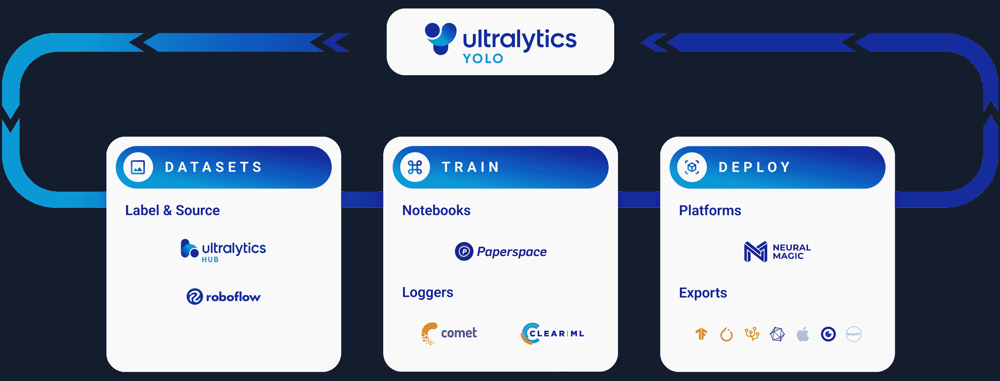

# 使用 Ultralytics YOLO 进行模型验证

> 原文：[`docs.ultralytics.com/modes/val/`](https://docs.ultralytics.com/modes/val/)



## 简介

验证是机器学习流程中的关键步骤，允许您评估训练模型的质量。Ultralytics YOLOv8 的 Val 模式提供了一套强大的工具和指标，用于评估您的目标检测模型的性能。本指南作为一个完整的资源，帮助您有效地使用 Val 模式，确保您的模型既准确又可靠。

[`www.youtube.com/embed/j8uQc0qB91s?start=47`](https://www.youtube.com/embed/j8uQc0qB91s?start=47)

**观看：** Ultralytics 模式教程：验证

## 为什么要使用 Ultralytics YOLO 进行验证？

使用 YOLOv8 的 Val 模式的优势如下：

+   **精度：** 获取像 mAP50、mAP75 和 mAP50-95 这样的准确度指标，全面评估您的模型。

+   **便利性：** 利用内置功能记住训练设置，简化验证流程。

+   **灵活性：** 使用相同或不同的数据集和图像大小验证您的模型。

+   **超参数调整：** 使用验证指标对模型进行微调，以提高性能。

### Val 模式的主要特性

这些是 YOLOv8 的 Val 模式提供的显著功能：

+   **自动设置：** 模型记住其训练配置，使验证过程简单直接。

+   **多指标支持：** 基于一系列准确度指标评估您的模型。

+   **CLI 和 Python API：** 根据您的喜好选择命令行界面或 Python API 进行验证。

+   **数据兼容性：** 与训练阶段使用的数据集以及自定义数据集无缝配合。

小贴士

+   YOLOv8 模型自动记住其训练设置，因此您可以轻松地以相同的图像大小和原始数据集验证模型，只需执行 `yolo val model=yolov8n.pt` 或 `model('yolov8n.pt').val()`

## 使用示例

在 COCO8 数据集上验证训练后的 YOLOv8n 模型的准确性。不需要传递任何参数，因为 `model` 保留其训练 `data` 和参数作为模型属性。请参阅下面的参数部分，了解完整的导出参数列表。

示例

```py
`from ultralytics import YOLO  # Load a model model = YOLO("yolov8n.pt")  # load an official model model = YOLO("path/to/best.pt")  # load a custom model  # Validate the model metrics = model.val()  # no arguments needed, dataset and settings remembered metrics.box.map  # map50-95 metrics.box.map50  # map50 metrics.box.map75  # map75 metrics.box.maps  # a list contains map50-95 of each category` 
```

```py
`yolo  detect  val  model=yolov8n.pt  # val official model yolo  detect  val  model=path/to/best.pt  # val custom model` 
```

## YOLO 模型验证参数

在验证 YOLO 模型时，可以调整多个参数以优化评估过程。这些参数控制诸如输入图像大小、批处理和性能阈值等方面。以下是每个参数的详细说明，帮助您有效地定制验证设置。

| 参数 | 类型 | 默认值 | 描述 |
| --- | --- | --- | --- |
| `data` | `str` | `None` | 指定数据集配置文件的路径（例如 `coco8.yaml`）。该文件包含验证数据的路径、类名以及类的数量。 |
| `imgsz` | `int` | `640` | 定义输入图像的大小。所有图像在处理之前都会被调整到这个尺寸。 |
| `batch` | `int` | `16` | 设置每批图像的数量。使用 `-1` 进行自动批处理，根据 GPU 内存的可用性自动调整。 |
| `save_json` | `bool` | `False` | 如果为 `True`，将结果保存到 JSON 文件，以便进一步分析或与其他工具集成。 |
| `save_hybrid` | `bool` | `False` | 如果为 `True`，保存一个混合版本的标签，将原始注释与额外的模型预测结合起来。 |
| `conf` | `float` | `0.001` | 设置检测的最小置信度阈值。置信度低于此阈值的检测结果将被丢弃。 |
| `iou` | `float` | `0.6` | 设置非极大值抑制（NMS）的交并比（IoU）阈值。有助于减少重复检测结果。 |
| `max_det` | `int` | `300` | 限制每个图像的最大检测数。在密集场景中有助于防止过多的检测结果。 |
| `half` | `bool` | `True` | 启用半精度（FP16）计算，减少内存使用量，可能提高速度，对精度影响最小。 |
| `device` | `str` | `None` | 指定用于验证的设备（`cpu`、`cuda:0` 等）。允许在 CPU 或 GPU 资源中灵活选择。 |
| `dnn` | `bool` | `False` | 如果为 `True`，使用 OpenCV 的 DNN 模块进行 ONNX 模型推理，提供了 PyTorch 推理方法的替代方案。 |
| `plots` | `bool` | `False` | 当设置为 `True` 时，生成并保存预测与地面真实值的图表，以视觉方式评估模型性能。 |
| `rect` | `bool` | `False` | 如果为 `True`，使用矩形推理进行批处理，减少填充，可能提高速度和效率。 |
| `split` | `str` | `val` | 确定用于验证的数据集拆分（`val`、`test` 或 `train`）。允许在选择数据段进行性能评估时灵活选择。 |

这些设置在验证过程中各自扮演重要角色，允许定制化和高效的 YOLO 模型评估。根据您的特定需求和资源调整这些参数可以帮助实现精度和性能的最佳平衡。

### 使用参数进行示例验证

下面的示例展示了在 Python 和 CLI 中使用自定义参数进行 YOLO 模型验证。

示例

```py
`from ultralytics import YOLO  # Load a model model = YOLO("yolov8n.pt")  # Customize validation settings validation_results = model.val(data="coco8.yaml", imgsz=640, batch=16, conf=0.25, iou=0.6, device="0")` 
```

```py
`yolo  val  model=yolov8n.pt  data=coco8.yaml  imgsz=640  batch=16  conf=0.25  iou=0.6  device=0` 
```

## 常见问题解答

### 如何验证我的 YOLOv8 模型使用 Ultralytics？

要验证您的 YOLOv8 模型，可以使用 Ultralytics 提供的 Val 模式。例如，使用 Python API，您可以加载模型并运行验证：

```py
`from ultralytics import YOLO  # Load a model model = YOLO("yolov8n.pt")  # Validate the model metrics = model.val() print(metrics.box.map)  # map50-95` 
```

或者，您可以使用命令行界面（CLI）：

```py
`yolo  val  model=yolov8n.pt` 
```

若要进行进一步定制，可以在 Python 和 CLI 模式下调整诸如 `imgsz`、`batch` 和 `conf` 等各种参数。请查看 YOLO 模型验证参数部分以获取完整的参数列表。

### YOLOv8 模型验证可以得到哪些指标？

YOLOv8 模型验证提供了几个关键指标，用于评估模型性能。这些包括：

+   mAP50（IoU 阈值为 0.5 的平均精度）

+   mAP75（IoU 阈值为 0.75 的平均精度）

+   mAP50-95（跨多个 IoU 阈值从 0.5 到 0.95 的平均精度）

使用 Python API，您可以按以下方式访问这些指标：

```py
``metrics = model.val()  # assumes `model` has been loaded print(metrics.box.map)  # mAP50-95 print(metrics.box.map50)  # mAP50 print(metrics.box.map75)  # mAP75 print(metrics.box.maps)  # list of mAP50-95 for each category`` 
```

对于完整的性能评估，审查所有这些指标至关重要。有关更多详细信息，请参阅 Val Mode 的关键功能。

### 使用 Ultralytics YOLO 进行验证的优势有哪些？

使用 Ultralytics YOLO 进行验证提供了多个优势：

+   **精确性：** YOLOv8 提供准确的性能指标，包括 mAP50、mAP75 和 mAP50-95。

+   **便捷性：** 模型记住它们的训练设置，使验证变得简单直接。

+   **灵活性：** 您可以针对相同或不同的数据集和图像尺寸进行验证。

+   **超参数调整：** 验证指标有助于优化模型以获得更好的性能。

这些优势确保您的模型经过全面评估，并可以优化以获得卓越的结果。详细了解这些优势，请参阅为什么要使用 Ultralytics YOLO 进行验证部分。

### 我可以使用自定义数据集验证我的 YOLOv8 模型吗？

是的，您可以使用自定义数据集验证您的 YOLOv8 模型。请使用`data`参数指定您的数据集配置文件的路径。该文件应包括验证数据的路径、类名和其他相关详细信息。

Python 示例：

```py
`from ultralytics import YOLO  # Load a model model = YOLO("yolov8n.pt")  # Validate with a custom dataset metrics = model.val(data="path/to/your/custom_dataset.yaml") print(metrics.box.map)  # map50-95` 
```

CLI 示例：

```py
`yolo  val  model=yolov8n.pt  data=path/to/your/custom_dataset.yaml` 
```

对于在验证过程中更可定制的选项，请参阅示例验证参数部分。

### 如何在 YOLOv8 中将验证结果保存到 JSON 文件？

要将验证结果保存到 JSON 文件中，在运行验证时，可以将`save_json`参数设置为`True`。无论是在 Python API 还是 CLI 中均可完成此操作。

Python 示例：

```py
`from ultralytics import YOLO  # Load a model model = YOLO("yolov8n.pt")  # Save validation results to JSON metrics = model.val(save_json=True)` 
```

CLI 示例：

```py
`yolo  val  model=yolov8n.pt  save_json=True` 
```

此功能特别适用于进一步分析或与其他工具集成。有关更多详细信息，请查看 YOLO 模型验证参数部分。
