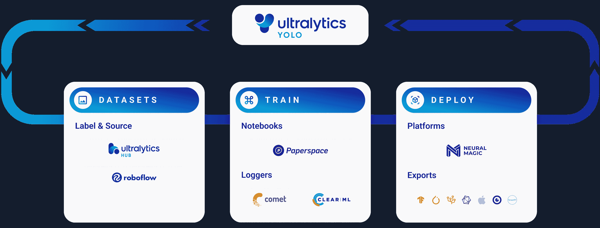
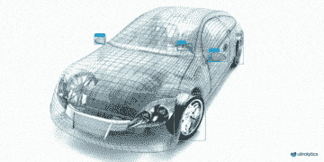
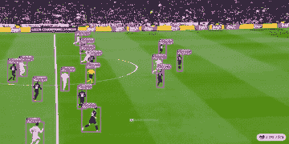
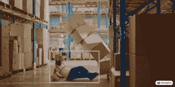

# 使用 Ultralytics YOLO 进行模型预测

> 原文：[`docs.ultralytics.com/modes/predict/`](https://docs.ultralytics.com/modes/predict/)



## 介绍

在机器学习和计算机视觉领域，从视觉数据中获取信息的过程称为“推理”或“预测”。Ultralytics YOLOv8 提供了一个强大的功能，称为**预测模式**，专为在广泛的数据源上进行高性能、实时推理而设计。

[`www.youtube.com/embed/QtsI0TnwDZs?si=ljesw75cMO2Eas14`](https://www.youtube.com/embed/QtsI0TnwDZs?si=ljesw75cMO2Eas14)

**观看：** 如何从 Ultralytics YOLOv8 模型中提取自定义项目的输出。

## 实际应用场景

| 制造业 | 体育 | 安全 |
| --- | --- | --- |
|  |  |  |
| 车辆零部件检测 | 足球运动员检测 | 人员摔倒检测 |

## 为什么要使用 Ultralytics YOLO 进行推理？

以下是考虑使用 YOLOv8 预测模式满足各种推理需求的原因：

+   **多功能性：** 能够对图像、视频甚至实时流进行推理。

+   **性能：** 针对实时高速处理而设计，同时保持精度。

+   **易于使用：** 提供直观的 Python 和 CLI 界面，用于快速部署和测试。

+   **高度可定制：** 可根据您的具体要求调整模型推理行为的各种设置和参数。

### 预测模式的关键特性

YOLOv8 的预测模式设计坚固多变，具备以下特点：

+   **多数据源兼容性：** 无论您的数据是单独的图像、图像集合、视频文件还是实时视频流，预测模式都能覆盖。

+   **流模式：** 使用流特性生成内存高效的`Results`对象的生成器。通过在预测器的调用方法中设置`stream=True`来启用此功能。

+   **批处理处理：** 能够在单个批次中处理多个图像或视频帧，进一步加快推理时间。

+   **集成友好：** 由于其灵活的 API，可以轻松集成到现有的数据流水线和其他软件组件中。

Ultralytics YOLO 模型返回的结果可以是 Python 列表的`Results`对象，或者当在推理过程中传递`stream=True`给模型时，返回内存高效的`Results`对象的 Python 生成器：

预测

```py
`from ultralytics import YOLO  # Load a model model = YOLO("yolov8n.pt")  # pretrained YOLOv8n model  # Run batched inference on a list of images results = model(["im1.jpg", "im2.jpg"])  # return a list of Results objects  # Process results list for result in results:     boxes = result.boxes  # Boxes object for bounding box outputs     masks = result.masks  # Masks object for segmentation masks outputs     keypoints = result.keypoints  # Keypoints object for pose outputs     probs = result.probs  # Probs object for classification outputs     obb = result.obb  # Oriented boxes object for OBB outputs     result.show()  # display to screen     result.save(filename="result.jpg")  # save to disk` 
```

```py
`from ultralytics import YOLO  # Load a model model = YOLO("yolov8n.pt")  # pretrained YOLOv8n model  # Run batched inference on a list of images results = model(["im1.jpg", "im2.jpg"], stream=True)  # return a generator of Results objects  # Process results generator for result in results:     boxes = result.boxes  # Boxes object for bounding box outputs     masks = result.masks  # Masks object for segmentation masks outputs     keypoints = result.keypoints  # Keypoints object for pose outputs     probs = result.probs  # Probs object for classification outputs     obb = result.obb  # Oriented boxes object for OBB outputs     result.show()  # display to screen     result.save(filename="result.jpg")  # save to disk` 
```

## 推理来源

YOLOv8 可以处理不同类型的输入源进行推理，如下表所示。这些源包括静态图像、视频流和各种数据格式。表格还指示了是否可以使用`stream=True`参数在流模式下使用每个源 ✅。流模式对于处理视频或直播流非常有用，因为它创建了一个结果生成器，而不是将所有帧加载到内存中。

提示

对于处理长视频或大型数据集，可以使用`stream=True`来高效管理内存。当`stream=False`时，所有帧或数据点的结果都会存储在内存中，这可能会快速累积并导致大输入时的内存不足错误。相比之下，`stream=True`利用生成器，只在内存中保留当前帧或数据点的结果，大大减少内存消耗并防止内存不足问题。

| 源 | 示例 | 类型 | 注释 |
| --- | --- | --- | --- |
| 图像 | `'image.jpg'` | `str` 或 `Path` | 单个图像文件。 |
| 网址 | `'https://ultralytics.com/images/bus.jpg'` | `str` | 图像的网址。 |
| 截图 | `'screen'` | `str` | 捕获屏幕截图。 |
| PIL | `Image.open('im.jpg')` | `PIL.Image` | HWC 格式，带有 RGB 通道。 |
| OpenCV | `cv2.imread('im.jpg')` | `np.ndarray` | HWC 格式，带有 BGR 通道 `uint8 (0-255)`。 |
| numpy | `np.zeros((640,1280,3))` | `np.ndarray` | HWC 格式，带有 BGR 通道 `uint8 (0-255)`。 |
| torch | `torch.zeros(16,3,320,640)` | `torch.Tensor` | BCHW 格式，带有 RGB 通道 `float32 (0.0-1.0)`。 |
| CSV | `'sources.csv'` | `str` 或 `Path` | 包含图像、视频或目录路径的 CSV 文件。 |
| video ✅ | `'video.mp4'` | `str` 或 `Path` | MP4、AVI 等视频文件格式。 |
| 目录 ✅ | `'path/'` | `str` 或 `Path` | 包含图像或视频的目录路径。 |
| glob ✅ | `'path/*.jpg'` | `str` | 匹配多个文件的通配符模式。使用 `*` 字符作为通配符。 |
| YouTube ✅ | `'https://youtu.be/LNwODJXcvt4'` | `str` | YouTube 视频的网址。 |
| stream ✅ | `'rtsp://example.com/media.mp4'` | `str` | 用于流协议（如 RTSP、RTMP、TCP 或 IP 地址）的网址。 |
| multi-stream ✅ | `'list.streams'` | `str` 或 `Path` | `*.streams`文本文件，每行一个流的 URL，例如批处理大小为 8 的 8 个流将同时运行。 |

下面是每种源类型的代码示例：

预测源

在图像文件上进行推理。

```py
`from ultralytics import YOLO  # Load a pretrained YOLOv8n model model = YOLO("yolov8n.pt")  # Define path to the image file source = "path/to/image.jpg"  # Run inference on the source results = model(source)  # list of Results objects` 
```

对当前屏幕内容（截图）进行推理。

```py
`from ultralytics import YOLO  # Load a pretrained YOLOv8n model model = YOLO("yolov8n.pt")  # Define current screenshot as source source = "screen"  # Run inference on the source results = model(source)  # list of Results objects` 
```

在远程托管的图像或视频上进行推理。

```py
`from ultralytics import YOLO  # Load a pretrained YOLOv8n model model = YOLO("yolov8n.pt")  # Define remote image or video URL source = "https://ultralytics.com/images/bus.jpg"  # Run inference on the source results = model(source)  # list of Results objects` 
```

对使用 Python Imaging Library（PIL）打开的图像进行推理。

```py
`from PIL import Image  from ultralytics import YOLO  # Load a pretrained YOLOv8n model model = YOLO("yolov8n.pt")  # Open an image using PIL source = Image.open("path/to/image.jpg")  # Run inference on the source results = model(source)  # list of Results objects` 
```

在使用 OpenCV 读取的图像上运行推理。

```py
`import cv2  from ultralytics import YOLO  # Load a pretrained YOLOv8n model model = YOLO("yolov8n.pt")  # Read an image using OpenCV source = cv2.imread("path/to/image.jpg")  # Run inference on the source results = model(source)  # list of Results objects` 
```

在表示为 numpy 数组的图像上运行推理。

```py
`import numpy as np  from ultralytics import YOLO  # Load a pretrained YOLOv8n model model = YOLO("yolov8n.pt")  # Create a random numpy array of HWC shape (640, 640, 3) with values in range [0, 255] and type uint8 source = np.random.randint(low=0, high=255, size=(640, 640, 3), dtype="uint8")  # Run inference on the source results = model(source)  # list of Results objects` 
```

在表示为 PyTorch 张量的图像上运行推理。

```py
`import torch  from ultralytics import YOLO  # Load a pretrained YOLOv8n model model = YOLO("yolov8n.pt")  # Create a random torch tensor of BCHW shape (1, 3, 640, 640) with values in range [0, 1] and type float32 source = torch.rand(1, 3, 640, 640, dtype=torch.float32)  # Run inference on the source results = model(source)  # list of Results objects` 
```

在 CSV 文件中列出的图像、URL、视频和目录集合上进行推理。

```py
`from ultralytics import YOLO  # Load a pretrained YOLOv8n model model = YOLO("yolov8n.pt")  # Define a path to a CSV file with images, URLs, videos and directories source = "path/to/file.csv"  # Run inference on the source results = model(source)  # list of Results objects` 
```

在视频文件上进行推理。通过使用`stream=True`，您可以创建一个 Results 对象的生成器来减少内存使用。

```py
`from ultralytics import YOLO  # Load a pretrained YOLOv8n model model = YOLO("yolov8n.pt")  # Define path to video file source = "path/to/video.mp4"  # Run inference on the source results = model(source, stream=True)  # generator of Results objects` 
```

在目录中的所有图像和视频上运行推断。要还包括子目录中的图像和视频，请使用 glob 模式，例如 `path/to/dir/**/*`。

```py
`from ultralytics import YOLO  # Load a pretrained YOLOv8n model model = YOLO("yolov8n.pt")  # Define path to directory containing images and videos for inference source = "path/to/dir"  # Run inference on the source results = model(source, stream=True)  # generator of Results objects` 
```

对匹配带有 `*` 字符的 glob 表达式的所有图像和视频运行推断。

```py
`from ultralytics import YOLO  # Load a pretrained YOLOv8n model model = YOLO("yolov8n.pt")  # Define a glob search for all JPG files in a directory source = "path/to/dir/*.jpg"  # OR define a recursive glob search for all JPG files including subdirectories source = "path/to/dir/**/*.jpg"  # Run inference on the source results = model(source, stream=True)  # generator of Results objects` 
```

在 YouTube 视频上运行推断。通过使用 `stream=True`，可以创建 Results 对象的生成器，以减少长视频的内存使用。

```py
`from ultralytics import YOLO  # Load a pretrained YOLOv8n model model = YOLO("yolov8n.pt")  # Define source as YouTube video URL source = "https://youtu.be/LNwODJXcvt4"  # Run inference on the source results = model(source, stream=True)  # generator of Results objects` 
```

在远程流媒体源（使用 RTSP、RTMP、TCP 和 IP 地址协议）上运行推断。如果在 `*.streams` 文本文件中提供了多个流，则将运行批处理推断，即 8 个流将以批大小 8 运行，否则单个流将以批大小 1 运行。

```py
`from ultralytics import YOLO  # Load a pretrained YOLOv8n model model = YOLO("yolov8n.pt")  # Single stream with batch-size 1 inference source = "rtsp://example.com/media.mp4"  # RTSP, RTMP, TCP or IP streaming address  # Multiple streams with batched inference (i.e. batch-size 8 for 8 streams) source = "path/to/list.streams"  # *.streams text file with one streaming address per row  # Run inference on the source results = model(source, stream=True)  # generator of Results objects` 
```

## 推断参数

`model.predict()` 在推断时接受多个参数，可用于覆盖默认设置：

示例

```py
`from ultralytics import YOLO  # Load a pretrained YOLOv8n model model = YOLO("yolov8n.pt")  # Run inference on 'bus.jpg' with arguments model.predict("bus.jpg", save=True, imgsz=320, conf=0.5)` 
```

推断参数：

| 参数 | 类型 | 默认值 | 描述 |
| --- | --- | --- | --- |
| `source` | `str` | `'ultralytics/assets'` | 指定推断的数据源。可以是图像路径、视频文件、目录、URL 或用于实时视频流的设备 ID。支持多种格式和来源，适用于不同类型的输入。 |
| `conf` | `float` | `0.25` | 设置检测的最小置信度阈值。置信度低于此阈值的检测对象将被忽略。调整此值有助于减少误检。 |
| `iou` | `float` | `0.7` | 非最大抑制（NMS）的交并比（IoU）阈值。较低的值通过消除重叠的框来减少检测，有助于减少重复检测。 |
| `imgsz` | `int or tuple` | `640` | 定义推断时的图像大小。可以是一个整数 `640` 用于正方形调整，或者是一个 (height, width) 元组。正确的尺寸可以提高检测的准确性和处理速度。 |
| `half` | `bool` | `False` | 启用半精度（FP16）推断，可以在支持的 GPU 上加速模型推断，对准确性影响最小。 |
| `device` | `str` | `None` | 指定推断时使用的设备（例如 `cpu`、`cuda:0` 或 `0`）。允许用户选择在 CPU、特定 GPU 或其他计算设备上执行模型。 |
| `max_det` | `int` | `300` | 每个图像允许的最大检测数。限制模型在单次推断中可以检测的对象总数，避免在密集场景中输出过多对象。 |
| `vid_stride` | `int` | `1` | 视频输入的帧步进。允许跳过视频中的帧以加快处理速度，但会降低时间分辨率。值为 1 表示处理每一帧，更高的值表示跳过帧。 |
| `stream_buffer` | `bool` | `False` | 确定处理视频流时是否应缓冲所有帧 (`True`)，或者模型是否应返回最近的帧 (`False`)。对实时应用非常有用。 |
| `visualize` | `bool` | `False` | 在推理过程中激活模型特征可视化，展示模型所“看到”的内容。用于调试和模型解释。 |
| `augment` | `bool` | `False` | 启用测试时增强（TTA），可能提高检测的鲁棒性但会降低推理速度。 |
| `agnostic_nms` | `bool` | `False` | 启用无关类别的非最大抑制（NMS），合并不同类别的重叠框。适用于多类别检测场景中常见的类别重叠情况。 |
| `classes` | `list[int]` | `None` | 将预测结果过滤为一组类别 ID。仅返回属于指定类别的检测结果。用于多类检测任务中聚焦相关对象。 |
| `retina_masks` | `bool` | `False` | 如果模型可用，使用高分辨率分割掩模。对于分割任务可提供更精细的掩模质量。 |
| `embed` | `list[int]` | `None` | 指定提取特征向量或嵌入的层。用于聚类或相似性搜索等下游任务。 |

可视化参数：

| 参数 | 类型 | 默认值 | 描述 |
| --- | --- | --- | --- |
| `show` | `bool` | `False` | 如果为`True`，在窗口中显示带有注释的图像或视频。用于开发或测试过程中的即时视觉反馈。 |
| `save` | `bool` | `False` | 启用保存带有注释的图像或视频文件。用于文档、进一步分析或共享结果。 |
| `save_frames` | `bool` | `False` | 在处理视频时，将各个帧保存为图像。用于提取特定帧或进行详细的逐帧分析。 |
| `save_txt` | `bool` | `False` | 将检测结果保存为文本文件，格式为`[class] [x_center] [y_center] [width] [height] [confidence]`。用于与其他分析工具集成。 |
| `save_conf` | `bool` | `False` | 在保存的文本文件中包含置信度分数。增强后处理和分析的详细信息。 |
| `save_crop` | `bool` | `False` | 保存检测到的物体的裁剪图像。用于数据增强、分析或创建特定对象的专注数据集。 |
| `show_labels` | `bool` | `True` | 在视觉输出中显示每个检测结果的标签。提供检测到的对象的直观理解。 |
| `show_conf` | `bool` | `True` | 显示每个检测结果的置信度分数和标签。提供模型对每个检测结果的确定性见解。 |
| `show_boxes` | `bool` | `True` | 在检测到的物体周围绘制边界框。对于图像或视频帧中对象的视觉识别和定位至关重要。 |
| `line_width` | `None 或 int` | `None` | 指定边界框的线宽。如果为`None`，则根据图像大小自动调整线宽。提供视觉上的自定义以增强清晰度。 |

## 图像和视频格式

YOLOv8 支持多种图像和视频格式，详见[ultralytics/data/utils.py](https://github.com/ultralytics/ultralytics/blob/main/ultralytics/data/utils.py)。查看下表获取有效后缀和示例预测命令。

### 图像

下表列出了有效的 Ultralytics 图像格式。

| 图像后缀 | 示例预测命令 | 参考 |
| --- | --- | --- |
| `.bmp` | `yolo 预测 源=image.bmp` | [Microsoft BMP 文件格式](https://zh.wikipedia.org/wiki/BMP_file_format) |
| `.dng` | `yolo 预测 源=image.dng` | [Adobe DNG](https://zh.wikipedia.org/wiki/Digital_Negative) |
| `.jpeg` | `yolo 预测 源=image.jpeg` | [JPEG](https://zh.wikipedia.org/wiki/JPEG) |
| `.jpg` | `yolo 预测 源=image.jpg` | [JPEG](https://zh.wikipedia.org/wiki/JPEG) |
| `.mpo` | `yolo 预测 源=image.mpo` | [多图片对象](https://fileinfo.com/extension/mpo) |
| `.png` | `yolo 预测 源=image.png` | [便携式网络图形](https://zh.wikipedia.org/wiki/PNG) |
| `.tif` | `yolo 预测 源=image.tif` | [标签图像文件格式](https://zh.wikipedia.org/wiki/TIFF) |
| `.tiff` | `yolo 预测 源=image.tiff` | [标签图像文件格式](https://zh.wikipedia.org/wiki/TIFF) |
| `.webp` | `yolo 预测 源=image.webp` | [WebP](https://zh.wikipedia.org/wiki/WebP) |
| `.pfm` | `yolo 预测 源=image.pfm` | [便携式浮点图](https://zh.wikipedia.org/wiki/Netpbm#File_formats) |

### 视频

下表列出了有效的 Ultralytics 视频格式。

| 视频后缀 | 示例预测命令 | 参考 |
| --- | --- | --- |
| `.asf` | `yolo 预测 源=video.asf` | [高级系统格式](https://zh.wikipedia.org/wiki/Advanced_Systems_Format) |
| `.avi` | `yolo 预测 源=video.avi` | [音频视频交互式格式](https://zh.wikipedia.org/wiki/Audio_Video_Interleave) |
| `.gif` | `yolo 预测 源=video.gif` | [图形交换格式](https://zh.wikipedia.org/wiki/GIF) |
| `.m4v` | `yolo 预测 源=video.m4v` | [MPEG-4 第十四部分](https://zh.wikipedia.org/wiki/M4V) |
| `.mkv` | `yolo 预测 源=video.mkv` | [Matroska](https://zh.wikipedia.org/wiki/Matroska) |
| `.mov` | `yolo 预测 源=video.mov` | [QuickTime 文件格式](https://zh.wikipedia.org/wiki/QuickTime_File_Format) |
| `.mp4` | `yolo 预测 源=video.mp4` | [MPEG-4 第十四部分 - Wikipedia](https://zh.wikipedia.org/wiki/MPEG-4_Part_14) |
| `.mpeg` | `yolo 预测 源=video.mpeg` | [MPEG-1 第二部分](https://zh.wikipedia.org/wiki/MPEG-1) |
| `.mpg` | `yolo 预测 源=video.mpg` | [MPEG-1 第二部分](https://zh.wikipedia.org/wiki/MPEG-1) |
| `.ts` | `yolo 预测 源=video.ts` | [MPEG 传输流](https://zh.wikipedia.org/wiki/MPEG_transport_stream) |
| `.wmv` | `yolo 预测 源=video.wmv` | [Windows 媒体视频](https://zh.wikipedia.org/wiki/Windows_Media_Video) |
| `.webm` | `yolo 预测 源=video.webm` | [WebM 项目](https://zh.wikipedia.org/wiki/WebM) |

## 处理结果

所有 Ultralytics 的 `predict()` 调用将返回 `Results` 对象的列表：

Results

```py
`from ultralytics import YOLO  # Load a pretrained YOLOv8n model model = YOLO("yolov8n.pt")  # Run inference on an image results = model("bus.jpg")  # list of 1 Results object results = model(["bus.jpg", "zidane.jpg"])  # list of 2 Results objects` 
```

`Results` 对象具有以下属性：

| 属性 | 类型 | 描述 |
| --- | --- | --- |
| `orig_img` | `numpy.ndarray` | 原始图像的 numpy 数组。 |
| `orig_shape` | `tuple` | 原始图像形状，格式为 (height, width)。 |
| `boxes` | `Boxes, optional` | 包含检测边界框的 Boxes 对象。 |
| `masks` | `Masks, optional` | 包含检测遮罩的 Masks 对象。 |
| `probs` | `Probs, optional` | 包含分类任务每个类别概率的 Probs 对象。 |
| `keypoints` | `Keypoints, optional` | 包含每个对象检测关键点的 Keypoints 对象。 |
| `obb` | `OBB, optional` | 包含有向边界框的 OBB 对象。 |
| `speed` | `dict` | 预处理、推断和后处理速度的毫秒数字典。 |
| `names` | `dict` | 类名字典。 |
| `path` | `str` | 图像文件的路径。 |

`Results` 对象具有以下方法：

| 方法 | 返回类型 | 描述 |
| --- | --- | --- |
| `update()` | `None` | 更新结果对象的 boxes、masks 和 probs 属性。 |
| `cpu()` | `Results` | 返回所有张量在 CPU 内存上的 Results 对象副本。 |
| `numpy()` | `Results` | 返回所有张量转换为 numpy 数组的 Results 对象副本。 |
| `cuda()` | `Results` | 返回所有张量在 GPU 内存上的 Results 对象副本。 |
| `to()` | `Results` | 返回所有张量在指定设备和数据类型上的 Results 对象副本。 |
| `new()` | `Results` | 返回具有相同图像、路径和名称的新 Results 对象。 |
| `plot()` | `numpy.ndarray` | 绘制检测结果。返回带注释的图像的 numpy 数组。 |
| `show()` | `None` | 在屏幕上显示注释结果。 |
| `save()` | `None` | 将注释结果保存到文件。 |
| `verbose()` | `str` | 返回每个任务的日志字符串。 |
| `save_txt()` | `None` | 将预测保存到 txt 文件中。 |
| `save_crop()` | `None` | 将裁剪后的预测保存到 `save_dir/cls/file_name.jpg`。 |
| `tojson()` | `str` | 将对象转换为 JSON 格式。 |

有关更多详情，请参阅 `Results` 类的文档。

### Boxes

`Boxes` 对象可用于索引、操作和将边界框转换为不同格式。

Boxes

```py
`from ultralytics import YOLO  # Load a pretrained YOLOv8n model model = YOLO("yolov8n.pt")  # Run inference on an image results = model("bus.jpg")  # results list  # View results for r in results:     print(r.boxes)  # print the Boxes object containing the detection bounding boxes` 
```

下面是 `Boxes` 类的方法和属性的表格，包括它们的名称、类型和描述：

| 名称 | 类型 | 描述 |
| --- | --- | --- |
| `cpu()` | 方法 | 将对象移动到 CPU 内存。 |
| `numpy()` | 方法 | 将对象转换为 numpy 数组。 |
| `cuda()` | 方法 | 将对象移动到 CUDA 内存。 |
| `to()` | 方法 | 将对象移动到指定设备。 |
| `xyxy` | 属性 (`torch.Tensor`) | 返回 xyxy 格式的边界框。 |
| `conf` | 属性 (`torch.Tensor`) | 返回边界框的置信度值。 |
| `cls` | 属性 (`torch.Tensor`) | 返回边界框的类别值。 |
| `id` | 属性 (`torch.Tensor`) | 返回框的轨迹 ID（如果可用）。 |
| `xywh` | 属性 (`torch.Tensor`) | 返回 xywh 格式的框。 |
| `xyxyn` | 属性 (`torch.Tensor`) | 返回以原始图像大小归一化的 xyxy 格式的框。 |
| `xywhn` | 属性 (`torch.Tensor`) | 返回以原始图像大小归一化的 xywh 格式的框。 |

更多详情请参阅 `Boxes` 类文档。

### 掩码

`Masks` 对象可用于索引、操作和将掩码转换为分段。

掩码

```py
`from ultralytics import YOLO  # Load a pretrained YOLOv8n-seg Segment model model = YOLO("yolov8n-seg.pt")  # Run inference on an image results = model("bus.jpg")  # results list  # View results for r in results:     print(r.masks)  # print the Masks object containing the detected instance masks` 
```

下面是 `Masks` 类方法和属性的表格，包括它们的名称、类型和描述：

| 名称 | 类型 | 描述 |
| --- | --- | --- |
| `cpu()` | 方法 | 返回在 CPU 内存上的掩码张量。 |
| `numpy()` | 方法 | 将掩码张量返回为 numpy 数组。 |
| `cuda()` | 方法 | 返回在 GPU 内存上的掩码张量。 |
| `to()` | 方法 | 返回指定设备和数据类型的掩码张量。 |
| `xyn` | 属性 (`torch.Tensor`) | 归一化分段列表，表示为张量。 |
| `xy` | 属性 (`torch.Tensor`) | 像素坐标表示的分段列表，表示为张量。 |

更多详情请参阅 `Masks` 类文档。

### 关键点

`Keypoints` 对象可用于索引、操作和标准化坐标。

关键点

```py
`from ultralytics import YOLO  # Load a pretrained YOLOv8n-pose Pose model model = YOLO("yolov8n-pose.pt")  # Run inference on an image results = model("bus.jpg")  # results list  # View results for r in results:     print(r.keypoints)  # print the Keypoints object containing the detected keypoints` 
```

下面是总结 `Keypoints` 类方法和属性的表格，包括它们的名称、类型和描述：

| 名称 | 类型 | 描述 |
| --- | --- | --- |
| `cpu()` | 方法 | 返回在 CPU 内存上的关键点张量。 |
| `numpy()` | 方法 | 将关键点张量返回为 numpy 数组。 |
| `cuda()` | 方法 | 返回在 GPU 内存上的关键点张量。 |
| `to()` | 方法 | 返回指定设备和数据类型的关键点张量。 |
| `xyn` | 属性 (`torch.Tensor`) | 归一化关键点列表，表示为张量。 |
| `xy` | 属性 (`torch.Tensor`) | 像素坐标表示的关键点列表，表示为张量。 |
| `conf` | 属性 (`torch.Tensor`) | 如果可用，则返回关键点的置信度值，否则返回 None。 |

更多详情请参阅 `Keypoints` 类文档。

### Probs

`Probs` 对象可用于索引、获取分类的 `top1` 和 `top5` 索引及分数。

Probs

```py
`from ultralytics import YOLO  # Load a pretrained YOLOv8n-cls Classify model model = YOLO("yolov8n-cls.pt")  # Run inference on an image results = model("bus.jpg")  # results list  # View results for r in results:     print(r.probs)  # print the Probs object containing the detected class probabilities` 
```

下面是总结 `Probs` 类方法和属性的表格：

| 名称 | 类型 | 描述 |
| --- | --- | --- |
| `cpu()` | 方法 | 返回在 CPU 内存上的概率张量的副本。 |
| `numpy()` | 方法 | 将概率张量的副本返回为 numpy 数组。 |
| `cuda()` | 方法 | 返回在 GPU 内存上的概率张量的副本。 |
| `to()` | 方法 | 返回指定设备和数据类型的概率张量的副本。 |
| `top1` | 属性 (`int`) | 最高类别的索引。 |
| `top5` | 属性 (`list[int]`) | 前五个类别的索引。 |
| `top1conf` | 属性 (`torch.Tensor`) | 最高类别的置信度。 |
| `top5conf` | 属性 (`torch.Tensor`) | 前五个类别的置信度。 |

要了解更多详情，请参阅`Probs`类文档。

### `OBB`

`OBB`对象可用于索引、操作和将定向边界框转换为不同格式。

`OBB`

```py
`from ultralytics import YOLO  # Load a pretrained YOLOv8n model model = YOLO("yolov8n-obb.pt")  # Run inference on an image results = model("bus.jpg")  # results list  # View results for r in results:     print(r.obb)  # print the OBB object containing the oriented detection bounding boxes` 
```

这里是`OBB`类的方法和属性表，包括它们的名称、类型和描述：

| 名称 | 类型 | 描述 |
| --- | --- | --- |
| `cpu()` | 方法 | 将对象移动到 CPU 内存。 |
| `numpy()` | 方法 | 将对象转换为 numpy 数组。 |
| `cuda()` | 方法 | 将对象移动到 CUDA 内存。 |
| `to()` | 方法 | 将对象移动到指定设备。 |
| `conf` | 属性（`torch.Tensor`） | 返回边界框的置信度值。 |
| `cls` | 属性（`torch.Tensor`） | 返回边界框的类别值。 |
| `id` | 属性（`torch.Tensor`） | 返回边界框的跟踪 ID（如果可用）。 |
| `xyxy` | 属性（`torch.Tensor`） | 返回 xyxy 格式的水平框。 |
| `xywhr` | 属性（`torch.Tensor`） | 返回 xywhr 格式的旋转框。 |
| `xyxyxyxy` | 属性（`torch.Tensor`） | 返回 xyxyxyxy 格式的旋转框。 |
| `xyxyxyxyn` | 属性（`torch.Tensor`） | 返回归一化为图像大小的 xyxyxyxy 格式的旋转框。 |

要了解更多详情，请参阅`OBB`类文档。

## 绘制结果

`Results`对象中的`plot()`方法通过将检测到的对象（如边界框、掩码、关键点和概率）叠加到原始图像上，便于可视化预测。该方法将带注释的图像作为 NumPy 数组返回，方便显示或保存。

绘图

```py
`from PIL import Image  from ultralytics import YOLO  # Load a pretrained YOLOv8n model model = YOLO("yolov8n.pt")  # Run inference on 'bus.jpg' results = model(["bus.jpg", "zidane.jpg"])  # results list  # Visualize the results for i, r in enumerate(results):     # Plot results image     im_bgr = r.plot()  # BGR-order numpy array     im_rgb = Image.fromarray(im_bgr[..., ::-1])  # RGB-order PIL image      # Show results to screen (in supported environments)     r.show()      # Save results to disk     r.save(filename=f"results{i}.jpg")` 
```

### `plot()`方法参数

`plot()`方法支持各种参数以自定义输出：

| 参数 | 类型 | 描述 | 默认值 |
| --- | --- | --- | --- |
| `conf` | `bool` | 包括检测置信度分数。 | `True` |
| `line_width` | `float` | 边界框的线宽。如果为`None`，则随着图像大小缩放。 | `None` |
| `font_size` | `float` | 文本字体大小。如果为`None`，则随着图像大小缩放。 | `None` |
| `font` | `str` | 文本注释的字体名称。 | `'Arial.ttf'` |
| `pil` | `bool` | 返回图像作为 PIL 图像对象。 | `False` |
| `img` | `numpy.ndarray` | 用于绘图的替代图像。如果为`None`，则使用原始图像。 | `None` |
| `im_gpu` | `torch.Tensor` | GPU 加速的图像，用于更快的掩码绘制。形状：（1, 3, 640, 640）。 | `None` |
| `kpt_radius` | `int` | 绘制关键点的半径。 | `5` |
| `kpt_line` | `bool` | 使用线连接关键点。 | `True` |
| `labels` | `bool` | 在注释中包含类标签。 | `True` |
| `boxes` | `bool` | 在图像上叠加边界框。 | `True` |
| `masks` | `bool` | 在图像上叠加掩码。 | `True` |
| `probs` | `bool` | 包括分类概率。 | `True` |
| `show` | `bool` | 直接使用默认图像查看器显示带注释的图像。 | `False` |
| `save` | `bool` | 将带注释的图像保存到由`filename`指定的文件中。 | `False` |
| `filename` | `str` | 如果 `save` 为 `True`，保存带注释图像的文件的路径和名称。 | `None` |

## 线程安全推理

当您在不同线程上并行运行多个 YOLO 模型时，确保推理的线程安全性至关重要。线程安全推理确保每个线程的预测是隔离的，不会互相干扰，从而避免竞态条件，并确保输出一致和可靠。

当在多线程应用程序中使用 YOLO 模型时，重要的是为每个线程实例化单独的模型对象或使用线程本地存储来避免冲突：

线程安全推理

在每个线程内部实例化单个模型以实现线程安全推理：

```py
`from threading import Thread  from ultralytics import YOLO   def thread_safe_predict(image_path):   """Performs thread-safe prediction on an image using a locally instantiated YOLO model."""     local_model = YOLO("yolov8n.pt")     results = local_model.predict(image_path)     # Process results   # Starting threads that each have their own model instance Thread(target=thread_safe_predict, args=("image1.jpg",)).start() Thread(target=thread_safe_predict, args=("image2.jpg",)).start()` 
```

深入了解 YOLO 模型的线程安全推理和逐步指南，请参阅我们的 YOLO 线程安全推理指南。该指南将为您提供避免常见问题并确保多线程推理顺利运行的所有必要信息。

## 流式源 `for` 循环

这是一个使用 OpenCV (`cv2`) 和 YOLOv8 运行视频帧推理的 Python 脚本。该脚本假设您已经安装了必要的包 (`opencv-python` 和 `ultralytics`)。

流式 for 循环

```py
`import cv2  from ultralytics import YOLO  # Load the YOLOv8 model model = YOLO("yolov8n.pt")  # Open the video file video_path = "path/to/your/video/file.mp4" cap = cv2.VideoCapture(video_path)  # Loop through the video frames while cap.isOpened():     # Read a frame from the video     success, frame = cap.read()      if success:         # Run YOLOv8 inference on the frame         results = model(frame)          # Visualize the results on the frame         annotated_frame = results[0].plot()          # Display the annotated frame         cv2.imshow("YOLOv8 Inference", annotated_frame)          # Break the loop if 'q' is pressed         if cv2.waitKey(1) & 0xFF == ord("q"):             break     else:         # Break the loop if the end of the video is reached         break  # Release the video capture object and close the display window cap.release() cv2.destroyAllWindows()` 
```

该脚本将对视频的每一帧进行预测，可视化结果，并在窗口中显示。通过按下 'q' 键可以退出循环。

## 常见问题解答（FAQ）

### Ultralytics YOLOv8 及其用于实时推理的预测模式是什么？

Ultralytics YOLOv8 是一种用于实时对象检测、分割和分类的先进模型。其**预测模式**允许用户在诸如图像、视频和实时流等多种数据源上进行高速推理。设计用于性能和多功能性，还提供批处理处理和流模式。有关其特性的更多详情，请查看 Ultralytics YOLOv8 预测模式。

### 如何在不同数据源上使用 Ultralytics YOLOv8 进行推理？

Ultralytics YOLOv8 可处理多种数据源，包括单个图像、视频、目录、URL 和流。您可以在 `model.predict()` 调用中指定数据源。例如，使用 `'image.jpg'` 表示本地图像，`'https://ultralytics.com/images/bus.jpg'` 表示 URL。请查看文档中有关各种推理源的详细示例。

### 如何优化 YOLOv8 推理速度和内存使用？

为了优化推理速度并有效管理内存，您可以在预测器的调用方法中设置 `stream=True` 来使用流模式。流模式生成一个内存高效的 `Results` 对象生成器，而不是将所有帧加载到内存中。对于处理长视频或大型数据集，流模式特别有用。了解更多关于流模式的信息。

### Ultralytics YOLOv8 支持哪些推理参数？

YOLOv8 中的 `model.predict()` 方法支持各种参数，例如 `conf`、`iou`、`imgsz`、`device` 等。这些参数允许您自定义推断过程，设置诸如置信阈值、图像大小和用于计算的设备等参数。关于这些参数的详细描述可以在推断参数部分找到。

### 如何可视化和保存 YOLOv8 预测结果？

在使用 YOLOv8 进行推断后，`Results` 对象包含用于显示和保存带注释图像的方法。您可以使用诸如 `result.show()` 和 `result.save(filename="result.jpg")` 的方法来可视化和保存结果。有关这些方法的详细列表，请参阅处理结果部分。
