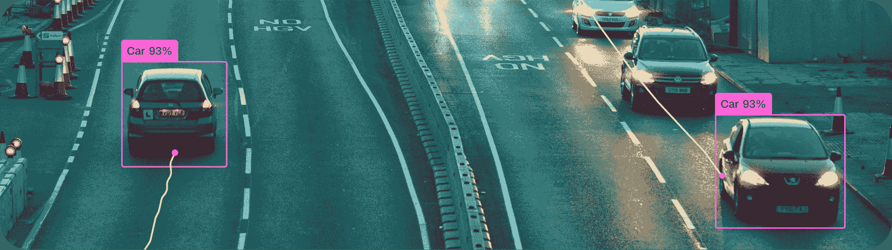
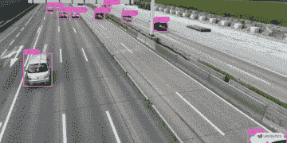
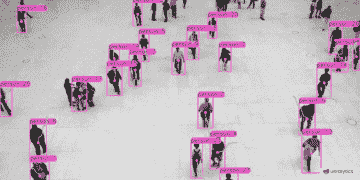
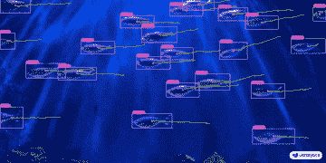

# 多目标跟踪与 Ultralytics YOLO

> 原文：[`docs.ultralytics.com/modes/track/`](https://docs.ultralytics.com/modes/track/)



在视频分析领域中进行对象跟踪是一个关键任务，不仅可以确定帧内对象的位置和类别，还可以在视频进展中为每个检测到的对象维护唯一的 ID。应用广泛，从监控和安全到实时体育分析。

## 为什么选择 Ultralytics YOLO 进行对象跟踪？

Ultralytics 跟踪器的输出与标准对象检测一致，但增加了对象 ID 的价值。这使得在视频流中跟踪对象并进行后续分析变得更加容易。以下是您考虑使用 Ultralytics YOLO 进行对象跟踪的原因：

+   **效率：** 实时处理视频流，而不影响准确性。

+   **灵活性：** 支持多个跟踪算法和配置。

+   **易于使用：** 简单的 Python API 和 CLI 选项，快速集成和部署。

+   **可定制性：** 使用自定义训练的 YOLO 模型易于使用，可集成到特定领域的应用程序中。

[`www.youtube.com/embed/hHyHmOtmEgs?si=VNZtXmm45Nb9s-N-`](https://www.youtube.com/embed/hHyHmOtmEgs?si=VNZtXmm45Nb9s-N-)

**观看：** 使用 Ultralytics YOLOv8 进行对象检测和跟踪。

## 现实世界的应用

| 交通运输 | 零售 | 水产养殖 |
| --- | --- | --- |
|  |  |  |
| 车辆跟踪 | 人员跟踪 | 鱼类跟踪 |

## 特点一览

Ultralytics YOLO 通过扩展其对象检测功能来提供强大而多功能的对象跟踪：

+   **实时跟踪：** 在高帧率视频中无缝跟踪对象。

+   **多跟踪器支持：** 可选择多种成熟的跟踪算法。

+   **可定制的跟踪器配置：** 通过调整各种参数来定制跟踪算法，以满足特定需求。

## 可用的跟踪器

Ultralytics YOLO 支持以下跟踪算法。可以通过传递相关的 YAML 配置文件如`tracker=tracker_type.yaml`来启用它们：

+   [BoT-SORT](https://github.com/NirAharon/BoT-SORT) - 使用`botsort.yaml`来启用该跟踪器。

+   [ByteTrack](https://github.com/ifzhang/ByteTrack) - 使用`bytetrack.yaml`来启用该跟踪器。

默认跟踪器是 BoT-SORT。

## 跟踪

跟踪器阈值信息

如果对象置信度得分低于[`track_high_thresh`](https://github.com/ultralytics/ultralytics/blob/main/ultralytics/cfg/trackers/bytetrack.yaml#L5)，则将不会成功返回和更新跟踪。

要在视频流上运行跟踪器，请使用训练有素的 Detect、Segment 或 Pose 模型，例如 YOLOv8n、YOLOv8n-seg 和 YOLOv8n-pose。

示例

```py
from ultralytics import YOLO

# Load an official or custom model
model = YOLO("yolov8n.pt")  # Load an official Detect model
model = YOLO("yolov8n-seg.pt")  # Load an official Segment model
model = YOLO("yolov8n-pose.pt")  # Load an official Pose model
model = YOLO("path/to/best.pt")  # Load a custom trained model

# Perform tracking with the model
results = model.track("https://youtu.be/LNwODJXcvt4", show=True)  # Tracking with default tracker
results = model.track("https://youtu.be/LNwODJXcvt4", show=True, tracker="bytetrack.yaml")  # with ByteTrack 
```

```py
# Perform tracking with various models using the command line interface
yolo  track  model=yolov8n.pt  source="https://youtu.be/LNwODJXcvt4"  # Official Detect model
yolo  track  model=yolov8n-seg.pt  source="https://youtu.be/LNwODJXcvt4"  # Official Segment model
yolo  track  model=yolov8n-pose.pt  source="https://youtu.be/LNwODJXcvt4"  # Official Pose model
yolo  track  model=path/to/best.pt  source="https://youtu.be/LNwODJXcvt4"  # Custom trained model

# Track using ByteTrack tracker
yolo  track  model=path/to/best.pt  tracker="bytetrack.yaml" 
```

如上使用中所示，跟踪适用于在视频或流媒体源上运行的所有检测、分割和姿态模型。

## 配置

跟踪器阈值信息

如果对象的置信度得分低，即低于 [`track_high_thresh`](https://github.com/ultralytics/ultralytics/blob/main/ultralytics/cfg/trackers/bytetrack.yaml#L5)，则不会成功返回和更新任何轨迹。

### 跟踪参数

跟踪配置与预测模式相似，例如 `conf`、`iou` 和 `show`。有关进一步的配置，请参阅预测模型页面。

示例

```py
from ultralytics import YOLO

# Configure the tracking parameters and run the tracker
model = YOLO("yolov8n.pt")
results = model.track(source="https://youtu.be/LNwODJXcvt4", conf=0.3, iou=0.5, show=True) 
```

```py
# Configure tracking parameters and run the tracker using the command line interface
yolo  track  model=yolov8n.pt  source="https://youtu.be/LNwODJXcvt4"  conf=0.3,  iou=0.5  show 
```

### 跟踪器选择

Ultralytics 还允许您使用修改后的跟踪器配置文件。要做到这一点，只需从 [ultralytics/cfg/trackers](https://github.com/ultralytics/ultralytics/tree/main/ultralytics/cfg/trackers) 复制跟踪器配置文件（例如 `custom_tracker.yaml`），并根据需要修改任何配置（除了 `tracker_type`）。

示例

```py
from ultralytics import YOLO

# Load the model and run the tracker with a custom configuration file
model = YOLO("yolov8n.pt")
results = model.track(source="https://youtu.be/LNwODJXcvt4", tracker="custom_tracker.yaml") 
```

```py
# Load the model and run the tracker with a custom configuration file using the command line interface
yolo  track  model=yolov8n.pt  source="https://youtu.be/LNwODJXcvt4"  tracker='custom_tracker.yaml' 
```

有关跟踪参数的全面列表，请参阅 [ultralytics/cfg/trackers](https://github.com/ultralytics/ultralytics/tree/main/ultralytics/cfg/trackers) 页面。

## Python 示例

### 持续跟踪循环

这是一个使用 OpenCV (`cv2`) 和 YOLOv8 在视频帧上运行对象跟踪的 Python 脚本。此脚本假定您已经安装了必要的软件包 (`opencv-python` 和 `ultralytics`)。`persist=True` 参数告诉跟踪器当前图像或帧是序列中的下一帧，并且在当前图像中期望来自上一帧的轨迹。

使用跟踪的流式循环

```py
import cv2

from ultralytics import YOLO

# Load the YOLOv8 model
model = YOLO("yolov8n.pt")

# Open the video file
video_path = "path/to/video.mp4"
cap = cv2.VideoCapture(video_path)

# Loop through the video frames
while cap.isOpened():
    # Read a frame from the video
    success, frame = cap.read()

    if success:
        # Run YOLOv8 tracking on the frame, persisting tracks between frames
        results = model.track(frame, persist=True)

        # Visualize the results on the frame
        annotated_frame = results[0].plot()

        # Display the annotated frame
        cv2.imshow("YOLOv8 Tracking", annotated_frame)

        # Break the loop if 'q' is pressed
        if cv2.waitKey(1) & 0xFF == ord("q"):
            break
    else:
        # Break the loop if the end of the video is reached
        break

# Release the video capture object and close the display window
cap.release()
cv2.destroyAllWindows() 
```

请注意从 `model(frame)` 更改为 `model.track(frame)`，这将启用对象跟踪而不是简单的检测。这个修改后的脚本将在视频的每一帧上运行跟踪器，可视化结果，并在窗口中显示它们。可以通过按下 'q' 键来退出循环。

### 随时间绘制轨迹

在连续帧上可视化对象轨迹可以为视频中检测到的对象的移动模式和行为提供宝贵的见解。通过 Ultralytics YOLOv8，绘制这些轨迹是一个无缝且高效的过程。

在以下示例中，我们演示如何利用 YOLOv8 的跟踪能力在多个视频帧上绘制检测到的对象的移动。该脚本涉及打开视频文件，逐帧读取并利用 YOLO 模型识别和跟踪各种对象。通过保留检测到的边界框的中心点并连接它们，我们可以绘制代表被跟踪对象路径的线条。

在多个视频帧上绘制轨迹

```py
from collections import defaultdict

import cv2
import numpy as np

from ultralytics import YOLO

# Load the YOLOv8 model
model = YOLO("yolov8n.pt")

# Open the video file
video_path = "path/to/video.mp4"
cap = cv2.VideoCapture(video_path)

# Store the track history
track_history = defaultdict(lambda: [])

# Loop through the video frames
while cap.isOpened():
    # Read a frame from the video
    success, frame = cap.read()

    if success:
        # Run YOLOv8 tracking on the frame, persisting tracks between frames
        results = model.track(frame, persist=True)

        # Get the boxes and track IDs
        boxes = results[0].boxes.xywh.cpu()
        track_ids = results[0].boxes.id.int().cpu().tolist()

        # Visualize the results on the frame
        annotated_frame = results[0].plot()

        # Plot the tracks
        for box, track_id in zip(boxes, track_ids):
            x, y, w, h = box
            track = track_history[track_id]
            track.append((float(x), float(y)))  # x, y center point
            if len(track) > 30:  # retain 90 tracks for 90 frames
                track.pop(0)

            # Draw the tracking lines
            points = np.hstack(track).astype(np.int32).reshape((-1, 1, 2))
            cv2.polylines(annotated_frame, [points], isClosed=False, color=(230, 230, 230), thickness=10)

        # Display the annotated frame
        cv2.imshow("YOLOv8 Tracking", annotated_frame)

        # Break the loop if 'q' is pressed
        if cv2.waitKey(1) & 0xFF == ord("q"):
            break
    else:
        # Break the loop if the end of the video is reached
        break

# Release the video capture object and close the display window
cap.release()
cv2.destroyAllWindows() 
```

### 多线程跟踪

多线程跟踪提供了同时在多个视频流上运行对象跟踪的能力。这在处理多个视频输入时特别有用，例如来自多个监控摄像头的视频，其中并行处理可以极大地提高效率和性能。

在提供的 Python 脚本中，我们利用 Python 的 `threading` 模块同时运行多个跟踪器实例。每个线程负责在一个视频文件上运行跟踪器，所有线程在后台同时运行。

为确保每个线程接收到正确的参数（视频文件、要使用的模型和文件索引），我们定义了一个函数 `run_tracker_in_thread`，接受这些参数并包含主要的跟踪循环。此函数逐帧读取视频，运行跟踪器并显示结果。

此示例中使用了两种不同的模型：`yolov8n.pt` 和 `yolov8n-seg.pt`，分别在不同的视频文件中跟踪对象。视频文件由 `video_file1` 和 `video_file2` 指定。

`threading.Thread` 中的 `daemon=True` 参数意味着这些线程会在主程序完成后立即关闭。然后我们使用 `start()` 启动线程，并使用 `join()` 让主线程等待两个追踪线程都完成。

最后，在所有线程完成任务后，使用 `cv2.destroyAllWindows()` 关闭显示结果的窗口。

带跟踪的流式循环

```py
import threading

import cv2

from ultralytics import YOLO

def run_tracker_in_thread(filename, model, file_index):
  """
 Runs a video file or webcam stream concurrently with the YOLOv8 model using threading.

 This function captures video frames from a given file or camera source and utilizes the YOLOv8 model for object
 tracking. The function runs in its own thread for concurrent processing.

 Args:
 filename (str): The path to the video file or the identifier for the webcam/external camera source.
 model (obj): The YOLOv8 model object.
 file_index (int): An index to uniquely identify the file being processed, used for display purposes.

 Note:
 Press 'q' to quit the video display window.
 """
    video = cv2.VideoCapture(filename)  # Read the video file

    while True:
        ret, frame = video.read()  # Read the video frames

        # Exit the loop if no more frames in either video
        if not ret:
            break

        # Track objects in frames if available
        results = model.track(frame, persist=True)
        res_plotted = results[0].plot()
        cv2.imshow(f"Tracking_Stream_{file_index}", res_plotted)

        key = cv2.waitKey(1)
        if key == ord("q"):
            break

    # Release video sources
    video.release()

# Load the models
model1 = YOLO("yolov8n.pt")
model2 = YOLO("yolov8n-seg.pt")

# Define the video files for the trackers
video_file1 = "path/to/video1.mp4"  # Path to video file, 0 for webcam
video_file2 = 0  # Path to video file, 0 for webcam, 1 for external camera

# Create the tracker threads
tracker_thread1 = threading.Thread(target=run_tracker_in_thread, args=(video_file1, model1, 1), daemon=True)
tracker_thread2 = threading.Thread(target=run_tracker_in_thread, args=(video_file2, model2, 2), daemon=True)

# Start the tracker threads
tracker_thread1.start()
tracker_thread2.start()

# Wait for the tracker threads to finish
tracker_thread1.join()
tracker_thread2.join()

# Clean up and close windows
cv2.destroyAllWindows() 
```

可以通过创建更多线程并应用相同的方法轻松扩展此示例以处理更多视频文件和模型。

## 贡献新的跟踪器

您精通多对象跟踪，并成功地使用 Ultralytics YOLO 实现或调整了跟踪算法吗？我们邀请您贡献到我们的 Trackers 部分，位于 [ultralytics/cfg/trackers](https://github.com/ultralytics/ultralytics/tree/main/ultralytics/cfg/trackers)！您的真实应用和解决方案可能对正在处理跟踪任务的用户非常宝贵。

通过贡献到这一部分，您将帮助扩展 Ultralytics YOLO 框架中可用的跟踪解决方案范围，为社区增加功能和效用的另一层。

要开始您的贡献，请参考我们的贡献指南，详细了解提交 Pull Request（PR）的说明 🛠️。我们期待看到您能为这个项目带来什么！

让我们共同增强 Ultralytics YOLO 生态系统的跟踪能力 🙏！

## 常见问题解答

### 什么是多对象跟踪，以及 Ultralytics YOLO 如何支持它？

视频分析中的多对象跟踪涉及识别对象并在视频帧之间维护每个检测到的对象的唯一 ID。Ultralytics YOLO 通过提供实时跟踪和对象 ID 支持此功能，方便进行安全监控和体育分析等任务。系统使用诸如 BoT-SORT 和 ByteTrack 的跟踪器，可以通过 YAML 文件进行配置。

### 如何为 Ultralytics YOLO 配置自定义跟踪器？

您可以通过从[Ultralytics 跟踪器配置目录](https://github.com/ultralytics/ultralytics/tree/main/ultralytics/cfg/trackers)复制一个现有的跟踪器配置文件（例如`custom_tracker.yaml`）并根据需要修改参数来配置自定义跟踪器，但是`tracker_type`除外。像这样在您的跟踪模型中使用此文件：

示例

```py
from ultralytics import YOLO

model = YOLO("yolov8n.pt")
results = model.track(source="https://youtu.be/LNwODJXcvt4", tracker="custom_tracker.yaml") 
```

```py
yolo  track  model=yolov8n.pt  source="https://youtu.be/LNwODJXcvt4"  tracker='custom_tracker.yaml' 
```

### 如何同时在多个视频流上运行对象跟踪？

要同时在多个视频流上运行对象跟踪，您可以使用 Python 的`threading`模块。每个线程将处理一个单独的视频流。以下是如何设置的示例：

多线程跟踪

```py
import threading

import cv2

from ultralytics import YOLO

def run_tracker_in_thread(filename, model, file_index):
    video = cv2.VideoCapture(filename)
    while True:
        ret, frame = video.read()
        if not ret:
            break
        results = model.track(frame, persist=True)
        res_plotted = results[0].plot()
        cv2.imshow(f"Tracking_Stream_{file_index}", res_plotted)
        if cv2.waitKey(1) & 0xFF == ord("q"):
            break
    video.release()

model1 = YOLO("yolov8n.pt")
model2 = YOLO("yolov8n-seg.pt")
video_file1 = "path/to/video1.mp4"
video_file2 = 0  # Path to a second video file, or 0 for a webcam

tracker_thread1 = threading.Thread(target=run_tracker_in_thread, args=(video_file1, model1, 1), daemon=True)
tracker_thread2 = threading.Thread(target=run_tracker_in_thread, args=(video_file2, model2, 2), daemon=True)

tracker_thread1.start()
tracker_thread2.start()

tracker_thread1.join()
tracker_thread2.join()

cv2.destroyAllWindows() 
```

### 利用 Ultralytics YOLO 进行多目标跟踪的实际应用是什么？

使用 Ultralytics YOLO 进行多目标跟踪有许多应用，包括：

+   **交通：** 用于交通管理和自动驾驶的车辆跟踪。

+   **零售：** 用于店内分析和安全的人员跟踪。

+   **水产养殖：** 用于监测水生环境的鱼类跟踪。

这些应用程序受益于 Ultralytics YOLO 在实时处理高帧率视频的能力。

### 如何使用 Ultralytics YOLO 在多个视频帧上可视化对象轨迹？

要在多个视频帧上可视化对象轨迹，您可以使用 YOLO 模型的跟踪功能以及 OpenCV 来绘制检测到的对象的路径。以下是演示此操作的示例脚本：

绘制多个视频帧上的轨迹

```py
from collections import defaultdict

import cv2
import numpy as np

from ultralytics import YOLO

model = YOLO("yolov8n.pt")
video_path = "path/to/video.mp4"
cap = cv2.VideoCapture(video_path)
track_history = defaultdict(lambda: [])

while cap.isOpened():
    success, frame = cap.read()
    if success:
        results = model.track(frame, persist=True)
        boxes = results[0].boxes.xywh.cpu()
        track_ids = results[0].boxes.id.int().cpu().tolist()
        annotated_frame = results[0].plot()
        for box, track_id in zip(boxes, track_ids):
            x, y, w, h = box
            track = track_history[track_id]
            track.append((float(x), float(y)))
            if len(track) > 30:
                track.pop(0)
            points = np.hstack(track).astype(np.int32).reshape((-1, 1, 2))
            cv2.polylines(annotated_frame, [points], isClosed=False, color=(230, 230, 230), thickness=10)
        cv2.imshow("YOLOv8 Tracking", annotated_frame)
        if cv2.waitKey(1) & 0xFF == ord("q"):
            break
    else:
        break
cap.release()
cv2.destroyAllWindows() 
```

此脚本将绘制跟踪线，显示跟踪对象随时间的移动路径。
