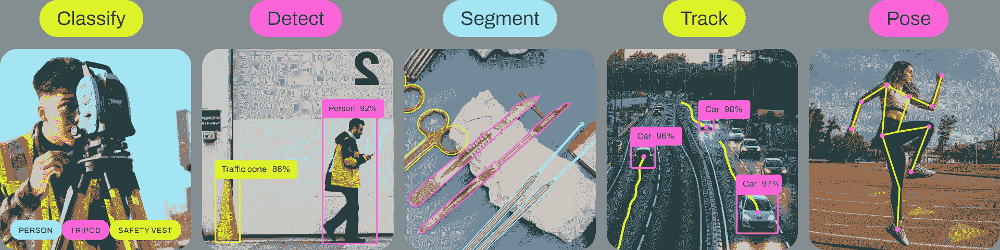

# Ultralytics YOLOv8 任务

> 原文：[`docs.ultralytics.com/tasks/`](https://docs.ultralytics.com/tasks/)



YOLOv8 是一个支持多个计算机视觉**任务**的 AI 框架。该框架可用于执行检测、分割、obb、分类和姿态估计。每个任务都有不同的目标和用例。

[`www.youtube.com/embed/NAs-cfq9BDw`](https://www.youtube.com/embed/NAs-cfq9BDw)

**Watch:** 探索 Ultralytics YOLO 任务：对象检测、分割、OBB、跟踪和姿态估计。

## 检测

检测是 YOLOv8 支持的主要任务。它涉及在图像或视频帧中检测物体，并在它们周围绘制边界框。检测到的对象根据其特征被分类为不同类别。YOLOv8 可以以高精度和速度在单个图像或视频帧中检测多个物体。

检测示例

## 分割

分割是一项任务，涉及根据图像内容将图像分割成不同区域。每个区域根据其内容被赋予一个标签。这项任务在图像分割和医学成像等应用中非常有用。YOLOv8 使用改进的 U-Net 架构执行分割。

分割示例

## 分类

分类是一项任务，涉及将图像分类为不同的类别。YOLOv8 可以基于图像内容对图像进行分类。它使用改进的 EfficientNet 架构进行分类。

分类示例

## 姿态

姿态/关键点检测是一项任务，涉及在图像或视频帧中检测特定点。这些点称为关键点，用于跟踪运动或姿态估计。YOLOv8 可以以高精度和速度检测图像或视频帧中的关键点。

姿态示例

## OBB

定向目标检测比常规物体检测更进一步，引入额外的角度来更精确地定位图像中的对象。YOLOv8 可以以高精度和速度检测图像或视频帧中的旋转对象。

定向检测

## 结论

YOLOv8 支持多个任务，包括检测、分割、分类、定向物体检测和关键点检测。每个任务都有不同的目标和用例。通过理解这些任务之间的差异，您可以选择适合您的计算机视觉应用的任务。

## 常见问题

### Ultralytics YOLOv8 能执行哪些任务？

Ultralytics YOLOv8 是一个多才多艺的 AI 框架，能够以高精度和速度执行各种计算机视觉任务。这些任务包括：

+   **检测：** 通过在图像或视频帧中绘制边界框来识别和定位物体。

+   **分割：** 将图像根据其内容分割成不同区域，适用于医学成像等应用。

+   **分类：** 基于其内容对整个图像进行分类，利用 EfficientNet 架构的变体。

+   **姿态估计：** 在图像或视频帧中检测特定的关键点，以跟踪动作或姿势。

+   **定向目标检测（OBB）：** 通过增加方向角度参数检测旋转对象，实现更高精度。

### 如何使用 Ultralytics YOLOv8 进行目标检测？

要使用 Ultralytics YOLOv8 进行目标检测，请按以下步骤操作：

1.  准备适当格式的数据集。

1.  训练 YOLOv8 模型使用检测任务。

1.  使用模型通过输入新图像或视频帧进行预测。

示例

```py
from ultralytics import YOLO

model = YOLO("yolov8n.pt")  # Load pre-trained model
results = model.predict(source="image.jpg")  # Perform object detection
results[0].show() 
```

```py
yolo  detect  model=yolov8n.pt  source='image.jpg' 
```

获取更详细的说明，请查看我们的检测示例。

### 使用 YOLOv8 进行分割任务有哪些好处？

使用 YOLOv8 进行分割任务具有多个优势：

1.  **高精度：** 分割任务利用 U-Net 架构的变体实现精准的分割。

1.  **速度：** YOLOv8 针对实时应用进行了优化，即使处理高分辨率图像也能快速处理。

1.  **多应用场景：** 适用于医学成像、自动驾驶等需要详细图像分割的应用。

了解有关分割部分中 YOLOv8 的优势和用例。

### Ultralytics YOLOv8 能够处理姿态估计和关键点检测吗？

是的，Ultralytics YOLOv8 能够以高精度和速度有效执行姿态估计和关键点检测。这一功能在运动分析、医疗保健和人机交互应用中特别有用。YOLOv8 能够检测图像或视频帧中的关键点，实现精准的姿态估计。

获取更多关于姿态估计示例的详细信息和实施提示。

### 为什么我应该选择 Ultralytics YOLOv8 进行定向目标检测（OBB）？

使用 YOLOv8 进行定向目标检测（OBB）通过检测具有额外角度参数的对象，提供了增强的精度。这一特性对需要精确定位旋转对象的应用尤为有益，例如航空影像分析和仓库自动化。

+   **增加精度：** 角度组件减少了旋转对象的误报。

+   **多功能应用：** 适用于地理空间分析、机器人技术等任务。

查看定向目标检测部分以获取更多详细信息和示例。
