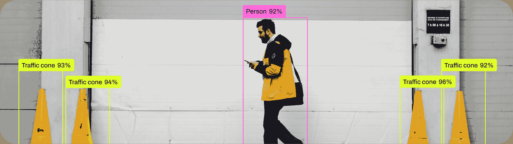

# 目标检测

> 原文：[`docs.ultralytics.com/tasks/detect/`](https://docs.ultralytics.com/tasks/detect/)



目标检测是一项任务，涉及在图像或视频流中识别对象的位置和类别。

目标检测器的输出是一组边界框，这些边界框围绕图像中的对象，以及每个框的类别标签和置信度分数。当您需要识别场景中感兴趣的对象，但不需要知道对象的确切位置或确切形状时，目标检测是一个不错的选择。

[`www.youtube.com/embed/5ku7npMrW40?si=6HQO1dDXunV8gekh`](https://www.youtube.com/embed/5ku7npMrW40?si=6HQO1dDXunV8gekh)

**观看：** 使用预训练的 Ultralytics YOLOv8 模型进行目标检测。

提示

YOLOv8 Detect 模型是默认的 YOLOv8 模型，即 `yolov8n.pt`，并在 [COCO](https://github.com/ultralytics/ultralytics/blob/main/ultralytics/cfg/datasets/coco.yaml) 上进行了预训练。

## [模型](https://github.com/ultralytics/ultralytics/tree/main/ultralytics/cfg/models/v8)

YOLOv8 预训练 Detect 模型显示在此处。Detect、Segment 和 Pose 模型在 [COCO](https://github.com/ultralytics/ultralytics/blob/main/ultralytics/cfg/datasets/coco.yaml) 数据集上进行了预训练，而 Classify 模型在 [ImageNet](https://github.com/ultralytics/ultralytics/blob/main/ultralytics/cfg/datasets/ImageNet.yaml) 数据集上进行了预训练。

[模型](https://github.com/ultralytics/ultralytics/tree/main/ultralytics/cfg/models) 在首次使用时会自动从最新的 Ultralytics [发布](https://github.com/ultralytics/assets/releases) 中下载。

| 模型 | 尺寸 ^((像素)) | mAP^(val 50-95) | 速度 ^(CPU ONNX

(ms)) | 速度 ^(A100 TensorRT

(ms)) | 参数 ^((M)) | FLOPs ^((B)) |

| --- | --- | --- | --- | --- | --- | --- |
| --- | --- | --- | --- | --- | --- | --- |
| [YOLOv8n](https://github.com/ultralytics/assets/releases/download/v8.2.0/yolov8n.pt) | 640 | 37.3 | 80.4 | 0.99 | 3.2 | 8.7 |
| [YOLOv8s](https://github.com/ultralytics/assets/releases/download/v8.2.0/yolov8s.pt) | 640 | 44.9 | 128.4 | 1.20 | 11.2 | 28.6 |
| [YOLOv8m](https://github.com/ultralytics/assets/releases/download/v8.2.0/yolov8m.pt) | 640 | 50.2 | 234.7 | 1.83 | 25.9 | 78.9 |
| [YOLOv8l](https://github.com/ultralytics/assets/releases/download/v8.2.0/yolov8l.pt) | 640 | 52.9 | 375.2 | 2.39 | 43.7 | 165.2 |
| [YOLOv8x](https://github.com/ultralytics/assets/releases/download/v8.2.0/yolov8x.pt) | 640 | 53.9 | 479.1 | 3.53 | 68.2 | 257.8 |

+   **mAP^(val)** 值是在 [COCO val2017](https://cocodataset.org) 数据集上进行单模型单尺度测试的结果。

    通过 `yolo val detect data=coco.yaml device=0` 复现

+   **速度** 是在使用 [Amazon EC2 P4d](https://aws.amazon.com/ec2/instance-types/p4/) 实例对 COCO val 图像进行平均处理的。

    通过 `yolo val detect data=coco8.yaml batch=1 device=0|cpu` 复现

## 训练

在尺寸为 640 的图像上使用 COCO8 数据集对 YOLOv8n 进行 100 个 epochs 的训练。有关可用参数的完整列表，请参阅配置页面。

示例

```py
`from ultralytics import YOLO  # Load a model model = YOLO("yolov8n.yaml")  # build a new model from YAML model = YOLO("yolov8n.pt")  # load a pretrained model (recommended for training) model = YOLO("yolov8n.yaml").load("yolov8n.pt")  # build from YAML and transfer weights  # Train the model results = model.train(data="coco8.yaml", epochs=100, imgsz=640)` 
```

```py
`# Build a new model from YAML and start training from scratch yolo  detect  train  data=coco8.yaml  model=yolov8n.yaml  epochs=100  imgsz=640  # Start training from a pretrained *.pt model yolo  detect  train  data=coco8.yaml  model=yolov8n.pt  epochs=100  imgsz=640  # Build a new model from YAML, transfer pretrained weights to it and start training yolo  detect  train  data=coco8.yaml  model=yolov8n.yaml  pretrained=yolov8n.pt  epochs=100  imgsz=640` 
```

### 数据集格式

YOLO 检测数据集格式的详细信息可以在数据集指南中找到。要将现有数据集从其他格式（如 COCO 等）转换为 YOLO 格式，请使用 Ultralytics 的[JSON2YOLO](https://github.com/ultralytics/JSON2YOLO)工具。

## Val

在 COCO8 数据集上验证训练好的 YOLOv8n 模型的准确性。不需要传递任何参数，因为`model`保留了其训练`data`和参数作为模型属性。

示例

```py
`from ultralytics import YOLO  # Load a model model = YOLO("yolov8n.pt")  # load an official model model = YOLO("path/to/best.pt")  # load a custom model  # Validate the model metrics = model.val()  # no arguments needed, dataset and settings remembered metrics.box.map  # map50-95 metrics.box.map50  # map50 metrics.box.map75  # map75 metrics.box.maps  # a list contains map50-95 of each category` 
```

```py
`yolo  detect  val  model=yolov8n.pt  # val official model yolo  detect  val  model=path/to/best.pt  # val custom model` 
```

## 预测

使用训练好的 YOLOv8n 模型对图像进行预测。

示例

```py
`from ultralytics import YOLO  # Load a model model = YOLO("yolov8n.pt")  # load an official model model = YOLO("path/to/best.pt")  # load a custom model  # Predict with the model results = model("https://ultralytics.com/images/bus.jpg")  # predict on an image` 
```

```py
`yolo  detect  predict  model=yolov8n.pt  source='https://ultralytics.com/images/bus.jpg'  # predict with official model yolo  detect  predict  model=path/to/best.pt  source='https://ultralytics.com/images/bus.jpg'  # predict with custom model` 
```

查看预测模式详细信息，请参阅预测页面。

## 导出

将 YOLOv8n 模型导出到 ONNX、CoreML 等不同格式。

示例

```py
`from ultralytics import YOLO  # Load a model model = YOLO("yolov8n.pt")  # load an official model model = YOLO("path/to/best.pt")  # load a custom trained model  # Export the model model.export(format="onnx")` 
```

```py
`yolo  export  model=yolov8n.pt  format=onnx  # export official model yolo  export  model=path/to/best.pt  format=onnx  # export custom trained model` 
```

可用的 YOLOv8 导出格式在下表中列出。您可以使用`format`参数导出到任何格式，例如`format='onnx'`或`format='engine'`。您可以直接在导出的模型上进行预测或验证，例如`yolo predict model=yolov8n.onnx`。导出完成后，显示了您的模型的使用示例。

| Format | `format` Argument | Model | Metadata | Arguments |
| --- | --- | --- | --- | --- |
| [PyTorch](https://pytorch.org/) | - | `yolov8n.pt` | ✅ | - |
| TorchScript | `torchscript` | `yolov8n.torchscript` | ✅ | `imgsz`, `optimize`, `batch` |
| ONNX | `onnx` | `yolov8n.onnx` | ✅ | `imgsz`, `half`, `dynamic`, `simplify`, `opset`, `batch` |
| OpenVINO | `openvino` | `yolov8n_openvino_model/` | ✅ | `imgsz`, `half`, `int8`, `batch`, `dynamic` |
| TensorRT | `engine` | `yolov8n.engine` | ✅ | `imgsz`, `half`, `dynamic`, `simplify`, `workspace`, `int8`, `batch` |
| CoreML | `coreml` | `yolov8n.mlpackage` | ✅ | `imgsz`, `half`, `int8`, `nms`, `batch` |
| TF SavedModel | `saved_model` | `yolov8n_saved_model/` | ✅ | `imgsz`, `keras`, `int8`, `batch` |
| TF GraphDef | `pb` | `yolov8n.pb` | ❌ | `imgsz`, `batch` |
| TF Lite | `tflite` | `yolov8n.tflite` | ✅ | `imgsz`, `half`, `int8`, `batch` |
| TF Edge TPU | `edgetpu` | `yolov8n_edgetpu.tflite` | ✅ | `imgsz` |
| TF.js | `tfjs` | `yolov8n_web_model/` | ✅ | `imgsz`, `half`, `int8`, `batch` |
| PaddlePaddle | `paddle` | `yolov8n_paddle_model/` | ✅ | `imgsz`, `batch` |
| NCNN | `ncnn` | `yolov8n_ncnn_model/` | ✅ | `imgsz`, `half`, `batch` |

查看完整的导出详细信息，请参阅导出页面。

## 常见问题解答

### 如何在自定义数据集上训练 YOLOv8 模型？

训练 YOLOv8 模型的自定义数据集涉及几个步骤：

1.  **准备数据集**：确保您的数据集采用 YOLO 格式。有关指导，请参阅我们的数据集指南。

1.  **加载模型**：使用 Ultralytics YOLO 库加载预训练模型或从 YAML 文件创建新模型。

1.  **训练模型**：在 Python 中执行`train`方法或在 CLI 中执行`yolo detect train`命令。

示例

```py
`from ultralytics import YOLO  # Load a pretrained model model = YOLO("yolov8n.pt")  # Train the model on your custom dataset model.train(data="my_custom_dataset.yaml", epochs=100, imgsz=640)` 
```

```py
`yolo  detect  train  data=my_custom_dataset.yaml  model=yolov8n.pt  epochs=100  imgsz=640` 
```

欲了解详细的配置选项，请访问配置页面。

### YOLOv8 中有哪些预训练模型可用？

Ultralytics YOLOv8 提供多个预训练模型，用于目标检测、分割和姿态估计。这些模型在 COCO 数据集或 ImageNet 上进行了预训练，用于分类任务。以下是一些可用的模型：

+   [YOLOv8n](https://github.com/ultralytics/assets/releases/download/v8.2.0/yolov8n.pt)

+   [YOLOv8s](https://github.com/ultralytics/assets/releases/download/v8.2.0/yolov8s.pt)

+   [YOLOv8m](https://github.com/ultralytics/assets/releases/download/v8.2.0/yolov8m.pt)

+   [YOLOv8l](https://github.com/ultralytics/assets/releases/download/v8.2.0/yolov8l.pt)

+   [YOLOv8x](https://github.com/ultralytics/assets/releases/download/v8.2.0/yolov8x.pt)

如需详细列表和性能指标，请参阅[模型](https://github.com/ultralytics/ultralytics/tree/main/ultralytics/cfg/models/v8)部分。

### 如何验证我训练的 YOLOv8 模型的准确性？

要验证您训练的 YOLOv8 模型的准确性，可以在 Python 中使用`.val()`方法或在 CLI 中使用`yolo detect val`命令。这将提供诸如 mAP50-95、mAP50 等指标。

示例

```py
`from ultralytics import YOLO  # Load the model model = YOLO("path/to/best.pt")  # Validate the model metrics = model.val() print(metrics.box.map)  # mAP50-95` 
```

```py
`yolo  detect  val  model=path/to/best.pt` 
```

更多验证细节，请访问 Val 页面。

### YOLOv8 模型可以导出到哪些格式？

Ultralytics YOLOv8 支持将模型导出到各种格式，如 ONNX、TensorRT、CoreML 等，以确保在不同平台和设备上的兼容性。

示例

```py
`from ultralytics import YOLO  # Load the model model = YOLO("yolov8n.pt")  # Export the model to ONNX format model.export(format="onnx")` 
```

```py
`yolo  export  model=yolov8n.pt  format=onnx` 
```

查看支持的格式列表和导出页面的说明。

### 为什么应该使用 Ultralytics YOLOv8 进行目标检测？

Ultralytics YOLOv8 旨在提供优越的目标检测、分割和姿态估计性能。以下是一些关键优势：

1.  **预训练模型**：利用在流行数据集如 COCO 和 ImageNet 上预训练的模型，加快开发速度。

1.  **高准确性**：实现了令人印象深刻的 mAP 分数，确保可靠的目标检测。

1.  **速度**：优化用于实时推理，非常适合需要快速处理的应用。

1.  **灵活性**：将模型导出到 ONNX 和 TensorRT 等多种格式，用于在多平台部署。

浏览我们的[博客](https://www.ultralytics.com/blog)，查看使用案例和展示 YOLOv8 效果的成功故事。
