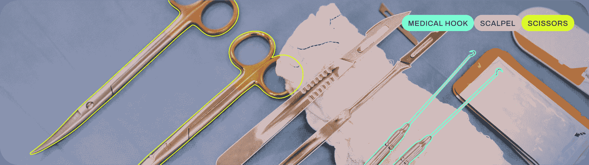

# 实例分割

> 原文：[`docs.ultralytics.com/tasks/segment/`](https://docs.ultralytics.com/tasks/segment/)



实例分割比目标检测更进一步，涉及识别图像中的单个对象并将其从图像的其余部分分割出来。

实例分割模型的输出是一组掩膜或轮廓，勾勒出图像中每个对象的轮廓，以及每个对象的类别标签和置信度分数。当你需要知道图像中对象的位置以及它们的确切形状时，实例分割非常有用。

[`www.youtube.com/embed/o4Zd-IeMlSY?si=37nusCzDTd74Obsp`](https://www.youtube.com/embed/o4Zd-IeMlSY?si=37nusCzDTd74Obsp)

**观看：** 在 Python 中使用预训练的 Ultralytics YOLOv8 模型运行分割。

提示

YOLOv8 分割模型使用 `-seg` 后缀，例如 `yolov8n-seg.pt`，并在 [COCO](https://github.com/ultralytics/ultralytics/blob/main/ultralytics/cfg/datasets/coco.yaml) 数据集上进行预训练。

## [模型](https://github.com/ultralytics/ultralytics/tree/main/ultralytics/cfg/models/v8)

这里展示了 YOLOv8 预训练的分割模型。检测、分割和姿态模型在 [COCO](https://github.com/ultralytics/ultralytics/blob/main/ultralytics/cfg/datasets/coco.yaml) 数据集上进行预训练，而分类模型在 [ImageNet](https://github.com/ultralytics/ultralytics/blob/main/ultralytics/cfg/datasets/ImageNet.yaml) 数据集上进行预训练。

[模型](https://github.com/ultralytics/ultralytics/tree/main/ultralytics/cfg/models) 在首次使用时会自动从最新的 Ultralytics [发布](https://github.com/ultralytics/assets/releases) 下载。

| 模型 | 大小 ^((像素)) | mAP^(框 50-95) | mAP^(掩膜 50-95) | 速度 ^(CPU ONNX

(毫秒)) | 速度 ^(A100 TensorRT

(毫秒)) | 参数 ^((M)) | FLOPs ^((B)) |

| --- | --- | --- | --- | --- | --- | --- | --- |
| --- | --- | --- | --- | --- | --- | --- | --- |
| [YOLOv8n-seg](https://github.com/ultralytics/assets/releases/download/v8.2.0/yolov8n-seg.pt) | 640 | 36.7 | 30.5 | 96.1 | 1.21 | 3.4 | 12.6 |
| [YOLOv8s-seg](https://github.com/ultralytics/assets/releases/download/v8.2.0/yolov8s-seg.pt) | 640 | 44.6 | 36.8 | 155.7 | 1.47 | 11.8 | 42.6 |
| [YOLOv8m-seg](https://github.com/ultralytics/assets/releases/download/v8.2.0/yolov8m-seg.pt) | 640 | 49.9 | 40.8 | 317.0 | 2.18 | 27.3 | 110.2 |
| [YOLOv8l-seg](https://github.com/ultralytics/assets/releases/download/v8.2.0/yolov8l-seg.pt) | 640 | 52.3 | 42.6 | 572.4 | 2.79 | 46.0 | 220.5 |
| [YOLOv8x-seg](https://github.com/ultralytics/assets/releases/download/v8.2.0/yolov8x-seg.pt) | 640 | 53.4 | 43.4 | 712.1 | 4.02 | 71.8 | 344.1 |

+   **mAP^(val)** 值是针对 [COCO val2017](https://cocodataset.org) 数据集的单模型单尺度。

    通过 `yolo val segment data=coco.yaml device=0` 重现

+   **速度** 是在使用 [Amazon EC2 P4d](https://aws.amazon.com/ec2/instance-types/p4/) 实例的 COCO val 图像上平均计算得出的。

    通过`yolo val segment data=coco8-seg.yaml batch=1 device=0|cpu`来复现

## 训练

在图像大小为 640 的情况下，在 COCO128-seg 数据集上训练 YOLOv8n-seg 100 个 epoch。有关可用参数的完整列表，请参见配置页面。

例子

```py
`from ultralytics import YOLO  # Load a model model = YOLO("yolov8n-seg.yaml")  # build a new model from YAML model = YOLO("yolov8n-seg.pt")  # load a pretrained model (recommended for training) model = YOLO("yolov8n-seg.yaml").load("yolov8n.pt")  # build from YAML and transfer weights  # Train the model results = model.train(data="coco8-seg.yaml", epochs=100, imgsz=640)` 
```

```py
`# Build a new model from YAML and start training from scratch yolo  segment  train  data=coco8-seg.yaml  model=yolov8n-seg.yaml  epochs=100  imgsz=640  # Start training from a pretrained *.pt model yolo  segment  train  data=coco8-seg.yaml  model=yolov8n-seg.pt  epochs=100  imgsz=640  # Build a new model from YAML, transfer pretrained weights to it and start training yolo  segment  train  data=coco8-seg.yaml  model=yolov8n-seg.yaml  pretrained=yolov8n-seg.pt  epochs=100  imgsz=640` 
```

### 数据集格式

YOLO 分割数据集格式的详细信息可以在数据集指南中找到。要将现有数据集从其他格式（如 COCO 等）转换为 YOLO 格式，请使用 Ultralytics 的 [JSON2YOLO](https://github.com/ultralytics/JSON2YOLO) 工具。

## 验证

在 COCO128-seg 数据集上验证训练好的 YOLOv8n-seg 模型准确性。不需要传递任何参数，因为`model`保留其训练`data`和参数作为模型属性。

例子

```py
`from ultralytics import YOLO  # Load a model model = YOLO("yolov8n-seg.pt")  # load an official model model = YOLO("path/to/best.pt")  # load a custom model  # Validate the model metrics = model.val()  # no arguments needed, dataset and settings remembered metrics.box.map  # map50-95(B) metrics.box.map50  # map50(B) metrics.box.map75  # map75(B) metrics.box.maps  # a list contains map50-95(B) of each category metrics.seg.map  # map50-95(M) metrics.seg.map50  # map50(M) metrics.seg.map75  # map75(M) metrics.seg.maps  # a list contains map50-95(M) of each category` 
```

```py
`yolo  segment  val  model=yolov8n-seg.pt  # val official model yolo  segment  val  model=path/to/best.pt  # val custom model` 
```

## 预测

使用训练好的 YOLOv8n-seg 模型对图像进行预测。

例子

```py
`from ultralytics import YOLO  # Load a model model = YOLO("yolov8n-seg.pt")  # load an official model model = YOLO("path/to/best.pt")  # load a custom model  # Predict with the model results = model("https://ultralytics.com/images/bus.jpg")  # predict on an image` 
```

```py
`yolo  segment  predict  model=yolov8n-seg.pt  source='https://ultralytics.com/images/bus.jpg'  # predict with official model yolo  segment  predict  model=path/to/best.pt  source='https://ultralytics.com/images/bus.jpg'  # predict with custom model` 
```

查看预测页面中的全部`predict`模式细节。

## 导出

将 YOLOv8n-seg 模型导出到 ONNX、CoreML 等不同格式。

例子

```py
`from ultralytics import YOLO  # Load a model model = YOLO("yolov8n-seg.pt")  # load an official model model = YOLO("path/to/best.pt")  # load a custom trained model  # Export the model model.export(format="onnx")` 
```

```py
`yolo  export  model=yolov8n-seg.pt  format=onnx  # export official model yolo  export  model=path/to/best.pt  format=onnx  # export custom trained model` 
```

可用的 YOLOv8-seg 导出格式列在下表中。您可以使用`format`参数导出到任何格式，例如`format='onnx'`或`format='engine'`。您可以直接在导出模型上预测或验证，例如`yolo predict model=yolov8n-seg.onnx`。导出完成后，您的模型示例将显示使用示例。

| Format | `format` 参数 | 模型 | 元数据 | 参数 |
| --- | --- | --- | --- | --- |
| [PyTorch](https://pytorch.org/) | - | `yolov8n-seg.pt` | ✅ | - |
| TorchScript | `torchscript` | `yolov8n-seg.torchscript` | ✅ | `imgsz`, `optimize`, `batch` |
| ONNX | `onnx` | `yolov8n-seg.onnx` | ✅ | `imgsz`, `half`, `dynamic`, `simplify`, `opset`, `batch` |
| OpenVINO | `openvino` | `yolov8n-seg_openvino_model/` | ✅ | `imgsz`, `half`, `int8`, `batch`, `dynamic` |
| TensorRT | `engine` | `yolov8n-seg.engine` | ✅ | `imgsz`, `half`, `dynamic`, `simplify`, `workspace`, `int8`, `batch` |
| CoreML | `coreml` | `yolov8n-seg.mlpackage` | ✅ | `imgsz`, `half`, `int8`, `nms`, `batch` |
| TF SavedModel | `saved_model` | `yolov8n-seg_saved_model/` | ✅ | `imgsz`, `keras`, `int8`, `batch` |
| TF GraphDef | `pb` | `yolov8n-seg.pb` | ❌ | `imgsz`, `batch` |
| TF Lite | `tflite` | `yolov8n-seg.tflite` | ✅ | `imgsz`, `half`, `int8`, `batch` |
| TF Edge TPU | `edgetpu` | `yolov8n-seg_edgetpu.tflite` | ✅ | `imgsz` |
| TF.js | `tfjs` | `yolov8n-seg_web_model/` | ✅ | `imgsz`, `half`, `int8`, `batch` |
| PaddlePaddle | `paddle` | `yolov8n-seg_paddle_model/` | ✅ | `imgsz`, `batch` |
| NCNN | `ncnn` | `yolov8n-seg_ncnn_model/` | ✅ | `imgsz`, `half`, `batch` |

查看导出页面中的全部`export`细节。

## 常见问题

### 如何在自定义数据集上训练 YOLOv8 分割模型？

要在自定义数据集上训练 YOLOv8 分割模型，您首先需要将数据集准备成 YOLO 分割格式。您可以使用 [JSON2YOLO](https://github.com/ultralytics/JSON2YOLO) 等工具将其他格式的数据集转换为 YOLO 格式。准备好数据集后，可以使用 Python 或 CLI 命令来训练模型：

例子

```py
`from ultralytics import YOLO  # Load a pretrained YOLOv8 segment model model = YOLO("yolov8n-seg.pt")  # Train the model results = model.train(data="path/to/your_dataset.yaml", epochs=100, imgsz=640)` 
```

```py
`yolo  segment  train  data=path/to/your_dataset.yaml  model=yolov8n-seg.pt  epochs=100  imgsz=640` 
```

检查配置页面以获取更多可用参数信息。

### YOLOv8 中对象检测和实例分割的区别是什么？

对象检测通过在图像中绘制边界框来识别和定位对象，而实例分割不仅能识别边界框，还能勾画出每个对象的精确形状。YOLOv8 实例分割模型提供了每个检测到的对象的掩码或轮廓，这对于需要知道对象精确形状的任务非常有用，如医学成像或自动驾驶。

### 为什么使用 YOLOv8 进行实例分割？

Ultralytics YOLOv8 是一种现代化的模型，以其高精度和实时性能而闻名，非常适合实例分割任务。YOLOv8 Segment 模型在[COCO 数据集](https://github.com/ultralytics/ultralytics/blob/main/ultralytics/cfg/datasets/coco.yaml)上预训练，确保在各种对象上表现稳健。此外，YOLOv8 支持训练、验证、预测和导出功能，与 Python 和 CLI 无缝集成，非常适用于研究和工业应用。

### 如何加载和验证预训练的 YOLOv8 分割模型？

加载和验证预训练的 YOLOv8 分割模型非常简单。以下是使用 Python 和 CLI 的操作方法：

示例

```py
`from ultralytics import YOLO  # Load a pretrained model model = YOLO("yolov8n-seg.pt")  # Validate the model metrics = model.val() print("Mean Average Precision for boxes:", metrics.box.map) print("Mean Average Precision for masks:", metrics.seg.map)` 
```

```py
`yolo  segment  val  model=yolov8n-seg.pt` 
```

这些步骤将为您提供像平均精度（mAP）这样的验证指标，对评估模型性能至关重要。

### 如何将 YOLOv8 分割模型导出为 ONNX 格式？

将 YOLOv8 分割模型导出为 ONNX 格式非常简单，可以使用 Python 或 CLI 命令完成：

示例

```py
`from ultralytics import YOLO  # Load a pretrained model model = YOLO("yolov8n-seg.pt")  # Export the model to ONNX format model.export(format="onnx")` 
```

```py
`yolo  export  model=yolov8n-seg.pt  format=onnx` 
```

有关导出到各种格式的更多详细信息，请参阅导出页面。
